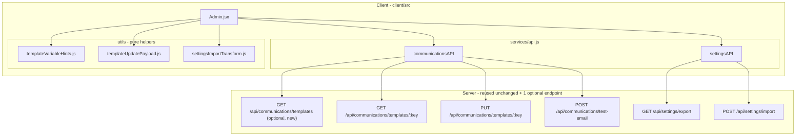

# Design Document

## Overview

This design surfaces two backend-complete capabilities in the existing Global_Manager `/admin` page:

- **Feature A - Email Template Editor**: list, load, edit, and save the seven seeded email templates; show advisory `{{variable}}` hints; send a test email to a self-supplied address.
- **Feature B - Settings Export / Import**: download an Exported_Archive of allow-listed settings and email templates, and import it back, bridging the export's ZIP-of-two-JSON-files format to the import endpoint's single merged JSON body via a client-side unzip-and-merge.

The work is almost entirely in the Client (`client/src`). The server side is reused unchanged, with one small, optional, explicitly-scoped addition: a `GET /api/communications/templates` list endpoint so the Template_Editor has a single source of truth for the set of template keys. No other server route, middleware, database table, column, or migration is introduced or changed.

The design deliberately extracts the non-trivial logic (the ZIP-unzip-and-merge Import_Transform, the PUT payload builder, and the Template_Variable_Hints map) into pure, dependency-light helper modules under `client/src/utils/`, so they can be unit-tested without rendering a component, following this repository's established client-test convention.

## Existing Backend (Reused Unchanged)

Everything below already exists, is mounted, and is tested. This design calls none of it into question and changes none of it (except adding the optional list endpoint in the next section).

| Method & Path | File | Behavior relied on |
| --- | --- | --- |
| `GET /api/communications/templates/:key` | `server/routes/communications.js` | Returns `{ template: { template_key, subject_template, body_template, description, updated_at } }`; 404 if key unknown. Global_Manager-only via `authorize`. |
| `PUT /api/communications/templates/:key` | `server/routes/communications.js` | Body `{ subjectTemplate?, bodyTemplate? }` (at least one required; each non-empty; subject <= 1000, body <= 10000 chars). Partial update via COALESCE. Writes an `email_template.update` audit log row. 404 if key unknown. |
| `POST /api/communications/test-email` | `server/routes/communications.js` | Body `{ targetEmail, templateKey?, variables? }`. Sends via the real EmailService; defaults to the `admin_notification_digest` template when `templateKey` is omitted. |
| `GET /api/settings/export` | `server/routes/settings.js` | Streams a ZIP of `settings.json` (`{ exportedAt, systemConfig, siteConfig }`, allow-listed keys only via `server/config/exportableSettingsKeys.js`) and `email_templates.json` (array of all template rows). |
| `POST /api/settings/import` | `server/routes/settings.js` | Body `{ systemConfig, siteConfig, emailTemplates? }`. Validates the whole payload BEFORE any write (allow-list membership for every config_key, row shape for all three arrays). Rejects the whole import with 400 + `{ error, problems: [...] }` on any problem; otherwise applies all rows in one transaction and returns `{ success: true, imported: { systemConfig, siteConfig, emailTemplates } }`. |

**Secrets exclusion is a backend property, not a client responsibility.** `tak_server_p12_passphrase` is absent from `exportableSettingsKeys.systemConfigKeys`, so it can never appear in an Exported_Archive and is rejected by the import validator like any other disallowed key. The Client only *communicates* this fact to the operator (Requirements 7.5, 9.5); it does not implement the exclusion.

**Format asymmetry the client must bridge.** Export produces a ZIP of two JSON files; import wants one merged JSON object. The backend intentionally does not accept a ZIP upload for import: its only ZIP-reading library, `adm-zip`, is a `devDependency` (used only by `server/routes/settings.test.js`), and `archiver` (the runtime dependency used to *write* the export) has no read API. The unzip-and-merge therefore happens client-side (see Import Flow).

## Architecture



**Boundary decisions:**

- **Client-only, plus one optional list endpoint.** The only server change contemplated is `GET /api/communications/templates`. It reuses the same table and the same `authorize` gate the existing `:key` route uses. It is recommended (a single source of truth for template keys that survives future template additions) over the alternative of hardcoding the seven keys client-side.
- **Auth is the httpOnly `tak_session` cookie** carried by the shared `api` axios instance (`withCredentials: true`). No new wrapper uses raw axios or reads a token from localStorage. `Admin.jsx` carries a comment documenting a past 401 bug caused by raw axios calls; all new calls go through the shared `api` instance via wrapper objects, matching `configAPI`/`adminAPI`/`syncAPI`.
- **Client gates visibility; server enforces access.** The Template_Editor and Export/Import sections are shown under the same `is_global_manager` condition already used for existing Global_Manager-only Admin surfaces; real enforcement is the server's `authorize` middleware.

## Components and Interfaces

### Optional server endpoint: `GET /api/communications/templates`

Added to `server/routes/communications.js`, mounted alongside the existing routes, Global_Manager-only via the same `authenticateToken` + `authorize` chain. It runs a single read:

```
SELECT template_key, subject_template, body_template, description, updated_at
FROM email_templates
ORDER BY template_key
```

and responds `{ templates: [ ... ] }`. It adds no table, column, or migration. Its server test follows the existing supertest + `jest.mock('../config/database')` pattern in `server/routes/communications.test.js`: assert the 200 shape for a Global_Manager and a 500 on a query error.

### `communicationsAPI` (new, in `client/src/services/api.js`)

Matches the existing wrapper style exactly (thin methods over the shared `api` instance, returning the axios promise):

```js
export const communicationsAPI = {
  listTemplates: () => api.get('/communications/templates'),
  getTemplate: (key) => api.get(`/communications/templates/${key}`),
  // body: { subjectTemplate?, bodyTemplate? } -- caller includes only changed fields
  updateTemplate: (key, body) => api.put(`/communications/templates/${key}`, body),
  // body: { targetEmail, templateKey?, variables? }
  sendTestEmail: (body) => api.post('/communications/test-email', body),
};
```

### `settingsAPI` (new, in `client/src/services/api.js`)

`exportSettings` requests the archive as a blob so the Client can trigger a file download; `importSettings` posts the merged JSON body:

```js
export const settingsAPI = {
  // Blob response so the Admin page can hand the archive to the browser as a download.
  exportSettings: () => api.get('/settings/export', { responseType: 'blob' }),
  // payload: { systemConfig, siteConfig, emailTemplates? }
  importSettings: (payload) => api.post('/settings/import', payload),
};
```

### `Admin.jsx` UI structure

The existing `Admin.jsx` already uses a tabbed card/section layout (`activeTab`, e.g. `'colors'`), `useState`/`useEffect`, and the shared API wrappers. Two new sections are added within the existing Global_Manager-gated area, consistent with that layout:

- **Templates section (Feature A)**: a template selector (populated from `communicationsAPI.listTemplates`), an editable subject field and body field (populated on selection from `communicationsAPI.getTemplate`), a `description`/`updated_at` display, an advisory Template_Variable_Hints list, Save and Send-test controls, and an inline status/error area. New local state: `templateList`, `selectedTemplateKey`, `templateDraft` (`{ subject, body }`), `templateMeta` (`{ description, updatedAt }`), `templateStatus`, `testEmailAddress`, `testEmailStatus`.
- **Settings Export / Import section (Feature B)**: an Export button, an Import file input + Import button, an inline status/error area (including a rendered `problems` list on a 400), and the two advisory notices (secrets-excluded / not-a-DB-backup, and DB-only-durability). New local state: `importFile`, `importStatus`, `importProblems`, `exportStatus`.

All new sections and controls render only when the same `is_global_manager` condition used by existing Global_Manager-only Admin surfaces is true (Requirement 1).

### Extracted pure helpers (in `client/src/utils/`)

Following the repository convention that most client logic is unit-tested as extracted pure helpers (`callsignSuffixPreview.js`, `channelTree.js`, `directoryScopeMessage.js`, each with a sibling `.test.js`), three helpers hold all non-rendering logic:

- **`templateVariableHints.js`** - exports the static `TEMPLATE_VARIABLE_HINTS` map (Template_Key -> string[]) and a `getVariableHints(key)` accessor returning `[]` for an unknown key. Advisory only (Requirement 5). Seed map:

  | Template_Key | Advisory Template_Variables |
  | --- | --- |
  | `access_request_verification` | `first_name`, `verification_link`, `team_path`, `expiry_hours` |
  | `access_request_approved` | `first_name`, `team_path`, `callsign`, `username`, `password_reset_url` |
  | `access_request_denied` | `first_name`, `team_path`, `denial_reason` |
  | `admin_notification_digest` | `pending_count`, `request_list` |
  | `signup_pending_review` | `first_name`, `team_path` |
  | `signup_already_active` | `first_name`, `username` |
  | `team_transfer_completed` | `first_name`, `callsign`, `team_path` |

  This map is advisory and is not enforced anywhere; it is documented as such in the module and surfaced as such in the UI.

- **`templateUpdatePayload.js`** - `buildTemplateUpdatePayload(original, draft)` returns `{ subjectTemplate?, bodyTemplate? }` containing only the fields that changed from `original`, plus `validateTemplateDraft(draft)` returning a list of validation problems (both-empty, subject empty-after-trim or > 1000, body empty-after-trim or > 10000) mirroring the server's own express-validator bounds so the Client fails fast (Requirement 4). The payload builder guarantees the client never sends an unchanged field and never sends an empty object.

- **`settingsImportTransform.js`** - the Import_Transform. Exports:
  - `mergeExportedJson(settingsJson, emailTemplatesJson)` -> `{ systemConfig, siteConfig, emailTemplates }`, a pure merge of the two parsed export files.
  - `isImportPayloadShape(value)` -> boolean, true when `value` is an object with array `systemConfig` and array `siteConfig` (and, if present, array `emailTemplates`).
  - `unzipExportedArchive(arrayBuffer)` -> `Promise<{ systemConfig, siteConfig, emailTemplates }>`, which unzips the archive, reads `settings.json` and `email_templates.json`, and calls `mergeExportedJson`. This is the only helper that touches the unzip dependency; the merge/shape functions stay dependency-free and trivially testable.

### Client-side unzip dependency

`unzipExportedArchive` needs a browser-side ZIP reader. This repository pins its dependencies and enforces it with `npm run lint:pinned-deps` (`scripts/check-pinned-deps.js`), and the client `package.json` uses exact pins for its own tooling (e.g. `jsdom`, `vitest`, `fast-check`). The chosen unzip library (recommended: `fflate`, a small, dependency-free unzip/zip library) MUST therefore be added to `client/package.json` `dependencies` with an **exact pinned version** (no `^`/`~`), and the pinned-deps check MUST continue to pass. `fflate` exposes a synchronous `unzipSync(Uint8Array)` that returns a map of entry name -> bytes, which `unzipExportedArchive` decodes to text and `JSON.parse`s.

Note: the backend deliberately does not accept a ZIP upload (see Overview), so the unzip MUST happen client-side; this dependency is unavoidable if zip round-trip is supported. The raw-`.json` import path (Requirement 8.3) needs no dependency and works even if the operator has already unzipped and merged by hand.

## Data Models

The Client introduces no persisted data model. It exchanges these shapes with the reused endpoints:

```
Email_Template            = { template_key, subject_template, body_template, description, updated_at }
TemplateUpdateBody        = { subjectTemplate?: string, bodyTemplate?: string }   // at least one, only-if-changed
TestEmailBody             = { targetEmail: string, templateKey?: string, variables?: object }

ExportSettingsJson        = { exportedAt: string, systemConfig: ConfigRow[], siteConfig: ConfigRow[] }
ExportEmailTemplatesJson  = Email_Template[]
ConfigRow                 = { config_key: string, config_value: string, description?: string|null }

Import_Payload            = { systemConfig: ConfigRow[], siteConfig: ConfigRow[], emailTemplates?: Email_Template[] }
ImportSuccess             = { success: true, imported: { systemConfig: number, siteConfig: number, emailTemplates: number } }
ImportRejection           = { error: string, problems: string[] }   // HTTP 400
```

The `updated_by` column set by the `PUT` route is DB-only data not returned to or displayed by the Client; the durability notice (Requirement 10) covers the fact that this and all UI edits live only in the database.

## Correctness Properties

*A property is a characteristic or behavior that should hold true across all valid executions of a system - essentially, a formal statement about what the system should do. Properties serve as the bridge between human-readable specifications and machine-verifiable correctness guarantees.*

The rendering and API-side-effect behavior of `Admin.jsx` (which sections show, which endpoint fires, which toast appears) is example/integration-shaped and covered by the Testing Strategy below. The genuinely input-varying, pure logic is the three extracted helpers, for which the following universal properties hold. (`fast-check` is already available in the client dev dependencies.)

### Property 1: Export-to-import round-trip preserves rows

*For any* pair of parsed export files (`settings.json` with arbitrary `systemConfig`/`siteConfig` arrays and `email_templates.json` with an arbitrary array of template rows), `mergeExportedJson(settingsJson, emailTemplatesJson)` produces an Import_Payload whose `systemConfig`, `siteConfig`, and `emailTemplates` arrays equal, element for element, the input arrays.

**Validates: Requirements 8.2, 8.4**

### Property 2: Import-payload shape recognition is exact

*For any* value, `isImportPayloadShape(value)` returns true if and only if the value is an object whose `systemConfig` and `siteConfig` are arrays and whose `emailTemplates`, when present, is an array; it returns false for any non-object, for a missing array field, and for a non-array field.

**Validates: Requirements 8.3, 8.6**

### Property 3: Update payload contains exactly the changed fields

*For any* original `{ subject, body }` and any draft `{ subject, body }` that both pass draft validation, `buildTemplateUpdatePayload(original, draft)` includes `subjectTemplate` if and only if the draft subject differs from the original subject, includes `bodyTemplate` if and only if the draft body differs from the original body, and never produces an empty object when at least one field differs.

**Validates: Requirements 4.2**

### Property 4: Draft validation enforces the server's bounds

*For any* draft `{ subject, body }`, `validateTemplateDraft` reports a problem if and only if both fields are empty after trimming, or a supplied subject is empty after trimming or longer than 1000 characters, or a supplied body is empty after trimming or longer than 10000 characters.

**Validates: Requirements 4.3, 4.4, 4.5**

### Property 5: Variable hints never break editing

*For any* Template_Key string, `getVariableHints(key)` returns an array (empty for an unknown key), so a template with no hint entry still renders and remains editable.

**Validates: Requirements 5.1, 5.2**

## Error Handling

- **Every API call in both features has an explicit failure branch** that surfaces an operator-visible message and leaves prior state intact:
  - Template list failure (2.6): show error, do not render a stale/partial list.
  - Single-template load failure: 404 -> not-found message, fields untouched (3.4); other errors -> error message, fields unchanged (3.5).
  - Save failure (4.7): error message, unsaved edits retained.
  - Test-email failure (6.5): error message.
  - Export failure (7.4): error message.
  - Import transport failure other than 400 (9.4): error message.
- **Client-side validation fails fast** before hitting the network: both-empty save (4.3), out-of-bounds subject/body (4.4, 4.5), invalid/empty test-email address (6.3), and an unreadable/misshapen import file (8.6) each block the request and show a validation message.
- **Import rejection (HTTP 400)** is treated as a first-class, expected outcome, not a generic error: the Admin_Page renders each Import_Problem from the returned `problems` array (9.2) and states that nothing was changed (9.3). This is why `settingsAPI.importSettings` returns the axios promise unmodified - the Admin handler inspects `error.response?.status === 400` and `error.response?.data?.problems` directly.
- **Blob export edge**: because `exportSettings` uses `responseType: 'blob'`, a JSON error body from a failed export arrives as a blob; the export handler treats any non-2xx as the generic export-failure message (7.4) rather than attempting to parse the blob.
- **401 handling is unchanged**: the shared `api` instance's existing interceptor (`shouldRedirectToLogin`) handles session expiry; no new wrapper duplicates it.

## Testing Strategy

Follows the two established conventions in this repository: pure helpers are unit- and property-tested directly, and structural assertions read the source file with `readFileSync` where a full render harness is not warranted. Some newer suites do mount components with `@testing-library/react`; this design keeps rendered-component testing minimal by pushing logic into the pure helpers.

**Property-based tests (client, `fast-check` + Vitest, minimum 100 iterations each).** One property-based test per correctness property, each tagged `Feature: admin-settings-management, Property N: <text>`:

- `client/src/utils/settingsImportTransform.test.js` - Property 1 (round-trip merge) and Property 2 (shape recognition), with generators for arbitrary config-row and template-row arrays and for arbitrary non-payload values.
- `client/src/utils/templateUpdatePayload.test.js` - Property 3 (changed-fields-only) and Property 4 (validation bounds), with generators for subject/body strings including empty, whitespace-only, at-boundary, and over-boundary lengths.
- `client/src/utils/templateVariableHints.test.js` - Property 5 (always-an-array), with a generator over arbitrary key strings plus the seven known keys.

**Unit / example tests (client).**

- `settingsImportTransform.test.js` also covers `unzipExportedArchive` with one representative real archive built in-test (round-tripping through the chosen unzip library) and the raw-`.json` pass-through path.
- `api.test.js` (extend the existing suite) asserts that `communicationsAPI` and `settingsAPI` build the expected method/URL/`responseType` for each method, matching how the existing suite validates wrappers.
- `Admin.test.jsx` (or a `readFileSync` structural test consistent with `TeamDetail.test.jsx`/`Requests.test.jsx`) asserts the Global_Manager gating (Requirement 1), the presence of the two advisory notices (7.5, 9.5, 10), and that the import handler renders a `problems` list on a 400 (9.2, 9.3).

**Server test (only if the optional list endpoint is built).** `server/routes/communications.test.js` gains a case for `GET /api/communications/templates` following the file's existing supertest + `jest.mock('../config/database')` pattern: a Global_Manager gets the 200 `{ templates: [...] }` shape; a query error yields 500.

**Lint baseline.** Server-side additions (the optional list endpoint) must keep `npm run lint` at exactly its baseline of `157 problems (145 errors, 12 warnings)` and must not increase it; client code is outside the root lint scope. Any newly pinned client dependency must keep `npm run lint:pinned-deps` passing.
