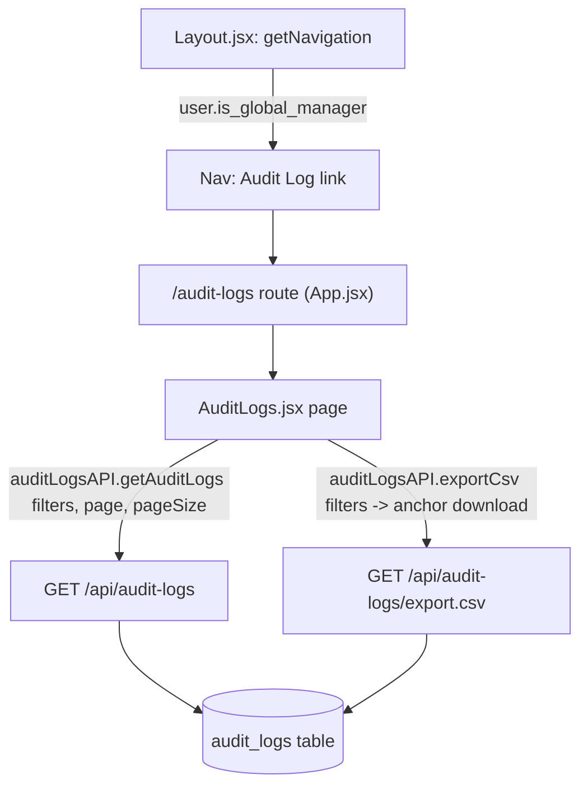
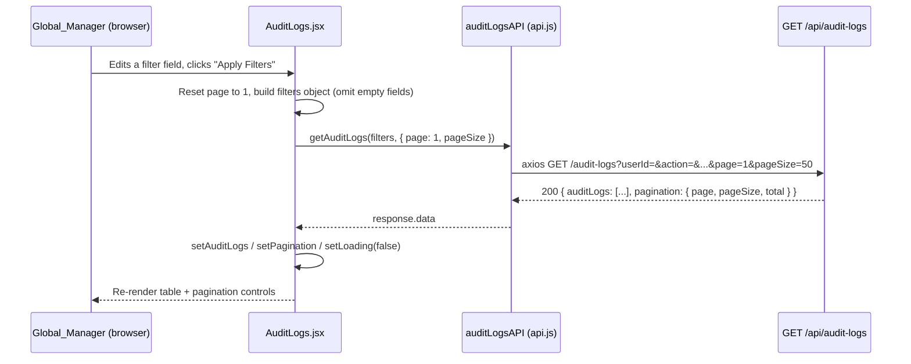

# Design Document: Audit Log UI

## Overview

This feature adds the missing client-side interface for the already-implemented, already-tested audit log backend (`server/routes/auditLogs.js`), closing BUG-013. It introduces a new Global_Manager-only page, `client/src/pages/AuditLogs.jsx`, reachable at `/audit-logs`, that lists `audit_logs` rows with filtering (actor, action, resource type, team, date range) and pagination against `GET /api/audit-logs`, and offers a "Export CSV" action that triggers a browser download from `GET /api/audit-logs/export.csv` using the same filters currently applied.

No backend code changes are made. This is a client-only addition: one new page component, one new `auditLogsAPI` object in `client/src/services/api.js`, one new route in `client/src/App.jsx`, and one new conditionally-rendered nav entry in `client/src/components/Layout.jsx`, gated on `user.is_global_manager` — mirroring exactly how the existing "Global Channels" nav entry and page are gated, since the backend routes are Global_Manager-only (Requirement 31 Criterion 4) and a team admin who is not also a Global_Manager must never see this page or its nav entry.

## Architecture



`AuditLogs.jsx` owns all filter/pagination state locally (no new global/context state is introduced — this matches `Requests.jsx`/`Teams.jsx`'s existing per-page local-state pattern). The CSV export never goes through axios/JSON; it is a plain browser navigation to the export URL (see "CSV Export Flow" below), since the endpoint is a `Content-Disposition: attachment` file stream, not JSON, and the session is carried automatically via the `tak_session` cookie (`SameSite=Lax`, so it is sent on this top-level/same-site navigation).

### Request flow: applying filters



### CSV export flow

```mermaid
sequenceDiagram
    participant U as Global_Manager (browser)
    participant P as AuditLogs.jsx
    participant B as Browser navigation

    U->>P: Clicks "Export CSV"
    P->>P: Build same filters object as the current applied filters (excluding page/pageSize -- export is unpaginated)
    P->>B: window.open(buildExportUrl(filters), '_blank') via a same-origin GET
    B->>B: Browser follows the URL, tak_session cookie sent automatically (SameSite=Lax, same-site request)
    Note over B: Server responds with Content-Disposition: attachment; browser downloads audit-logs-export.csv without navigating away from the app
```

Rationale for `window.open(url, '_blank')` over an axios blob download: the export endpoint streams a `text/csv` response with `Content-Disposition: attachment`, which every browser already downloads correctly on direct navigation without any client-side blob/`URL.createObjectURL` plumbing. This mirrors how `authAPI.login()` already navigates directly to a same-origin API URL (`joinBaseAndPath(validatedBase, '/api/auth/login')`) rather than using axios, for the same reason: some responses are meant to be followed by the browser, not consumed as JSON. Opening in a new tab (rather than `window.location.href`) avoids navigating the SPA itself away from `/audit-logs`.

## Components and Interfaces

### Component: `AuditLogs` page (`client/src/pages/AuditLogs.jsx`)

**Purpose**: Global_Manager-only page rendering the filter bar, results table, pagination controls, and export action for the audit log.

**Props**:
```javascript
/**
 * @param {{ user: { is_global_manager?: boolean, isAdmin?: boolean } }} props
 */
function AuditLogs({ user }) { /* ... */ }
```

`user` is passed the same way `GlobalChannels({ user })` and `Admin({ user })` already receive it from `App.jsx`'s route element (`<Route path="/global-channels" element={<GlobalChannels user={user} />} />`), for a defense-in-depth client-side guard (see "Error Handling" below) even though the real access control is server-side.

**Internal state**:
```javascript
const [auditLogs, setAuditLogs] = useState([])         // current page of rows
const [pagination, setPagination] = useState({ page: 1, pageSize: 50, total: 0 })
const [loading, setLoading] = useState(true)            // initial + refetch spinner
const [error, setError] = useState(null)                // fetch error message, or null
const [filters, setFilters] = useState({                // draft filter form values (uncommitted)
  userId: '', action: '', resourceType: '', teamId: '', startDate: '', endDate: ''
})
const [appliedFilters, setAppliedFilters] = useState({}) // last-applied filters, used for both the list fetch and the export URL
const [teams, setTeams] = useState([])                  // for the team filter <select>, from teamsAPI.getMyTeams()
```

Splitting `filters` (the draft form) from `appliedFilters` (what was last submitted) means editing a field does not refetch on every keystroke — a request is only issued when the Global_Manager clicks "Apply Filters" (or "Clear Filters", or changes page). This mirrors the general form-then-submit pattern already used by every create/edit modal in `GlobalChannels.jsx` (`formData` state, only sent on `handleCreate`/`handleUpdate` submit).

**Responsibilities**:
- Fetch `teamsAPI.getMyTeams()` once on mount to populate the team filter `<select>` with `{id, name}` options (Global_Manager sees all teams per `Team.getAllTeams()`, already the case for the existing `Teams` page).
- Fetch `auditLogsAPI.getAuditLogs(appliedFilters, { page, pageSize })` whenever `appliedFilters` or `pagination.page` changes.
- Render loading, error, empty, and populated states (see "Error Handling" and mermaid diagram above).
- Render the results table sorted by `created_at` descending (the order the API already returns).
- Render Previous/Next pagination controls driven by `pagination.total`/`pagination.page`/`pagination.pageSize`, matching the exact markup/class pattern already used in `TeamDetail.jsx`/`Teams.jsx` ("Showing X to Y of Z", `Previous`/`Next` buttons, `disabled` at boundaries).
- Render an "Export CSV" button that opens `auditLogsAPI.buildExportUrl(appliedFilters)` in a new tab.
- Render each row's `details` (jsonb) as pretty-printed JSON in a collapsible/`<pre>` cell, and `user_id` alongside a best-effort resolved username (see "Data Models" below for how `user_id` is resolved to a display name).

### New API module: `auditLogsAPI` (`client/src/services/api.js`)

Added alongside the existing `teamsAPI`/`requestsAPI`/`globalChannelsAPI` objects, following their exact shape (plain object of functions calling the shared `api` axios instance, which already has `withCredentials: true` and the validated base URL baked in):

```javascript
export const auditLogsAPI = {
  // filters: { userId?, action?, resourceType?, teamId?, startDate?, endDate? }
  // pageParams: { page, pageSize }
  getAuditLogs: (filters = {}, pageParams = {}) =>
    api.get('/audit-logs', { params: { ...filters, ...pageParams } }),

  // Builds the absolute export URL (including the same base-URL handling
  // used by authAPI.login()) rather than making an axios call, since the
  // caller navigates the browser directly to this URL for the file
  // download (see design.md "CSV Export Flow").
  buildExportUrl: (filters = {}) => {
    const params = new URLSearchParams(
      Object.fromEntries(Object.entries(filters).filter(([, v]) => v !== '' && v != null))
    );
    const query = params.toString();
    return joinBaseAndPath(validatedBase, `/api/audit-logs/export.csv${query ? `?${query}` : ''}`);
  },
};
```

`getAuditLogs` relies on axios's `params` serialization to omit any filter key whose value is `''`/`undefined` — matching how the backend's `buildAuditLogFilters` already treats an absent/empty query param as "no filter" for every field (Requirement 31 Criterion 1). `AuditLogs.jsx` is still responsible for not putting empty-string values into `appliedFilters` in the first place (see Property 1 below), so this is a defense-in-depth consistency, not the only place emptiness is handled.

`buildExportUrl` is a pure function (no network call) so it can be unit-tested directly without mocking axios, and reuses the module's existing `joinBaseAndPath`/`validatedBase` (already defined earlier in `api.js` for `authAPI.login`) instead of duplicating base-URL logic.

### Route (`client/src/App.jsx`)

```javascript
<Route path="/audit-logs" element={<AuditLogs user={user} />} />
```

Added inside the existing authenticated `<Routes>` block (the one already containing `/global-channels` and `/admin`), imported at the top alongside the other page imports.

### Navigation entry (`client/src/components/Layout.jsx`)

```javascript
if (user?.is_global_manager) {
  baseNavigation.push({ name: 'Global Channels', href: '/global-channels', icon: GlobeAltIcon })
  baseNavigation.push({ name: 'Audit Log', href: '/audit-logs', icon: ClipboardDocumentListIcon })
}
```

Added inside the existing `if (user?.is_global_manager)` block in `getNavigation(user)`, directly after the "Global Channels" entry — not a new `if` block, since both are gated on the identical condition. `ClipboardDocumentListIcon` is already imported in this file (currently used for the "Requests" nav entry); reusing it avoids importing a redundant icon for a similar "list of records" concept, but if a more distinct icon is preferred (e.g. `DocumentMagnifyingGlassIcon` from `@heroicons/react/24/outline`, already available in the installed heroicons package) that is an implementation-time styling choice, not a design constraint.

## Data Models

### Filter form state (client-only, not persisted)

```javascript
interface AuditLogFilters {
  userId: string      // numeric-looking string, or '' for "no filter"; matches server's `userId` query param
  action: string       // free text, or ''; matches server's `action` query param (exact match, not substring -- see Error Handling)
  resourceType: string // free text, or ''; matches server's `resourceType` query param (exact match)
  teamId: string        // numeric-looking string (selected team's id), or ''
  startDate: string     // 'YYYY-MM-DD' from an <input type="date">, or ''
  endDate: string       // 'YYYY-MM-DD' from an <input type="date">, or ''
}
```

`action` and `resourceType` are rendered as free-text `<input>` fields (optionally with a `<datalist>` of previously-seen values sourced from the current page of results, as a soft autocomplete convenience only) rather than a fixed `<select>` of enumerated options, because `audit_logs.action`/`resource_type` are unconstrained `varchar` columns (`database/schema.sql`) with no enum/lookup table backing them — new action/resource_type strings are added by services (`VendorChannelService`, `ChannelRequestService`, `devices.js`, etc.) over time, and a hardcoded dropdown would silently go stale and hide legitimate rows as new features add new action strings.

### Audit log row (as returned by `GET /api/audit-logs`, unmodified passthrough of the DB row shape)

```javascript
interface AuditLogRow {
  id: number
  user_id: number | null      // FK to users.id; may be null if the actor row was later deleted (ON DELETE not RESTRICT-guaranteed by this FK alone)
  action: string
  resource_type: string
  resource_id: number | null
  details: object | null       // jsonb, arbitrary shape set by the writing service
  created_at: string           // ISO 8601 timestamp string (as serialized by pg -> JSON)
}

interface AuditLogListResponse {
  auditLogs: AuditLogRow[]
  pagination: { page: number, pageSize: number, total: number }
}
```

**Resolving `user_id` to a display name**: `GET /api/audit-logs` intentionally returns the raw `user_id` only (no joined username — confirmed by reading `auditLogs.js`'s `SELECT id, user_id, action, resource_type, resource_id, details, created_at`), since adding a join was out of scope for the already-shipped, already-tested backend and this spec does not modify it. The page therefore displays `user_id` as-is (e.g. "User #42") in the table; it does NOT attempt a client-side batch lookup against `usersAPI` for every distinct `user_id` on the current page, since:
- `GET /api/users` (`usersAPI.getAll`) returns only active, currently-provisioned users, and an audit log actor may no longer exist as an active user (the FK has no `ON DELETE CASCADE`/`SET NULL` documented here, and a deactivated/removed user's past actions must still be visible in the log per the feature's own incident-investigation purpose).
- Adding a client-side N-id-lookup join reintroduces exactly the kind of extra round-trip complexity the backend's own doc comments describe avoiding server-side (see `users.js`'s Requirement 11.3 comment on batched team-name resolution) — better done as a future backend enhancement (a joined `username`/`display_name` column on this endpoint) than papered over client-side.
- The `userId` filter `<input>` still lets a Global_Manager filter by a known numeric user id typed in directly; this is consistent with the backend contract (`query('userId').optional().isInt()`), which accepts only an integer, not a name/search string.

### Team filter options (`teamsAPI.getMyTeams()`, already existing, unmodified)

```javascript
interface Team {
  id: number
  name: string
  // ...other existing Team fields, unused by this page
}
```

For a Global_Manager (`req.user.isAdmin` server-side branch), `GET /api/teams/my-teams` already returns every team, paginated (`Team.getAllTeams`). This page requests a single large page (`pageSize: 200`, the server's documented maximum) to populate the `<select>` with the full team list in one request, accepting that in a deployment with more than 200 teams the dropdown would be incomplete — an acceptable tradeoff for a filter convenience dropdown, not a data-integrity concern, and consistent with `paginationParams`' own hard cap.

## Correctness Properties

*A property is a characteristic or behavior that should hold true across all valid executions of a system-essentially, a formal statement about what the system should do. Properties serve as the bridge between human-readable specifications and machine-verifiable correctness guarantees.*

### Property 1: Empty filter fields are never sent as query parameters

For any combination of filter form values where zero or more fields are `''` (unset) and the rest are non-empty, building the request parameters (for both `getAuditLogs` and `buildExportUrl`) SHALL include a query parameter only for the non-empty fields, and SHALL omit every field whose value is `''`.

**Validates: Requirements 3.5**

### Property 2: Export URL filters always match the currently-applied list filters

For any set of currently-applied filters shown in the results table, the URL produced by `buildExportUrl` for the "Export CSV" action, when parsed back into a parameter map, SHALL be equal to the parameter map that was used for the most recent `getAuditLogs` list request, minus `page`/`pageSize` (the export is deliberately unpaginated per Requirement 31 Criterion 2).

**Validates: Requirements 5.2, 5.3**

### Property 3: Pagination controls never request an out-of-range page

For any `pagination.total`/`pagination.pageSize` returned by the server, the computed total page count SHALL be `Math.max(1, Math.ceil(total / pageSize))`, and the "Previous"/"Next" controls SHALL be disabled whenever the current page is already at 1 or at that computed maximum, respectively, so the UI never issues a request for `page < 1` or `page > totalPages`.

**Validates: Requirements 2.5, 2.6, 2.7**

### Property 4: Nav entry and route access mirror the same gating condition

For any `user` object, the "Audit Log" nav entry SHALL be present in `getNavigation(user)`'s result if and only if `user.is_global_manager` is truthy, matching exactly the condition under which the "Global Channels" entry is present (Requirement 31 Criterion 4's client-side mirror).

**Validates: Requirements 1.1, 1.2, 1.3**

## Error Handling

### Error Scenario 1: `GET /api/audit-logs` returns a non-2xx response (network failure, 500, or an unexpected 403)

**Condition**: The axios call in `getAuditLogs` rejects, whether from a network error or any non-2xx HTTP status other than 401 (401 is already handled globally by the existing `api.js` response interceptor, which redirects to `/login`).
**Response**: `AuditLogs.jsx` catches the rejection, sets `error` to a user-facing message (e.g. "Failed to load audit logs. Please try again."), stops the loading spinner, and does not clear any previously-successfully-loaded rows still on screen (a failed refetch after changing a filter should not blank out the table, only surface the error alongside the stale-but-still-valid last-good results).
**Recovery**: The filter bar and pagination controls remain interactive; the Global_Manager can retry by re-applying filters or changing the page, which issues a fresh request and clears `error` on success.

### Error Scenario 2: A non-Global_Manager somehow lands on `/audit-logs` (deep link, stale bookmark, or a race between login and nav render)

**Condition**: `user.is_global_manager` is falsy when `AuditLogs.jsx` renders (the nav entry itself is hidden per Property 4, but React Router does not enforce that a hidden nav link is the only way to reach a route).
**Response**: The page renders a client-side "not authorized" message instead of attempting to fetch, matching the defense-in-depth pattern already used elsewhere in this codebase (e.g. `GlobalChannels.jsx`'s `isGlobalManager` checks gating its management UI, though that page still shows read-only content to non-managers -- this page shows none, since the backend has no non-Global_Manager-readable subset of the audit log at all).
**Recovery**: This is not a real security boundary (the server-side `authorize` middleware is the actual enforcement point, per Requirement 31 Criterion 4, and already rejects with 403 regardless of what the client renders) -- it only prevents a confusing "stuck loading spinner followed by a 403 toast" UX for a user who should never see this page.

### Error Scenario 3: The server returns a 403 mid-session (e.g. a Global_Manager's role was revoked after the page was already loaded)

**Condition**: `getAuditLogs` or the export navigation receives/would receive a 403 after the initial page load succeeded.
**Response**: For the list fetch, the same Error Scenario 1 handling applies (403 is just another non-2xx status; the existing `api.js` interceptor only special-cases 401, not 403). For the CSV export (a plain browser navigation, not an axios call), a 403 renders the browser's own response body (a small JSON error blob) in the new tab rather than downloading a file -- there is no client-side way to intercept a `window.open` navigation's response status, and adding one (e.g. switching the export to an axios blob-fetch purely to detect 403) is treated as unnecessary complexity for an edge case (mid-session role revocation) with no severe consequence beyond a confusing new tab, not silent failure.
**Recovery**: Reloading `/audit-logs` re-triggers the client-side gating in Error Scenario 2 once the user's session/profile reflects the revoked role (on next `authAPI.getProfile()` call, e.g. after a page refresh).

### Error Scenario 4: `startDate` is chosen after `endDate` in the filter form

**Condition**: The Global_Manager picks an `endDate` earlier than `startDate` before clicking "Apply Filters".
**Response**: The backend already validates each date independently (`isISO8601()`) but does not reject `startDate > endDate` (confirmed by reading `auditLogs.js` -- there is no such cross-field check); such a combination simply produces zero matching rows (`created_at >= startDate AND created_at <= endDate` can never be satisfied). The client does not add an extra validation error for this case -- it applies the filters as given and lets the resulting empty results table communicate the outcome, consistent with treating the backend's filter semantics as the single source of truth rather than duplicating/second-guessing them client-side.
**Recovery**: The Global_Manager adjusts the date fields and re-applies.

## Testing Strategy

### Unit Testing Approach

Component tests for `AuditLogs.jsx` (React Testing Library + the project's existing test runner) covering: initial loading state, populated table rendering, empty-results state, error state (mocked rejected `getAuditLogs`), pagination button enable/disable at boundaries, filter form submit building the expected `appliedFilters`, "Clear Filters" resetting both `filters` and `appliedFilters`, and the nav-entry/route-level gating in Error Scenario 2. Unit tests for the new `auditLogsAPI.getAuditLogs`/`buildExportUrl` functions in `api.js` (mocking the underlying `api` axios instance for `getAuditLogs`; no mocking needed for the pure `buildExportUrl`).

### Property-Based Testing Approach

Properties 1-4 above are each suited to property-based testing over randomly generated filter-object combinations (arbitrary subsets of fields set to non-empty strings vs `''`), randomly generated `{total, pageSize, page}` triples, and randomly generated `user` objects with varying truthy/falsy `is_global_manager`/`isAdmin` combinations -- all pure-function/pure-data properties with no I/O, well suited to PBT per the "when PBT is appropriate" guidance (pure functions, large input space, universal round-trip/invariant properties).

**Property Test Library**: `fast-check` (the standard property-based testing library for JavaScript/TypeScript; not currently a dependency of this repository's `client/package.json` and will need to be added as a devDependency).

### Integration Testing Approach

A small number of example-based integration tests exercising `AuditLogs.jsx` mounted with a mocked `auditLogsAPI` (via the existing client test setup, mirroring how other page tests in this codebase mock `services/api.js`) to confirm the full fetch -> render -> paginate -> re-fetch loop wires together correctly end to end, without hitting a real backend (the real backend's own contract is already covered by `auditLogs.test.js`/`auditLogs.integration.test.js`, which this spec does not re-test).

## Dependencies

- `fast-check` (new client devDependency, for property-based tests per "Testing Strategy" above).
- No new runtime dependencies: `axios`, `react-router-dom`, `@heroicons/react`, `react-hot-toast` are already used by the client and are sufficient for this feature.
- No backend dependency changes; this spec integrates against `server/routes/auditLogs.js` and `server/config/permissions.registry.js` exactly as they exist today.
