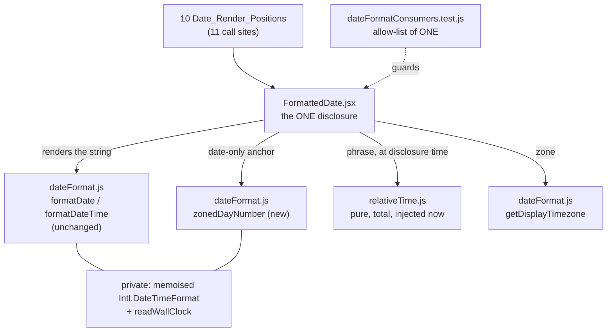

# Design Document: Date Tooltips and Folder Contrast

## Overview

Two changes that share a document and nothing else. They are designed separately below, they land in disjoint files, and neither is a prerequisite of the other.

**Concern A** adds one client component, `client/src/components/FormattedDate.jsx`, and one pure classifier, `client/src/utils/relativeTime.js`. Every place in the client that renders a date routes its value through the component instead of calling `formatDate`/`formatDateTime` inline; the component renders the identical string and adds a state-driven disclosure carrying the Relative_Time phrase and the Resolved_Display_Timezone. `client/src/utils/dateFormat.js` gains two additive exports and loses nothing: the two Date_Format_Helpers keep their signatures, their `fallback` argument and their behaviour untouched (Criterion 2.13), because the zoned-reading machinery the Midnight_Anchor needs — the memoised `Intl.DateTimeFormat` and `readWallClock` — is already inside that module and is module-private.

**Concern B** changes colour tokens on two pages and adds a test that computes the ratios rather than asserting remembered ones. No component is extracted, no markup is restructured, and no behaviour changes; what changes is eleven class strings across two files, plus the addition of `client/src/utils/contrast.js` and a contrast test that reads its inputs off the rendered elements.

Nothing here touches the server, the wire format, the database, or the public config. Every timestamp still travels as ISO-8601 UTC and the Display_Timezone is still applied only at render, exactly as device-management Requirement 18 left it.

## Corrections to the requirements' incidental figures

Two of the requirements' incidental figures need correcting, one of them in a way that adds a token to the change. They are recorded here rather than fixed silently, and the third item below records the recomputation of everything else. Every ratio in this document was computed from `client/tailwind.config.js`'s declared palette (plus Tailwind 3.4.19's stock `blue`, which the config does not declare) with the WCAG 2.1 relative-luminance formula.

1. **Six of the ten Date_Render_Positions are table cells, not eight.** Criterion 3.4 says eight and Criterion 3.8 names the two non-table positions as Admin's. Measured: the table cells are `DeviceListRow.jsx` ×3 (inside the `overflow-x-auto` wrappers at `Dashboard.jsx:761` and `UserDevicesModal.jsx:218`), `AuditLogs.jsx` (wrapper at line 291), `Users.jsx` (line 88) and `OrgInterestRequests.jsx` (line 70) — six. The other four are `<p>` elements inside cards: Requests' two "Submitted" values as well as Admin's last-sync and template-last-updated values. The design consequence is nil for placement, because Criterion 3.8 already requires one tooltip behaviour regardless of the surrounding element, and it now covers four positions instead of two. It matters only for the reasoning: the Tooltip_Clipping_Defect's `overflow-x-auto` ancestors are inherited by six positions, and Sideways_Tooltip_Placement is applied to all ten anyway.

2. **Criterion 6.1's unification pushes the Expandable_Channel_Row's light-mode description text BELOW the Text_Contrast_Minimum, and Criterion 6.6 does not catch it because it only measured dark mode.** The description is `text-gray-500 dark:text-gray-400`. Today it sits on `bg-gray-50` in light mode: **4.63:1**, a pass. Moved to the unified `bg-gray-100` it is **4.39:1** — a fail against 4.5:1, introduced by this spec. Criterion 7.4 asserts row-text pairs at `>= 4.5` and Criterion 7.5 requires the row text to be covered, so the contrast test as specified would go red in light mode after the change. The fix is one more light-mode-only token: the description becomes `text-gray-600 dark:text-gray-400`, measuring **6.87:1** on `gray-100` and leaving the dark-mode 5.78:1 Criterion 6.6 cites exactly as it is. This is a colour-value change of the kind Criterion 5.8 confines the work to, and it is flagged because it is a token the requirements do not mention.

3. **Every other measurement in `requirements.md` recomputes correctly**, including all three of its own corrections. Confirmed: 1.46, 1.99, 2.84, 3.43, 5.77, 4.70, 4.17, 1.90, 4.05, 7.00, 9.96, 5.13, 2.13, 1.56, 3.04, 1.42, 1.13, 13.34, 5.78. Two figures the requirements do not state are load-bearing below and so are recorded here: `dark:text-blue-400` on `gray-600` is **2.97:1** (which is why nothing in the unified tree may keep a `gray-600` background under the Folder_Icon), and `text-gray-500` on `bg-gray-100` / `bg-gray-200` is **4.39:1** / **3.90:1** (both clear of the Graphical_Object_Minimum, which is why Criterion 5.7's chevron change is correctly dark-mode-only).

One adjacent failure is measured and deliberately **not** fixed: Dashboard's plain (non-folder, non-expandable) channel leaf rows keep `bg-gray-50 dark:bg-gray-700`, on which their `dark:text-gray-400` description measures **4.06:1**. Leaf rows are not Channel_Tree_Rows under the glossary and are outside Requirement 6, so they are left alone and named here so the omission reads as a decision. Note the flip side: the same 4.06:1 pair exists on the Expandable_Channel_Row today and this spec incidentally repairs it, to 5.78:1, by darkening that row's background.

## Existing Infrastructure Reused

### `client/src/utils/dateFormat.js`

Owns `formatDate`/`formatDateTime`, the Display_Timezone_Fallback_Chain, `setDisplayTimezone`, `getDisplayTimezone`, and — module-private — one memoised `Intl.DateTimeFormat` plus `readWallClock(date)`, which returns the zoned `{year, month, day, hour, minute}` from a single `formatToParts` call. The Midnight_Anchor needs exactly that reading and nothing more, which is why its new function lives in this module rather than beside it (see Components).

`getDisplayTimezone()` returns the zone **after** resolution, and returns the browser's zone or the empty string in the documented degraded case where not even `UTC` constructs. Both matter: the first is the whole of Criterion 2.9, the second is the whole of the tooltip's error path.

### `client/src/utils/expiryWarning.js`

The precedent this spec's classifier copies rather than reinvents:

- `now` is a parameter, so every boundary is reachable by arithmetic instead of clock manipulation.
- A hand-rolled `toEpochMs` accepts exactly three shapes — a finite `number`, a `Date` whose time is not `NaN`, a non-blank `string` that `new Date(...)` parses — and rejects everything else **by type**, never by wrapping a coercion in try/catch. The reason is recorded in that file and applies unchanged here: `new Date(Symbol())` throws on string conversion and `new Date(1n)` throws on number conversion, and an object with a hostile `valueOf` can throw anything. A classifier that renders once per table cell must be unable to throw, and by-type rejection is what makes that structural rather than hopeful.
- Its state set is a frozen exported object so the renderer and the tests share values instead of retyping literals, and its property test lives at `expiryWarning.property.test.js` with the boundary-concentrated generator discipline Criterion 1.12 asks for.

The Relative_Time classifier reuses all four conventions and diverges on exactly one point, deliberately: it takes no default `now` (Decision 2).

### The tooltip idiom

`DeviceTypeIcon.jsx` and `DeviceListRow.jsx` between them fix the visual treatment, both sides of the placement, and the caret:

```
absolute left-full top-1/2 transform -translate-y-1/2 ml-2 px-3 py-2
bg-gray-900 text-white text-xs rounded-lg opacity-0
group-hover:opacity-100 group-focus-within:opacity-100
transition-opacity duration-200 pointer-events-none whitespace-nowrap z-10
```
plus `absolute right-full top-1/2 transform -translate-y-1/2 border-4 border-transparent border-r-gray-900` for the caret, on a `relative group inline-flex` host carrying `tabIndex={0}` and a `cursor-help` glyph. The trailing-column mirror swaps `left-full`/`ml-2`/`border-r-` for `right-full`/`mr-2`/`border-l-`. `DeviceTypeIcon.jsx`'s comment block records the Tooltip_Clipping_Defect and why the placement is sideways; that comment is the reason Criterion 3.4 exists and it is cited, not repeated, in the new component.

The two existing tooltips wire ARIA differently from each other, and understanding why decides how the third one is wired: `DeviceTypeIcon` puts `role="img"` + `aria-label` on the host so the platform announces once and the tooltip text — which merely restates the label — is not announced twice; `DeviceListRow`'s revoke tooltip is `aria-hidden="true"` for the same reason against the button's `aria-label`. The Date_Tooltip is the first one whose content exists **nowhere else**, so it is the first that must be announced, which is why it is the first to use `aria-describedby` (Criterion 3.2).

### Client test infrastructure (this constrains the design, not just the tests)

- **There is no `@testing-library/react` and no `@testing-library/user-event`** in `client/package.json` or `client/node_modules`, and none is added. Components are mounted with `react-dom/client`'s `createRoot` inside React 18's `act`, the approach `TransferMemberDialog.test.jsx` established and `DeviceTypeIcon.test.jsx` documents. Events are dispatched natively.
- `jsdom` 29.1.1 provides both `MouseEvent` and `PointerEvent` (verified), so React's `onPointerEnter`/`onPointerLeave` are drivable from a test by dispatching `pointerover`/`pointerout` with `bubbles: true`. `focus()`/`blur()` drive `onFocus`/`onBlur` through focusin/focusout as usual.
- `fast-check` 4.9.0 is a client devDependency and nine client test files already use it, two of them under this spec's `*.property.test.js` naming, so the four properties below need no new dependency.
- `tailwindcss` 3.4.19 is a client devDependency and ships `resolveConfig`. Under ESM it must be imported **with the extension** — `import resolveConfig from 'tailwindcss/resolveConfig.js'` — because the package publishes no `exports` map (verified: the extensionless specifier fails Node's ESM resolver).
- `Dashboard.test.jsx` and `UserDevicesModal.test.jsx` compare device-cell text with `toBe`, through an `accessibleTextOf` helper that strips only `[aria-hidden="true"]` subtrees. That is measured evidence, not a style preference, and it decides the disclosure's DOM shape (Decision 4).

### `client/tailwind.config.js`

Declares `theme.extend.colors.primary` (four shades) and `theme.extend.colors.gray` (50–900) only. The `blue` scale the Folder_Icon uses is **not** declared and comes from stock Tailwind. So a Color_Token_Table that reads `tailwindConfig.theme.extend.colors` directly cannot resolve `blue-400` at all, and one that hardcodes stock hex values is what Criterion 7.3 forbids. `resolveConfig` is the close: it merges the declared scales over the stock palette, so `gray` comes from the project and `blue` comes from Tailwind, and a config edit flows through either way.

## Architecture

### Concern A: three layers, one component, no timers



The layering is what makes Criterion 2.5 cheap. The string comes from the helpers at render time, because it cannot go stale — a `yyyy-mm-dd HH:MM` rendering of a fixed instant is the same string forever. The phrase comes from the classifier inside the event handler that opens the tooltip, because it *can* go stale, and it is recomputed on every disclosure. No timer, no interval, no subscription exists anywhere in the component (Criterion 2.6): the only clock read is in a handler that only runs when a user asks for the answer.

### The eleven call sites behind the ten Date_Render_Positions

| # | File | Renders | Helper | Fallback today | `precision` | `side` |
|---|---|---|---|---|---|---|
| 1 | `components/DeviceListRow.jsx` | Issued (table cell 3 of 6) | `formatDate` | `'Unknown'` | `date` | right |
| 2 | `components/DeviceListRow.jsx` | Expires (cell 4 of 6, beside the expiry markers) | `formatDate` | `'Unknown'` | `date` | right |
| 3 | `components/DeviceListRow.jsx` | Last Seen, **connected branch**, beside the Connected_Label | `formatDateTime` | `''` | `datetime` | left |
| 4 | `components/DeviceListRow.jsx` | Last Seen, **not-connected branch** | `formatDateTime` | `'never seen'` | `datetime` | left |
| 5 | `pages/AuditLogs.jsx` | Created At (last cell) | `formatDateTime` | `row.created_at` (the raw value) | `datetime` | left |
| 6 | `pages/Users.jsx` | Last login (second-to-last cell) | `formatDate` | `'Never'` from a `user.last_login ?` guard; helper default `''` | `date` | left |
| 7 | `pages/Requests.jsx` | "Submitted", team_change card | `formatDate` | `''` | `date` | right |
| 8 | `pages/Requests.jsx` | "Submitted", new_account card | `formatDate` | `''` | `date` | right |
| 9 | `pages/Admin.jsx` | last sync (`<p>`) | `formatDateTime` | `''` | `datetime` | right |
| 10 | `pages/Admin.jsx` | template last updated (`<p>`) | `formatDateTime` | `''` | `datetime` | right |
| 11 | `components/OrgInterestRequests.jsx` | created at (second-to-last cell) | `formatDateTime` | `'-'` from a `req.created_at ?` guard; helper default `''` | `datetime` | left |

Rows 3 and 4 are the two branches Criterion 2.4 counts as one position: the cell composes a label and a value, so `FormattedDate` renders an inline `<span>` inside the existing `<td>` and never owns a cell.

**Rows 6 and 11 keep their guards, and the component is passed `fallback=''`.** Both express their fallback as a ternary today — `user.last_login ? formatDate(user.last_login) : 'Never'` and `req.created_at ? formatDateTime(req.created_at) : '-'` — and folding the string into `fallback` would read better while changing what the page renders. Measured against the current code: a `last_login` that is present but unparseable renders the **empty string** today, because the ternary takes the truthy branch and the helper's own default fallback is `''`. Passing `fallback="Never"` would render `Never` for that value instead. That is a better rendering and it is not this spec's to make: Criterion 2.3 promises the same string character for character, and Criterion 2.4 preserves each caller's fallback rather than relocating it. So the guard stays outside the component, the fallback the component receives is the helper's own `''`, and the strings on both pages are untouched — including the empty one nobody has noticed.

`side` follows Criterion 3.5 mechanically: a position in the trailing half of a horizontally scrolling table opens leftward from `right-full`, everything else opens rightward from `left-full`. The default is rightward, because the two failure modes are not symmetric — a tooltip pushed past a scroll container's right edge is clipped but reachable by scrolling, while one pushed past the left edge is clipped **and** unreachable, which is the defect `DeviceListRow.jsx` already records.

### Concern B: the class edits, with the ratio each one buys

Both Channel_Tree_Pages get identical edits (Criterion 5.2). The Expandable_Channel_Row exists only in `Dashboard.jsx`.

| Element | Today | After | Dark resting | Dark hover | Light resting | Light hover |
|---|---|---|---|---|---|---|
| Folder_Row background | `bg-gray-100 dark:bg-gray-600` `hover:bg-gray-200 dark:hover:bg-gray-500` | `bg-gray-100 dark:bg-gray-800` `hover:bg-gray-200 dark:hover:bg-gray-700` | — | — | — | — |
| Expandable_Channel_Row background | `bg-gray-50 dark:bg-gray-700` | `bg-gray-100 dark:bg-gray-800` | — | — | — | — |
| Folder_Icon | `h-5 w-5 text-blue-600 mr-2` | `h-5 w-5 text-blue-600 dark:text-blue-400 mr-2` | **5.77** (was 1.46) | **4.05** (was 1.90 had the hover been left alone) | 4.70 | 4.17 |
| Disclosure_Chevron | `h-4 w-4 text-gray-500` | `h-4 w-4 text-gray-500 dark:text-gray-300` | **9.96** (was 1.99–2.13) | **7.00** folder row, **5.13** toggle button | 4.39 | 3.90 |
| Row heading | `text-gray-900 dark:text-gray-100` | unchanged | 13.34 | 9.37 | 16.12 | 14.33 |
| Row description | `text-gray-500 dark:text-gray-400` | `text-gray-600 dark:text-gray-400` | 5.78 | n/a | **6.87** (4.39 without this change — see correction 2) | n/a |
| Hover step (background to background) | — | — | 1.42 | — | 1.13 | — |

Two things the table is deliberately silent about, both because Criteria 5.8 and 6.5 forbid them: the icon's `h-5 w-5 mr-2`, the glyph swap, the chevron's `transition-transform`/`rotate-90`, the expandable row's `ml-6` and `justify-between`, its toggle button (including that button's `hover:bg-gray-200 dark:hover:bg-gray-600`, which is why the chevron is measured against `gray-600` at 5.13:1), and its fixed light-palette permission badges.

## Components and Interfaces

### `client/src/utils/relativeTime.js` (new)

```js
/** The distinct "nothing to say about this value" result (Criteria 1.8, 1.9). */
export const NO_PHRASE = null

/**
 * @param {*} value  any candidate instant, or anything at all
 * @param {*} now    the reference instant. REQUIRED -- no default (Criterion 1.1)
 * @returns {string|null} an English phrase, or NO_PHRASE
 */
export function relativeTime(value, now)
```

Private to the module: `toEpochMs` (copied in discipline, not in code, from `expiryWarning.js` — the same three accepted shapes, the same by-type rejection, the same reason), the six-rung ladder as a frozen array of `{ limitMs, unitMs, singular, plural }`, and the two nominal constants. The ladder is **not** exported: its boundaries are the thing Property 1 exists to check, and a test that imported them would agree with a ladder edited to 31-day months. The property test hard-codes the six boundaries from Criterion 1.3 instead, the same re-derivation rule `expiryWarning.property.test.js` records as its second generator decision.

Phrase assembly is string concatenation over literals in this file. `Intl.RelativeTimeFormat` is not used, for the reason Criterion 1.10 gives and one more: it would not produce this ladder, since its own unit selection and pluralisation are locale-driven and its `numeric: 'auto'` mode emits `yesterday`/`last month`, which is a second vocabulary Criterion 4.4 explicitly declined.

### `client/src/utils/dateFormat.js` (extended, additively)

```js
// unchanged, signature and behaviour, Criterion 2.13:
export function formatDate(value, fallback = '')
export function formatDateTime(value, fallback = '')
export function setDisplayTimezone(zone)
export function getDisplayTimezone()
export const DEFAULT_DISPLAY_TIMEZONE

// new:
/**
 * The calendar day `value` falls on in the Resolved_Display_Timezone, as whole
 * days since 1970-01-01. Never the browser's zone (Criterion 4.6).
 * @returns {number|null} an integer, or null when there is no such day.
 */
export function zonedDayNumber(value)

/**
 * Whether the Date_Format_Helpers would render this value rather than a
 * fallback. Exported so a caller can make a LAYOUT decision without importing
 * a renderer -- see DeviceListRow's connected branch.
 */
export function hasRenderableDate(value)
```

`zonedDayNumber` reads `readWallClock(date)`'s zoned `{year, month, day}` and maps the calendar triple to an ordinal with `Date.UTC(y, m - 1, d) / 86_400_000`. That is a pure calendar-to-integer map with no zone and no DST anywhere in it, which is the entire point: **no zoned midnight instant is ever constructed.** Two details are in the code rather than left to be rediscovered:

- `Date.UTC` maps years 0–99 to 1900–1999, so a year in that range is built through `setUTCFullYear` instead. Certificates and audit rows do not reach it; totality does.
- If the zoned components do not read back as plain integers — which is where a BCE instant and an era-bearing formatter would land — the function returns `null`, and `null` becomes No_Phrase and therefore no tooltip. Guessing would be worse than saying nothing.

The date-only distance is then `(zonedDayNumber(value) - zonedDayNumber(Date.now())) * 86_400_000`, and the classifier is fed the two day numbers scaled to milliseconds rather than the raw instants. Both ends are anchored by construction (Criterion 4.2), the distance is an exact multiple of a day, the sign is right, and Criterion 4.4 falls out with nothing written for it: same day means distance zero, distance zero is the first rung, the first rung is `just now`.

### `client/src/components/FormattedDate.jsx` (new)

```jsx
export const DATE_PRECISION = Object.freeze({ DATE: 'date', DATE_TIME: 'datetime' })
export const TOOLTIP_SIDES  = Object.freeze({ RIGHT: 'right', LEFT: 'left' })
export const TOOLTIP_SEPARATOR = ', '

/** Pure, exported for tests: the two facts in order, or the phrase alone. */
export function buildTooltipText(phrase, zone)

export default function FormattedDate({
  value,                               // anything the helpers accept
  fallback = '',                       // the helpers' own default (Criterion 2.13)
  precision,                           // DATE_PRECISION.*  -- required
  side = TOOLTIP_SIDES.RIGHT,
  className = ''
})
```

`precision` is required and has no default. An absent or unrecognised value is treated as `DATE_TIME`, which is the strictly more informative rendering and therefore the visible one: a caller who meant date-only gets a stray ` HH:MM` on screen and finds out, where the opposite default would silently drop a time nobody noticed was gone. A unit test pins that.

Three outcomes, and the distinction between the second and third is Criterion 2.7:

1. `hasRenderableDate(value)` is false → render `fallback` as text. No host, no `tabIndex`, no `aria-describedby`, no tooltip. `AuditLogs`' raw-value fallback is rendered exactly as passed, preserving today's behaviour including today's failure mode for a non-renderable React child.
2. Renderable, but the phrase is `NO_PHRASE` (only reachable via `zonedDayNumber` returning `null`) → render the formatted string with no host and no tooltip.
3. Renderable with a phrase → the disclosure below.

```jsx
<span className={`relative inline-flex ${className}`}>
  <span
    tabIndex={0}
    className="cursor-help"
    aria-describedby={disclosed ? tooltipId : undefined}
    onPointerEnter={...} onPointerLeave={...}
    onFocus={...} onBlur={...} onKeyDown={escapeDismisses}
  >
    {formattedText}
  </span>
  {disclosed && (
    <span id={tooltipId} className={`absolute ${sideClasses} top-1/2 transform -translate-y-1/2 ${gap} px-3 py-2 bg-gray-900 text-white text-xs rounded-lg opacity-100 transition-opacity duration-200 pointer-events-none whitespace-nowrap z-10`}>
      {tooltipText}
      <span aria-hidden="true" className={caretClasses} />
    </span>
  )}
</span>
```

- **The focusable node is the date text, not the outer wrapper.** A focusable `<span>` takes its accessible name from its contents, so a wrapper enclosing both the date and the tooltip would name itself with both and then describe itself with one of them again — the double announcement `DeviceTypeIcon` and `DeviceListRow` each avoid by a different trick. Keeping the tooltip a sibling of the described element means the name is the date and the description is the context, once each.
- **No `role`**, on either node. Criterion 3.10 forbids the date announcing as a control, and a focusable span with no role announces as text carrying a description, which is what it is. `role="tooltip"` on the popover adds nothing that `aria-describedby` has not already established.
- `tooltipId` comes from React 18's `useId()`, so two dates in one row cannot collide.
- **The `group` class is dropped.** Nothing consumes it any more, and leaving it would imply a CSS-driven disclosure the component no longer has.

**The disclosure state machine.** Two booleans and a string: `hovered`, `focused`, and the text computed by whichever handler opened it. `disclosed` is `hovered || focused`, so moving the pointer away from a focused date does not hide a tooltip the keyboard is still asking for. Every entry transition — `pointerenter` and `focus` alike — recomputes the text, which means the clock is read at disclosure and only at disclosure (Criterion 2.5). A tooltip held open for ten minutes does go stale for those ten minutes; that is what Criterion 2.5's "recompute on each subsequent disclosure" accepts, and the alternative is the ticking timer Criterion 2.6 forbids.

**`pointer-events-none` is retained**, and not only for visual parity. Folder rows are `cursor-pointer` with an `onClick`, and six of the ten positions sit in table rows; a tooltip that accepted pointer events would swallow a click on the row underneath it, and with a `pointerleave`-driven state it would also flicker — the pointer entering the tooltip leaves the host, which unmounts the tooltip, which returns the pointer to the host. Retaining it does mean the tooltip cannot be hovered, which is a WCAG 2.1 SC 1.4.13 "hoverable" shortfall. It is a shortfall this codebase already ships on both existing tooltips, Criterion 3.6 requires matching them, and fixing it properly means changing all three together with a dismiss-on-hover-out delay — out of scope here, recorded so it is not discovered as news. What *is* added, because it costs one handler and no pixels, is **Escape dismisses the tooltip**: an addition beyond the requirements, flagged for review, which brings the disclosure closer to 1.4.13 than the tooltips it copies.

### Keyboard reachability, and the tab stops it costs

`tabIndex={0}` on every date host, following `DeviceTypeIcon`. The price is real and worth stating in the currency it is paid in: `AuditLogs` paginates at 50 rows, so its page gains **50** tab stops; a device list gains **3** per row on top of the type icon and the revoke button it already has. Nothing about that is free, and four alternatives were weighed.

- **`title` instead of focus** is forbidden by Criterion 3.3, and would fail Criterion 3.1 outright: `title` never appears on keyboard focus.
- **An always-present visually-hidden description**, read by a screen reader as the virtual cursor passes, needs no tab stop at all — and cannot work here. There is no event to hang a clock read on, so its text would be fixed when the row rendered, which is exactly what Criterion 2.5 forbids. Freshness and tab-stop-free announcement are mutually exclusive for this content.
- **A roving `tabIndex` with arrow-key navigation** would cost one tab stop per table, and it requires making the table a composite widget with grid semantics — restructuring the interactive semantics of every row, which Criterion 3.10 forbids, to save keystrokes on a page that is a static list.
- **Exposing only one date per row** (say Last Seen, not Issued or Expires) was rejected on the same ground Requirement 2 rests on: hovering a date would then do something on some columns and nothing on others.

So the tab stop per date is the right price, with one mitigation that comes free from Criterion 2.7: a value with nothing to say has no host and therefore no tab stop, so unparseable and absent dates cost nothing.

### `client/src/utils/contrast.js` (new)

```js
export function hexToRgb(hex)                  // '#1f2937' -> [31, 41, 55]
export function relativeLuminance(hex)         // WCAG 2.1, sRGB linearisation
export function contrastRatio(hexA, hexB)      // (L_lighter + .05) / (L_darker + .05)

export const COLOR_TOKEN_TABLE                 // from resolveConfig(tailwindConfig)
export function resolveColorToken(className)   // 'dark:hover:bg-gray-700' -> '#374151'
                                               // throws for a colour utility it cannot resolve
```

`COLOR_TOKEN_TABLE` is built once from `resolveConfig(tailwindConfig).theme.colors`, flattened to `family-shade` keys. That is the indirection Criterion 7.3 requires and the reason it is required rather than optional: the declared `gray` scale is currently byte-identical to stock Tailwind 3.4.19, so a table of stock hex values would pass today and quietly stop measuring the real colours the first time someone edits the config.

`resolveColorToken` strips any `dark:`/`hover:`/`dark:hover:` variant prefix, matches `^(bg|text|border)-([a-z]+)-(\d{2,3})$`, and looks the pair up. A class that is not a colour utility (`rounded-lg`, `p-3`, `h-5`) resolves to nothing and is skipped; a class that **looks** like a colour utility and has no table entry **throws**, so a token renamed to one the table does not know about is reported rather than silently unmeasured (Criterion 7.3, last sentence).

This module is test-support code that lives in `src/utils` on purpose: Property 2 needs something to point at, and this repo's convention — recorded in `expiryWarning.js`'s own header — is that a pure total function with interesting boundaries belongs where a property test can reach it directly. No component imports it, so Vite tree-shakes it out of the bundle. Inlining the helpers in the test file was the alternative and was rejected for the same reason: a luminance formula transcribed inside a test is a formula nothing tests.

### The contrast test, and what reading class names does and does not prove

`client/src/pages/channelTreeContrast.test.jsx` renders **both** Channel_Tree_Pages (Criterion 7.6) with the API mocks each needs, driving each to a state that produces a Folder_Row in both the collapsed and expanded glyphs, and — for `Dashboard` — an Expandable_Channel_Row as well. It then reads the class lists off the produced elements, resolves them through `resolveColorToken`, computes each pair with `contrastRatio`, and asserts inequalities (Criterion 7.4). The resting-to-hover step of Criterion 6.4 is asserted **relationally** — the dark step must exceed the light step this application already ships and users already read as a hover — rather than against an invented threshold.

The honest part. **jsdom applies no CSS**, and `darkMode: 'class'` means dark styling depends on an ancestor `.dark` rather than on a media query, so there is no computed style to read and no way to trigger `:hover`. The test therefore reads **class names**, not painted colours. What that proves: the token pairs the JSX declares meet the thresholds, and — because the pairs are read off the same rendered element rather than from a list (Criterion 7.2) — a token edited or deleted in the JSX makes the test fail rather than pass unchanged. What it does not prove: that a browser paints those tokens. A conflicting rule elsewhere, a specificity accident, a purged class, or a missing `.dark` ancestor would all go undetected. Closing that gap needs a real browser and is not what this test is for; Criterion 7.8 forbids the reverse trade, which is trusting a screenshot instead.

One anti-vacuity guard, mirroring `martiEndpointContract.test.js`'s: the test asserts it actually found a folder row, a chevron and a heading on each page before asserting anything about their ratios. A test that silently found no rows would pass every inequality below while measuring nothing.

### The drift guard

`client/src/utils/dateFormatConsumers.test.js` walks `client/src` with `fs`, skips `*.test.js`/`*.test.jsx`/`*.property.test.js*` (Criterion 2.12 scopes the rule to non-test modules, and tests legitimately import the helpers to compute expected strings), and for every remaining file extracts import declarations whose specifier resolves to `utils/dateFormat`. A file naming `formatDate` or `formatDateTime` among its specifiers — or taking a namespace import of the module, which would reach them by another route — must appear in an allow-list whose only entry is `src/components/FormattedDate.jsx`. Violations fail with the offending paths and the two acceptable resolutions: route the date through `FormattedDate`, or amend the list deliberately.

The guard is about the **two helpers**, not the module, which is exactly how the glossary defines Date_Format_Helpers. `App.jsx` will keep importing `setDisplayTimezone`, and `DeviceListRow.jsx` will import `hasRenderableDate`; neither renders a helper's return value into the document and neither is a violation. Today six non-test modules import the helpers; after this change, one does.

## Data Models

No schema, no migration, no wire change, no new public-config key. The two structures worth pinning down are internal.

**The Relative_Time_Ladder**, private to `relativeTime.js`, one rung per row, evaluated top to bottom against `|value - now|`:

| Lower bound (inclusive) | Upper bound (exclusive) | Unit | Past | Future |
|---|---|---|---|---|
| 0 | 1 minute | — | `just now` | `just now` |
| 1 minute | 1 hour | 60 000 ms | `<n> minute(s) ago` | `in <n> minute(s)` |
| 1 hour | 1 day | 3 600 000 ms | `<n> hour(s) ago` | `in <n> hour(s)` |
| 1 day | 30 days | 86 400 000 ms | `<n> day(s) ago` | `in <n> day(s)` |
| 30 days | 365 days | 2 592 000 000 ms | `<n> month(s) ago` | `in <n> month(s)` |
| 365 days | ∞ | 31 536 000 000 ms | `<n> year(s) ago` | `in <n> year(s)` |

Every magnitude is `Math.floor(distance / unitMs)`, and every rung from the second down has a lower bound of exactly one of its own units, so a floored magnitude of 0 is unreachable and `0 minutes ago` cannot be emitted. The month rung's top magnitude is 12, not 11, because 365 / 30 = 12.17 — an artifact Criterion 1.5 accepts, recorded here too because it looks like an off-by-one to anyone who has not read the criterion.

**The Color_Token_Table**, `contrast.js`: `Record<'gray-800' | 'blue-400' | ..., '#rrggbb'>`, derived at import time from `resolveConfig(tailwindConfig).theme.colors` and never written by hand.

## Correctness Properties

*A property is a characteristic or behavior that should hold true across all valid executions of a system — essentially, a formal statement about what the system should do. Properties serve as the bridge between human-readable specifications and machine-verifiable correctness guarantees.*

PBT applies to the pure core of Concern A (the classifier, the day-number anchor) and to the arithmetic Concern B's test rests on. It does not apply to the tooltip's placement classes, its ARIA wiring, the drift guard, or the channel-tree class edits: those are single structures with single correct outcomes, covered by example tests below.

The prework's reflection collapsed the testable criteria hard, because most of them imply one another and would fail together. Criteria 1.2, 1.3, 1.4, 1.6, 1.7 and 1.8 are one property, not six: bucket selection, flooring, sign and pluralisation are all statements about the same returned phrase, and separating them would mean six generators sweeping the same space. Criteria 2.3, 2.4 and 2.7 are one property for the same reason — each is a statement about what the component outputs for a given value, and a component that mishandles a fallback and one that discloses for a No_Phrase value are caught by the same sweep. Criteria 4.1, 4.2, 4.3 and 4.6 are one property seen from two sides: time-of-day independence and zone-correctness are the same invariant. And Criteria 7.1 and 7.4 collapse into the arithmetic property, since a threshold comparison is only as trustworthy as the number it compares. One candidate was declined outright (see the note after Property 4).

### Property 1: The Relative_Time classification is total, boundary-exact, correctly signed, and correctly singularised

*For all* candidate values — including `null`, `undefined`, `NaN`, `Infinity`, symbols, bigints, objects with a hostile `valueOf`, unparseable strings, blank strings, finite numbers, `Date` objects and ISO strings — and *for all* supplied `now` values including unusable ones, `relativeTime` SHALL return either a non-empty English phrase or `NO_PHRASE`, and SHALL NOT throw. *For all* distances at each of the six Criterion 1.3 boundaries, one millisecond below it and one millisecond above it, in both directions, the returned phrase SHALL name the unit and magnitude that boundary's rung assigns, with a floored magnitude never below 1 and the sub-minute rung rendering `just now` in place of any zero-magnitude phrase. A value strictly earlier than `now` SHALL NOT produce an `in ...` phrase and a value strictly later SHALL NOT produce an `... ago` phrase. A magnitude of exactly 1 SHALL be singular and every magnitude of 2 or more SHALL be plural, in every unit and both directions.

**Validates: Requirements 1.1, 1.2, 1.3, 1.4, 1.6, 1.7, 1.8, 1.9, 1.11, 1.12**

### Property 2: The Contrast_Ratio computation is symmetric, bounded, and monotone

*For all* pairs of sRGB colours, `contrastRatio(a, b)` SHALL equal `contrastRatio(b, a)`, SHALL be at least 1, SHALL be at most 21, and SHALL equal exactly 1 when the two colours are identical. *For all* triples where one colour's relative luminance lies between the other two, the ratio against the nearer luminance SHALL NOT exceed the ratio against the further one; and the ratio of black to white SHALL be 21 to within floating-point tolerance.

**Validates: Requirements 7.1, 7.4**

### Property 3: The Midnight_Anchor is a whole number of days, taken in the display timezone and independent of time of day

*For all* instants and *for all* installed zones drawn from a fixed awkward set — `Pacific/Auckland`, `Pacific/Chatham` (+12:45), `Asia/Kolkata` (+05:30), `America/Los_Angeles` and `UTC` — `zonedDayNumber` SHALL return an integer or `null`, SHALL return the same integer for any two instants sharing a calendar day in the installed zone regardless of their times of day, SHALL return integers differing by exactly 1 for instants on adjacent calendar days in that zone, and SHALL agree with an independently constructed zoned formatter's calendar day rather than with the browser's local calendar day — in particular for instants within an hour of midnight in the installed zone, where the two disagree about the day.

**Validates: Requirements 4.1, 4.2, 4.3, 4.6**

### Property 4: A Formatted_Date renders exactly the string the helper renders, and discloses nothing when there is nothing to say

*For all* values, *for all* fallback strings including the five enumerated by Criterion 2.4 and the empty string, and for both precisions, the text `FormattedDate` renders outside its tooltip SHALL equal the corresponding `formatDate`/`formatDateTime` call's return value character for character; and WHERE that value yields no phrase, the rendered output SHALL contain no disclosure host, no `tabIndex`, no `aria-describedby` and no tooltip element, rather than a tooltip carrying an empty phrase or the zone alone.

**Validates: Requirements 2.3, 2.4, 2.7**

### The token resolver gets no property, deliberately

`resolveColorToken`'s input space is small and finite: three utility prefixes crossed with four variant combinations crossed with the dozen tokens these two pages use, plus the non-colour classes it must skip and the colour-shaped unknown it must throw for. Every one of those cases has a single correct answer and they are better enumerated in a table-driven example test, where a reader can see the whole space, than sampled by a generator that would rediscover the same dozen cases a hundred times. The absence is recorded so it reads as a decision.

## Error Handling

- **`getDisplayTimezone()` returns the empty string** — its documented outcome when not even `UTC` constructs. `buildTooltipText` then renders the phrase **alone**, with no separator and no empty second fact. Criterion 2.8's "exactly two facts" is read as two facts when there are two; a tooltip reading `3 minutes ago, ` would be a rendering defect standing in for a missing one. The phrase is what the hover was for (Criterion 2.8), so it is the half that survives.
- **The same degraded state anchors date-only values in the browser's zone**, because `readWallClock` falls through to the local getters when no formatter exists. That is not a Criterion 4.6 violation: 4.6 forbids *choosing* local while a resolved zone exists, and in this state there is no resolved zone at all. A date in the wrong zone remains a smaller failure than no date, which is the trade `dateFormat.js` already documents.
- **An unrenderable value** takes the fallback branch: the caller's own string, no host, no tooltip (Criteria 2.4, 2.7).
- **A renderable value with no day number** (`zonedDayNumber` → `null`) renders the date with no tooltip. The date is still true; there is simply nothing the phrase can say.
- **The classifier cannot throw**, by type-rejection rather than try/catch, so one odd `created_at` cannot blank a 50-row audit table. This is the reason `expiryWarning.js` gives for the same construction, and it applies here across ten surfaces instead of one.
- **`AuditLogs`' raw-value fallback** is rendered exactly as passed. If the API ever sends a non-renderable child there, it fails exactly as it fails today; this spec neither introduces nor repairs that.
- **Unmount while disclosed** needs no cleanup, because there is nothing to clean up: no timer, no interval, no subscription, no listener outside the component's own JSX (Criterion 2.6).
- **A pointer leaving a focused date** does not hide the tooltip — `disclosed` is `hovered || focused` — so the keyboard user's disclosure is not dismissed by a stray mouse movement.
- **The contrast test on an unknown token** fails loudly rather than skipping the pair (Criterion 7.3), and on a page that rendered no folder row it fails on the anti-vacuity guard rather than passing vacuously.

## Testing Strategy

Client tests run under vitest (`cd client && npm test`), mounted with `createRoot` + `act` as this repo does everywhere, with `fast-check` 4.9.0 for the properties. **Baseline to hold: 32 test files, 460 tests, all passing** (measured). Every number below is an addition to that baseline, not a replacement.

### Property tests

One property, one file, `numRuns` at least 100, each tagged `// Feature: date-tooltips-and-folder-contrast, Property N: <name>` and carrying its `**Validates: Requirements ...**` line:

| Property | File |
|---|---|
| 1 | `client/src/utils/relativeTime.property.test.js` |
| 2 | `client/src/utils/contrast.property.test.js` |
| 3 | `client/src/utils/dateFormat.zonedDay.property.test.js` |
| 4 | `client/src/components/FormattedDate.property.test.jsx` |

Two generator disciplines are load-bearing and are inherited verbatim from `expiryWarning.property.test.js`:

- **Boundary concentration** (Criterion 1.12). Property 1's distances come from `fc.oneof` over each of the six boundaries offset by −1, 0 and +1 ms, plus a broad uniform arm spanning decades. A uniform offset over decades lands on a boundary with vanishing probability, and the boundaries are precisely where an implementation that wrote `<` for `<=` is wrong; a uniform-only generator would report that bug as a clean pass.
- **Independent re-derivation.** Expected phrases are computed from the generated distance and the six hard-coded Criterion 1.3 boundaries, never by importing the module's ladder and never by calling back into `relativeTime`. Property 3 compares against a separately constructed `Intl.DateTimeFormat` for the same zone — a model comparison, not a reimplementation of the ordinal arithmetic. Property 4's model is the Date_Format_Helpers themselves, which is legitimate precisely because Criterion 2.3 defines the component's correctness *as* agreement with them.

### Unit and example tests

- **`relativeTime.test.js`** — `just now` at distance 0 and at 59 999 ms; the singular/plural pivot in all five magnitude-bearing units; `12 months ago` reachable immediately below the year boundary (the 365/30 artifact of Criterion 1.5); `NO_PHRASE` as a distinct value rather than `''` (Criterion 1.9); `relativeTime(value)` with `now` omitted returning `NO_PHRASE` rather than reading the clock (Criterion 1.1); no `Intl.RelativeTimeFormat` reference in the module source (Criterion 1.10, a one-line structural assertion).
- **`FormattedDate.test.jsx`** — disclosure on `pointerover` and on `focus()`, dismissal on `pointerout`, `blur()` and Escape; the tooltip absent from the DOM until disclosed and `aria-describedby` absent with it (Criterion 3.7); the attribute resolving to a present element while disclosed (Criterion 3.2); the placement classes for both sides, asserted by class name so the Tooltip_Clipping_Defect cannot return quietly (Criteria 3.4, 3.5, 3.11); `pointer-events-none` present; no `role` on the date node and no `title` standing in for the description (Criteria 3.3, 3.10); the two facts in order with the explicit separator, and the phrase alone when the resolved zone is `''` (Criteria 2.8, 2.10); no ISO instant anywhere in the tooltip text (Criterion 2.11); recomputation across two disclosures separated by an advanced fake clock, which is the assertion Criterion 2.5 turns on; and an unrecognised `precision` falling back to `datetime`.
- **`dateFormat.test.js`** (extended) — `zonedDayNumber` for an in-zone time of day just after 00:00 and just before 24:00 on the same day, and for a value whose local and display-zone calendar days differ, so Criterion 4.6 cannot regress to a local anchor undetected (Criterion 4.8). `hasRenderableDate` against the same value set the helpers use.
- **`dateFormatConsumers.test.js`** — the drift guard, plus its own anti-vacuity check: the scan must find the allow-listed file importing the helpers, or a broken walker would pass while proving nothing.
- **`channelTreeContrast.test.jsx`** — both pages, both glyph states, all pairs Criterion 7.5 enumerates, the relational hover step of Criterion 6.4, and the light-mode pairs alongside the dark ones so "we only changed dark mode" is checked rather than assumed (Criterion 5.5). Criterion 7.7 makes the ordering part of the work: this file must be red against today's markup — the 1.46:1 Folder_Icon pair — before the class edits land.
- **Adoption tests** — one per Date_Render_Position surface, asserting the rendered date text is unchanged and a disclosure now exists. Six existing files need edits, and one needs a specific fix that will otherwise fail confusingly: **`OrgInterestRequests.test.jsx` partially mocks `../utils/dateFormat`, supplying only `formatDateTime`.** Once the component renders through `FormattedDate`, that mock leaves `getDisplayTimezone` and `zonedDayNumber` undefined and the render throws. The mock has to gain the new exports or be dropped in favour of the real module.

### What is not property-tested, and what covers it instead

The ARIA wiring, the placement classes, the Escape dismissal, the drift guard's allow-list, the class edits on both pages, and the token resolver's finite input space are all example, edge-case or structural tests, per the list above. Nothing in Concern B is a candidate for PBT — it is declarative styling, and Requirement 7's computed test is a model-comparison against the WCAG formula, which is why Property 2 covers the formula and example tests cover the pairs.

### Lint

`npm run lint` at the repo root must stay at or below its measured **107 problems (95 errors, 12 warnings)**. Worth being plain about how weak a signal that is here: the root script lints `server scripts database/*.js eslint.config.js` and **does not lint `client/`**, and essentially all of this spec's code is client-side. So the number should come out unchanged at 107, and that fact says nothing about the quality of the client changes. The real gate for this work is the client vitest suite.

## Design Decisions and Rationale

1. **`zonedDayNumber` lives in `dateFormat.js`, and compares calendar days instead of constructing a zoned midnight.** Constructing a real 00:00-in-zone instant means either offset arithmetic against a DST table or an iterative search for the instant whose zoned components read `00:00` — both fiddly, both wrong in a way that only shows up twice a year in one hemisphere. Mapping each end to a calendar-day ordinal and subtracting has no zone and no DST in it at all: the zone is applied once, when the calendar triple is read, by machinery that is already memoised and already tested. It also makes Criterion 4.4 free rather than special-cased. It goes *in* `dateFormat.js` because `readWallClock` and the memoised formatter are module-private and should stay that way; exporting them so a sibling module could reach them would widen that module's surface to avoid adding one function to it. Criterion 2.13 is untouched — the two helpers are not read, not wrapped and not modified.

2. **The classifier takes no default `now`.** `classifyExpiry` defaults to `Date.now()`, and copying that would have been the consistent choice. Criterion 1.1 forbids it in as many words, and the criterion is right for a reason worth recording: a defaulted clock read is a silently-working call for a caller who forgot to pass the disclosure-time clock, and "silently working while wrong by the age of the render" is exactly the failure Criterion 2.5 exists to prevent. With no default, an omitted `now` is `undefined`, `undefined` is unusable, and an unusable `now` already means `NO_PHRASE` — so the totality rule the classifier needs anyway also makes the mistake visible as a missing tooltip rather than as a wrong phrase. The divergence from its sibling module is deliberate and is the only one.

3. **State-driven disclosure, in a component whose visual treatment is byte-identical to the CSS-driven ones.** Criteria 2.5 and 3.6 leave no choice about the mechanism: a `group-hover:opacity-100` tooltip's content is fixed when the row renders, and this tooltip's content cannot be. What *was* a choice is how far the divergence spreads, and the answer is: not past the mechanism. Same palette, same padding, same radius, same `text-xs`, same caret, same `whitespace-nowrap`, same `z-10`, same `transition-opacity duration-200` classes, same sideways placement. The application acquires a third tooltip, not a second tooltip look.

4. **The tooltip is mounted only while disclosed, at the cost of the 200 ms fade-in.** The alternative — keeping it mounted and toggling opacity, which is exactly what the two existing tooltips do and would have preserved the fade — puts tooltip text in the DOM while the tooltip is invisible. That is not hypothetical harm: `Dashboard.test.jsx` and `UserDevicesModal.test.jsx` assert device-cell text with `toBe`, through an `accessibleTextOf` helper that strips only `aria-hidden` subtrees, and this tooltip must *not* be `aria-hidden` because Criterion 3.2 requires it to be announced. An always-mounted tooltip would therefore break those assertions and, worse, would let a screen reader reach a phrase computed at render time. Mounting on disclosure makes the resting DOM identical to today's, character for character, which is the strongest possible reading of Criterion 2.3; and it makes a stale phrase structurally impossible rather than merely unlikely. The fade is a real loss and the classes stay anyway, so the shown state is indistinguishable from the other two.

5. **A tab stop per date, paid knowingly.** Argued at length under "Keyboard reachability" above, with the four rejected alternatives and the one number that matters: 50 extra tab stops on a full audit-log page. The short version is that the only construction which avoids the tab stop — an always-present hidden description — cannot carry fresh content, and every other construction either fails Criterion 3.1 or changes the semantics Criterion 3.10 protects.

6. **A required `precision` prop, not two components and not an inferred default.** `<FormattedDate>` / `<FormattedDateTime>` as separate exports was the alternative and reads slightly better at the call site, but it doubles the thing Criterion 2.1 wants to be singular: two components mean two places the disclosure, the ARIA wiring and the placement live, and the day-anchoring difference between them is four lines. One component with an explicit discriminator keeps the disclosure in one place and makes the anchoring choice visible in the JSX at every call site, which is where a reviewer checking Criterion 4.1 against Criterion 4.5 needs to see it. The frozen `DATE_PRECISION` constant follows `EXPIRY_STATES` and `CLIENT_TYPES`: callers and tests share values instead of retyping literals.

7. **`hasRenderableDate` is exported so `DeviceListRow` can make a layout decision without importing a renderer.** The connected branch of the Last Seen cell needs to know whether there is a timestamp *before* it decides whether to render the `ml-2` wrapper and the deliberate in-string leading space beside the Connected_Label — a decision the component cannot make for it, since the component does not own the cell. Two alternatives were rejected: leaving `formatDateTime(device.lastSeenAt, '')` in that file purely as a predicate, which would keep a helper import alive in a module the drift guard is meant to clear; and having `FormattedDate` own the wrapper and the space via extra props, which pushes the cell's layout into the shared component and risks the trailing-whitespace change that would break the existing exact-text assertions. A three-line predicate is the cheaper answer, and it is why the drift guard is written against the two helpers by name rather than against the module.

8. **A comma as the Date_Tooltip's separator.** Criterion 2.10 rules out adjacency and layout, which leaves punctuation or prose. A middot or a bullet is announced inconsistently — sometimes "dot", sometimes silently, depending on the screen reader and its punctuation level — so it can degrade to exactly the run-together string the criterion forbids. Prose (`shown in`) reads as a third element in a tooltip Criterion 2.8 fixes at two facts. A comma is announced as a pause essentially everywhere, is invisible as clutter, and is inside the string rather than in the layout, which is the same reasoning `DeviceListRow.jsx` already records for the space beside its Connected_Label. It is exported as `TOOLTIP_SEPARATOR` so the tests do not retype it.

9. **Escape dismisses the tooltip: an addition beyond the requirements, flagged.** It costs one `onKeyDown`, changes no pixels, and moves the disclosure closer to SC 1.4.13's dismissable clause than the two tooltips it otherwise copies. The related shortfall it does *not* fix is the hoverable clause, which `pointer-events-none` forecloses and which cannot be fixed here without changing all three tooltips together — recorded under the component above rather than left to be discovered.

10. **The Folder_Row markup is NOT extracted into a shared component.** Extracting it is this codebase's usual answer to duplication — device-management's Criterion 16.6 made "one shared row component" the rule — and it would satisfy Criterion 5.2 structurally instead of by discipline. It is still the wrong move here. Criterion 5.8 confines this work to colour values, and lifting a row out of two pages means reviewing the click and expansion handlers each page passes it, on a change whose entire content is eleven class strings. Criterion 7.6 already supplies the mechanical guard extraction would have bought, by requiring the contrast test to measure both pages rather than whichever one it happened to import. And extraction would invite unifying the Expandable_Channel_Row along with it, which Criterion 6.5 forbids for exactly the reason that row is indented in the first place. If a third channel tree ever appears, extraction becomes the right call and this decision should be revisited.

11. **`resolveConfig`, not the raw config object, and not stock hex.** Reading `tailwindConfig.theme.extend.colors` directly is the obvious implementation of Criterion 7.3 and it silently cannot see `blue-400` or `blue-600`, because the config declares only `primary` and `gray`. A hand-written stock table is what the criterion forbids and would pass today, since the declared `gray` is currently byte-identical to Tailwind 3.4.19's. `resolveConfig(tailwindConfig)` is the only source that satisfies both halves: project-declared tokens override, stock tokens fill in, and a config edit to either flows straight into the assertions. The ESM import needs the explicit `.js` extension, which is recorded in the design because the extensionless form fails at resolution rather than at runtime and reads like a typo.

12. **The contrast test reads class names, and says so.** Reading computed styles would be the stronger test and is not available: jsdom applies no Tailwind, and `darkMode: 'class'` makes dark styling depend on an ancestor rather than a media query, so there is nothing computed to read and no `:hover` to trigger. The available choices were therefore a class-name test that measures the declared tokens or a browser-based visual check, and Criterion 7.8 rules out the latter as the *only* verification for the reason this defect shipped in the first place — a dim icon looks like a preference until someone produces a number. So the class-name test is what ships, with its limits stated in the design and in the test header rather than implied by its passing.

13. **The two ternary-guarded call sites keep their ternaries.** Folding `'Never'` and `'-'` into the component's `fallback` prop is the tidier code and it changes what the pages render: today a present-but-unparseable `last_login` takes the truthy branch and renders the helper's default empty string, where `fallback="Never"` would render `Never`. The tidier version is arguably the better product decision, which is exactly why it does not belong in a spec whose Criterion 2.3 promises the same string character for character. The guards stay, the component receives `fallback=''`, and if anyone wants the better rendering it is a one-line change with its own justification rather than a side effect of this one.

14. **Correction 2's light-mode token change is inside this spec's scope, and the alternatives are worse.** Leaving the description at `text-gray-500` ships a 4.39:1 body-text pair that Criterion 7.4 asserts against 4.5 and would fail. Exempting the description from Criterion 6.6 trades a measured conformance failure for a footnote, which is the trade this whole spec exists to reverse. Keeping the Expandable_Channel_Row's light background at `gray-50` to preserve today's 4.63:1 contradicts Criterion 6.1 and reinstates the divergence Requirement 6 removes. Darkening one text token in light mode fixes it at 6.87:1, changes a colour value and nothing else, and is the smallest of the four.

---

**Ready for review.** Four things deserve explicit review attention. **Concern A reaches app-wide**, which `requirements.md` already flags in Requirement 2's scope note and which this design quantifies: every one of the ten Date_Render_Positions gains a focusable disclosure, including on pages with nothing to do with either concern, and a full audit-log page gains 50 tab stops. **Correction 2 adds a token the requirements do not mention** — the row description's light-mode colour — because Criterion 6.1's unification otherwise pushes that text below the Text_Contrast_Minimum it is asserted against, which would leave Requirement 7's own test red. **Criterion 3.4's count of table-cell positions is wrong** (six, not eight); it changes none of the placement design, but it does change which files a reviewer should expect to find the `<p>`-hosted tooltips in. And **Escape-to-dismiss is an addition beyond the requirements** (Decision 9), included because it is one handler and no pixels, and recorded alongside the SC 1.4.13 hoverable shortfall it does not fix.
