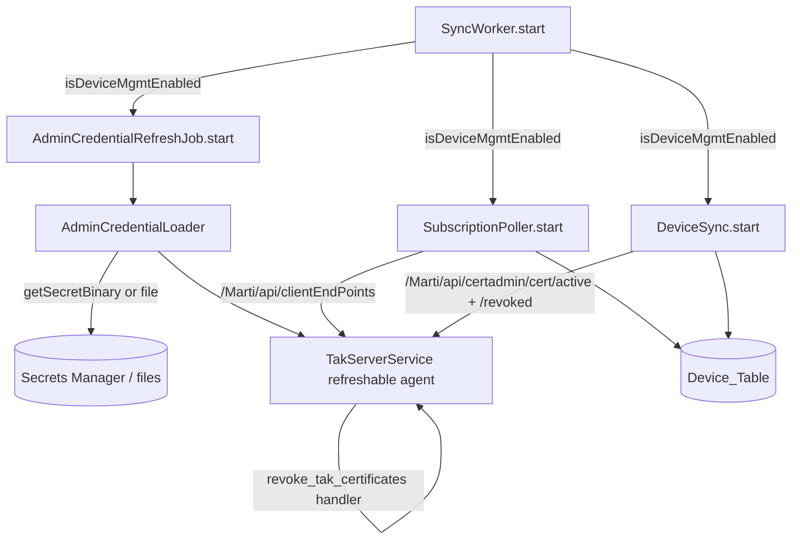

# Design Document: Device Management

## Overview

Device_Management adds an optional TAK device-management capability to TAK Team Manager: a signed-in user can see the TAK Server clients ("Devices") enrolled under their name — one per `clientUid`, each with a client-type icon — a Last_Seen indicator for each Device, and a type-`REVOKE`-to-confirm revocation of that Device's certificates. An admin gets the same view and revocation for the users they directly manage. Everything is gated behind a single server-side flag, `DEVICE_MGMT_ENABLED` (default `false`), read as `process.env.DEVICE_MGMT_ENABLED === 'true'` and never surfaced to the client — exactly mirroring the existing `CLOUDTAK_ENABLED` / `isCloudTakEnabled()` pattern in `server/config/cloudtak.js` (Requirement 1).

Last_Seen is derived ONLY from TAK Server's Marti HTTP API — specifically the Client_Endpoints_API, `GET /Marti/api/clientEndPoints`, which is TAK Server's own per-client last-seen history. There is deliberately no `cot_router` query, no TAK Server database access, and no new database role (Requirement 3.6). A Device is one `clientUid` holding a SET of Live_Certificates — those present in `GET /Marti/api/certadmin/cert/active` and absent from `GET /Marti/api/certadmin/cert/revoked` — and its displayed attributes come from the Newest_Live_Certificate, the greatest `issuanceDate` among them (Requirements 4.3, 4.6, 11).

**Endpoint authority.** TAK Server's OpenAPI 3.1 document is committed at `tak-server-openapispec.json` (308 paths) and is the authoritative endpoint contract for this feature. Every endpoint named below is cited from it by operation id and response schema; an endpoint absent from it is treated as non-existent and is not called (Requirement 14.4).

The feature reuses the codebase's established primitives rather than introducing new frameworks:

- **Flag module** — a new `server/config/deviceMgmt.js` `isDeviceMgmtEnabled(env)`, mirroring `server/config/cloudtak.js` (Requirement 1.3).
- **Scheduled jobs** — three jobs (`AdminCredentialRefreshJob`, `SubscriptionPoller`, `DeviceSync`) each follow the exact `ExpiryScheduler` / `RetentionCleanupJob` shape: a constructor that clamps an interval from an env var (`parseInt(...) || default` + `Math.min/Math.max`), a `start()` that runs one pass immediately then `setInterval`, a `stop()` that `clearInterval` (both idempotent), and a run method that NEVER throws (try/catch or `Promise.allSettled`, logged via the Structured_Logger). They are constructed in the `SyncWorker` constructor and started/stopped in `start()`/`stop()`, guarded by `isDeviceMgmtEnabled()` (Requirements 2.6, 3.1, 4.8).
- **Secrets provider** — a NEW `getSecretBinary(secretId): Promise<Buffer>` capability added to `EnvSecretsProvider` and `AwsSecretsManagerProvider` in `server/config/secretsProvider.js`, leaving the existing string `getSecret` untouched (Requirements 2.3, 2.2).
- **TAK Server client** — `server/services/TakServerService.js`, extended with an active-cert fetch, a revoked-cert fetch and a client-endpoints fetch, corrected revocation verification, and made agent-refreshable (Requirements 2.7, 4.3, 12.4, 13.1).
- **Durable revocation queue** — the existing `revoke_tak_certificates` Sync_Operation via `EventPublisher.publishOperation` and the `revokeTakCertificates` handler in `server/workers/syncWorker.js`, reused for both self- and admin-revocation but with an ADDED device-scoped payload shape, because the existing user-scoped shape revokes every certificate a user holds across all their Devices (Requirements 7.4, 8.4, 12).
- **Authorization** — the centralized `server/middleware/authorize.js` registry + row-scoped resolvers, and `server/services/DirectoryScopeService.js` for the direct-admin managed-user scoping (Requirements 6.2, 9.3, 9.4).

This document specifies only the behavior of this feature. It does not restate the existing Sync_Worker, `EventPublisher`, `TakServerService`, secrets-provider, or authorization behavior it builds on, except where a new requirement constrains that behavior.

### Naming note (avoiding collision with the existing device-enrollment feature)

The repository ALREADY has an unrelated feature at `server/routes/devices.js` + `server/services/DeviceEnrollmentService.js` with a `device:manage` permission — that is **Team-Owned Device Enrollment** (Requirement 27 of a different spec), which creates device *user accounts* and generates enrollment QR codes. This feature is different: it surfaces existing TAK Server certificates and revokes them. To avoid any collision, Device_Management mounts under a new path prefix `/api/device-management` (not `/api/devices`), uses new permission identifiers (`device_mgmt:*`, not `device:manage`), and its own service module `DeviceManagementService`. The existing `devices.js`/`DeviceEnrollmentService`/`device:manage` are left entirely unchanged.

### Findings that invalidated earlier assumptions

The first implementation of this feature was written against assumptions about TAK Server's certificate and client APIs that had not been checked against a running server. They were then checked, against the live TAK Server using the Admin_Credential, and eight of them turned out to be false or misleading. The concrete numbers are recorded here so the reversal is auditable rather than looking like drift. Each finding names the criteria it corrected.

1. **`/Marti/clients` does not exist.** It returns 404 and is absent from `tak-server-openapispec.json` entirely. The implemented `getConnectedSubscriptions()` targeted it. Requirement 3.8's graceful-404-as-empty handling turned that 404 into "no clients observed", so `last_seen_at` stayed null forever and no error was ever logged — a wrong URL was indistinguishable from an idle server. The Subscriptions_API glossary entry named this endpoint and was therefore wrong. → corrects 3.1, 3.2, 3.8; generalized as Requirement 14.
2. **`GET /Marti/api/certadmin/cert/active` is not "non-revoked, non-superseded".** It returned **95** certificates, of which **90** also appear in `GET /Marti/api/certadmin/cert/revoked`. Requirements 4.3/4.6 and the Active_Certificate glossary entry treated this view as the live set; it is only the candidate set. → corrects 4.3, 4.6, 5.4.
3. **`revocationDate` is not a reliable revocation signal.** All **95** certificates returned by `/active` carry a non-null `revocationDate` — including the **5** that TAK Server does NOT list under `/revoked` (e.g. id **3212**, `revocationDate: 2026-01-17T01:15:22.160Z`, absent from `/revoked`). The authoritative signal is membership in `GET /Marti/api/certadmin/cert/revoked`. `TakServerService.revokeCertificates` verifies with `cert.revocationDate === null`, so its verification passes unconditionally. → corrects 7.6, 8.7; specified as Requirement 12.
4. **`GET /Marti/api/certadmin/cert/replaced` cannot exclude superseded certificates.** It returned a set byte-identical to `/active` — the same **95** ids. Superseding must be computed locally as the newest `issuanceDate` per `clientUid`. → corrects 4.6.
5. **`clientUid` is heavily reused.** 60 active certificates for `ckadmin (ETL)`, 12 for `etl-fenz-test (ETL)`, 6 for `ANDROID-63040a40563b5fab`; **95** certificates collapse to **10** distinct `clientUid`s. A Device is a `clientUid` with a SET of certificates, not one certificate. → corrects 4.4, 4.5; specified as Requirement 11.
6. **The device list was mostly wrong.** Applying "in `/active` AND NOT in `/revoked`, newest `issuanceDate` per `clientUid`" yields exactly **1** live device UID on the whole server. The implementation listed **10**, most of them revoked certificates displayed with `revoked = false`. → Requirement 11.5.
7. **Revocation was over-scoped.** The revoke path enqueues `revoke_tak_certificates` with `{ tak_usernames: [username] }` (`server/workers/operationSchemas.js`: `requiredFields: { tak_usernames: 'object' }`), and `SyncWorker.revokeTakCertificates` matches every certificate whose `creatorDn` matches that username. Revoking ONE device therefore revokes EVERY certificate that user holds across ALL their devices, contradicting Requirements 7.4/8.4's "that Device's certificate". → corrects 7.4, 8.4; specified as Requirement 12.
8. **Last_Seen has a real source.** `GET /Marti/api/clientEndPoints` (OpenAPI `getClientEndpoints` → `ApiResponseListClientEndpoint`, schema `ClientEndpoint { callsign, uid, username, team, role, lastEventTime (date-time), lastStatus }`, query params `secAgo`, `showCurrentlyConnectedClients`, `showMostRecentOnly`, `group`) returned **48** entries live: **46** `lastStatus: "Disconnected"` carrying timestamps and **2** `"Connected"`. **Corrected in place (Requirement 22.10):** this finding previously continued "with `uid` values in the same space as our `client_uid` (e.g. `ANDROID-842f08e120efdbe3`)", and `server/services/SubscriptionPoller.js`'s header carries the same sentence. The claim is FALSE, and the citation is what makes it look verified: `ANDROID-842f08e120efdbe3` is a native ATAK device, the one case where the certificate `clientUid` and the reported `uid` coincide — by accident of construction, not by design. The two spaces coincide for native ATAK/iTAK/WinTAK clients and DIVERGE for CloudTAK, whose certificate uid (`chris@chriselsen.net (Web)`, `ckadmin (ETL)`) and reported uid (`ANDROID-CloudTAK-chris@chriselsen.net`) are minted in unrelated code paths, so a direct equality join can never match one. The close is the Connection_Alias — see "Matching a reported connection uid to a Device" below and Requirement 22. This is TAK Server's own last-seen HISTORY, so the best-effort monotonic reconstruction Requirement 3 was built around is largely unnecessary — the guard stays, the reconstruction goes. `GET /Marti/api/subscriptions/all` (`ApiResponseSetSubscriptionInfo` → `SubscriptionInfo`) does carry `clientUid`, but it was empty in **14 of 16** live entries, so it is not a usable key source. → corrects 3.1, 3.2, 3.7; specified as Requirement 13.

Two of these corrections reach outside this feature, and both are called out again where they are designed below: the `revocationDate` verification fix lands in the shared `TakServerService.revokeCertificates` (so it also corrects the pre-existing main-spec Requirement 26 revoke path), and the device-scoped payload changes the shared `revoke_tak_certificates` operation schema and handler (additively, so the three pre-existing user-scoped call sites keep working).

## Existing Infrastructure Reused

This section records the exact existing components this design builds on, with the observations that constrain the design.

### Secrets provider (`server/config/secretsProvider.js`)

`getSecretsProvider(env)` returns an `AwsSecretsManagerProvider` when `SECRETS_PROVIDER === 'aws-secrets-manager'`, else an `EnvSecretsProvider`. Both implement `getSecret(secretName): Promise<string>` returning a `SecretString` only — `AwsSecretsManagerProvider.getSecret` calls `GetSecretValueCommand` and throws if `SecretString` is absent. The Admin_Credential is stored as `SecretBinary`, so `getSecret` cannot read it. This design ADDS a `getSecretBinary(secretId): Promise<Buffer>` capability, without touching `getSecret` (Requirement 2.3).

### Scheduled-job shape (`ExpiryScheduler` / `RetentionCleanupJob`)

Both classes share an identical shape this design mirrors exactly:

- Constructor: `this.intervalMs = Math.min(MAX, Math.max(MIN, parseInt(process.env.X, 10) || DEFAULT))` (or just a `Math.max` lower bound where there is no hard upper cap), `this.timer = null`.
- `start()`: `if (this.timer) return;` → run one pass immediately → `this.timer = setInterval(...)`.
- `stop()`: `if (!this.timer) return;` → `clearInterval(this.timer)` → `this.timer = null`.
- The run method wraps its work in `try/catch` (or `Promise.allSettled`) so a failure is logged via `createLogger(...)` and NEVER thrown, so it can never crash the Sync_Worker (Requirements 2.10, 3.8, 4.9).

### Sync_Worker (`server/workers/syncWorker.js`)

The `SyncWorker` constructor constructs `this.expiryScheduler = new ExpiryScheduler()`, `this.retentionCleanupJob = new RetentionCleanupJob()`, and `this.takServerService = new TakServerService()`. `start()` calls `.start()` on the schedulers; `stop()` calls `.stop()`. The `revokeTakCertificates(payload)` handler uses `this.takServerService.listCertificates()`/`.revokeCertificates(...)`. Crucially, `TakServerService` builds its `https.Agent` ONCE in its constructor — so to pick up a rotated credential without a restart, the agent must be made refreshable and BOTH the existing `revoke_tak_certificates` consumer and the new device-management jobs must route through the shared Admin_Credential_Loader (Requirements 2.7, 2.8).

### TakServerService (`server/services/TakServerService.js`)

`buildMutualTlsAgentOptions(env)` returns `{ pfx, passphrase }` / `{ cert, key }` (+ optional `{ ca }`) from file/env values. `listCertificates()` does `GET /Marti/api/certadmin/cert` and unwraps `response.data.data`. `findCertificatesForUser(takUsername)` filters that list via the exported pure predicate `matchesCreatorDn(creatorDn, takUsername)` (exact `CN=<username>` component match, else case-sensitive substring). `revokeCertificates(certIds)` does `DELETE /Marti/api/certadmin/cert/revoke/{ids}` (OpenAPI `revokeCertificates`), then re-queries `listCertificates()` and treats a non-null `revocationDate` as confirmation — which finding 3 shows is not a revocation signal at all, so this verification currently succeeds unconditionally and is corrected to re-query the Revoked_Certificate_View instead (Requirements 12.4–12.6).

The fetches added here are `listActiveCertificates()` (`GET /Marti/api/certadmin/cert/active`), `listRevokedCertificates()` (`GET /Marti/api/certadmin/cert/revoked`) and `getClientEndpoints()` (`GET /Marti/api/clientEndPoints`). The already-implemented `getConnectedSubscriptions()` targets `/Marti/clients`, which does not exist (finding 1), and is removed rather than repointed, so no caller can keep the old semantics by accident.

### SiteConfig public config exclusion (`server/models/SiteConfig.js`)

`getPublicConfig()` returns only an allow-listed set of client-visible keys. There is a precedent + test (`SiteConfig.test.js`, "never includes a cloudtak/CLOUDTAK key, even when CLOUDTAK_ENABLED=true") for the CloudTAK flag being excluded. `DEVICE_MGMT_ENABLED` is mirrored: it is NEVER added to `getPublicConfig()`, and a parallel exclusion test is added (Requirements 1.4, 9.5).

The same method is ALSO where two new Presentation_Config keys are added (`display_timezone`, `device_expiry_warning_days` — Requirements 18.5, 21.7). That is not a contradiction of the exclusion above, and the distinction is worth stating once in the place a future reader will look: `getPublicConfig()` already carries `channel_folder_separator`, `maxTeamDepth` and `takRoleValues`, all of them values the client needs in order to RENDER correctly and none of them a capability gate. `DEVICE_MGMT_ENABLED` and `DEVICE_MGMT_REVOKE_ENABLED` are in the other category: they describe the arming state of a destructive capability, which is why the client discovers the feature by probing the self-view route instead (see `probeEnabled()`), and why Requirement 18.6 states the contrast explicitly rather than leaving it to be re-derived.

### Client date rendering (`client/src/utils/dateFormat.js`)

`formatDate(value, fallback)` and `formatDateTime(value, fallback)` are the app's only user-visible date formatters, and every date surface goes through them: `components/DeviceListRow.jsx`, `components/OrgInterestRequests.jsx`, `pages/Users.jsx`, `pages/AuditLogs.jsx`, `pages/Admin.jsx`, `pages/Requests.jsx`. Their doc comment already records why they exist — the app standardises on locale-independent `yyyy-mm-dd` rather than each page calling `toLocaleDateString()` — and both build their output from `getFullYear()`/`getMonth()`/`getDate()`/`getHours()`/`getMinutes()`, which are browser-local getters. That is the whole of the bug Requirement 18 fixes, and the fact that there is exactly one implementation is what makes an app-wide fix a small change (Requirement 18.2).

### Client startup config fetch (`client/src/App.jsx`)

`App.jsx` calls `configAPI.getPublic()` today, but ONLY inside the `authAPI.getProfile()` rejection branch — the unauthenticated path that decides whether to auto-start the Authentik OAuth flow. A signed-in user never reaches it. So it is **not** an existing app-wide config install point and cannot simply be reused as one; Requirement 18.11 needs a fetch that runs regardless of session state, resolved before the first date is rendered. See "Installing the Display_Timezone" below.

### Dashboard auto-refresh (`client/src/pages/Dashboard.jsx`)

`fetchChannelData` already runs on a `setInterval(…, 60000)` that a `visibilitychange` listener clears while `document.hidden` and, on becoming visible again, re-runs immediately before restarting — with the listener and the interval both torn down in the effect's cleanup. That is the Visibility_Pause_Pattern, and Requirement 19 reuses it verbatim for the device list rather than adding a second cadence beside it. `fetchDevices` in the same component has no interval at all: it runs once on mount (`useEffect(() => { fetchDevices() }, [fetchDevices])`) and again from `RevokeDeviceDialog`'s `onRevoked`.

### CloudTAK P12→PEM reference (`CloudTAK/api/common/config.ts`)

CloudTAK reads the same style of secret: `GetSecretValueCommand` → `secretValue.SecretBinary` → `Buffer.from(...)` → `pem.readPkcs12(p12Buffer, { p12Password }, cb)` → `{ cert, key }`, which it then passes as PEM strings (never as `pfx`). It uses the `pem` package (which shells out to OpenSSL). The reference bundle uses LEGACY PKCS#12 algorithms (RC2/3DES) that Node/OpenSSL 3 will not load directly as `pfx`, which is why converting to PEM at load time is required (Requirements 2.5, 2.12).

### Authorization (`server/middleware/authorize.js` + registry)

`authorize` runs after `authenticateToken`, looks up `${METHOD} ${fullPath}` in the Permission_Registry, and permits only if every required identifier is held (deny-by-default). Row-scoped resolvers (e.g. `team:update`, `user:team:transfer`) express per-request checks like "admin of THIS team". `req.user.userId` is the local `users.id`; `req.user.is_global_manager` is the cached global-manager flag. `DirectoryScopeService.resolveScope(user)` returns `UNSCOPED` for a Global_Manager, else the caller's Scoped_Organisations/Allowed_Domains, computed from `role='admin' AND inherited_from_team_id IS NULL` direct-admin rows walked to each Organisation root — this is the managed-user scoping this feature reuses (Requirement 6.2).

### `users` table

`users` has `id` (PK), `username` (the local identity matched against a certificate's `creatorDn`), `authentik_user_id`, `is_global_manager`, and `is_active`. Device_Table rows associate to a user by `users.id`, resolved from `matchesCreatorDn(cert.creatorDn, user.username)` (Requirement 4.5).

### `node-pg-migrate` migrations

`database/migrations/` holds one squashed baseline (`*_baseline-schema.cjs`) using `pgm.sql(...)`; every change from here is its own incremental migration (`npm run migrate:create`). The Device_Table is a new incremental migration in this folder (Requirement 4.1).

## Architecture

### Flag gate and inertness

`server/config/deviceMgmt.js` exports `isDeviceMgmtEnabled(env = process.env)` returning `env.DEVICE_MGMT_ENABLED === 'true'` (Requirements 1.1, 1.2, 1.3). The flag is consulted at exactly two kinds of place, so that WHILE it is false the feature is completely inert (Requirement 9.5):

1. **Job wiring** — `SyncWorker.start()` starts the three device-management jobs only `if (isDeviceMgmtEnabled())`; `stop()` stops any that were started. When off, no credential is loaded/refreshed, no poll runs, no sync runs (Requirements 1.5, 1.6, 1.7).
2. **Route reachability** — the device-management router is mounted only when the flag is on, AND each route handler re-checks the flag (defense in depth), so every device-management route and UI surface is unreachable and no Revoke_Operation is enqueued when off (Requirements 1.8, 1.9). Because the client only renders the surfaces when its own reachability probe (a `GET /api/device-management/enabled`-style call, or a 404 from the self-view) indicates the feature is live, the UI is inert too.

`DEVICE_MGMT_ENABLED` is documented in `.env.example` (optional, safe default `false`) rather than added to `REQUIRED_VARS`, and is never surfaced by `SiteConfig.getPublicConfig()` (Requirement 1.4).

### The Admin_Credential_Loader (shared, refreshable)

A new singleton module, `server/services/AdminCredentialLoader.js`, is the single source of the TAK Server admin mutual-TLS credential for BOTH the existing `revoke_tak_certificates` handler and the new device-management jobs (Requirement 2.8). It owns:

- **Source selection** (Requirement 2.1): `TAK_ADMIN_CERT_SOURCE` selects `secrets-manager` or `file`; unset defaults to `file`, preserving current behavior.
- **Load** (Requirements 2.2, 2.4, 2.5):
  - `secrets-manager`: `getSecretsProvider().getSecretBinary(TAK_ADMIN_CERT_SECRET_ARN)` → `Buffer` → convert P12→PEM using `P12_Passphrase` (default `atakatak`, overridable via `TAK_ADMIN_CERT_PASSPHRASE`) → cache `{ cert, key }` (+ `{ ca }` when a CA bundle is configured).
  - `file`: reuse `TakServerService.buildMutualTlsAgentOptions(env)` unchanged from `TAK_API_P12_PATH`/`TAK_API_P12_PASSPHRASE` or `TAK_API_CERT_PATH`/`TAK_API_KEY_PATH` (+ optional `TAK_CA_PATH`) (Requirement 2.9). Where source is `secrets-manager`, file/env credentials are NOT used.
- **Cache + accessor**: `getAgentOptions()` returns the currently-cached `https.Agent` options.
- **Refresh** (Requirements 2.6, 2.7, 2.10): `refresh()` reloads from the configured source and, if the material changed, swaps the cached credential. If refresh throws, the previously cached credential is retained, the failure is logged (no secret material), and the next scheduled refresh retries — never crashing the worker.
- **P12→PEM conversion at load time** (Requirements 2.5, 2.12): converting rather than passing `pfx` to Node avoids depending on the OpenSSL legacy provider for legacy-algorithm bundles.

The Loader NEVER logs the credential material or the passphrase at any level (Requirement 2.11).

**Making the agent refreshable.** `TakServerService` currently builds its `https.Agent` once in its constructor. This design gives it a `setAgentOptions(options)` (or a `refreshAgent()` that pulls from the Loader) method that rebuilds `this.client`'s `httpsAgent` from the current credential, so a rotated credential is used for subsequent Marti calls without a process restart (Requirement 2.7). `AdminCredentialRefreshJob.run()` calls `loader.refresh()` and then `takServerService.refreshAgent()` (or the Loader notifies the service). The single `TakServerService` instance on the `SyncWorker` (`this.takServerService`) is the one both the revoke handler and the device-management jobs use, so both pick up rotations (Requirement 2.8).



### The Subscription_Poller

`server/services/SubscriptionPoller.js`, scheduled inside the Sync_Worker on its own timer (`DEVICE_MGMT_POLL_INTERVAL_MS`, clamped, default e.g. 5 minutes). The class keeps its name so the existing tests, tasks and code comments that cite it stay valid, but its source changes from a live connected-clients snapshot to TAK Server's own history. Each run (Requirements 3.1–3.4, 3.8, 13):

1. Calls `takServerService.getClientEndpoints()` (`GET /Marti/api/clientEndPoints`, OpenAPI `getClientEndpoints` → `ApiResponseListClientEndpoint`). Disconnected entries are kept: 46 of the 48 live entries were `lastStatus: "Disconnected"` and those are precisely the ones carrying a useful last-seen time, so `showCurrentlyConnectedClients` is NOT used to narrow the result (Requirement 13.7).
2. For each entry, matches the entry to `tak_devices` rows by the Candidate_Client_Uids the Connection_Alias derives from `ClientEndpoint.uid`, and writes the entry's own `lastEventTime` — not the observation time — under the **Monotonic_Guard**. The guard protects a stored value against a shrunk or rewound upstream history rather than accumulating history itself (Requirements 13.3, 13.4). **Corrected in place (Requirement 20.3):** this step previously gave the statement as `UPDATE tak_devices SET last_seen_at = GREATEST(last_seen_at, $lastEventTime) WHERE client_uid = $uid` (equivalently `WHERE last_seen_at IS NULL OR last_seen_at < $lastEventTime`), i.e. with the clamp in the `WHERE` clause. That form cannot carry the Connection_Status write, because a non-advancing timestamp matches no row — see "Connection_Status from `ClientEndpoint.lastStatus`" for the corrected single statement, which keeps the clamp on `last_seen_at` alone by moving it into the `SET` list.
3. An entry whose `lastEventTime` is absent or unparseable is skipped for the purposes of the Last_Seen write, leaving the stored value untouched (Requirement 13.6) — but it still contributes its `lastStatus` to Connection_Status (Requirement 20.4). Devices with no entry keep their Last_Seen unchanged — no null, no rewind (Requirement 3.4) — and are set to not connected on a successful poll (Requirement 20.6).
4. On failure — including a 404, because `/Marti/api/clientEndPoints` is documented in `tak-server-openapispec.json`, so its absence means the request was wrong — log at error level via the Structured_Logger, report the run failed, leave all `last_seen_at` unchanged, retry next poll, never crash (Requirements 3.8, 14.1, 14.2). No failure is degraded to an empty result set.

Last_Seen is TAK Server's own reported last-seen time, not a reconstruction, and not a guaranteed-complete connection history: TAK Server may hold no entry for a Device, in which case `last_seen_at IS NULL` and the UI shows "never seen" (Requirements 3.5, 3.7).

`GET /Marti/api/subscriptions/all` was considered and rejected as the source: its `SubscriptionInfo.clientUid` was empty in 14 of 16 live entries, so most rows cannot be joined to a Device at all (Requirement 13.2).

### The Device_Sync

`server/services/DeviceSync.js`, scheduled inside the Sync_Worker on its own timer (`DEVICE_MGMT_SYNC_INTERVAL_MS`, clamped, default e.g. 15 minutes). Each run (Requirements 4.3–4.7, 4.9, 11):

1. Fetches BOTH views: `takServerService.listActiveCertificates()` (`GET /Marti/api/certadmin/cert/active`, OpenAPI `getActive`) and `takServerService.listRevokedCertificates()` (`GET /Marti/api/certadmin/cert/revoked`, OpenAPI `getRevoked`). Both return `ApiResponseListTakCert`.
2. Computes the **Live_Certificates** as a set difference by certificate id: in `/active`, not in `/revoked`. This is the step the earlier design lacked, and it is why the earlier implementation listed 10 devices where only 1 is live (findings 2, 6).
3. Groups Live_Certificates by `clientUid` and picks each group's **Newest_Live_Certificate** by greatest `issuanceDate`. Because `clientUid` reuse is normal (95 certificates → 10 uids, one of them holding 60), this grouping is what turns certificates into Devices (finding 5, Requirement 11.1).
4. Per group, resolves the local user by `matchesCreatorDn(newest.creatorDn, user.username)` over the local `users` table (the same predicate `findCertificatesForUser` uses) and upserts ONE Device_Table row keyed on `client_uid`, carrying the Newest_Live_Certificate's `cert_id`, `issued_at`, `expires_at`, plus `user_id` and `last_polled_at = <sync run time>`. `last_seen_at` and `revoked` are never overwritten by the sync (`last_seen_at` is the poller's; `revoked` is the worker's).
5. A `clientUid` whose every certificate is revoked yields no group, so it is not upserted as a live Device and never appears with `revoked = false` (Requirement 11.5). **Corrected in place (task 25, Requirement 17).** This step previously claimed that an existing row for such a uid "stops being refreshed — its `last_polled_at` goes stale, which is the signal the self-view uses to stop presenting it as current". That claim was false in both halves: no such signal was ever implemented, and `DeviceManagementService.listOwnDevices` filters on `user_id` alone with no freshness check and no `revoked` check, so a row upserted while the uid was still live kept being returned forever. Measured live: 13 Live_Certificates yielding 13 Devices against 22 `tak_devices` rows, nine of them stale, all with `revoked = false`. What the sync actually does now is **delete** the Stale_Device_Rows — see "Deleting stale Device rows" below.
6. Superseding is computed locally in step 3. `/Marti/api/certadmin/cert/replaced` is deliberately NOT consulted: it returned the same 95 ids as `/active` (finding 4, Requirement 11.4).
7. On failure of either fetch — including a 404 from either, since both are documented — log at error level, report the run failed, leave rows unchanged, retry next run, never crash (Requirements 4.9, 14.1, 14.2). A failed `/revoked` fetch is never treated as an empty revoked set, because that would promote every revoked certificate back to live. A failed run writes nothing AND deletes nothing (Requirement 17.2).

The upsert stays idempotent: running the same Live_Certificate set twice yields identical rows and preserves `last_seen_at` and `revoked`.

#### Deleting stale Device rows (Requirement 17)

The upsert alone cannot make the Device_Table converge on the live set: it can only add and refresh. After the upsert loop, a run that reached the completed outcome therefore deletes every Device_Table row whose `client_uid` is absent from the **Live_Device_Set** — the derived Device keys, which are exactly the `client_uid`s that run upserted:

```sql
DELETE FROM tak_devices WHERE client_uid <> ALL($1::text[])   -- $1 = the Live_Device_Set
```

**Why deletion is safe now and would not have been before.** Since task 21.2, `last_seen_at` is sourced from TAK Server's own reported `ClientEndpoint.lastEventTime` rather than accumulated by our polling (Requirement 13.1). A deleted row's `last_seen_at` is therefore re-derivable: if the `clientUid` comes back with a fresh certificate, the normal upsert re-inserts the row on a later run and the next poll re-populates `last_seen_at` from TAK Server's history, with `revoked` back at its column default (Requirement 17.5). Under the pre-21.2 accumulate-by-polling design, deleting a row destroyed the only copy of that history — which is why the earlier design reached for a staleness signal instead. That constraint is gone; the wrong claim it produced is not, which is why step 5 is corrected rather than left standing beside this section.

**The safety property, and why it is the load-bearing one.** The delete runs ONLY on a run that fully succeeded. Every failure path in `run()` — a rejected `listLiveCertificates()`, a payload that is not an array, a failed `loadUsers()` — already returns before any write with `outcome: 'failed'` (task 23.2), and each of those paths must delete nothing. Otherwise a TAK Server outage whose response read as empty would wipe the entire table on the first bad tick, which is strictly worse than the stale rows this change exists to remove. This is Property 14, and it is stated as a biconditional precisely so an implementation cannot satisfy "deletes stale rows" while missing "deletes nothing on failure".

Three further constraints follow from the existing design rather than being new choices:

- **Scoped, never blanket.** The statement is restricted to `client_uid`s absent from the Live_Device_Set; a `DELETE FROM tak_devices` with no predicate is forbidden (Requirement 17.3). The complement of that scoping is Requirement 17.4: a `clientUid` that DOES carry a Live_Certificate is never deleted, which is Requirement 11.5's failure mode from the other direction — hiding a live Device instead of showing a dead one.
- **Non-fatal.** A failed delete is logged and swallowed, the rest of the run completes, and the next run retries it — the same handling a single row's failed upsert already gets, and `run()` keeps never throwing (Requirement 17.6). Deletion is derived state; a missed pass self-corrects.
- **Ordering.** The delete runs after the upserts, and its predicate is the Live_Device_Set derived from the fetch — not the set of upserts that happened to succeed. So a run in which some rows failed to upsert still deletes only genuinely-absent uids.

**What happens to a row whose `revoked` flag was just set true.** Its certificates are revoked, so it carries no Live_Certificate, so it is absent from the Live_Device_Set and is deleted on the next completed sync. **That is intended**: the Device is gone, and the point of the revoke was to remove it. The consequence to be explicit about is that the "Revoked" badge is a transient state between the confirmed revocation and the next sync (up to `DEVICE_MGMT_SYNC_INTERVAL_MS`), NOT a permanent record that a revocation happened (Requirement 17.7). Nothing is lost by that: the durable record is the `sync_operations` row plus the Revoke_Audit_Record and its result counterpart (Requirement 12.14), which is the artifact the incident in "Revocation rails" showed to be the one that actually answers "did we revoke these?". A user-visible revocation audit trail — a retained history of revoked Devices — is a **follow-up**, deliberately not in this change's scope.

One known interaction, recorded rather than fixed here: a `clientUid` that is re-enrolled with a fresh certificate BEFORE the next sync stays in the Live_Device_Set, so its row is refreshed rather than deleted — and because the sync never writes `revoked`, that row keeps `revoked = true` and the re-enrolled Device renders as revoked. This predates this change (the sync has never cleared the flag) and is narrow (it needs a re-enrollment inside one sync interval). Clearing `revoked` on a row whose Newest_Live_Certificate is newer than the revocation is the obvious fix and is a **follow-up**, not part of task 25.

**The read path needs no change.** Confirmed by reading `server/services/DeviceManagementService.js`: `listOwnDevices(userId)` selects `WHERE user_id = $1` and orders by `issued_at DESC NULLS LAST, client_uid ASC`, with no `last_polled_at` and no `revoked` predicate, and `listManagedUserDevices` delegates straight to it — so once the rows are deleted, both views stop returning them with no query change at all. A `last_polled_at` freshness filter or a `revoked` filter MUST NOT be added (Requirement 17.8): it would be a second, independent removal mechanism that can disagree with the first, and a stale-row bug would then have two places to hide. `last_polled_at` stays what the Data Models table says it is — sync bookkeeping — and is deliberately not a visibility input.

### How the three jobs wire into SyncWorker

In the `SyncWorker` constructor, construct `this.adminCredentialLoader = new AdminCredentialLoader({ takServerService: this.takServerService })`, `this.adminCredentialRefreshJob = new AdminCredentialRefreshJob({ loader: this.adminCredentialLoader })`, `this.subscriptionPoller = new SubscriptionPoller({ takServerService: this.takServerService })`, and `this.deviceSync = new DeviceSync({ takServerService: this.takServerService })`. In `start()`, after the existing schedulers, add `if (isDeviceMgmtEnabled()) { this.adminCredentialRefreshJob.start(); this.subscriptionPoller.start(); this.deviceSync.start(); }`. In `stop()`, stop them (the idempotent `stop()` makes stopping unstarted jobs a no-op, so an unconditional stop is safe). The `AdminCredentialRefreshJob.start()`'s immediate-first-run loads the credential before the first poll/sync tick.

### Revocation flow (self and admin)

Both self- and admin-revocation reuse the existing `revoke_tak_certificates` Sync_Operation, but **device-scoped**, not user-scoped (Requirement 12). The route handler:

1. Validates authorization (self: device belongs to caller; admin: target is a Managed_User AND device belongs to that user), rejecting BEFORE any enqueue (Requirements 7.5, 8.5, 8.6).
2. Validates the `confirmation` body field equals exactly `REVOKE` server-side (`confirmation === 'REVOKE'`), rejecting (400) otherwise — the enqueue happens ONLY after this validation passes (Requirements 7.3, 8.3).
3. Enqueues `revoke_tak_certificates` with a **device-scoped payload** carrying the target `client_uid` and the owning user id: `{ client_uid, target_user_id }`. The handler resolves the Device's Live_Certificates from that `client_uid` at execution time, so a certificate issued between enqueue and execution is still covered and a certificate belonging to another Device never is.

**Why the payload has to change.** Today the operation schema is `revoke_tak_certificates: { requiredFields: { tak_usernames: 'object' }, optionalFields: { target_user_id: 'number' } }` and `SyncWorker.revokeTakCertificates` matches EVERY certificate whose `creatorDn` matches a payload username. Enqueuing `{ tak_usernames: [username] }` from a per-device Revoke button therefore revokes every certificate that user holds across all their Devices — 60 certificates on one uid in the live data, and every other uid that user owns as well (finding 7). That is over-revocation and it directly contradicts Requirements 7.4/8.4.

**Shape of the change** (Requirements 12.1–12.3):

- `server/workers/operationSchemas.js` — `revoke_tak_certificates` gains an alternative, device-scoped shape: `client_uid` (string) with `target_user_id` optional, alongside the existing `tak_usernames` array shape. Exactly one of `client_uid` / `tak_usernames` must be present. This is ADDITIVE: the three pre-existing user-scoped call sites (`TakCertificateRevocationService.revokeUserTakCertificates`, `TeamMembershipService.removeUserFromTeam`'s no-teams-left branch, and `Team.delete`'s bulk enqueue) legitimately revoke everything a user holds and keep working unchanged, so main-spec Requirement 26.6/26.7 is not broken.
- `SyncWorker.revokeTakCertificates` — when the payload carries `client_uid`, it selects the target certificate ids by `cert.clientUid === payload.client_uid` intersected with the Live_Certificates (in `/active`, not in `/revoked`), instead of by `matchesCreatorDn`. The single-fetch, no-match-is-a-successful-no-op, and error-classification semantics are unchanged.
- `TakServerService.revokeCertificates` — verification changes from "`revocationDate` is non-null in a re-queried `listCertificates()`" to "every targeted id is present in a re-queried `GET /Marti/api/certadmin/cert/revoked`" (Requirements 12.4–12.6). This is the load-bearing correctness fix: with all 95 live certificates carrying a non-null `revocationDate`, including 5 that `/revoked` does not list, the current check reports success for every id it is ever handed. **Scope note:** `revokeCertificates` is shared, so this also corrects the verification of the pre-existing main-spec Requirement 26 revoke path — a deliberate change in behavior outside this feature's own surface, and one that should be flagged in review. It is a strict tightening: an unverified id now yields the existing retryable `{success:false, unverified:[...]}` result rather than a false success.

When the operation confirms revocation, the handler flips the Device_Table flag for that one `client_uid` only: `UPDATE tak_devices SET revoked = true WHERE client_uid = $1`, guarded by `isDeviceMgmtEnabled()` and reached only past the verify-before-success check (Requirements 7.6, 8.7, 12.8). Keeping the flip inside the handler retains a single durable, retried, verified path shared by self- and admin-initiated revocation. The existing `markDevicesRevoked(clientUids)` helper already does exactly this and stays; the device-scoped path simply hands it a one-element set instead of every uid a username matched.

#### Revocation rails: separate destructive flag, dry-run, blast-radius cap, audit record

The revocation path above is correct in scope but unguarded in kind: it goes live the moment the feature flag goes on, it resolves whatever set the payload implies, and it leaves no record of what it targeted. These four rails change that (Requirements 12.9–12.16).

**Two flags, and where each is consulted.** `server/config/deviceMgmt.js` gains a second predicate beside `isDeviceMgmtEnabled()`:

```
isDeviceMgmtEnabled(env = process.env)       -> env.DEVICE_MGMT_ENABLED === 'true'
isDeviceMgmtRevokeEnabled(env = process.env) -> env.DEVICE_MGMT_REVOKE_ENABLED === 'true'
```

`DEVICE_MGMT_REVOKE_ENABLED` is an independent variable with its own default of `false` — it is NOT derived from, nested under, or defaulted to `DEVICE_MGMT_ENABLED`. Read gates keep consulting `isDeviceMgmtEnabled()` alone (the self-view, the admin view, the Subscription_Poller, the Device_Sync, route reachability). `isDeviceMgmtRevokeEnabled()` is consulted at exactly two places, both on the destructive path: in the two revoke route handlers, before any enqueue, and in `SyncWorker.revokeTakCertificates`, before any `DELETE`. Like `DEVICE_MGMT_ENABLED` it is documented in `.env.example` as an optional variable with a safe default and is never surfaced by `SiteConfig.getPublicConfig()` (Requirement 12.9).

**The dry-run path through the handler.** WHILE Revoke_Enabled is false the two revoke routes reject before enqueue with a distinct, non-404 client error (`403` with a body naming the disarmed capability, e.g. `{ error: 'Device revocation is disabled', capability: 'DEVICE_MGMT_REVOKE_ENABLED' }`). A `404` is deliberately NOT used: `404` already means Device_Mgmt_Enabled is off (Requirement 1.8), so reusing it would make "the feature is absent" and "revocation is disarmed" indistinguishable to the caller and in the logs (Requirement 12.10).

The handler cannot rely on the route gate, because a Revoke_Operation can reach the queue from three pre-existing user-scoped call sites, from an earlier deployment, or by hand. So `revokeTakCertificates` runs its full resolution — payload branch, Live_Certificate set difference, single-`client_uid` check, cap check — and then, WHILE Revoke_Enabled is false, stops: it logs the complete Revoke_Audit_Record, issues no `DELETE`, flips no `revoked` flag, and returns **success as a dry-run** rather than a failure, so the operation is not retried forever and the queue does not fill with a revoke waiting to fire the moment the flag flips (Requirement 12.11). The dry-run outcome is logged with its own distinguishable marker (a `dryRun: true` field on the audit record), so a dry-run is never mistaken for a completed revocation in the logs.

**Cap check placement, and why it fails closed.** Both checks sit AFTER the target certificate ids are resolved and BEFORE the `DELETE` — the only point at which the true blast radius is known:

1. **Single-`client_uid`** (device-scoped shape only): the resolved set must carry exactly one distinct `clientUid`. A set spanning more than one means the resolution itself is wrong, so the operation aborts without a `DELETE` and is marked **permanently** failed via the existing `classifyTakServerError`-style permanent path — retrying cannot fix a resolution defect (Requirement 12.12).
2. **Blast-radius cap**: the resolved count is compared against `DEVICE_MGMT_REVOKE_MAX_CERTS` (default **250**), and exceeding it aborts without a `DELETE`. The default is set above the largest real per-Device count measured on the live server — 60 certificates on `ckadmin (ETL)` — so a re-enrollment-heavy Device is not blocked by the rail that exists to catch runaway resolutions (Requirement 12.13).

**Truncating to the cap is forbidden**, not merely discouraged. A truncated revoke leaves some of a Device's Live_Certificates valid while the operation reports success and the UI marks the Device revoked — a Device presented as disabled that still connects. Refusing the whole operation is a visible, fixable state; a partial revocation is an invisible, wrong one. Both aborts apply to both payload shapes; the single-`client_uid` check applies only to the device-scoped shape, since the user-scoped shape legitimately spans a user's Devices (Requirements 12.13, 12.15).

**Audit-record shape.** One structured line before the action, one after, both via the Structured_Logger and both carrying non-sensitive identifiers only (no credential material, no passphrase — Requirements 2.11, 9.2 unchanged):

```js
// BEFORE the DELETE - emitted in dry-run mode too
logger.info('revoke_audit', {
  operationId,                  // sync_operations id
  actingUserId,                 // who initiated (or the system call site)
  payloadShape: 'client_uid' | 'tak_usernames',
  clientUid,                    // target Device (null for the user-scoped shape)
  targetCertIds: [/* every id, not truncated */],
  targetCertCount,
  targetCertIdsDigest,          // stable digest of the sorted id list
  capLimit, dryRun,
  revokedViewCountBefore        // pre-flight /revoked size
});
// AFTER - the verification outcome
logger.info('revoke_audit_result', {
  operationId, clientUid, targetCertCount,
  verified: true | false, unverified: [/* ids */],
  revokedViewCountAfter, revokedFlagFlipped
});
```

The id list is never truncated in the log; where a count makes a full list impractical, the count and the stable digest are logged alongside whatever ids are recorded, so two runs can be compared without the full list (Requirement 12.14). `revokedViewCountBefore`/`revokedViewCountAfter` come from the `/revoked` fetches the operation already makes, so the change a revoke caused is answerable by differencing two recorded numbers instead of being inferred from an absence of evidence (Requirement 12.16). Both records are emitted for the user-scoped shape as well — that shape has the larger blast radius, so exempting it would leave the widest revoke the least observable one (Requirement 12.15).

**Incident that motivated these rails.** While this feature was enabled against a shared live TAK Server, 20 valid certificates were revoked in one batch. **Our application was not the cause**, established on four independent points:

- **Zero** `revoke_tak_certificates` operations have ever existed in `sync_operations` — that queue is the only path through which our worker can revoke.
- No log line in the sync-worker or app containers mentions a revoke.
- The only requests made by hand against TAK Server were `GET`s.
- The batch landed at `01:15:01`, matching a recurring TAK-Server-side pattern that predates this work (`2026-01-17T01:15:22`, 67 certificates; `2026-08-14T07:15:02`, 14 certificates); our jobs run on a different cadence. None of the 20 were past expiry.

**The exposure was nonetheless real, and it is the reason for these rails.** The feature had been enabled with a revoke path that (a) enqueued a user-scoped payload revoking every certificate a user holds across all their Devices (finding 7), and (b) verified success via `revocationDate`, which is non-null on every certificate (finding 3) — so it would have reported success regardless of what actually happened on the server. Nothing fired only because the queue happened to be empty. That is a weak guarantee: three pre-existing user-scoped call sites and any click on the Revoke button could have put an operation in it. Note also what the investigation depended on: the `sync_operations` table was the only artifact that could answer "did we revoke these?" at all, and a revoke issued outside the queue would have left nothing to answer with — which is why the Revoke_Audit_Record (12.14) is a requirement and not a convenience.

### Presentation configuration reaching the client (Requirements 18.5, 21.7)

Two values have to reach the browser because the browser is what renders with them: the Display_Timezone and Expiry_Warning_Days. Both are added to `SiteConfig.getPublicConfig()` as Presentation_Config keys, resolved server-side so the default lives in one place:

```js
// server/models/SiteConfig.js, inside getPublicConfig()
config.display_timezone = process.env.DISPLAY_TIMEZONE || 'Pacific/Auckland';   // Requirement 18.1, 18.5
config.device_expiry_warning_days =
  parseInt(process.env.DEVICE_MGMT_EXPIRY_WARNING_DAYS, 10) > 0
    ? parseInt(process.env.DEVICE_MGMT_EXPIRY_WARNING_DAYS, 10)
    : 30;                                                                       // Requirement 21.1, 21.7
```

**Why this is not a hole in Requirement 12.9, stated here as well as in the requirement.** The device-management flags stay out of the public config because they say whether a destructive capability is armed. These two say how to draw a date. They carry no security meaning, gate nothing, and are useless server-side — nothing on the server renders `yyyy-mm-dd HH:MM` for a user or decides what colour a table cell is. The client's feature-discovery mechanism is unchanged: it still probes the self-view route (`probeEnabled()`), and neither `DEVICE_MGMT_ENABLED` nor `DEVICE_MGMT_REVOKE_ENABLED` is added to `getPublicConfig()` (Requirements 1.4, 12.9, 18.6). The existing exclusion tests stay, and the new keys get their own presence tests, so the two categories are asserted separately and a later refactor cannot quietly move a flag from one to the other.

Both keys degrade to their defaults client-side when the endpoint is unreachable or omits them (Requirements 18.7, 21.7). The defaults are the same literals on both sides, deliberately duplicated rather than shared through a build-time import, because the client bundle and the server process do not share a module graph and a client that never received the config must behave exactly like one that received the default.

### The Display_Timezone inside the shared formatters (Requirement 18)

`formatDate`/`formatDateTime` keep their signatures, their `fallback` semantics, and their output format exactly (Requirements 18.3, 18.10). What changes is where the components come from: instead of `date.getFullYear()`/`getMonth()`/`getDate()`/`getHours()`/`getMinutes()` — browser-local getters, which is why a `2026-03-12T00:58:04.508Z` instant rendered as `2026-03-11 17:58` on a UTC−7 browser — the components are read out of an `Intl.DateTimeFormat` configured with `timeZone` set to the resolved Display_Timezone.

`Intl.DateTimeFormat` with `formatToParts` and an explicit numeric part configuration is the mechanism, because it is the only one in the platform that answers "what were the wall-clock components in zone Z at instant I" without a date library. It is used to READ components, and the `yyyy-mm-dd`/`yyyy-mm-dd HH:MM` string is still assembled by this module from those parts. Handing the formatting itself to a locale-aware formatter — `toLocaleDateString()`-style output, or `Intl` with a named `dateStyle` — is what the Date_Format_Helpers exist to prevent, and would put `3/11/2026` or `11.03.2026` back on the page depending on the user's browser (Requirement 18.3). Configuring `hour12: false` and `hourCycle: 'h23'` explicitly matters for the same reason: an `h24`-style cycle renders midnight as `24:00`, which is not the format either.

**Resolution is memoised and never throws** (Requirements 18.8, 18.9). An unrecognised `timeZone` makes the `Intl.DateTimeFormat` constructor throw a `RangeError`, and these functions are called once per rendered cell — so a mistyped `DISPLAY_TIMEZONE` on a table of thirty rows would otherwise be thirty exceptions, and whatever error boundary caught them would blank the page. The module therefore builds its formatters once, inside a try/catch that walks the Display_Timezone_Fallback_Chain — configured zone, then `Pacific/Auckland`, then `UTC` — and caches the first one that constructs. `UTC` is the last link because it is the one zone a runtime with any `Intl` support at all is required to accept. If even that fails, the formatters fall back to the current local-getter arithmetic rather than returning nothing: a date in the wrong zone is a smaller failure than no date.

**Installing the Display_Timezone.** A `setDisplayTimezone(zone)` entry point on the module accepts the value from the public config and resets the memoised formatters. It is called once at startup from `App.jsx`, in a fetch that runs regardless of whether the profile call succeeded — the existing `configAPI.getPublic()` call in that file is inside the `getProfile()` rejection branch and a signed-in user never reaches it, so it is not usable for this. The call resolves within the startup gate `App.jsx` already holds the interface behind (`loading`), so the first rendered date is already in the configured zone (Requirement 18.11) and correctness does not depend on a module-level mutation propagating to components that have already rendered — React would not re-render for it. A failed or slow fetch does not extend that gate: the default stands and the app renders (Requirements 18.7, 18.11).

Nothing server-side changes. Stored timestamps, `sync_operations` payloads, Structured_Logger fields and API response fields all stay ISO-8601 UTC (Requirement 18.12) — the Display_Timezone exists at exactly one layer, the last one.

### Device-list auto-refresh (Requirement 19)

The Dashboard's device card gets the same effect shape the channel card in the same file already has: `setInterval(fetchDevices, 60000)`, cleared on `document.hidden`, re-fetched immediately and restarted on becoming visible, both the interval and the `visibilitychange` listener cleared in the effect's cleanup so nothing survives unmount (Requirements 19.1–19.3). `fetchDevices` is already a `useCallback` with a stable identity, so the effect mounts once.

Three behaviours are what make this more than a `setInterval`, and each is a constraint on `fetchDevices`, not on the timer:

- **A refresh must not disturb an open revoke dialog** (Requirement 19.4). The dialog's visibility is driven by `deviceToRevoke`, and its typed confirmation text is state inside `RevokeDeviceDialog`. So the refresh must not clear `deviceToRevoke` and must not remount the dialog — meaning the refreshed list must not be given a new React key path for the open row, and `deviceToRevoke` must be left alone by the fetch. It holds the Device object captured when the row was clicked, which is sufficient for the dialog (it needs the `clientUid`), so no re-resolution against the refreshed list is needed or wanted.
- **A transient failure must not clear or flicker the list** (Requirements 19.5, 19.6). Today `fetchDevices` sets `devicesLoading` and, on error, sets `devicesError` while leaving `devices` in place — the retained-list half is already right. What a periodic refresh adds is that the loading flag must NOT be re-raised on a background refresh (only the first fetch shows the spinner), and `setDevices([])` must not happen on failure, or a 5xx on one tick would empty a correct table and the next tick would refill it. The probe result is treated the same way: only an explicit 404 (feature disabled) hides the card, never a network or 5xx failure.
- **The cadence is a UI-consistency decision, not a data-freshness one** (Requirement 19.7). The server re-polls TAK Server every `DEVICE_MGMT_POLL_INTERVAL_MS` (default 5 minutes) and re-syncs every `DEVICE_MGMT_SYNC_INTERVAL_MS` (default 15 minutes), so roughly four in five device refreshes at 60 s re-read rows nothing has touched. A cadence matched to the server's would have been defensible; 60 s was chosen so that the two auto-refreshing cards on one dashboard behave identically, and that is recorded here so the next reader does not "fix" the mismatch by tightening the server cadence.

The user-details modal is deliberately excluded (Requirement 19.8). It is a dialog opened for a moment, it already refetches on open and after a revoke, and a background refresh inside a modal that can have a confirmation dialog stacked on top of it is the exact disruption the constraint above exists to avoid.

### Connection_Status from `ClientEndpoint.lastStatus` (Requirement 20)

`lastStatus` is the field the poller currently reads past. It is `Connected` or `Disconnected`, it is CURRENT state, and it is the answer to a question a certificate cannot answer — which is why it is stored on `tak_devices` as a `connected` boolean rather than derived on read the way `clientType` is (Requirements 20.2, 15.2).

Two things about writing it are the entire risk of this capability, and both are stated as criteria because getting either wrong silently produces a status that looks plausible and is stale:

**1. The Monotonic_Guard must not gate the status write** (Requirement 20.3). The poller's existing statement is

```sql
UPDATE tak_devices SET last_seen_at = $2
 WHERE client_uid = $1 AND (last_seen_at IS NULL OR last_seen_at < $2)
```

and that `WHERE` clause is deliberately a no-match for a non-advancing timestamp — which is exactly right for a running maximum and exactly wrong for current state. A device that is connected right now but whose reported `lastEventTime` equals what is already stored matches no row, so a status riding on this statement would never be written for precisely the devices most likely to be connected. The write becomes one statement whose guard applies to `last_seen_at` only:

```sql
UPDATE tak_devices
   SET connected = $3,
       last_seen_at = CASE
         WHEN $2::timestamptz IS NOT NULL
          AND (last_seen_at IS NULL OR last_seen_at < $2) THEN $2
         ELSE last_seen_at
       END
 WHERE client_uid = ANY($1::text[])
```

**Corrected in place (Requirement 22.4, 22.5):** this statement's `WHERE` clause previously read `WHERE client_uid = $1`, a single reported uid. It now takes the Candidate_Client_Uids of the reported entry — for a native Device a one-element array holding the reported uid, which is the same match it has always made, and for a CloudTAK Device the three-element array the Connection_Alias derives. Nothing else about the statement changes: the clamp stays in the `SET` list governing `last_seen_at` alone, and both writes still ride one statement. See "Matching a reported connection uid to a Device".

The `WHERE` narrows to the candidate rows; the monotonic clamp moves into the `SET` list where it governs one column. `last_seen_at` keeps its exact semantics — never rewound, never nulled, Property 3 unchanged — while `connected` is written unconditionally for every reported `uid`. One consequence to keep: this statement now matches (and so bumps `updated_at` on) rows whose `last_seen_at` did not move, which the previous guarded form avoided. That is the cost of writing a second column and is accepted.

A second consequence follows in `extractLastEventTimes`. It currently SKIPS an entry with an absent or unparseable `lastEventTime` entirely (Requirement 13.6) — which must keep leaving `last_seen_at` untouched, but must no longer discard the entry's status (Requirement 20.4). The reducer's value type therefore becomes `{ lastEventTime: Date|null, connected: boolean }` per `uid`: a skipped timestamp contributes `lastEventTime: null`, which the `CASE` above leaves alone, while its `Connected` still reaches the `connected` column.

**2. Several entries per UID** (Requirement 20.5). The reducer already collapses duplicate `uid`s, taking the GREATEST reported time. Status collapses by a different rule — `connected` if ANY entry for that `uid` reports `Connected`, compared case-insensitively — because a device with one live connection is connected no matter how many stale per-callsign entries TAK Server also holds for it. Verified live: one Windows SID returned four entries under different callsigns. Anything that is not `Connected`, including an absent or null `lastStatus`, counts as not connected; the classification is total.

**A Device with no entry at all**, on a run that succeeded, is set to not connected (Requirement 20.6). The statement is scoped to the `client_uid`s absent from the reported set — which, **corrected in place (Requirement 22.6)**, is the UNION of the Candidate_Client_Uids of every reported entry rather than the raw reported `uid` values; a sweep still keyed on the raw values would set a CloudTAK row back to `false` in the same poll that had just marked it connected, and the fix would be invisible. That is the same discipline Requirement 17.3 imposes on the stale-row delete, and for the same reason: an update unrestricted by `client_uid` is one typo away from rewriting the table. The reasoning for the rule itself is that "connected" is a positive claim that needs evidence from the current poll; a stale `true` left in place would show a Device as online forever if TAK Server dropped its entry, whereas this rule's failure mode costs a connected Device its badge for at most one poll interval. Requirement 3.4 is untouched: that Device's `last_seen_at` is still left exactly as it was.

**A failed poll writes nothing** (Requirement 20.7). Every existing early return in `run()` — the rejected fetch, the non-list payload — already precedes every write and reports `outcome: 'failed'`; the status write sits behind the same returns. Marking every Device disconnected because the fetch failed would make a TAK Server outage indistinguishable from every device going offline, which is the same class of error as Requirement 17.2's "an outage must not empty the table".

The field reaches the client through `mapDevice` (Requirement 20.8), so all four endpoints gain `connected` at once, and the Device_Sync neither inserts nor updates the column — it is absent from both the `INSERT` column list and the `ON CONFLICT DO UPDATE SET` list, exactly like `last_seen_at` and `revoked`, which is what makes "the poller is the only writer" structural rather than a convention (Requirement 20.10).

**Rendering** (Requirement 20.9). `DeviceListRow.jsx`'s Last Seen cell becomes: when `connected` is true, the Connected_Label as text, with the `formatDateTime(lastSeenAt)` value retained beside it when one is known; otherwise the cell is exactly what it is today, including the `NEVER_SEEN_LABEL` fallback. The label is text — following the "Revoked" badge precedent (Requirement 16.5), where the text badge is what carries the state to assistive technology and the colour is decoration — and it lives in the shared row component, so the Dashboard card and the modal cannot disagree (Requirement 16.6). Requirements 5.3 and 6.5 were amended in place to carry the not-currently-connected qualifier, because "never seen" is a false statement about a Device that is connected right now.

### Imminent-expiry highlighting (Requirement 21)

A pure client-side classifier, `client/src/utils/expiryWarning.js`, maps an `expiresAt` and a threshold to one of three states:

```
classifyExpiry(expiresAt, warningDays, now) -> 'none' | 'imminent' | 'expired'
```

Total, boundary-explicit, and never throwing: null/undefined/unparseable → `'none'`; strictly before `now` → `'expired'`; from `now` through `now + warningDays` inclusive → `'imminent'`; later → `'none'` (Requirement 21.6). `now` is injected so the boundaries are testable without clock manipulation. It lives in `client/src/utils/` beside `dateFormat.js` and `channelTree.js` for the same reason `classifyClientType` lives in `server/utils/`: a pure total function with interesting boundaries belongs somewhere a property test can reach it directly.

The row renders the state: `'imminent'` and `'expired'` both get bold red, and each gets its OWN text marker — "Expires soon" and "Expired" respectively (Requirements 21.2, 21.3, 21.5). Two distinct markers rather than one shared style because "expires soon" is false of a date in the past, and because font weight and colour are both invisible to a screen reader, so the marker is the only thing that actually conveys the state (Requirement 21.3). `'none'` renders precisely what the cell renders today, including the `'Unknown'` fallback for a null `expiresAt` (Requirement 21.4).

**On the expired state's reachability.** Whether TAK Server's `/active` view excludes fully-expired certificates has NOT been checked against the live server, and this design does not assume either answer. If it excludes them, such a Device carries no Live_Certificate, so its row is deleted by the stale-row reconciliation (Requirement 17.1) and `'expired'` is unreachable in practice; if it does not, the row persists and renders as `'expired'`. Either way the still-live, nearly-expired certificate is the case this feature is for, and no expiry filter is added to the read path to force one outcome or the other — Requirement 17.8 stands and visibility keeps exactly one mechanism (Requirement 21.9).

### Matching a reported connection uid to a Device (Requirement 22)

The poller's join is `ClientEndpoint.uid == tak_devices.client_uid`. For a native ATAK, iTAK or WinTAK Device those two strings are the same string and the join is correct. For a CloudTAK Device they are minted in two unrelated code paths and never coincide, so `chris@chriselsen.net (Web)` renders "never seen" while the browser session is in use — not because TAK Server holds no entry for it, but because the entry it holds reports `ANDROID-CloudTAK-chris@chriselsen.net`. Requirement 22 records the provenance of both strings and the live evidence; this section designs the close.

**One shared derivation, `server/utils/connectionAlias.js`.** A pure, total function of the reported uid alone, living beside `clientType.js` and `callsignValidation.js` for the same reason those do — a total function with interesting boundaries belongs somewhere a property test can call it directly (Requirement 22.1):

```
CLOUDTAK_CONNECTION_PREFIX = 'ANDROID-CloudTAK-'
candidateClientUids(reportedUid) -> string[]
  // ALWAYS [reportedUid, ...]. WHERE reportedUid starts with the prefix
  // (case-insensitive), also `${base} (Web)` and `${base} (ETL)`, base being
  // the remainder after the prefix. Total: returns a value for every input,
  // including '', the prefix with nothing after it, and non-string input.
```

Both writes call it — the Last_Seen/Connection_Status statement's `WHERE client_uid = ANY($1::text[])` and the unreported sweep's exclusion list — so the two cannot disagree about which rows a reported uid identifies. That is the point of putting it in one place rather than inlining the prefix test at each write site.

| reported `ClientEndpoint.uid` | Candidate_Client_Uids | matches (live) |
|---|---|---|
| `ANDROID-63040a40563b5fab` | `[ANDROID-63040a40563b5fab]` | the native row, bit-for-bit as today |
| `ANDROID-CloudTAK-chris@chriselsen.net` | `[…, chris@chriselsen.net (Web), chris@chriselsen.net (ETL)]` | `chris@chriselsen.net (Web)` |
| `ANDROID-CloudTAK-ckadmin` | `[…, ckadmin (Web), ckadmin (ETL)]` | `ckadmin (ETL)` |

**Both suffixes are generated, not one.** The reported uid carries no evidence of which enrollment path minted the certificate: ` (ETL)` comes from upstream `@tak-ps/node-tak`, ` (Web)` from the TAK-NZ CloudTAK fork only. Picking one would leave the other form unmatched — which is the bug, not a fix (Requirement 22.3). Where both rows exist for one base, both get the same Last_Seen and the same Connection_Status; that ambiguity is accepted rather than resolved (Requirement 22.8, and decision 18 below).

**The one non-local interaction is the unreported sweep.** Requirement 20.6's sweep sets `connected = false` on every row whose `client_uid` is absent from the reported set. If that set stays the raw reported uids, a CloudTAK row marked connected earlier in the same poll is by construction absent from it and is immediately unmarked — so the sweep's input becomes the union of every entry's Candidate_Client_Uids (Requirement 22.6). Requirement 20.6's scoping discipline is otherwise untouched: the write stays restricted to the absent `client_uid` values and is never issued unrestricted.

**Exact strings only.** Every candidate is a complete `client_uid` compared by equality. No `LIKE`, no prefix or substring test, no wildcard (Requirement 22.7). Each candidate's base is the account identifier the connection belongs to, so a row is only reachable by a uid whose base is that row's own account identifier — which is what keeps one user's connection off another user's Device row. `ClientEndpoint.username` was available and was rejected precisely because it is a TAK Server account name rather than a Client_Uid: joining on it would map every Device an account owns onto one connection.

**Known-unhandled: the DN_Shaped_Connection_Uid.** `MachineConnConfig` and `AdminConnConfig` return `ConnectionControl.uid(cert)` — the certificate subject reversed and comma-joined — rather than the prefixed form. No uid of that shape appeared in the 48 live Client_Endpoints_API entries, so no candidate is generated for it, and the derivation site records that in a comment (Requirement 22.11). Recording it is the point: an unmatched DN-shaped uid found later reads as accounted-for rather than as an oversight.

**Failure direction.** The alias is keyed on upstream string construction this project does not control. If upstream changes it, the alias stops matching and the affected CloudTAK Device's Last_Seen returns to null — the pre-fix behaviour — because the reported uid is always still tried on its own (Requirement 22.9). Nothing is persisted, so there is no stored key to fall out of date (Requirement 22.13); no migration and no schema change.

## Components and Interfaces

### `server/config/deviceMgmt.js` (new)

```
isDeviceMgmtEnabled(env = process.env) -> boolean   // env.DEVICE_MGMT_ENABLED === 'true'
```

### `server/config/secretsProvider.js` (extended)

```
EnvSecretsProvider.getSecretBinary(secretName) -> Promise<Buffer>
  // dev/test: read a local file path (e.g. `${secretName}` names an env var
  // holding a path) OR decode a base64 env var; documented precisely in code.
AwsSecretsManagerProvider.getSecretBinary(secretName) -> Promise<Buffer>
  // GetSecretValueCommand -> Buffer.from(response.SecretBinary); throws if absent.
// getSecret(secretName) -> Promise<string>   // UNCHANGED
```

### `server/services/AdminCredentialLoader.js` (new)

```
constructor({ takServerService, env = process.env, secretsProvider = getSecretsProvider(env) })
load() -> Promise<void>            // initial load from configured source
refresh() -> Promise<void>         // reload; retain cache on failure; swap agent on change
getAgentOptions() -> https.AgentOptions   // { cert, key } (+ { ca })
selectSource(env) -> 'secrets-manager' | 'file'
```

### `server/services/AdminCredentialRefreshJob.js`, `SubscriptionPoller.js`, `DeviceSync.js` (new)

Each mirrors `ExpiryScheduler`/`RetentionCleanupJob`: `constructor({ ... })` with clamped interval, `start()`, `stop()`, and a never-throwing `run*()`.

### `server/services/TakServerService.js` (extended)

```
refreshAgent() / setAgentOptions(options)   // rebuild this.client's httpsAgent
listActiveCertificates() -> Promise<Array>  // GET /Marti/api/certadmin/cert/active   (getActive)
listRevokedCertificates() -> Promise<Array> // GET /Marti/api/certadmin/cert/revoked  (getRevoked)
listLiveCertificates() -> Promise<Array>    // active MINUS revoked, by cert id (Requirement 11.2)
getClientEndpoints(params?) -> Promise<Array>
  // GET /Marti/api/clientEndPoints (getClientEndpoints -> ApiResponseListClientEndpoint)
  // entries: { callsign, uid, username, team, role, lastEventTime, lastStatus }
revokeCertificates(certIds) -> Promise<{success:true}|{success:false,unverified:number[]}>
  // verification re-queries /Marti/api/certadmin/cert/revoked and requires MEMBERSHIP;
  // the previous `revocationDate !== null` check is removed (Requirements 12.4-12.6)
buildMutualTlsAgentOptions(env) -> https.AgentOptions
  // + optional { servername } from TAK_SERVER_TLS_SERVERNAME; otherwise unchanged
// REMOVED: getConnectedSubscriptions()  // targeted /Marti/clients, which does not exist
// listCertificates / findCertificatesForUser / matchesCreatorDn unchanged
```

All four GETs are documented in `tak-server-openapispec.json`, so none of them tolerates a 404 as an empty result; each rejects and lets the caller's never-throwing `run()` log an error and report the run failed (Requirement 14). The one deliberate exception the code must justify inline is any view this feature does not need to be correct — there is currently none among these four (Requirement 14.3).

### `server/utils/clientType.js` (new) — pure classification

```
CLIENT_TYPES = { CLOUDTAK, ANDROID, IOS, WINDOWS, UNKNOWN }
classifyClientType(clientUid) -> 'cloudtak' | 'android' | 'ios' | 'windows' | 'unknown'
```

A pure, total, case-insensitive function of `clientUid` alone (Requirement 15.1, 15.3), living beside the existing pure helpers in `server/utils/` (`callsignValidation.js`, `directoryScope.js`). Rules are evaluated in precedence order and the first match wins:

| # | Client_Type | Rule on `clientUid` (case-insensitive) | Live example |
|---|---|---|---|
| 1 | CloudTAK | contains `(ETL)`, `(Web)`, or the literal `CloudTAK` anywhere | `ckadmin (ETL)`, `ANDROID-CloudTAK-chris@chriselsen.net` |
| 2 | Android / ATAK | starts with `ANDROID-` | `ANDROID-63040a40563b5fab` |
| 3 | iOS / iTAK | UUID, `8-4-4-4-12` hex groups | `CE17C84D-9700-4080-BA5A-44AF51809453` |
| 4 | Windows / WinTAK | Windows SID, `S-1-5-21-<digits>-<digits>-<digits>-<digits>` | `S-1-5-21-2281966494-490247268-205662872-1002` |
| 5 | Unknown | anything else | — |

**CloudTAK outranks Android deliberately** (Requirement 15.4): `ANDROID-CloudTAK-chris@chriselsen.net` exists on the server and is a CloudTAK session, not an ATAK device, so testing the Android prefix first would misclassify it. Unknown is a first-class outcome with its own icon and label — never guessed into another category (Requirement 15.5).

Classification is derived SERVER-SIDE on read and exposed as `clientType` on the Device wire shape. No column, no migration, no backfill (Requirement 15.2): the derivation is cheap, and putting it in one place means the Dashboard card and the modal cannot drift apart.

### TAK Server TLS server identity (`TAK_SERVER_TLS_SERVERNAME`)

Both new fetches above — and the pre-existing revoke path — only work if the TLS handshake to TAK Server completes. It currently does not, and that is not a deployment defect (Requirement 10).

**The failure, and why it is permanent.** TAK Server presents a server certificate with `subject CN=takserver` and a single SAN, `DNS:takserver`. Operators never dial that name; they reach TAK Server through a different DNS name (in the reference environment, an AWS NLB at `tak.test.tak.nz:8443`). Node verifies the server certificate's identity against the host it dialed, so the handshake fails with `ERR_TLS_CERT_ALTNAME_INVALID` every time. Nothing about the deployment can change this: the internal Expected_Server_Name is what TAK Server's own certificate carries, so the mismatch is inherent to TAK Server deployments in production too, not an artifact of the demo environment (Requirement 10.1).

Three probes were run through the exact `https.Agent` → axios path `TakServerService` uses, against the live TAK Server:

| Agent options | Outcome |
|---|---|
| pinned TAK CA bundle as `ca` + `servername: 'takserver'` | **HTTP 200** — `GET /Marti/api/certadmin/cert/active` returned 22 active certificates |
| public roots only + `servername: 'takserver'` | rejected — `SELF_SIGNED_CERT_IN_CHAIN` |
| pinned TAK CA bundle as `ca` + `servername: 'tak.test.tak.nz'` (the dialed host) | rejected — `ERR_TLS_CERT_ALTNAME_INVALID` |

The middle probe is the load-bearing one: with the same `servername` but without the Server_Trust_Bundle the connection is still refused, which proves chain verification is genuinely enforced in the passing configuration. The passing configuration is therefore a narrowing of *which name* is verified, not a disguised bypass of *whether* the certificate is verified (Requirement 10.2).

**Chosen design.** `buildMutualTlsAgentOptions(env)` gains one optional field: when `TAK_SERVER_TLS_SERVERNAME` is set to a non-empty value, `options.servername` is set to it; when unset or empty, the returned options are byte-for-byte what they are today. The option is read at agent-construction time, which was verified to be sufficient — setting `servername` on the `https.Agent` options (rather than per axios request) is honored for every request the agent carries, so no per-call plumbing is needed and both `refreshAgent()`-rebuilt agents and the constructor-built agent pick it up (Requirements 10.4, 10.5, 10.6).

**Where the Server_Trust_Bundle comes from.** The admin PKCS#12 in Secrets Manager was verified to carry the full chain — leaf `CN=admin`, intermediate `CN=intermediate-ca`, self-signed root `CN=TAK.NZ` — so the `ca` bundle can be derived from the Admin_Credential itself rather than scraped from the TAK Server connection at connect time, which would be circular. That keeps the trust anchor out-of-band relative to the connection it verifies (Requirement 10.7). Separately, that same bundle uses `pbeWithSHA1And40BitRC2-CBC`, which stock Node 24 / OpenSSL 3 refuses outright when handed to `https.Agent` as `pfx` (`Unsupported PKCS12 PFX data`) — independent real-world confirmation of the `node-forge` P12→PEM conversion Requirements 2.5/2.12 mandate.

**Rejected: `rejectUnauthorized: false`.** It is the shortest fix and the worst one. It does not narrow verification to the identity check — it turns off chain verification as well, so the agent would happily hand the Admin_Credential (a TAK Server *administrative* client certificate, the highest-value secret this feature touches) to whatever endpoint answered the connection. Any party able to intercept the connection collects it. Rejected in every environment, including development and test (Requirement 10.3).

**Rejected: a `checkServerIdentity` no-op.** Supplying `checkServerIdentity: () => undefined` keeps chain verification but accepts *any* name the pinned CA ever signs. Pinning a real Expected_Server_Name is strictly stronger for the same amount of configuration, so the no-op adds nothing but a wider hole.

**Scope note — this changes behavior beyond device-management.** `buildMutualTlsAgentOptions` is shared, so the pre-existing `revoke_tak_certificates` path picks the `servername` up too (Requirement 10.6). That is a deliberate change in behavior outside this feature's own surface and worth calling out in review. It is backwards compatible: the option is inert while `TAK_SERVER_TLS_SERVERNAME` is unset, so any deployment whose TAK Server certificate already matches the dialed name is unaffected, and the variable is documented in `.env.example` as optional with a safe default (Requirement 10.5).

### `server/services/DeviceManagementService.js` (new)

Pure-ish query/authorization layer used by the routes (mirrors how routes delegate to services elsewhere):

```
listOwnDevices(userId) -> Promise<Device[]>       // WHERE user_id = $1 only - no freshness
                                                  // filter, no revoked filter (Requirement 17.8)
listManagedUserDevices(actingUser, targetUserId) -> Promise<Device[]>   // throws NotManagedUserError if not managed
assertCanRevokeOwn(userId, clientUid) -> Promise<Device>                // throws if not owner
assertCanRevokeManaged(actingUser, targetUserId, clientUid) -> Promise<Device> // throws if not managed / not owner
```

Managed-user determination reuses `DirectoryScopeService.resolveScope(actingUser)` plus the direct-admin membership relationship (`role='admin' AND inherited_from_team_id IS NULL`), consistent with `user:read:team_admin`/DirectoryScope. A Global_Manager is `UNSCOPED` (sees all).

`mapDevice(row)` remains the single definition of the Device wire shape, and is where `clientType` is added:

```
mapDevice(row) -> { clientUid, certId, issuedAt, expiresAt, lastSeenAt, revoked,
                    clientType,    // clientType = classifyClientType(row.client_uid)
                    connected }    // connected  = row.connected (Requirement 20.8)
```

Because every method (`listOwnDevices`, `listManagedUserDevices`, both revoke assertions) already returns through `mapDevice`, adding the field there gives every endpoint `clientType` at once and makes it impossible for one surface to see it and another not (Requirements 15.1, 15.2).

### `server/routes/deviceManagement.js` (new) — mounted at `/api/device-management`

Every route: `authenticateToken` → `authorize` → handler that re-checks `isDeviceMgmtEnabled()` (404 when off).

### `server/workers/syncWorker.js` (extended)

Construct + start/stop the three jobs (guarded); optionally extend `revokeTakCertificates` to flip Device_Table `revoked` when device-management is enabled.

### Client

- `client/src/services/api.js` — a new `deviceManagementAPI` group.
- `client/src/pages/Dashboard.jsx` — a "My Devices" surface.
- A reusable `client/src/components/UserDevicesModal.jsx` (user-details modal) used by BOTH `client/src/pages/Users.jsx` and the Orgs & Teams view (`client/src/pages/Teams.jsx` / `TeamDetail.jsx`).
- A reusable REVOKE type-in confirmation dialog (modeled on `TransferMemberDialog.jsx`).
- `client/src/components/DeviceTypeIcon.jsx` (new) — ONE component mapping `clientType` to a glyph plus a label, used by both device lists (Requirements 15.6, 15.7).

### `client/src/components/DeviceTypeIcon.jsx` (new)

```
<DeviceTypeIcon clientType="android" />
// renders an inline <svg> (or a heroicon) with role="img" + <title>/aria-label,
// wrapped in the `relative group` tooltip pattern, tabIndex={0} so the tooltip
// is reachable by keyboard
```

Glyphs are inline SVG committed in this one file — no new client dependency (Requirement 15.7). `@heroicons/react` is already a client dependency, so `GlobeAltIcon` is used for CloudTAK and `QuestionMarkCircleIcon` for Unknown; Android, iOS and Windows get committed inline SVG glyphs. Each icon carries a visible-on-hover-and-focus tooltip naming the platform ("Android / ATAK", "iOS / iTAK", "Windows / WinTAK", "CloudTAK", "Unknown client type") and an accessible name, so the platform is never conveyed by shape alone.

### Icon-only list actions (Requirement 16)

Both device lists currently render a text `Revoke` button (`Dashboard.jsx`, `UserDevicesModal.jsx`). Those become Icon_Only_Actions, establishing the general convention for list actions in this codebase:

- A `TrashIcon`-style destructive glyph in place of the word, with `aria-label={`Revoke device ${device.clientUid}`}` so the accessible name names both the action and its target (Requirement 16.2).
- The tooltip reuses the existing `relative group` pattern already used in `Dashboard.jsx` (`opacity-0 group-hover:opacity-100`), extended with `group-focus-within:opacity-100` (or `focus-visible` on the control plus a sibling selector) so a keyboard user gets the same disclosure as a mouse user (Requirements 16.3, 16.4). No new tooltip library.
- The disabled state for an already-revoked Device keeps `disabled` (so it is announced as unavailable) alongside the existing "Revoked" text badge, so the state is never carried by color alone (Requirement 16.5).
- Both lists render the same markup, from the same helper, so the two surfaces cannot diverge (Requirement 16.6).

### `client/src/utils/dateFormat.js` (extended — Requirement 18)

```
formatDate(value, fallback = '')     -> 'yyyy-mm-dd'        // signature and fallback UNCHANGED
formatDateTime(value, fallback = '') -> 'yyyy-mm-dd HH:MM'  // signature and fallback UNCHANGED
setDisplayTimezone(zone)             -> void
  // installs the zone from the public config and resets the memoised formatters;
  // called once at startup from App.jsx (Requirement 18.11)
getDisplayTimezone()                 -> string
  // the zone actually in force after the Display_Timezone_Fallback_Chain resolved,
  // exported so a test can assert the fallback without reading module internals
DEFAULT_DISPLAY_TIMEZONE = 'Pacific/Auckland'   // Requirements 18.1, 18.7
```

Internally: one memoised `Intl.DateTimeFormat` per helper, built with `timeZone` + numeric parts + `hour12: false` / `hourCycle: 'h23'`, constructed inside a try/catch that walks configured zone → `Pacific/Auckland` → `UTC` (Requirements 18.8, 18.9). The `yyyy-mm-dd` assembly stays in this module, from `formatToParts` output — no locale-formatted string is ever returned (Requirement 18.3).

### `client/src/utils/expiryWarning.js` (new — Requirement 21)

```
EXPIRY_STATES = { NONE: 'none', IMMINENT: 'imminent', EXPIRED: 'expired' }
DEFAULT_EXPIRY_WARNING_DAYS = 30
classifyExpiry(expiresAt, warningDays = DEFAULT_EXPIRY_WARNING_DAYS, now = Date.now())
  -> 'none' | 'imminent' | 'expired'      // total, boundary-inclusive, never throws
resolveWarningDays(value)                 -> number
  // a positive integer from the public config, else DEFAULT_EXPIRY_WARNING_DAYS
  // (Requirements 21.1, 21.7)
```

### `server/models/SiteConfig.js` (extended)

```
getPublicConfig() -> { ...existing keys,
                       display_timezone,              // Requirement 18.5
                       device_expiry_warning_days }   // Requirement 21.7
// DEVICE_MGMT_ENABLED / DEVICE_MGMT_REVOKE_ENABLED remain absent (Requirements 1.4, 12.9)
```

### `server/services/SubscriptionPoller.js` (extended — Requirement 20)

```
extractLastEventTimes(entries)
  -> { statusByUid: Map<string, { lastEventTime: Date|null, connected: boolean }>,
       skipped: number }
  // was Map<string, Date>. An entry with an unusable lastEventTime now yields
  // { lastEventTime: null, connected } instead of being dropped (Requirements 13.6, 20.4);
  // `connected` collapses by the Status_Collapse_Rule (Requirement 20.5)
recordLastSeen(candidateClientUids, lastEventTime, connected) -> Promise<{rowCount}>
  // one statement: WHERE client_uid = ANY($1::text[]) narrows to the candidate rows
  // (Requirements 22.4, 22.5 — was a single clientUid); the monotonic clamp moves into
  // the SET list so it governs last_seen_at only (Requirement 20.3)
markUnreportedDisconnected(reportedCandidateUids) -> Promise<{rowCount}>
  // success path only, scoped to client_uid <> ALL($1) (Requirements 20.6, 20.7).
  // The argument is the UNION of every reported entry's Candidate_Client_Uids, not the
  // raw reported uids (Requirement 22.6)
```

### `server/utils/connectionAlias.js` (new — Requirement 22)

```
CLOUDTAK_CONNECTION_PREFIX = 'ANDROID-CloudTAK-'
candidateClientUids(reportedUid) -> string[]
  // pure, total, never throws; always includes reportedUid itself; adds
  // `${base} (Web)` and `${base} (ETL)` when the prefix is present (case-insensitive)
unionCandidateClientUids(reportedUids) -> string[]
  // the sweep's input (Requirement 22.6)
```

Both the Last_Seen/Connection_Status write and the unreported sweep call this module, which is what stops the two from diverging on which rows a reported uid identifies (Requirement 22.1). No client-side counterpart: the match happens server-side at poll time and nothing about it reaches the wire shape.

### `client/src/components/DeviceListRow.jsx` (extended — Requirements 20.9, 21.2-21.5, 21.8)

The Last Seen cell gains the Connected_Label branch and the Expires cell gains the two expiry markers. Both stay in this one component, which is what Requirement 16.6 exists to guarantee: neither the Dashboard card nor the modal renders a device cell of its own.

```
CONNECTED_LABEL   = 'Connected'
EXPIRES_SOON_LABEL = 'Expires soon'
EXPIRED_LABEL      = 'Expired'
// exported for direct unit testing, matching NEVER_SEEN_LABEL / revokeActionLabel
```

## Data Models

### Device_Table migration (`node-pg-migrate`, new incremental migration in `database/migrations/`)

Table `tak_devices`:

| Column | Type | Notes |
|---|---|---|
| `client_uid` | `text` / `varchar` | **PRIMARY KEY** — the certificate `clientUid`, the stable device id (Requirement 4.2) |
| `user_id` | `integer NULL REFERENCES users(id) ON DELETE SET NULL` | associated local user (matched via `creatorDn`); nullable when no local user matches |
| `cert_id` | `integer NOT NULL` | TAK certificate id |
| `issued_at` | `timestamptz NULL` | certificate issuance date |
| `expires_at` | `timestamptz NULL` | certificate expiration date |
| `last_seen_at` | `timestamptz NULL` | best-effort, monotonic-forward; NULL = "never seen" |
| `last_polled_at` | `timestamptz NULL` | set to the Device_Sync run time on each upsert; sync bookkeeping only, NOT a visibility or freshness input — a Device stops being presented because its row is deleted, not because this column went stale (Requirement 17.8) |
| `revoked` | `boolean NOT NULL DEFAULT false` | set true when the Revoke_Operation confirms revocation |
| `connected` | `boolean NOT NULL DEFAULT false` | **added by a second incremental migration (Requirement 20.2).** Connection_Status: TAK Server's CURRENT report for this Device, from `ClientEndpoint.lastStatus` collapsed by the Status_Collapse_Rule. Written by the Subscription_Poller only — absent from the Device_Sync's `INSERT` column list AND its `ON CONFLICT DO UPDATE SET` list, like `last_seen_at` and `revoked` (Requirement 20.10). NOT behind the Monotonic_Guard (Requirement 20.3) |
| `created_at` / `updated_at` | `timestamptz DEFAULT now()` | conventional, matching baseline tables |

Indexes: PK on `client_uid`; `CREATE INDEX ON tak_devices (user_id)` (self-view and admin-view lookups by user); optionally `(cert_id)` for revoke reconciliation. The migration follows the baseline conventions (`pgm.sql(...)` or the schema-builder API; either is acceptable for a new incremental migration).

No new column is added for Client_Type: `clientType` is derived on read from `client_uid` (Requirement 15.2). `client_uid` remains the primary key, which is exactly the Device identity Requirement 11 requires — one row per Device, updated in place across re-enrollments (Requirement 11.6).

Requirement 22 adds no column and no migration either: the Connection_Alias is computed from the reported uid at poll time and no derived key is persisted, so `client_uid` stays exactly the certificate's `clientUid` and there is nothing stored that can fall out of date with CloudTAK's string construction (Requirement 22.13). What changes is the `WHERE` clause of the poller's two writes, not the shape of the table.

#### `connected` column migration (second incremental migration)

A new `node-pg-migrate` migration adds the one column, following the same `pgm.sql(...)` conventions as `1787518155760_tak-devices.cjs`:

```sql
ALTER TABLE public.tak_devices
  ADD COLUMN connected boolean NOT NULL DEFAULT false;

COMMENT ON COLUMN public.tak_devices.connected IS
  'Requirement 20: Connection_Status -- TAK Server''s current report for this Device (ClientEndpoint.lastStatus, collapsed by the Status_Collapse_Rule). Written by the Subscription_Poller only, on every successful poll, NOT behind the Monotonic_Guard.';
```

`NOT NULL DEFAULT false` rather than a nullable tri-state. A nullable column would distinguish "no poll has reported on this Device yet" from "reported, not connected", mirroring how `last_seen_at IS NULL` means "never seen" — but nothing consumes the distinction: both render identically, and both mean "we have no evidence this Device is connected". Two states are what the UI needs and three is what a future reader would have to reason about. The existing rows an `ALTER` fills with `false` are also correct under this reading, so no backfill is needed: the next successful poll writes the real value for every Device TAK Server reports.

The same migration also re-issues the `last_seen_at` column comment, which is stale: it reads "best-effort, monotonic-forward Last_Seen from the live subscriptions API", and the live-subscriptions source is the endpoint that does not exist (finding 1) — Last_Seen has come from the Client_Endpoints_API's reported `lastEventTime` since task 21.2. `COMMENT ON COLUMN` is idempotent and the correction belongs in a migration that runs, since the applied `1787518155760_tak-devices.cjs` will not run again (its source text is corrected in place too, for readers).

#### Presentation_Config keys on `GET /api/config/public`

| Key | Source | Default | Client fallback |
|---|---|---|---|
| `display_timezone` | `DISPLAY_TIMEZONE` | `Pacific/Auckland` | `Pacific/Auckland`, then `UTC` if the runtime rejects the zone (Requirements 18.7, 18.8) |
| `device_expiry_warning_days` | `DEVICE_MGMT_EXPIRY_WARNING_DAYS` | `30` | `30` when absent or not a positive integer (Requirement 21.7) |

Neither key is a capability gate; `DEVICE_MGMT_ENABLED` and `DEVICE_MGMT_REVOKE_ENABLED` stay out of this response (Requirements 1.4, 12.9, 18.6).

### `revoke_tak_certificates` payload — two shapes

The operation now accepts either shape, and exactly one of `client_uid` / `tak_usernames` must be present (Requirement 12.2, 12.3):

```json
// device-scoped (this feature's Revoke button) - revokes the Live_Certificates
// of exactly ONE clientUid
{ "client_uid": "ANDROID-842f08e120efdbe3", "target_user_id": 42 }

// user-scoped (pre-existing call sites: explicit user revoke, last-team removal,
// Team.delete bulk) - unchanged, still revokes everything the user holds
{ "tak_usernames": ["alice"], "target_user_id": 42 }
```

`server/workers/operationSchemas.js` today declares `requiredFields: { tak_usernames: 'object' }`, which makes the device-scoped shape invalid. The schema entry becomes a two-shape entry with a validation rule that exactly one discriminator is present; the handler branches on which one it got. Keeping both shapes on one operation type preserves the single durable, retried, verified revocation path.

## Correctness Properties

*A property is a characteristic or behavior that should hold true across all valid executions of a system — essentially, a formal statement about what the system should do. Properties serve as the bridge between human-readable specifications and machine-verifiable correctness guarantees.*

The properties below were derived from the acceptance-criteria prework. Many criteria are UI/rendering, one-shot config, structural, or error-path (e.g. "surface in a modal", "never in public config", "migration exists", "refresh failure retains cache") and are covered by example, edge-case, integration, or smoke tests in the Testing Strategy rather than by universal properties. Redundant criteria were consolidated: the unset-flag case (1.2) is subsumed by the flag predicate; flag-off inertness across loader/poller/sync/enqueue (1.5–1.7, 1.9, 9.5) into one property; monotonic observations (3.2, 3.4, 9.8) into the monotonic-forward property; self view+revoke (5.5, 7.5, 9.3) into one self-scope property; admin view+revoke limits (6.6, 6.7, 8.5, 8.6, 9.4) into one admin-scope property.

### Property 1: Enablement flag predicate

*For all* possible values of `DEVICE_MGMT_ENABLED` (including unset, empty, `'TRUE'`, `' true '`, `'1'`, and arbitrary strings), `isDeviceMgmtEnabled` SHALL return `true` if and only if the value is exactly the string `'true'`.

**Validates: Requirements 1.1, 1.2**

### Property 2: Disabled inertness

*For all* device-management triggers — a scheduled credential-refresh tick, a poll tick, a sync tick, and a revocation request — WHILE Device_Mgmt_Enabled is false, exercising the trigger SHALL result in no Admin_Credential load/refresh, no Subscriptions_API call, no Active_Certificate fetch, no Device_Table write, and no Revoke_Operation enqueue.

**Validates: Requirements 1.5, 1.6, 1.7, 1.9, 9.5**

### Property 3: Last_Seen is monotonic-forward

*For all* sequences of reported `lastEventTime` values for a Device (each poll's Client_Endpoints_API entry for that `uid`), applying each in order SHALL leave the Device's stored Last_Seen equal to the maximum reported timestamp seen so far, so that no poll moves Last_Seen backward and no poll nulls an already-set Last_Seen; a Device TAK Server has never reported retains a null Last_Seen. The property is unchanged in force by the source change (finding 8) — it now guards a stored value against a shrunk or rewound upstream history instead of accumulating history from snapshots, and Requirement 9.8 continues to require it.

**Validates: Requirements 3.2, 3.3, 3.4, 9.8, 13.4, 13.5**

### Property 4: Device sync is idempotent and preserves Last_Seen

*For all* sets of Live_Certificates, upserting the set into the Device_Table twice SHALL yield the same rows as upserting it once (same `client_uid`, `cert_id`, `issued_at`, `expires_at`, `user_id`, one row per distinct `client_uid`), and SHALL leave each row's existing `last_seen_at` and `revoked` unchanged.

**Validates: Requirements 4.4, 4.7**

### Property 5: Self scope is enforced server-side

*For all* users and all Device_Table contents, a user's self-view SHALL return exactly the Devices whose `user_id` is that user, and a self-revocation SHALL be permitted (reach enqueue) only for a Device whose `user_id` is that user.

**Validates: Requirements 5.5, 7.5, 9.3**

### Property 6: Admin scope is strictly limited to managed users

*For all* admin/target-user pairs and all Device_Table contents, an admin's view or revocation of a target user's Devices SHALL be permitted only when the target user is a Managed_User of that admin (per the direct-admin scoping) AND, for revocation, the target Device belongs to that target user; any request against a non-Managed_User SHALL be denied.

**Validates: Requirements 6.6, 6.7, 8.5, 8.6, 9.4**

### Property 7: Revoke enqueue only after REVOKE confirmation

*For all* confirmation strings submitted with a revocation request (self or admin), the Revoke_Operation SHALL be enqueued if and only if the confirmation string is exactly equal to the Revoke_Confirmation_Word `REVOKE`.

**Validates: Requirements 7.3, 8.3**

### Property 8: Devices are live client UIDs carrying their newest live certificate

*For all* pairs of an Active_Certificate list and a Revoked_Certificate_View list (with arbitrary overlap, arbitrary `clientUid` reuse, and arbitrary `issuanceDate` order), the derived Device set SHALL contain exactly one entry per `clientUid` that has at least one certificate in `/active` and not in `/revoked`; each entry's `certId`, `issuedAt` and `expiresAt` SHALL equal those of the greatest-`issuanceDate` Live_Certificate for that `clientUid`; and no `clientUid` whose every certificate is revoked SHALL appear at all.

**Validates: Requirements 4.3, 4.4, 4.6, 5.4, 11.1, 11.2, 11.3, 11.5, 11.6**

### Property 9: Revocation targets exactly one Device's live certificates

*For all* certificate catalogues (arbitrary `clientUid` reuse and arbitrary `creatorDn` sharing) and every `clientUid` in them, a device-scoped Revoke_Operation for that `clientUid` SHALL target exactly the certificate ids that are Live_Certificates carrying that `clientUid`, and SHALL target no certificate carrying any other `clientUid` — including certificates sharing the same `creatorDn`. Correspondingly, at most the one Device_Table row for that `clientUid` SHALL have `revoked` flipped.

**Validates: Requirements 7.4, 8.4, 12.1, 12.8**

### Property 10: Revocation is confirmed only by revoked-view membership

*For all* re-queried catalogues, `revokeCertificates` SHALL report success if and only if every targeted id is present in the Revoked_Certificate_View, independently of any targeted certificate's `revocationDate` — in particular a catalogue in which every certificate carries a non-null `revocationDate` but a targeted id is absent from `/revoked` SHALL be reported as unverified, and a catalogue in which a targeted id is present in `/revoked` with a null `revocationDate` SHALL be reported as success.

**Validates: Requirements 7.6, 8.7, 12.4, 12.5, 12.6, 12.7**

### Property 11: Client_Type classification is total, deterministic, and precedence-correct

*For all* strings, `classifyClientType` SHALL return exactly one of the five Client_Types; SHALL return the same value for the string and for any change of its case; SHALL return `cloudtak` for every string containing `(ETL)`, `(Web)`, or `CloudTAK` (including strings that ALSO start with `ANDROID-`); SHALL return `android` for every other string starting with `ANDROID-`; SHALL return `ios` for every UUID-shaped and `windows` for every SID-shaped string not already matched; and SHALL return `unknown` for everything else, never throwing and never returning a non-Client_Type value.

**Validates: Requirements 15.1, 15.3, 15.4, 15.5, 15.8**

### Property 12: A documented-endpoint failure is never an empty result

*For all* failure modes of a fetch against an endpoint documented in `tak-server-openapispec.json` (404, other 4xx, 5xx, network error, timeout, malformed payload), the containing run SHALL be reported as failed with an error logged, and SHALL perform no Device_Table write — in particular a 404 SHALL NOT be converted into an empty result set, and a failed Revoked_Certificate_View fetch SHALL NOT be converted into an empty revoked set.

**Validates: Requirements 3.8, 4.9, 14.1, 14.2, 14.5**

### Property 13: A DELETE is issued only when armed, single-Device, and within the cap

*For all* resolved target certificate sets (arbitrary size, arbitrary `clientUid` spread including sets spanning several uids, and sizes both under and over the Revoke_Blast_Radius_Cap) and *for all* combinations of Device_Mgmt_Enabled and Revoke_Enabled, `revokeTakCertificates` SHALL issue the `DELETE /Marti/api/certadmin/cert/revoke/{ids}` if and only if Revoke_Enabled is true AND the resolved set carries exactly one distinct `client_uid` AND its size is less than or equal to the cap; in every other case no `DELETE` SHALL be issued and no Device_Table `revoked` flag SHALL be flipped. The single-`client_uid` conjunct applies to the device-scoped payload shape; for the user-scoped shape the armed-and-within-cap conjuncts alone decide. In every case — issued or not — the Revoke_Audit_Record SHALL have been logged before the decision point.

**Validates: Requirements 12.9, 12.10, 12.11, 12.12, 12.13, 12.14, 12.15**

### Property 14: A row is deleted if and only if the fetch succeeded and its client UID is not live

*For all* fetch outcomes (a rejected certificate-view fetch, a malformed non-list payload, a failed local-user load, and a fully successful fetch) and *for all* pairs of a derived Live_Device_Set and a Device_Table content (arbitrary overlap, including disjoint, identical, and one-empty pairs), a Device_Table row SHALL be deleted if and only if the run's fetch fully succeeded AND that row's `client_uid` is absent from the derived Live_Device_Set. In particular a run reporting `outcome: 'failed'` SHALL delete NO row whatever the table contains — including when the failure produced an empty or unreadable payload — and a successful run SHALL delete NO row whose `client_uid` is present in the Live_Device_Set. Every deletion SHALL be restricted by `client_uid`, never unrestricted.

**Validates: Requirements 17.1, 17.2, 17.3, 17.4**

### Property 15: Date rendering is total, correctly zoned, and format-invariant

*For all* instants (including pre-epoch instants, instants either side of a daylight-saving transition, and instants within an hour of midnight in the target zone) and *for all* installed zone values (valid IANA names including half-hour and 45-minute offsets, plus arbitrary strings, the empty string, and undefined), `formatDate` SHALL return a string matching exactly `yyyy-mm-dd` and `formatDateTime` a string matching exactly `yyyy-mm-dd HH:MM` on a 24-hour clock with every component zero-padded; the components SHALL equal the wall-clock components of that instant in the zone the Display_Timezone_Fallback_Chain resolved to; and neither function SHALL raise for any input, so that no installed zone value can blank out or crash a rendered date. For an input that is null, undefined, or unparseable, both SHALL return the caller's `fallback` unchanged.

**Validates: Requirements 18.2, 18.3, 18.8, 18.10, 18.14**

### Property 16: Expiry classification is total and boundary-exact

*For all* `expiresAt` values (null, undefined, unparseable strings, instants far in the past, instants exactly at `now`, instants exactly at `now + warningDays`, instants one millisecond either side of both boundaries, and instants far in the future) and *for all* threshold values, `classifyExpiry` SHALL return exactly one of `none`, `imminent`, `expired`, never raising; SHALL return `expired` if and only if `expiresAt` is a known instant strictly earlier than `now`; SHALL return `imminent` if and only if `expiresAt` is a known instant in the closed interval from `now` through `now + warningDays` inclusive; and SHALL return `none` for every other input, including every unknown or unparseable one.

**Validates: Requirements 21.4, 21.6, 21.11**

### Property 17: One poll writes current status for every reported UID, independently of the monotonic guard

*For all* Client_Endpoints_API payloads (arbitrary numbers of entries per `uid`, arbitrary `lastStatus` values including `Connected`, `Disconnected`, absent, null, and mixed case, and arbitrary `lastEventTime` sequences that deliberately include equal, decreasing, absent and unparseable values) and *for all* Device_Table contents, a successful poll SHALL leave each Device's stored `last_seen_at` equal to the running maximum of the parseable reported times for its `uid` (Property 3 unchanged), SHALL set each reported Device's `connected` to whether AT LEAST ONE entry for that `uid` reports `lastStatus` equal to `Connected` compared case-insensitively — invariantly under any permutation of the entries, and including the case where the only `Connected` entry is one whose `lastEventTime` was unusable and whose Last_Seen contribution was therefore skipped — and SHALL set `connected` to false for exactly the Device_Table rows whose `client_uid` is absent from the reported set, through a statement parameterised by those `client_uid`s and never one unrestricted by `client_uid`. In particular a reported `lastEventTime` that does not advance past the stored value SHALL still have its status written.

**Amended in place (Requirement 22.6):** "the reported set" in this property means the UNION of the Candidate_Client_Uids of every reported entry, not the raw reported `uid` values, and each per-entry write matches that entry's Candidate_Client_Uids rather than its raw `uid`. For a payload of native uids the two readings are identical, which is why the property text is amended rather than renumbered; Property 18 is what pins the derivation itself down.

**Validates: Requirements 20.3, 20.4, 20.5, 20.6, 20.12**

### Property 18: The Connection_Alias is total, additive, exact, and reaches the unreported sweep

*For all* reported `ClientEndpoint.uid` values — including the empty string, the CloudTAK_Connection_Prefix with nothing after it, prefixed uids whose base already ends in ` (Web)` or ` (ETL)`, the prefix in arbitrary mixed case, and arbitrary strings carrying no prefix — the Connection_Alias derivation SHALL return a value rather than raising, and SHALL be a pure function of its input alone; the reported uid SHALL be a member of the returned Candidate_Client_Uids for every input; a uid that does not begin with the CloudTAK_Connection_Prefix compared case-insensitively SHALL yield EXACTLY one candidate, that uid alone, so no native ATAK, iTAK or WinTAK Device's match is altered; a uid that does begin with that prefix SHALL yield EXACTLY three candidates — the reported uid itself, `<base> (Web)`, and `<base> (ETL)`, where `<base>` is the remainder of the uid after the prefix; every candidate SHALL be an exact complete `client_uid` string used for equality matching, so no candidate stands in a proper-prefix or substring relationship to a row key in place of equality and no candidate is a pattern; and *for all* Client_Endpoints_API payloads, the reported set handed to the Criterion 20.6 unreported sweep SHALL contain every candidate of every reported entry, so no row a reported entry just marked connected can be swept back to not connected within the same poll.

**Validates: Requirements 22.1, 22.2, 22.3, 22.6, 22.7, 22.9, 22.12**

### Two existing properties are strengthened rather than duplicated

Requirement 20.7 ("a failed poll writes no Connection_Status at all") and Requirement 20.10 ("the Device_Sync never writes `connected`") do NOT get properties of their own — they are already inside the scope of properties this design has:

- **Property 12** already asserts that for all failure modes of a documented-endpoint fetch the run is reported failed and performs **no Device_Table write**. The `connected` column is a Device_Table write, so 20.7 is covered; the property's implementation gains an assertion that the status statement is absent too, and an example test covers the specific "a failed poll must not mark every Device disconnected" reading.
- **Property 4** already asserts that a sync upsert leaves each row's existing `last_seen_at` and `revoked` unchanged. `connected` joins that preservation list, which is one more field on an existing assertion rather than a new property.

Adding separate properties for either would be exactly the redundancy the reflection step exists to remove: one property would imply the other and both would fail together.

### Requirement 19 gets no property, deliberately

Nothing in the device-list auto-refresh earns one. A `setInterval` firing on schedule, a `visibilitychange` transition, an unmount clearing a timer, and "the open dialog kept the text the user typed" are each a single interleaving with a single correct outcome; generating a hundred variants would exercise the browser's timer implementation rather than this application's code. They are covered by fake-timer example tests and edge-case tests in the Testing Strategy, and the absence is recorded here so it reads as a decision rather than an omission.

## API / Endpoint Design

All endpoints are mounted at `/api/device-management`, require `authenticateToken` + `authorize`, and re-check `isDeviceMgmtEnabled()` in-handler (returning 404 when off, so the surface is indistinguishable from not existing).

### Self-view — own Devices

`GET /api/device-management/me/devices`
- Auth: `device_mgmt:read:own` (in `roleDefaults.authenticated_user`).
- Handler: `DeviceManagementService.listOwnDevices(req.user.userId)`.
- Response `200`: `{ devices: [{ clientUid, certId, issuedAt, expiresAt, lastSeenAt, revoked, clientType, connected }] }`. `lastSeenAt` is `null` for "never seen"; `clientType` is one of `cloudtak | android | ios | windows | unknown` (Requirement 15.1); `connected` is TAK Server's current report for the Device, from the most recent successful poll (Requirement 20.8). Every timestamp stays ISO-8601 UTC on the wire — the Display_Timezone is applied only when the client renders (Requirement 18.12).

### Admin view — a managed user's Devices

`GET /api/device-management/users/:userId/devices`
- Auth: `device_mgmt:read:managed` — row-scoped resolver: Global_Manager, OR the target `:userId` is a Managed_User of the acting admin (direct-admin scoping via DirectoryScope). A non-managed target is denied (`403`).
- Handler: `DeviceManagementService.listManagedUserDevices(req.user, req.params.userId)`.
- Response `200`: same shape as self-view. `403` when not managed (Requirement 6.7).

### Self-revoke

`POST /api/device-management/me/devices/:clientUid/revoke`
- Body: `{ confirmation: "REVOKE" }`.
- Auth: `device_mgmt:revoke:own` (row-scoped: the `:clientUid` Device's `user_id` equals `req.user.userId`).
- Handler: assert ownership → assert `confirmation === 'REVOKE'` (else `400`, no enqueue) → `EventPublisher.publishOperation('revoke_tak_certificates', { client_uid: req.params.clientUid, target_user_id: req.user.userId }, req.user.userId)` — device-scoped, so only this Device's Live_Certificates are revoked (Requirements 7.4, 12.1).
- Response `202`: `{ enqueued: true }`.

### Admin-revoke

`POST /api/device-management/users/:userId/devices/:clientUid/revoke`
- Body: `{ confirmation: "REVOKE" }`.
- Auth: `device_mgmt:revoke:managed` — row-scoped: Global_Manager OR (`:userId` is a Managed_User of the acting admin AND the `:clientUid` Device's `user_id` equals `:userId`); denied upfront before any enqueue (Requirement 8.5).
- Handler: assert managed + ownership → assert `confirmation === 'REVOKE'` → enqueue `revoke_tak_certificates` with `{ client_uid: req.params.clientUid, target_user_id: req.params.userId }` — device-scoped, never user-scoped (Requirements 8.4, 12.1).
- Response `202`: `{ enqueued: true }`.

### Registry entries and role defaults

Added to `server/config/permissions.registry.js`:

```
'GET /api/device-management/me/devices': ['device_mgmt:read:own'],
'GET /api/device-management/users/:userId/devices': ['device_mgmt:read:managed'],
'POST /api/device-management/me/devices/:clientUid/revoke': ['device_mgmt:revoke:own'],
'POST /api/device-management/users/:userId/devices/:clientUid/revoke': ['device_mgmt:revoke:managed'],
```

`device_mgmt:read:own` and `device_mgmt:revoke:own` are placed in `roleDefaults.authenticated_user` (any signed-in user acts on their own Devices). `device_mgmt:read:managed` and `device_mgmt:revoke:managed` are NOT in `roleDefaults` (so `resolveAccess` never satisfies them statically and the row-scoped resolver is always consulted) — mirroring how `user:team:transfer` is deliberately kept out of `roleDefaults`. New row-scoped resolvers are added to `rowScopedResolvers`, each short-circuiting `true` for a Global_Manager, then checking managed-user + device-ownership against the DB.

## Client Design

- **Dashboard "My Devices"** (Requirement 5): `Dashboard.jsx` gains a card (rendered only when a reachability probe succeeds) calling `deviceManagementAPI.getMyDevices()`. It lists each Device's Device_Type_Icon, UID, issued, expires, and Last_Seen ("never seen" when null), with an icon-only Revoke action opening the confirmation dialog. Matches the existing card/table/dark-mode styling.
- **Reusable user-details modal** (Requirement 6.3, 6.4): `UserDevicesModal.jsx` takes a `userId`, calls `deviceManagementAPI.getUserDevices(userId)`, and renders the same device list — same Device_Type_Icon, same icon-only Revoke action. It is attached in `Users.jsx` (from the row "Manage" action) and in the Orgs & Teams view (`Teams.jsx`/`TeamDetail.jsx` member list), so both surfaces reuse ONE component.
- **Device_Type_Icon** (Requirements 15.6, 15.7, 16.6): both lists render `<DeviceTypeIcon clientType={device.clientType} />` from the shared component, so the platform glyph, its label and its tooltip have one definition.
- **Icon-only actions** (Requirement 16): the Revoke control is an icon with an `aria-label` naming action + target, and a `relative group` tooltip made visible on hover AND focus. A revoked Device's control stays `disabled` next to the existing "Revoked" badge, so the state is announced and not color-only.
- **REVOKE confirmation dialog**: a small dialog (modeled on `TransferMemberDialog.jsx`) that shows a warning, requires typing `REVOKE` exactly (client disables the confirm button until the input strictly equals `REVOKE`), then POSTs the revoke endpoint with `{ confirmation: 'REVOKE' }`. The client check is a convenience only — the server re-validates (Requirement 7.3/8.3). A background list refresh must leave this dialog and its typed text alone (Requirement 19.4).
- **Auto-refresh** (Requirement 19): the Dashboard card re-fetches on the Visibility_Pause_Pattern at Device_List_Refresh_Interval; a background refresh never raises the spinner, never clears the list, and never closes the confirmation dialog. The modal is not auto-refreshed (Requirement 19.8).
- **Dates** (Requirement 18): every date on these surfaces goes through the shared Date_Format_Helpers, so they render in the Display_Timezone along with every other date in the application. Nothing device-specific is done about timezones in these components.
- **Connected and expiry presentation** (Requirements 20.9, 21.2–21.5, 21.8): both live in `DeviceListRow.jsx`, the one row definition both surfaces render, each carrying a text marker rather than relying on colour.

## Error Handling

- **Credential refresh failure** (Requirement 2.10): `AdminCredentialLoader.refresh()` catches the error, retains the previously cached credential (and thus the working agent), logs via Structured_Logger without any secret material, and the next `AdminCredentialRefreshJob` tick retries. The job's `run()` never throws.
- **Poll failure** (Requirements 3.8, 14.1): `SubscriptionPoller.run()` catches, logs at error level, reports the run failed, leaves all `last_seen_at` unchanged, retries next tick, never crashes.
- **Sync failure** (Requirements 4.9, 14.1, 17.2): `DeviceSync.run()` catches, logs at error level, reports the run failed, leaves existing rows unchanged, retries next run, never crashes. "Unchanged" includes NOT deleted: a failed fetch, a malformed payload, or a failed local-user load must delete nothing, or an outage would empty the Device_Table.
- **Stale-row deletion failure** (Requirement 17.6): the delete is logged and swallowed, the rest of the run completes, and the next run retries it — the same handling a single row's failed upsert gets. Deletion is derived state, so a missed pass self-corrects; `run()` still never throws.
- **404 / absent handling — tightened** (Requirement 14): the earlier "a 404 from a `GET /Marti/...` is an empty result" rule is withdrawn. It is what let `getConnectedSubscriptions()`'s call to the non-existent `/Marti/clients` read as "no clients observed", so Last_Seen never populated and nothing was ever logged as wrong (finding 1). The rule is now: an endpoint documented in `tak-server-openapispec.json` MUST fail loudly — the fetch rejects, the run logs an error and is reported failed. Only a view this feature does not need in order to produce correct output may tolerate absence, and each such site must record in code which OpenAPI operation it corresponds to and why the absence is safe (Requirement 14.3). `listActiveCertificates()`'s existing `isNotFound(error) -> []` branch is therefore removed, as is `getConnectedSubscriptions()` itself. A successful fetch that legitimately returns zero rows stays a normal, distinctly-logged outcome (Requirement 14.5).
- **Revoke handler semantics unchanged**: "no certificates matched" remains a successful no-op, and an unverified revocation remains a retryable failure — now decided by Revoked_Certificate_View membership rather than by `revocationDate` (Requirements 12.4, 12.7).
- **Unrecognised Display_Timezone** (Requirement 18.8): the `Intl.DateTimeFormat` constructor raises a `RangeError` for a zone it does not know, and the Date_Format_Helpers are called once per rendered cell — so this is caught at resolution time, once, and the Display_Timezone_Fallback_Chain (configured → `Pacific/Auckland` → `UTC`) supplies a working formatter. A bad `DISPLAY_TIMEZONE` costs the deployment its configured zone and nothing else; it never blanks a date, never returns the caller's `fallback` for a parseable instant, and never propagates an exception into a render.
- **Public config unreachable** (Requirements 18.7, 21.7): the startup fetch's failure is swallowed and the built-in defaults (`Pacific/Auckland`, 30 days) stand. A client that never received the configuration behaves exactly like one that received the defaults, and the interface still renders.
- **Failed device-list refresh** (Requirements 19.5, 19.6): the previously rendered list is retained, the spinner is not re-raised, `setDevices([])` is not called, and the card is not hidden. Only an explicit `404` — the feature genuinely turned off server-side — hides it.
- **Failed poll and Connection_Status** (Requirement 20.7): the status write sits behind the same early returns as every other write in `SubscriptionPoller.run()`, so a failed or malformed fetch leaves every `connected` value exactly as it was. Marking every Device disconnected on a failed poll is forbidden for the same reason Requirement 17.2 forbids deleting on a failed sync: it would make an outage indistinguishable from every device going offline.
- **An unmatched reported uid** (Requirements 22.9, 22.11): the Connection_Alias is total and never throws, so a uid of an unexpected shape — a DN_Shaped_Connection_Uid, or a form upstream CloudTAK starts producing later — yields its own single candidate, matches no row, and is silently a no-op for that entry. That is the intended degradation: the affected Device's Last_Seen returns to null ("never seen") rather than a timestamp landing on some other Device's row. It is not logged as an error, because a reported endpoint with no local Device is a normal condition on a shared TAK Server (48 reported entries against 13 live Devices).
- **Route inertness**: when the flag is off, handlers return `404` (feature absent), not `403`.
- **Authorization denials**: `403` (`{ error: 'Forbidden' }`) for a non-managed admin request; the row-scoped resolvers fail closed on any resolver exception (existing `authorize.js` behavior).

## Security

- **No secret leakage** (Requirements 2.11, 9.2): the Loader never logs cert/key material or the passphrase; device-management operations log only non-sensitive identifiers (device UID, user id, counts) via the Structured_Logger. No `console` in production code (Requirement 9.1).
- **Server-side authorization** (Requirements 5.5, 6.6, 7.5, 8.5, 9.3, 9.4): every view and revoke is enforced on the server via the Permission_Registry + row-scoped resolvers, never solely in the UI. Admin scope is strictly the direct-admin Managed_User set; revocation additionally requires device ownership; both are checked BEFORE any enqueue.
- **Flag exclusion from public config** (Requirement 1.4): `DEVICE_MGMT_ENABLED` is never in `getPublicConfig()`.
- **Confirmation gate** (Requirements 7.3, 8.3): the exact `REVOKE` string is validated server-side before enqueue.

## Testing Strategy

Server tests use jest + supertest with `jest.mock('../config/database')` and mocked `EventPublisher.publishOperation`; scheduled jobs are unit-tested with fake timers and mocked collaborators; `TakServerService`/Marti calls are tested by mocking the axios client. Client tests use vitest + React Testing Library (the client's existing runner). Property tests use `fast-check` (already a devDependency).

**PBT applicability.** This feature has a genuine pure/invariant core (flag predicate, monotonic-forward Last_Seen, sync idempotence, the Client_Type and Connection_Alias derivations, and the authorization/confirmation invariants) — PBT applies to those. The credential loading, P12→PEM conversion, scheduling, UI rendering, and migration shape are NOT good PBT candidates and are covered by example/edge-case/smoke/integration tests instead.

### Dual approach

- **Unit / example tests** cover: `isDeviceMgmtEnabled` existence (1.3); public-config exclusion of the flag, set and unset (1.4, 9.5) — mirroring the CloudTAK exclusion test; source selection (2.1); `getSecretBinary` returns a Buffer for `SecretBinary` and env-provider file/base64 equivalent, with `getSecret` unchanged (2.3); passphrase default vs override (2.4); P12→PEM conversion of a legacy fixture bundle (2.5, 2.12); refresh interval/clamp/immediate-first-run and agent swap (2.6, 2.7); shared loader used by the revoke handler (2.8); file-source agent + secrets-manager-not-using-file (2.9); no-secret logging (2.11, 9.2); poll/sync scheduling and endpoint/auth shapes (3.1, 4.3, 4.5–4.7); "never seen" rendering (3.5, 5.3, 6.5); route-unreachable-when-off per route (1.8); UI modal reuse in both views (6.3, 6.4); revoked-flag set on confirmed revocation (7.6, 8.7); no-`cot_router` structural check (3.6).
- **Edge-case tests** cover the never-throwing error paths: refresh failure retains cache (2.10), poll failure leaves data unchanged (3.8), sync failure leaves rows unchanged (4.9).
- **Property-based tests** implement one test per Correctness Property (1–18) above.
- **Presentation tests** (Requirements 18–21) cover: `display_timezone`/`device_expiry_warning_days` present in `getPublicConfig()` while both device-management flags stay absent, asserted in ONE test so the two categories cannot be conflated (18.5, 18.6, 21.7); the structural claim that no user-visible date is assembled outside `dateFormat.js` (18.4) plus one non-device surface (`AuditLogs`) rendering in the configured zone; memoisation, by spying on `Intl.DateTimeFormat` and asserting the construction count does not grow with the number of formatted values (18.9); startup install with a resolved and a rejected public-config fetch (18.7, 18.11); fake-timer refresh behaviour — n ticks produce n fetches, `visibilitychange` clears/re-fetches/restarts, unmount leaves no timer, an open revoke dialog survives a refresh with its typed text intact, a rejected refresh retains the rendered rows without a spinner or empty message, a `404` hides the card and a `500` does not, and the modal fires exactly once (19.1–19.6, 19.8); the migration's `connected` column with its type, `NOT NULL DEFAULT false`, and the corrected column comments (20.2); `connected` on `mapDevice`'s output (20.8); the four connected × last-seen-known render combinations in BOTH surfaces with the label queryable as text (20.1, 20.9); the `connected` default on a re-inserted row (20.11); `resolveWarningDays` over unset/`'0'`/`'-5'`/`'abc'`/`'45'` (21.1, 21.7); and the imminent, expired, and null renderings with their distinct markers in both surfaces (21.2–21.5, 21.8).
- **Revision-driven tests** (the corrections in findings 1–8) cover: the exact request URLs against `tak-server-openapispec.json`, asserting no code path calls `/Marti/clients` (14.4); a documented-endpoint 404 rejecting rather than returning `[]` (14.1, 14.2); a catalogue where `/active` and `/revoked` overlap producing only live Devices (11.2, 11.5); `clientUid` reuse collapsing many certificates to one Device row with the newest `issuanceDate` (11.1, 11.3, 11.6); `/replaced` never being fetched (11.4); a device-scoped enqueue payload validating against the operation schema and a user-scoped one still validating (12.2, 12.3); the handler revoking only the target `clientUid`'s Live_Certificates when two Devices share a `creatorDn` (12.1); verification failing when a targeted id carries a non-null `revocationDate` but is absent from `/revoked` (12.5); `lastEventTime` (not the observation time) being stored, including for `lastStatus: "Disconnected"` entries (13.1, 3.2); `clientType` present on every endpoint's device objects (15.1); the three live Connection_Alias examples mapping to their measured rows — `ANDROID-63040a40563b5fab` unchanged, `ANDROID-CloudTAK-chris@chriselsen.net` → `chris@chriselsen.net (Web)`, `ANDROID-CloudTAK-ckadmin` → `ckadmin (ETL)` — plus the both-rows-exist case writing the same values to both (22.8, 22.12); the corrected `SubscriptionPoller.js` header sentence containing no "same identifier space" claim (22.10); and the icon-only Revoke control's accessible name plus focus-visible tooltip (16.2, 16.3, 16.7).
- **Smoke / integration tests** cover one-shot setup: the Device_Table migration exists/applies with the specified columns/indexes (4.1, 4.2); jest server coverage (9.6) and vitest client coverage (9.7) are the runners the suites run under.

### Property test configuration

- Each Correctness Property is implemented by a SINGLE `fast-check` property test, minimum 100 iterations (`fc.assert(..., { numRuns: 100 })` or higher). Properties 15 and 16 run under the client's vitest runner, since their subjects are client modules; `fast-check` 4.9.0 is already a client devDependency (`client/package.json`) and several client utils already carry fast-check properties (`channelTree.test.js`, `callsignSuffixPreview.test.js`, `templateUpdatePayload.test.js`), so no new dependency is needed. Properties 17 and 18 run under jest with the server suites, their subjects being `SubscriptionPoller` and `server/utils/connectionAlias.js`. The client property files keep this feature's one-property-one-file naming (`*.property.test.js`), which vitest's default include picks up because those names still end in `.test.js`.
- Each property test is tagged: `// Feature: device-management, Property {number}: {property text}`.
- Property 1 runs directly against `isDeviceMgmtEnabled`. Property 3 (monotonic-forward) generates sequences of reported `lastEventTime` values and asserts the reduced stored Last_Seen equals the running max (the required fast-check test, Requirement 9.8, now applied to the Monotonic_Guard). Property 4 generates Live_Certificate sets and asserts upsert-once vs upsert-twice equality and last_seen/revoked preservation against a mocked DB. Properties 2, 5, 6, 7 generate flag values / user–device–managed relationships / confirmation strings and assert the enqueue/visibility decision against mocked `EventPublisher`/DB/DirectoryScope, so the authorization and confirmation gates are exercised across the input space rather than by a handful of examples.
- Property 14 generates the four fetch outcomes (rejection, non-list payload, failed user load, success) crossed with (Live_Device_Set, table content) pairs that include the disjoint, identical, subset and one-empty cases, and asserts the exact set of `client_uid`s the mocked pool was asked to delete — so an implementation that deletes on a failed run, or that issues an unscoped `DELETE FROM tak_devices`, fails. The empty-live-set-on-success case is generated deliberately, because it is the one case where the correct behaviour (delete everything) and the catastrophic behaviour (delete everything because the fetch failed) look identical in the table and are told apart only by the run outcome.
- Property 15 generates instants over a wide range (pre-epoch through far future) crossed with a fixed list of real zones chosen for their awkwardness — `Pacific/Auckland` (the default, and DST-observing in the southern hemisphere), `Pacific/Chatham` (+12:45), `Asia/Kolkata` (+05:30), `America/Los_Angeles` (the UTC−7 zone the observed defect was measured on), and `UTC` — plus a second arm that installs arbitrary strings, the empty string, and `undefined` as the zone. The value assertion compares against an independently constructed `Intl.DateTimeFormat`, which is a model comparison rather than a re-implementation of the string assembly; the shape assertion is a strict anchored regex, so a locale formatter leaking through or an `h24` cycle rendering `24:00` fails. Instants within an hour either side of midnight in the target zone are generated deliberately, since that is where a browser-local getter and a zoned one disagree about the calendar DAY — the exact shape of the reported defect.
- Property 16 generates `now`, `warningDays`, and an offset whose distribution is deliberately concentrated at the boundaries: exactly `0`, ±1 ms around `now`, and ±1 ms around `now + warningDays`, alongside broad random offsets. Without that concentration a uniform generator would essentially never land on the inclusive boundary the criterion pins down, and the property would pass an implementation that used `<` where it needs `<=`.
- Property 17 generates Client_Endpoints_API payloads with a small `uid` alphabet against a larger entry count (so several entries per `uid` is the common case, not an edge case — the live four-entries-per-SID shape), `lastStatus` drawn from `Connected`/`Disconnected`/absent/null/random-case, and `lastEventTime` sequences that deliberately include equal and DECREASING values as well as absent and unparseable ones. Equal and decreasing values are the whole point: they are the inputs for which a status write sharing the Monotonic_Guard's `WHERE` clause silently does nothing, and an advancing-only generator would pass such an implementation. The assertion inspects the exact statements and parameters handed to a mocked pool, so both the per-`uid` write and the scoping of the unreported-uid update are checked rather than inferred; the entries are also asserted to produce the same result under permutation, since the collapse rule is order-independent by definition.
- Property 18 runs directly against `candidateClientUids` under jest, and its generators must include the three live examples (`ANDROID-63040a40563b5fab`, `ANDROID-CloudTAK-chris@chriselsen.net`, `ANDROID-CloudTAK-ckadmin`) alongside arbitrary strings, prefixed uids with an EMPTY base, the CloudTAK_Connection_Prefix in mixed case (`android-cloudtak-`, `ANDROID-cloudTAK-`), and — the two a naive implementation gets wrong — a base that itself already ends in ` (Web)` or ` (ETL)`, and a uid that is exactly the prefix with nothing after it. The first of those two is where an implementation that strips or rewrites an existing suffix instead of appending produces the wrong candidate; the second is where one that assumes a non-empty base throws or emits ` (Web)` with no base at all, which would be a candidate belonging to nobody. The sweep-union arm generates payloads mixing native and prefixed uids and asserts the exact array handed to the mocked pool's unreported-sweep statement contains every candidate — the interaction where a regression actually lands, since a per-entry write that is right and a sweep that is stale produce a correct row that is immediately overwritten.
- Property 8 needs a generator that deliberately reproduces the live shape: heavy `clientUid` reuse (a small uid alphabet against a much larger certificate count), `/revoked` generated as a random SUBSET of `/active` (so the overlap that broke the earlier design is the common case, not an edge case), and shuffled `issuanceDate`s so "newest" is never accidentally "last in the array". Property 9 uses the same generator plus a shared-`creatorDn` constraint, since over-revocation only shows up when two Devices belong to one user. Property 10 generates `revocationDate` independently of `/revoked` membership — including the all-non-null case observed live — so a `revocationDate`-based implementation cannot pass. Property 11 runs directly against `classifyClientType` over arbitrary strings, plus targeted generators for each shape (UUIDs, SIDs, `ANDROID-` prefixes, and `ANDROID-`+CloudTAK strings for the precedence rule) with random case applied. Property 12 generates failure modes as thrown axios-shaped errors and asserts the run outcome and the absence of DB writes.

### Unit testing balance

Unit tests focus on concrete examples, integration points (exact Marti request shapes, exact enqueue payloads), and error conditions; they deliberately avoid enumerating the input spaces (flag values, observation sequences, confirmation strings, managed/ownership relationships) that the property tests already cover.

## Design Decisions and Rationale

1. **`node-forge` vs `pem` for P12→PEM.** `package.json` currently has NEITHER `node-forge` nor `pem`. The CloudTAK reference uses `pem`, which shells out to the system `openssl` binary — that adds a runtime dependency on an `openssl` executable being present in the container and re-enables the concern about legacy providers at the CLI level. **Recommendation: use `node-forge`** (pure JS, no native/CLI dependency, verified to open the reference legacy bundle), so the conversion works uniformly in the app container, the Sync_Worker, and jest without requiring an `openssl` binary or the OpenSSL 3 legacy provider. Add `node-forge` as a pinned dependency (the repo pins exact versions; see `lint:pinned-deps`). If a pure-JS dependency is undesirable, `pem` is the fallback, accepting the `openssl`-binary requirement. This keeps the loader converting to `{ cert, key }` PEM rather than passing `pfx` to Node's `https.Agent`, which is the crux of Requirements 2.5/2.12.

2. **Refreshable agent rather than reconstructing `TakServerService`.** `TakServerService` builds its `https.Agent` once in its constructor. Rather than constructing a fresh service per rotation (which would fragment the "one credential mechanism" goal and complicate the revoke handler that holds a single instance), the service gains a `refreshAgent()`/`setAgentOptions()` that rebuilds `this.client`'s `httpsAgent` in place from the Admin_Credential_Loader's current material. The single `SyncWorker.takServerService` instance is shared by the revoke handler and the device-management jobs, so a 24h refresh (or a rotation) is picked up everywhere without a restart (Requirements 2.7, 2.8).

3. **New path/permission namespace to avoid collision.** Because `/api/devices` + `device:manage` + `DeviceEnrollmentService` already exist for the unrelated Team-Owned Device Enrollment feature, this feature uses `/api/device-management`, `device_mgmt:*`, and `DeviceManagementService`. This prevents accidental permission bleed and keeps the two features independently testable.

4. **Managed users via DirectoryScope + direct-admin, never `Team.isAdmin` inheritance for the *set*.** Admin visibility uses the same direct-admin managed-user scoping the cloudtak-agency-groups feature uses and that `DirectoryScopeService` resolves (`role='admin' AND inherited_from_team_id IS NULL`), so "who an admin manages" has one definition. A Global_Manager is `UNSCOPED`.

5. **`revoke_tak_certificates` reuse + `revoked` flip in the handler.** Reusing the existing durable, retried, verified operation avoids a second revocation path. Flipping the Device_Table `revoked` flag inside the handler (guarded by `isDeviceMgmtEnabled()`), after `revokeCertificates` reports success, gives one correct place for both self- and admin-initiated revocation to mark the local row, consistent with the operation's verify-before-success semantics (Requirements 7.6, 8.7).

6. **Monotonic-forward via `GREATEST`/conditional UPDATE.** Doing the monotonic clamp in SQL (`last_seen_at = GREATEST(last_seen_at, $lastEventTime)`, or a `WHERE last_seen_at IS NULL OR last_seen_at < $lastEventTime`) makes the invariant atomic and race-safe across concurrent polls, and directly matches Property 3. It is retained as a guard even though the Client_Endpoints_API now supplies history directly (Requirement 13.4).

7. **Two payload shapes on one operation type, rather than a second operation type.** The device-scoped revoke could have been a new `revoke_device_certificates` operation. Extending `revoke_tak_certificates` with a `client_uid` discriminator was chosen instead because it keeps ONE durable, retried, verified revocation path, one error-classification policy, and one place where the Device_Table `revoked` flag is flipped. A second operation type would duplicate all of that and leave two handlers to keep in sync on the `/revoked` verification fix. The cost is a two-shape schema entry with an exactly-one-of rule, which is cheap and testable (Requirement 12.2).

8. **Derive Client_Type on read, server-side, rather than storing it.** A column plus migration plus backfill would buy nothing: the classification is a pure function of a value already in the row, and storing it would let a row go stale relative to the rules. Deriving it server-side rather than in the client is what guarantees the Dashboard card and the modal agree, since both consume the same `clientType` field rather than re-implementing the regexes (Requirements 15.1, 15.2).

9. **CloudTAK beats the Android prefix.** `ANDROID-CloudTAK-chris@chriselsen.net` is a real UID on the server and is a CloudTAK session, so a prefix-first ordering would label it an ATAK device. Ordering CloudTAK first is a user decision recorded in Requirement 15.4. `Unknown` is kept as a first-class outcome with its own icon rather than folded into a default platform, because a wrong platform badge is worse than an honest "unknown" (Requirement 15.5).

10. **Inline SVG in one component, not a new icon dependency.** `@heroicons/react` is already a client dependency and supplies `GlobeAltIcon`/`QuestionMarkCircleIcon`; the three platform glyphs are committed inline SVG inside `DeviceTypeIcon.jsx`. No new client package, one file to review, and no icon-set version to track (Requirement 15.7).

11. **Icon-only actions with focus-visible tooltips, reusing the existing pattern.** The `relative group` + `opacity-0 group-hover:opacity-100` pattern already in `Dashboard.jsx` is extended with focus visibility rather than replaced by a tooltip library. Every icon-only control carries an `aria-label` naming action and target, so replacing text labels with icons does not cost the accessible name (Requirement 16).

12. **A separate flag for the destructive capability, rather than one flag for the feature.** `DEVICE_MGMT_ENABLED` alone would have meant that enabling the feature to *look at* a device list simultaneously arms certificate revocation against a shared live TAK Server. Those are different decisions with different risk, and an operator who wants only visibility had no way to get it. `DEVICE_MGMT_REVOKE_ENABLED` is therefore an independent variable with its own `false` default, consulted only on the destructive path (the two revoke routes and the handler's pre-`DELETE` gate), while every read path keeps consulting `isDeviceMgmtEnabled()` alone. The alternatives were both worse: a single flag is what produced the exposure recorded in "Revocation rails" above, and a three-state variable (`off` / `read` / `read+revoke`) would put the destructive decision inside a value that a typo can silently widen, where two booleans that must BOTH be `'true'` cannot be widened by accident. The cost is one more variable in `.env.example`; the gain is that the disarmed state is the default and the dry-run rail makes what a revoke *would* have touched observable without touching it (Requirements 12.9, 12.10, 12.11).

13. **Delete the stale row during the sync, rather than filtering it out on read.** Requirement 11.5 was only ever satisfied on the write side — a fully-revoked `clientUid` is never upserted — and nothing removed a row that had been upserted while the uid was still live, so `listOwnDevices` kept returning it (22 rows against 13 live Devices, measured). Three closes were available: (a) delete the row during the sync, (b) filter on `last_polled_at` freshness in the read path, (c) mark the row dead and filter on that. **Deletion was chosen.** It is available at all only because of task 21.2: with `last_seen_at` sourced from TAK Server's reported `lastEventTime` instead of accumulated by our own polling, a deleted row's history is re-derivable on the next poll, so deletion no longer destroys the data the earlier design was protecting by leaving rows in place. A `last_polled_at` freshness filter — the mechanism the old design *claimed* existed — was rejected because it needs a threshold nobody can pick correctly (any value is either shorter than a legitimate slow sync, hiding live Devices, or longer than an operator's patience, showing dead ones) and because it leaves the dead row in the table where every future reader has to remember the filter. A dead-marker column adds a migration and a second source of truth for "is this Device live" that the derived Live_Device_Set already answers exactly. The cost of deletion is that the "Revoked" badge becomes transient (Requirement 17.7) and that the safety of the whole change rests on one conditional — delete only on a fully successful fetch — which is why that conditional is stated as a biconditional property (Property 14) rather than as a code comment (Requirement 17).

14. **The Display_Timezone is applied inside the shared formatters, app-wide, rather than scoped to device-management.** The alternative was a device-management-only zoned formatter, leaving the rest of the application on browser-local time. That was rejected because it produces the worse artefact: two dates on one screen in two different zones, with nothing on the screen saying which is which — a user comparing a device's Last Seen against an audit-log entry would be comparing values seven hours apart and have no way to know. The shared `formatDate`/`formatDateTime` pair is already the app's single date renderer and already exists to enforce one format everywhere, so putting the zone there is consistent with why that module exists at all. The cost is real and is the thing to flag in review: **rendered dates on pages unrelated to this feature will change**, and this feature's spec is where that decision is recorded (Requirement 18.4).

15. **The timezone value travels through the existing public config, and that is not a hole in Requirement 12.9.** The client renders the dates, so the client needs the zone; `SiteConfig.getPublicConfig()` is the mechanism that already exists for exactly this (`channel_folder_separator`, `maxTeamDepth`, `takRoleValues` are all there for the same reason). The device-management flags are a different category and stay out: they say whether a destructive capability is armed, which is why feature discovery still goes through the self-view probe rather than a config key. Requirement 18.6 states the contrast in the requirement text as well as here, because the failure mode to guard against is a future reader seeing a device-management-adjacent value in the public config and "fixing" it — or, worse, taking it as licence to move `DEVICE_MGMT_REVOKE_ENABLED` in beside it. The exclusion tests and the new presence tests are asserted in the same test for the same reason.

16. **Connection_Status is stored, and its write is deliberately outside the Monotonic_Guard.** Storing it is forced: `lastStatus` is current state read from TAK Server and no certificate attribute in the row implies it, so unlike `clientType` there is nothing to derive it from on read. Keeping it out of the guard is the subtler half and the one that would have been easy to get wrong by writing both columns in one guarded statement — `WHERE last_seen_at IS NULL OR last_seen_at < $2` is precisely a no-match for a non-advancing timestamp, so the devices most likely to be connected right now (the ones TAK Server keeps reporting with an unchanged `lastEventTime`) are exactly the ones whose status would never update. The clamp therefore moves from the `WHERE` clause into the `SET` list, where it governs one column; `last_seen_at` keeps its semantics and Property 3 unchanged, `connected` is written unconditionally, and Property 17 asserts the separation over sequences that deliberately do not advance. The ANY-entry-wins collapse rule follows from the data rather than from taste: TAK Server holds several entries per UID under different callsigns, and one live connection makes a device connected.

17. **60 seconds for the client refresh, matching the channel card, even though the server data cannot change that fast.** The server re-polls TAK every 5 minutes and re-syncs every 15, so most device refreshes re-read unchanged rows. A cadence matched to the server's would have been defensible and cheaper; matching the channel card was chosen so that two auto-refreshing cards on one dashboard behave the same way, and so that there is one refresh idiom in that file rather than two. This is recorded rather than left implicit because the mismatch looks like an oversight and the obvious "fix" — tightening the server cadence to match the client — would multiply load on a shared TAK Server for no gain (Requirement 19.7). The modal is excluded from auto-refresh for a different reason: it is a dialog a user opened deliberately, it can have a confirmation dialog stacked on it, and background re-rendering under a confirmation prompt is disruption rather than freshness (Requirement 19.8).

18. **The CloudTAK connection match is an ADDITIVE alias computed at poll time, never a stored key and never a replacement for the direct match.** A CloudTAK Device's certificate `clientUid` and its reported connection `uid` are minted in two unrelated code paths — one of them a TAK-NZ fork of CloudTAK, the other upstream — so the poller's equality join cannot match one, and the Device reads "never seen" while it is in use. Two things about the close are deliberate. **It is additive**: the reported uid is always still tried on its own, and the alias candidates are only ever ADDED beside it. That fixes the failure direction. Upstream owns the string construction this alias is keyed on, so it will eventually change; when it does, a CloudTAK Device loses its Last_Seen and goes back to null — the pre-fix state — and a native Device cannot lose the match it has today. The direction that must never be possible is a timestamp landing on the wrong Device, and an alias that REPLACED the direct match, or that matched loosely, could do exactly that. Every candidate is therefore a complete `client_uid` compared by equality, with no `LIKE`, prefix test or wildcard anywhere on the path (Requirements 22.2, 22.7, 22.9). **Nothing is persisted**: no column, no migration, nothing derived written to a row. This is the same reasoning as decision 8 above for `clientType` — a pure function of a value already in hand, where storing the result buys nothing and lets a row go stale against the rules that produced it — and it is worth reading against the deliberate opposite choice in decision 16: `connected` IS stored, because it is current state read from TAK Server with nothing in the row to derive it from. A stored alias key would be strictly worse than either: it would be derived state that can drift from CloudTAK's construction and would then be a second, disagreeing answer to "which rows does this uid identify", precisely the two-mechanisms failure decision 13 rejected for stale-row removal. Two alternatives were rejected. **Canonical-key normalisation on both sides** — rewriting reported uids and stored `client_uid`s into a common key — was rejected because it changes the match for every Device, including every native one that already matches correctly, in order to fix a form only CloudTAK produces; the blast radius is the whole table for a defect confined to one client type. **Matching on `ClientEndpoint.username`** was rejected because it is a TAK Server account name rather than a Client_Uid: it joins through an identifier the Device_Table does not hold, and it maps every Device an account owns onto one connection, which is over-matching of exactly the kind the exact-string rule exists to prevent. Two consequences are accepted rather than resolved. Where a base yields BOTH a `<base> (Web)` and a `<base> (ETL)` row, both receive the same Last_Seen and the same Connection_Status: TAK Server reports one connection for the account and nothing in the entry says which certificate established it, so writing the reported value to both is the honest reading and beats guessing one and leaving the other stale (Requirement 22.8). And the DN_Shaped_Connection_Uid — `ConnectionControl.uid(cert)`, the certificate subject reversed and comma-joined, returned by `MachineConnConfig`/`AdminConnConfig` — is known-unhandled: no uid of that shape appeared in the 48 live Client_Endpoints_API entries, so no candidate is built for it, and that is recorded at the derivation site so a future unmatched DN-shaped uid reads as accounted-for rather than as an oversight (Requirement 22.11). The one non-local cost is the unreported sweep: its input has to become the union of every entry's candidates, or a row marked connected earlier in a poll is unmarked by the end of the same poll and the fix is invisible (Requirement 22.6).

---

**Ready for review.** This design is complete through the Correctness Properties, Error Handling, Security, and Testing Strategy sections, and has been revised against the live TAK Server — see "Findings that invalidated earlier assumptions" for the eight measurements that drove the revision. **Three** of the changes deliberately reach outside this feature and are worth explicit review attention: the `revokeCertificates` verification fix (now `/revoked` membership, which also corrects the pre-existing main-spec Requirement 26 revoke path); the additive device-scoped `revoke_tak_certificates` payload (which changes the shared operation schema and handler while leaving the three pre-existing user-scoped call sites intact); and the app-wide Display_Timezone (Requirement 18), which lands inside the shared `formatDate`/`formatDateTime` and therefore changes the rendered output of every date in the application, including on pages that have nothing to do with device management.
