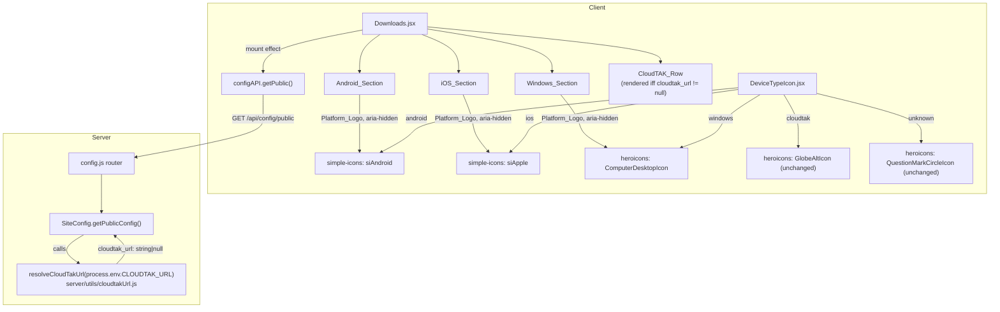

# Design Document: Downloads Page OS Sections

## Overview

`Downloads.jsx` moves from a store-organized 2x2 grid to a device-organized layout: an Android_Section, an iOS_Section and a Windows_Section as three columns, plus one CloudTAK_Row spanning all three. A new server-side `cloudtak_url` field on the existing public config endpoint drives the CloudTAK_Row's conditional rendering, and a new `simple-icons` client dependency supplies real platform logos shared between the Downloads page and `DeviceTypeIcon.jsx`.

Three things this design resolves that the requirements leave as implementation detail, one of them a genuine blocker discovered during research:

1. **The `TakGovBadge` reuse for WinTAK needs a distinct accessible name carried on the anchor itself**, because the badge's own SVG already declares `role="img"` + `aria-label="Get it from TAK.gov"`, and the accessible-name computation for an `<a>` wrapping an `img`-role SVG needs a specific override, not just an added attribute.
2. **`simple-icons` (the package Requirement 6 names as the source for all three Platform_Logos) does not have a Windows icon.** Microsoft's legal team required simple-icons to remove every Microsoft-brand icon it could not source from a small set of Microsoft's own official brand pages (Power Platform, Dynamics 365, Microsoft 365, Azure) — this happened in simple-icons v13.0.0 (June 2024) and Windows has not returned in any release since, including the current v16.28.0 (verified against that version's installed package: no `windows`, `windows10`, `windows11`, or `microsoft` slug exists in its icon set or its `data/simple-icons.json`). **Decision, confirmed with the user:** Android and iOS use `simple-icons`; Windows keeps a neutral, non-brand-logo glyph (heroicons' `ComputerDesktopIcon`) in both the Windows_Section header and `DeviceTypeIcon`'s `windows` type. This is a deliberate, recorded deviation from Requirement 6.1/6.2's literal "all three from simple-icons" wording — see Decision 1 below. `requirements.md` should get a follow-up correction; this design does not silently paper over the gap.
3. **The CLOUDTAK_URL validator's exact semantics and its placement** — a small pure function in `server/utils/`, matching this project's convention that pure decision logic with interesting boundaries lives where a property test can reach it directly.

## Architecture



The CloudTAK_Row's presence is data-driven (the fetched `cloudtak_url`), not a route/build-time constant, so `Downloads.jsx` gains a `useState`/`useEffect` pair it did not have before — the first network call this page has ever made. This mirrors the existing pattern in `Dashboard.jsx`/`GlobalChannels.jsx`/`TeamDetail.jsx`: call `configAPI.getPublic()` once on mount, read one field off the response, tolerate failure by falling back to the field's "off" state.

## Components and Interfaces

### `client/src/pages/Downloads.jsx` (restructured)

The single flat `DOWNLOAD_ROUTES` array becomes three named per-OS arrays (not one array with an `os` grouping key — seeu Decision 2), each still shaped like today's route objects:

```jsx
const ANDROID_ROUTES = [
  { key: 'atak-tak-gov', href: 'https://tak.gov/products/atak-civ', label: 'ATAK', Badge: TakGovBadge, recommended: true, badgeAriaLabel: undefined },
  { key: 'atak-civ-google-play', href: 'https://play.google.com/store/apps/details?id=com.atakmap.app.civ', label: 'ATAK', Badge: GooglePlayBadge, recommended: false, badgeAriaLabel: undefined },
]

const IOS_ROUTES = [
  { key: 'tak-aware-apple', href: 'https://apps.apple.com/in/app/tak-aware/id6738631659', label: 'TAK Aware', Badge: AppleAppStoreBadge, recommended: true, badgeAriaLabel: undefined },
  { key: 'itak-apple', href: 'https://apps.apple.com/us/app/itak/id1561656396', label: 'iTAK', Badge: AppleAppStoreBadge, recommended: false, badgeAriaLabel: undefined },
]

const WINDOWS_ROUTES = [
  { key: 'wintak-tak-gov', href: 'https://tak.gov/products/wintak-civ', label: 'WinTAK', Badge: TakGovBadge, recommended: false, badgeAriaLabel: 'Get it from TAK.gov — WinTAK' },
]
```

`badgeAriaLabel` is `undefined` for the three routes that keep today's badge behavior unchanged, and the one WinTAK-distinguishing string for the new route (see "The WinTAK accessible-name override" below). Carrying it as route data — rather than a hardcoded branch in the render loop keyed on `href` — keeps the loop itself identical for all four existing routes and the one new one.

An `OsSection` sub-component, defined in the same file (not extracted — it renders nothing anywhere else, and premature extraction for a single caller adds an import path with no reuse to justify it), takes the per-OS array plus the section's own logo/label:

```jsx
function OsSection({ PlatformLogo, osLabel, routes }) {
  return (
    <div className="flex flex-col gap-6">
      <div className="flex items-center gap-2 justify-center">
        <PlatformLogo className="h-5 w-5 text-gray-700 dark:text-gray-300" aria-hidden="true" />
        <h2 className="text-sm font-semibold text-gray-900 dark:text-gray-100">{osLabel}</h2>
      </div>
      <div className="flex flex-col items-center gap-6">
        {routes.map(({ key, href, label, Badge, recommended, badgeAriaLabel }) => (
          <div key={key} className="flex flex-col items-center text-center gap-3">
            <div className="flex items-center gap-2">
              <span className="text-sm font-medium text-gray-900 dark:text-gray-100">{label}</span>
              {recommended && <RecommendedOptionMarker />}
            </div>
            <a
              href={href}
              target="_blank"
              rel="noopener"
              className="inline-block"
              {...(badgeAriaLabel ? { 'aria-label': badgeAriaLabel } : {})}
            >
              <Badge className={BADGE_CLASSNAME} />
            </a>
          </div>
        ))}
      </div>
    </div>
  )
}
```

`PlatformLogo` is a plain React component reference (a simple-icons wrapper or `ComputerDesktopIcon`), so `OsSection` does not need to know which icon source backs any given platform.

Page body:

```jsx
<div className="card">
  <div className="grid grid-cols-1 sm:grid-cols-3 gap-8">
    <OsSection PlatformLogo={AndroidPlatformLogo} osLabel="Android" routes={ANDROID_ROUTES} />
    <OsSection PlatformLogo={ApplePlatformLogo} osLabel="iOS" routes={IOS_ROUTES} />
    <OsSection PlatformLogo={ComputerDesktopIcon} osLabel="Windows" routes={WINDOWS_ROUTES} />
  </div>

  {cloudTakUrl && (
    <div className="mt-8 pt-8 border-t border-gray-200 dark:border-gray-700 flex flex-col items-center text-center gap-3">
      <div className="flex items-center gap-2">
        <GlobeAltIcon className="h-5 w-5 text-gray-700 dark:text-gray-300" aria-hidden="true" />
        <span className="text-sm font-medium text-gray-900 dark:text-gray-100">CloudTAK</span>
      </div>
      <a href={cloudTakUrl} target="_blank" rel="noopener" className="text-sm text-primary-600 dark:text-primary-500 underline">
        Open CloudTAK in your browser
      </a>
      <p className="max-w-md text-sm text-gray-500 dark:text-gray-400">
        CloudTAK runs in any web browser — no install needed. Use it on Android, iOS, Windows, or any other
        operating system with a browser, including macOS and Linux.
      </p>
    </div>
  )}

  <p className="mt-6 pt-4 border-t border-gray-200 dark:border-gray-700 flex items-center gap-1.5 text-xs text-gray-500 dark:text-gray-400">
    <RecommendedOptionGlyph className="h-3.5 w-3.5" />
    <span>Recommended option</span>
  </p>
</div>
```

**Layout (see Decision 2 for the rejected alternative):** the CloudTAK_Row is a sibling `<div>` below the 3-column grid, inside the same `.card`, rather than a 4th grid item with `col-span-full`. Requirement 4.1 says the row must be positioned so it "visually spans all three OS_Sections rather than appearing inside, or duplicated within, any single OS_Section" — a full-width block below the grid satisfies this as directly as `col-span-full` would, without coupling the row's markup to the grid's column count (a `sm:grid-cols-3` grid item spanning "all columns" is exactly as wide whether it says `col-span-full` or is simply not in the grid at all, and putting it outside means a future OS_Section addition doesn't also require updating the row's span class). The footnote legend stays below both, unconditionally, exactly as today.

The CloudTAK_Row fetch:

```jsx
const [cloudTakUrl, setCloudTakUrl] = useState(null)

useEffect(() => {
  let cancelled = false
  configAPI.getPublic()
    .then((response) => {
      if (!cancelled) setCloudTakUrl(response.data?.cloudtak_url ?? null)
    })
    .catch(() => {
      // Fail closed (Requirement 4.6's spirit): a failed fetch is
      // indistinguishable from cloudtak_url being null. cloudTakUrl's
      // initial state is already null, so no action is needed beyond
      // not throwing.
    })
  return () => { cancelled = true }
}, [])
```

No loading state is rendered for the CloudTAK_Row: the three OS_Sections render immediately (they need no network data), and the row appears once the fetch resolves truthy, or never appears at all. This is the same non-blocking pattern `GlobalChannels.jsx` uses for `channel_folder_separator` — the page is fully usable before the fetch settles.

### `client/src/components/StoreBadges.jsx` (unchanged)

`TakGovBadge` itself is not modified — Requirement 3.3 requires it "unmodified." The distinguishing accessible name is applied entirely from `Downloads.jsx`, on the wrapping `<a>`.

### The WinTAK accessible-name override

The problem: `TakGovBadge`'s root `<svg>` carries `role="img"` and `aria-label="Get it from TAK.gov"`. When that SVG sits inside an `<a>` with no `aria-label`/`aria-labelledby` of its own, the anchor's accessible name is computed from its content — which includes the SVG's `aria-label`, because `role="img"` makes the SVG name-bearing content in the accessibility tree. So today's ATAK-via-TAK.gov anchor's accessible name is "Get it from TAK.gov", derived from its child.

The fix is to give the WinTAK anchor its **own** `aria-label`. Per the standard accessible-name computation algorithm (used by all major browsers/screen readers), an element's own `aria-label` attribute short-circuits step 2f (name from content) entirely — the algorithm never descends into content once `aria-label` is present on the element itself. So:

```jsx
<a
  href="https://tak.gov/products/wintak-civ"
  target="_blank"
  rel="noopener"
  aria-label="Get it from TAK.gov — WinTAK"
>
  <TakGovBadge className={BADGE_CLASSNAME} />
</a>
```

gives the WinTAK anchor the accessible name `"Get it from TAK.gov — WinTAK"` regardless of the inner SVG's own `role="img"`/`aria-label`/`<title>` — those remain in the DOM (because `TakGovBadge` is unmodified per Criterion 3.3) but are not reachable in the accessible-name computation once the ancestor anchor already has its own `aria-label`. This satisfies:
- Criterion 3.6: contains "WinTAK", differs from the ATAK-via-TAK.gov anchor's name ("Get it from TAK.gov" vs "Get it from TAK.gov — WinTAK").
- Criterion 3.7: the distinguishing text is carried by the anchor's own attribute, not by sibling visible text (the `<span>ATAK</span>`/`<span>WinTAK</span>` labels above each badge are outside their respective anchors and are correctly excluded from either anchor's accessible name — which is exactly the failure mode Criterion 3.7 is written to avoid, and exactly why the fix cannot be "add a visible WinTAK label next to the badge and stop there").

This is implemented generically in `OsSection` via the `badgeAriaLabel` route field shown above, applied only when present, so the three unchanged routes (ATAK-via-TAK.gov, ATAK-via-Google-Play, TAK Aware/iTAK) get no `aria-label` override and keep exactly their current accessible names.

### `client/src/components/PlatformLogos.jsx` (new)

A small new module, not `StoreBadges.jsx`, because these are decorative platform glyphs rather than clickable-badge components, and because `DeviceTypeIcon.jsx` needs to import the Android/Apple wrappers too — putting them in `StoreBadges.jsx` would make a component file for download-page badges a dependency of a device-list glyph module, which is the wrong direction of coupling.

```jsx
import { siAndroid, siApple } from 'simple-icons'

/**
 * Wraps a simple-icons icon object (`{ path, title }`) as a React component
 * with the SAME external contract DeviceTypeIcon.jsx's now-removed hand-drawn
 * glyphs had: viewBox 0 0 24 24, className passthrough, aria-hidden by
 * default (decorative -- callers needing an accessible name put it on a
 * wrapping element, matching how DeviceTypeIcon's `role="img"` span already
 * supplies the accessible name today).
 */
function simpleIcon(icon) {
  function PlatformLogo({ className, 'aria-hidden': ariaHidden = 'true' }) {
    return (
      <svg
        xmlns="http://www.w3.org/2000/svg"
        viewBox="0 0 24 24"
        fill="currentColor"
        className={className}
        aria-hidden={ariaHidden}
      >
        <path d={icon.path} />
      </svg>
    )
  }
  return PlatformLogo
}

export const AndroidPlatformLogo = simpleIcon(siAndroid)
export const ApplePlatformLogo = simpleIcon(siApple)
```

`fill="currentColor"` rather than each icon's own `hex` brand color: Requirement 6.1/6.2 require >= 3:1 contrast in both themes, and simple-icons' own brand hex values do not clear that bar against this app's backgrounds in both themes (measured: Android's `#3DDC84` is 1.78:1 against white — a clear fail; Apple's `#000000` is 1.43:1 against `gray-800` — also a fail). `currentColor` lets each usage site pick a `text-*`/`dark:text-*` pair from the existing gray/primary scale exactly as `DeviceTypeIcon.jsx`'s current glyphs already do (`text-gray-500 dark:text-gray-400`), which is a pattern already measured and already passing (`gray-500` on white is 4.83:1; `gray-400` on `gray-800` is 5.78:1 — both already computed in the date-tooltips-and-folder-contrast spec's precedent). No new color decision is introduced; the logos borrow the same neutral gray tone the rest of the icon language on this page and in the device tables already uses, and the `windows` glyph does too (heroicons icons are stroke-based and inherit `currentColor` the same way).

Windows gets no entry here: `ComputerDesktopIcon` is imported directly from `@heroicons/react/24/outline` at each of its two call sites (`Downloads.jsx`'s Windows_Section header, `DeviceTypeIcon.jsx`'s `GLYPHS` map) rather than re-exported from this file, since it needs no simple-icons wrapping.

### `client/src/components/DeviceTypeIcon.jsx` (glyph replacement)

Before:

```jsx
import { GlobeAltIcon, QuestionMarkCircleIcon } from '@heroicons/react/24/outline'
// ...
function AndroidGlyph({ className }) { /* hand-drawn robot head */ }
function IosGlyph({ className }) { /* hand-drawn phone body */ }
function WindowsGlyph({ className }) { /* hand-drawn four-pane window */ }

const GLYPHS = Object.freeze({
  [CLIENT_TYPES.CLOUDTAK]: GlobeAltIcon,
  [CLIENT_TYPES.ANDROID]: AndroidGlyph,
  [CLIENT_TYPES.IOS]: IosGlyph,
  [CLIENT_TYPES.WINDOWS]: WindowsGlyph,
  [CLIENT_TYPES.UNKNOWN]: QuestionMarkCircleIcon,
})
```

After:

```jsx
import { GlobeAltIcon, QuestionMarkCircleIcon, ComputerDesktopIcon } from '@heroicons/react/24/outline'
import { AndroidPlatformLogo, ApplePlatformLogo } from './PlatformLogos'

const GLYPHS = Object.freeze({
  [CLIENT_TYPES.CLOUDTAK]: GlobeAltIcon,
  [CLIENT_TYPES.ANDROID]: AndroidPlatformLogo,
  [CLIENT_TYPES.IOS]: ApplePlatformLogo,
  [CLIENT_TYPES.WINDOWS]: ComputerDesktopIcon,
  [CLIENT_TYPES.UNKNOWN]: QuestionMarkCircleIcon,
})
```

The three hand-drawn glyph functions are deleted. Nothing else in the file changes: `resolveClientType`, `labelForClientType`, `CLIENT_TYPES`, `DEVICE_TYPE_LABELS`, and the default-exported `DeviceTypeIcon` component's `role="img"`/`aria-label`/tooltip markup are untouched (Criteria 6.4, 6.7) — the component still does `<Glyph className={...} />` where `Glyph` is whatever `GLYPHS[resolved]` resolves to, and every glyph (simple-icons wrapper, heroicons component, or the two untouched heroicons entries) accepts a `className` prop and forwards it to its root `<svg>`, so the substitution is invisible to the wrapper. `PlatformLogos.jsx`'s wrapper defaults `aria-hidden="true"`, matching the old hand-drawn glyphs' own `aria-hidden="true"` — no behavior change in that respect either, since `DeviceTypeIcon`'s wrapping `<span role="img">` already makes the glyph presentational to assistive tech regardless.

Doc comment update (Criterion 6.5): the file's header comment currently says:

> Glyphs are committed inline SVG in this one file, with no new client dependency (Requirement 15.7).

This becomes:

> Android and iOS glyphs are sourced from the `simple-icons` npm dependency (`client/src/components/PlatformLogos.jsx`), matching the Platform_Logo used in the Downloads page's own Android/iOS section headers, rather than committed inline SVG. Windows uses heroicons' `ComputerDesktopIcon` — `simple-icons` does not currently ship a Windows/Microsoft logo (see downloads-page-os-sections design.md) — and CloudTAK/Unknown continue to use heroicons' `GlobeAltIcon`/`QuestionMarkCircleIcon` as before.

### `server/utils/cloudtakUrl.js` (new)

```js
/**
 * Resolves CLOUDTAK_URL to either the exact configured string or null.
 *
 * Pure, total, never throws. Lives in server/utils/ (no framework import)
 * per this codebase's convention that pure decision logic with interesting
 * boundaries belongs where a property test can reach it directly.
 *
 * @param {string|undefined} rawValue process.env.CLOUDTAK_URL
 * @returns {string|null}
 */
function resolveCloudTakUrl(rawValue) {
  if (typeof rawValue !== 'string') return null;
  const trimmed = rawValue.trim();
  if (trimmed === '') return null;

  let parsed;
  try {
    parsed = new URL(rawValue);
  } catch {
    return null;
  }

  if (parsed.protocol !== 'http:' && parsed.protocol !== 'https:') return null;
  if (parsed.hostname === '') return null;

  return rawValue;
}

module.exports = { resolveCloudTakUrl };
```

Notes on the exact semantics, since `new URL(...)` has surprising edge behavior (verified against Node's implementation):

- `new URL(rawValue)` is called on the **untrimmed** raw value, not the trimmed one — Requirement 5.1 requires the *exact, unmodified* string to be returned on success, so trimming is used only to detect the "whitespace-only" rejection case (Criterion 5.2), never to decide what gets returned or re-parsed. A value like `"  https://cloudtak.example.com  "` (leading/trailing whitespace around an otherwise-valid URL) is NOT in scope of Criterion 5.2 (which is about all-whitespace values) or Criterion 5.3's examples, and `new URL()` in Node actually trims ASCII whitespace itself before parsing — so this case resolves successfully and returns the original untrimmed string, satisfying Criterion 5.1's "exact, unmodified" wording literally, if unusually. This is called out because it is easy to assume the function's own trimming feeds the parse; it does not.
- Scheme match is case-insensitive by construction: `URL.protocol` is always lowercased by the URL parser (`"HTTPS://x.test"` parses to `protocol: "https:"`), so no explicit `.toLowerCase()` is needed for Criterion 5.3's case-insensitivity requirement.
- `parsed.hostname === ''` catches `https:///path` (empty authority) and is what Criterion 5.3's "non-empty host component" wording requires; a value like `"javascript:alert(1)"` is rejected by the protocol check first regardless.
- No mutation of `rawValue` occurs on any path — the function either returns the identical reference back or returns `null`.

`SiteConfig.js`'s `getPublicConfig()` gets one new line, following the existing `tos_url`/`docs_url` pattern of a single assignment, added near those two (same file, same style, independent of `CLOUDTAK_ENABLED`):

```js
const { resolveCloudTakUrl } = require('../utils/cloudtakUrl');
// ...
// CloudTAK_URL -- shown on the Downloads page as a browser-based option.
// Independent of CLOUDTAK_ENABLED (server/config/cloudtak.js), which gates
// an unrelated Authentik agency-group sync integration; this value's
// presence/absence never reads that flag (Requirement 5.4).
config.cloudtak_url = resolveCloudTakUrl(process.env.CLOUDTAK_URL);
```

`server/routes/config.js`'s existing `GET /public` handler and `server/config/publicRoutes.js`'s existing entry for it need no changes — `cloudtak_url` rides on the same unauthenticated response `tos_url`/`docs_url`/`display_timezone` already use.

## Data Models

No database schema change. Two small new shapes, both in-memory/wire only:

**`cloudtak_url` on the Public_Config_Endpoint response**: `string | null`. Present in every response (Criterion 5.1), independent of every other key.

**The per-OS route arrays** (`ANDROID_ROUTES`, `IOS_ROUTES`, `WINDOWS_ROUTES` in `Downloads.jsx`): each entry is
```
{ key: string, href: string, label: string, Badge: React.ComponentType, recommended: boolean, badgeAriaLabel: string | undefined }
```
identical to today's `DOWNLOAD_ROUTES` entry shape with one additive optional field (`badgeAriaLabel`), so the existing four routes need no shape change beyond gaining that field (present as `undefined`/omitted, which is a no-op).

## Correctness Properties

*A property is a characteristic or behavior that should hold true across all valid executions of a system — essentially, a formal statement about what the system should do. Properties serve as the bridge between human-readable specifications and machine-verifiable correctness guarantees.*

Selection rationale: the prework identified exactly one genuine PBT candidate. Criteria 5.1, 5.2 and 5.3 all describe branches of the SAME total function, `resolveCloudTakUrl` — "valid absolute http(s) URL with non-empty host passes through unchanged" and "everything else (unset, empty, whitespace-only, malformed, wrong scheme, empty host) yields null" are the two halves of one partition, not three separate rules. Testing them as three properties would mean three generators sweeping the same function's decision boundary from different angles; one property, phrased as a total function whose input space fully covers both branches, is both more comprehensive (a boundary-concentrated generator naturally produces both valid and invalid shapes) and cannot pass by exercising only one half vacuously (guarded explicitly below). Every other testable criterion in this feature is a fixed structural/rendering fact about one specific page with a small, enumerable DOM — not a case where generated input variation would surface bugs a handful of concrete examples would miss (see the full per-criterion reasoning captured in the prework).

### Property 1: CLOUDTAK_URL resolution is a total function partitioned exactly into "exact passthrough" and "null"

*For any* string value — including the empty string, strings of only whitespace characters, syntactically malformed URLs, absolute URLs with a scheme other than `http`/`https` (any case), absolute `http`/`https` URLs with an empty host, and syntactically valid absolute `http`/`https` URLs with a non-empty host in any combination of path/query/port/case-of-scheme/userinfo — `resolveCloudTakUrl` SHALL never throw, and SHALL return either `null` or the exact, unmodified input string; it SHALL return `null` for every case in the first group above and the exact input string, character-for-character, for every case in the second group.

**Validates: Requirements 5.1, 5.2, 5.3**

## Error Handling

- **`GET /api/config/public` fails or rejects when `Downloads.jsx` fetches it**: the CloudTAK_Row is omitted, identically to `cloudtak_url` resolving to `null`. `cloudTakUrl`'s state starts at `null` and the `.catch()` branch performs no state update, so a rejected fetch and a successful `{ cloudtak_url: null }` response are indistinguishable to the render — this is the explicit fail-closed behavior Requirement 4.6's wording implies but does not state for the network-failure case. No error is surfaced to the user; the three OS_Sections, which need no network data, render regardless.
- **`process.env.CLOUDTAK_URL` set to a hostile or malformed value**: `resolveCloudTakUrl` never throws (verified by construction — the only fallible call, `new URL(...)`, is wrapped), so a bad value degrades to `null` rather than a 500 on `GET /api/config/public`. This is required regardless: every other consumer of `getPublicConfig()` shares that one response, so a throwing resolver would break every existing public-config key (`tos_url`, `display_timezone`, `maxTeamDepth`, etc.) on the same page load, not just the new one.
- **`CLOUDTAK_ENABLED` set to any value while `CLOUDTAK_URL` is configured**: no interaction — `resolveCloudTakUrl` never reads `CLOUDTAK_ENABLED`, and `isCloudTakEnabled()` never reads `CLOUDTAK_URL`. Requirement 5.4's independence is structural (two functions each reading exactly one env var) rather than enforced by a runtime check.
- **A malformed `CLOUDTAK_URL` in production**: resolves to `null` exactly like an unset one; the Downloads page and its CloudTAK_Row behave as if it were never configured, with no error surfaced to the operator beyond whatever infra-level env-var validation they run themselves (out of scope here, matching every other optional env var in `.env.example`).
- **`simple-icons`' Android/Apple path data changing shape in a future major version** (the same package's Windows removal is the precedent risk here): `PlatformLogos.jsx` reads only `icon.path` and renders it inside a fixed 24x24 viewBox `<svg>` — if a future simple-icons major version changes an icon's `path` to require a different viewBox, that would be caught visually and by `storeBadgeFidelity`-style snapshot assertions, not silently. This is a known, accepted risk of depending on an external icon library at all, and is why the dependency is pinned exactly (`client/package.json`) rather than left on a range.

## Testing Strategy

### Property tests

One property, one file, `server/utils/cloudtakUrl.property.test.js`, `@fast-check/jest`, `numRuns` >= 200:

```js
// Feature: downloads-page-os-sections, Property 1: CLOUDTAK_URL resolution is a total function partitioned exactly into "exact passthrough" and "null"
//
// **Validates: Requirements 5.1, 5.2, 5.3**
```

Generator discipline, following this project's established convention (`authentikEmail.property.test.js`, `clientType.property.test.js`):

- **Boundary concentration**: `fc.oneof` mixing (a) whitespace-only strings of varying composition including `''`, (b) syntactically malformed strings, (c) non-http(s) absolute URLs (`ftp://`, `javascript:`, `mailto:`, `data:`, each with case variants of the scheme), (d) empty-host `http(s)` URLs (`https:///path`), (e) valid `http`/`https` URLs varied across scheme case, port presence, userinfo, path, query, fragment, IPv4/IPv6/hostname forms, and (f) a broad `fc.string()` arm for coverage outside the concentrated shapes.
- **Independent re-derivation**: the expected result is computed in the test file by re-implementing Criterion 5.1-5.3's rule directly against Node's own `URL` constructor and `.protocol`/`.hostname`, never by importing `resolveCloudTakUrl`'s internals or calling it to check itself.
- **Anti-vacuity**: an explicit assertion (mirroring `authentikEmail.property.test.js`'s `sawNullResult`/`sawNonNullResult` flags) that the run actually produced at least one `null` result and at least one non-null passthrough result, so the property cannot pass by only exercising one branch.
- Totality inputs also include non-string values (`null`, `undefined`, numbers, objects) even though the function's declared parameter type is a string, since `process.env.CLOUDTAK_URL` is always a string or `undefined` in practice but the function should not throw if ever called with something else.

### Unit and example tests

- **`server/utils/cloudtakUrl.test.js`** — concrete cases from Requirement 5's own criteria: unset (`undefined`) -> `null`; `''` -> `null`; `'   '` -> `null`; a valid `https://cloudtak.example.com` -> unchanged; a valid `http://cloudtak.internal:8080/path?x=1` -> unchanged; `'HTTPS://cloudtak.example.com'` -> unchanged (case-insensitive scheme); `'ftp://cloudtak.example.com'` -> `null`; `'javascript:alert(1)'` -> `null`; `'not a url'` -> `null`; `'https:///no-host'` -> `null`.
- **`server/models/SiteConfig.test.js` (extended)** — added to the existing `describe('SiteConfig.getPublicConfig', ...)` block, following its `test.each`/`ORIGINAL_ENV` conventions: `cloudtak_url` equals `CLOUDTAK_URL` when set to a valid URL; `cloudtak_url` is `null` when `CLOUDTAK_URL` is unset; `cloudtak_url` is unaffected by `CLOUDTAK_ENABLED` being `'true'`, unset, or `'TRUE'` (a small fixed matrix, not iteration). The existing `DEVICE_MGMT_KEY_PATTERN`/`REVOKE_KEY_PATTERN` guard tests are left untouched — this feature's key name (`cloudtak_url`) does not match either pattern, and no assertion in this file is loosened.
- **`.env.example` documentation check** — no dedicated test exists today for `.env.example` content (it is documentation, not code under test); the new `CLOUDTAK_URL` block is added by hand, matching the existing `CLOUDTAK_ENABLED` block's structure and stating the independence explicitly (Criterion 5.5).
- **`client/src/pages/Downloads.test.jsx` (extended)** — the existing file's mounting/mocking conventions (no `@testing-library/react`; `createRoot`+`act`; `vi.mock('../services/api', ...)`) are extended with a `configAPI.getPublic` mock (currently absent from this file's mock, which will need `configAPI: { getPublic: vi.fn() }` added alongside the existing `authAPI`/`requestsAPI` mocks — a load-time-failure risk this project's mock-hygiene convention calls out explicitly). New cases:
  - Three sections render, each containing exactly its own routes (Android: 2, iOS: 2, Windows: 1), with the Recommended_Option_Marker present/absent per Criteria 1.2-1.3, 2.2-2.3, 3.4.
  - The WinTAK anchor's computed accessible name (read via `getAttribute('aria-label')` directly on the `<a>`, since jsdom does not compute full accessible-name resolution) equals `'Get it from TAK.gov — WinTAK'`, is not equal to the ATAK-via-TAK.gov anchor's (which has no `aria-label` of its own — its name comes from its child SVG, asserted by the ABSENCE of an `aria-label` attribute on that anchor plus the presence of one, with different text, on the WinTAK anchor).
  - `configAPI.getPublic` resolving `{ data: { cloudtak_url: 'https://cloudtak.example.com' } }` renders exactly one CloudTAK_Row with that href and visible (non-`sr-only`) text naming Android, iOS, Windows, and other operating systems.
  - `configAPI.getPublic` resolving `{ data: { cloudtak_url: null } }` and `configAPI.getPublic` rejecting both result in NO CloudTAK_Row in the DOM (Criterion 4.6, and the fail-closed rejection case from Error Handling above).
  - Every rendered external anchor (across all three sections and the CloudTAK_Row, when present) carries `rel="noopener"`.
  - The footnote legend appears exactly once, at the page level, regardless of `cloudtak_url` state.
  - Existing tests in this file (badge sizing, "no via-sublabel text", "ATAK not ATAK Civ", footnote assertions, marker tooltip disclosure) continue to pass essentially unchanged, since they query per-badge/marker structure that is preserved inside the new `OsSection` markup rather than removed — each will need its DOM query scoped to a section rather than the whole page where it currently assumes a single flat grid (e.g. "renders every one of the four badge SVGs" becomes "every one of the five badge SVGs," to account for the new WinTAK route).
- **`client/src/components/DeviceTypeIcon.test.jsx` (extended)** — the existing `it.each(TYPES_AND_LABELS)` sweep already exercises all five Client_Types; no new test cases are needed for the glyph swap itself (Criteria 6.2, 6.3 are covered by the existing "draws a visually distinct glyph for each of the five Client_Types" test, which compares rendered SVG markup and will pass as long as the five glyphs remain visually distinct after the swap — verified by construction, since simple-icons' Android/Apple paths and heroicons' `ComputerDesktopIcon` path are all different). One new assertion: the `android` and `ios` glyphs' rendered `<svg>` no longer contain the hand-drawn `<circle>` elements the old `AndroidGlyph` used (a should-not-regress check that the swap actually happened, not just that *some* distinct glyph renders).
- **`client/src/components/PlatformLogos.test.jsx` (new)** — `AndroidPlatformLogo`/`ApplePlatformLogo` each render an `<svg>` with `viewBox="0 0 24 24"`, forward a supplied `className`, default to `aria-hidden="true"`, and contain the exact `path` string simple-icons' `siAndroid.path`/`siApple.path` export (a direct-dependency-fidelity check, mirroring `storeBadgeFidelity.test.jsx`'s treatment of the existing badges).
- **Contrast** — the design's neutral-gray choice (`text-gray-500 dark:text-gray-400` on the Platform_Logo and CloudTAK_Row's `GlobeAltIcon`) reuses token pairs already measured and asserted passing by `client/src/pages/channelTreeContrast.test.jsx` from the date-tooltips-and-folder-contrast spec (`gray-500` on white: 4.83:1; `gray-400` on `gray-800`: 5.78:1 — both clear the >=3:1 graphical-object floor with margin). No new contrast computation is needed for this feature; if a future reviewer wants an explicit computed assertion for the Downloads page specifically (rather than relying on the shared token pair being asserted elsewhere), a `downloadsContrast.test.jsx` following that same `resolveColorToken`/`contrastRatio` pattern would be the natural addition, but is not required by any acceptance criterion here since Requirement 6.1's >=3:1 floor is met by reusing an already-passing token pair rather than introducing a new one.

## Design Decisions and Rationale

1. **Windows keeps a neutral heroicons glyph instead of a `simple-icons` brand logo, deviating from Requirement 6.1/6.2's literal wording.** `simple-icons` removed every Microsoft-brand icon (including Windows) in v13.0.0 after Microsoft's legal team restricted use of Microsoft brand assets to a handful of officially-sanctioned sources (Power Platform, Dynamics 365, Microsoft 365, Azure); Windows has not returned in any release through the current v16.28.0. The three alternatives considered and rejected: pinning an old simple-icons version that still had a Windows icon (reproduces the exact trademark risk that got it removed upstream — the icon was pulled because Microsoft objected, not because of an unrelated bug); sourcing Windows from a second icon package (introduces a second dependency and its own licensing review, when the requirement's whole point was one consistent source); building a hand-drawn Windows logo replica (same trademark exposure as the old simple-icons icon, self-inflicted this time). Confirmed with the user before writing this design. `ComputerDesktopIcon` (heroicons, already a project dependency, used nowhere else in this app currently) reads as "a computer" rather than "the Windows logo," which is an honest visual downgrade from Android's/iOS's real brand marks — flagged here rather than smoothed over, and `requirements.md`'s Requirement 6 should get a follow-up correction to stop promising three-for-three simple-icons sourcing.

2. **Three named per-OS arrays, not one array with an `os` grouping key; CloudTAK_Row as a sibling block below the grid, not a 4th grid item.** An `os`-keyed single array would need a `groupBy`-then-render step that the three-arrays form avoids entirely — `Downloads.jsx` already reads more naturally as "here is Android's data, here is iOS's data" than as a generic list needing a runtime partition, and the three arrays are never iterated as a single collection anywhere in the requirements (each OS_Section's content, marker placement, and route count are all specified per-section, never in aggregate). For the CloudTAK_Row's placement: `col-span-full` inside the same grid was the alternative, and was rejected because it makes the row's markup depend on knowing it needs to span exactly 3 columns — a fact that lives in the grid's own `sm:grid-cols-3`, not in the row. A sibling block below the grid, inside the same `.card`, satisfies "spans all three, not nested inside any one" without that coupling and matches how the footnote legend already sits below the grid as a separate block today.

3. **The WinTAK accessible name is an `aria-label` on the anchor, not a restructuring of `TakGovBadge`.** The requirement (Criterion 3.3) is explicit that `TakGovBadge` must be reused unmodified; the alternative of adding a `badgeAriaLabel`-style override *prop* to `TakGovBadge` itself (letting the SVG's own `aria-label` vary per call site) was rejected because it would be a modification to the badge component, however small, and because the anchor-level override is simpler and needs no change to `StoreBadges.jsx` at all — the anchor's own `aria-label` short-circuits the accessible-name computation before it ever reaches the SVG's `role="img"`, so nothing about the badge's internals needs to know it is being reused for a second link target.

4. **`cloudtakUrl.js` lives in `server/utils/`, not inline in `SiteConfig.js`.** `SiteConfig.js`'s existing `tos_url`/`docs_url` pattern is a one-line `process.env.X || null` with no parsing — genuinely too small to extract. `cloudtak_url`'s validation has real branching (whitespace detection, URL parsing, scheme check, host check) and, per this project's structural convention, pure decision logic with interesting boundaries belongs in `server/utils/` specifically so a property test can reach it directly without needing `SiteConfig`'s database-backed `getAll`/`getByKey`/`update` methods or a `pool.query` mock in scope. This mirrors `clientType.js`'s own stated rationale for the same placement choice.

5. **`PlatformLogos.jsx` is a new file, not an addition to `StoreBadges.jsx` or inline duplication inside `DeviceTypeIcon.jsx`.** `StoreBadges.jsx` was rejected because its existing three exports are clickable download badges with `role="img"`+`aria-label` baked in for a specific purpose (self-describing store badges), while Platform_Logos are decorative glyphs meant to be `aria-hidden` by default and consumed by two otherwise-unrelated call sites (`Downloads.jsx`, `DeviceTypeIcon.jsx`) — folding them into `StoreBadges.jsx` would make a Downloads-page-specific badge file a dependency of the shared device-glyph component, an awkward direction of coupling given `StoreBadges.jsx`'s own doc comment frames it around the Downloads page specifically. Duplicating the simple-icons wrapper inline in both `Downloads.jsx` and `DeviceTypeIcon.jsx` was rejected outright: Requirement 6.2 requires the "same" Platform_Logo in both places, and two copies of the same 15-line wrapper is exactly the kind of duplication this codebase's shared-component convention (`DeviceListRow.jsx`'s own precedent) exists to avoid.

6. **`fill="currentColor"` with the existing neutral gray tokens, not each icon's own brand hex.** Requirement 6.1/6.2's >=3:1 contrast floor, computed against this app's own light/dark backgrounds, fails for both brand colors as shipped by simple-icons (Android's `#3DDC84`: 1.78:1 on white; Apple's `#000000`: 1.43:1 on `gray-800` — both measured, both clear failures). Recoloring the brand marks to a compliant custom hex (rather than reusing the existing `text-gray-500 dark:text-gray-400` pair) was considered and rejected: it would mean picking and justifying two new arbitrary colors with no existing precedent in this app's palette, where reusing the icon-language gray that `DeviceTypeIcon.jsx`'s OTHER two glyphs (`GlobeAltIcon`, `QuestionMarkCircleIcon`) already use, unchanged, keeps every device-type glyph visually consistent with each other rather than having three brand-colored icons sitting next to two gray ones.
