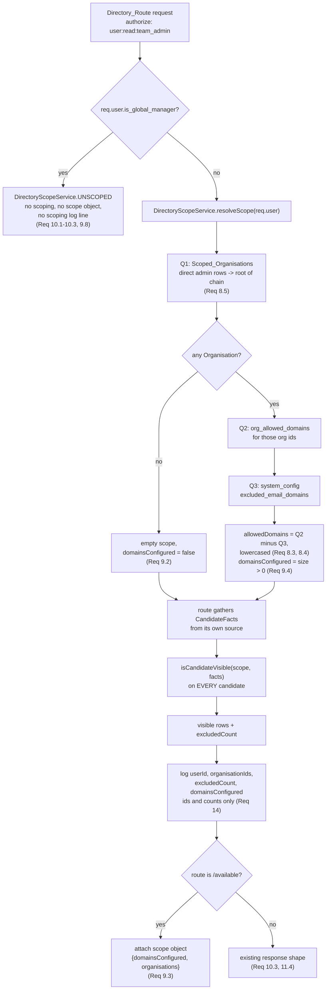
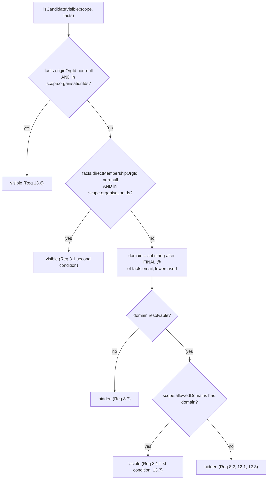
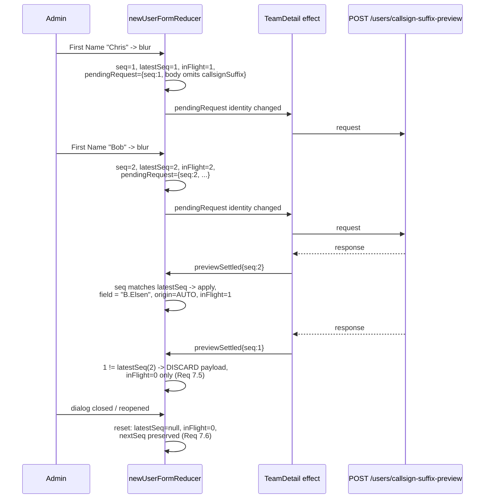
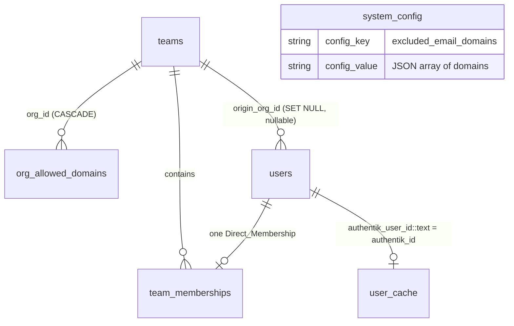

# Design Document

## Overview

Two defects, two independent mechanisms, one shared design principle: **the value that decides must be the only value that decides.**

Defect 1 exists because the Client holds one boolean (`newUserCallsignEdited`) that answers "may I overwrite this field?" and nothing at all answers "what should I send?". The Suffix_Field's value is therefore fed back into every subsequent Suffix_Preview, and `UserProvisioningService.resolveCallsignSuffixForNewUser`'s correct precedence rule (`trimmedRequested || computeDefault(...)`) faithfully echoes it. The fix is a three-state machine that makes *provenance* of the field's value the thing that decides what the request body contains, and one pure function — used by both the preview body and the submit body — that reads it.

Defect 2 exists because three Directory_Routes fetch rows and return them. Requirement 11.3 asks for one shared scoping component, but the three routes read from three different sources: `user_cache` LEFT JOINed to `users`, plain `users`, and **Authentik over HTTP**. There is no single SQL statement to attach a predicate to. The fix is therefore split in two: a **scope resolver** that answers "what may this caller see" once per request, and a **pure predicate** that answers "may this caller see this candidate" once per candidate. Every route gathers *facts* in whatever shape its source allows and then runs the same predicate over them. SQL never decides; SQL only supplies facts, and — on the two routes whose source is SQL — pre-narrows so a `LIMIT` still returns a useful page.

Four decisions shape everything below.

1. **The predicate is pure, total, and the only decision point.** `isCandidateVisible(scope, facts)` takes no client, issues no query, and is called on every row every Directory_Route returns, including rows the SQL already admitted. That is what makes Property 6 a direct unit-level assertion rather than an end-to-end one, and it is what bounds the blast radius of SQL/predicate drift to *hiding* a visible user rather than *disclosing* a hidden one.
2. **No new route, no new permission identifier, no registry change.** Requirement 11.6 keeps the three routes on `user:read:team_admin`; this specification narrows response *contents*, not callers. `server/config/permissions.registry.js`, `server/middleware/authorize.js`'s resolver map, and `server/config/permissions.registry.test.js`'s exception lists are untouched.
3. **The server-side Callsign_Suffix code does not change at all.** Requirement 5's criteria are already satisfied by the existing preview route; verifying that is a test task, not an implementation task. See "The preview route is already correct" below.
4. **Provenance is resolved in exactly one function.** All three user-creation paths (`POST /api/users/create-and-add`, access-request approval, bulk import) already funnel through `UserProvisioningService.createAndAddUser(client, { ..., teamId })`. Requirements 13.3, 13.4 and 13.5 are therefore one change in one place, not three.

### Research findings that constrain the design

Each of these was verified against the code on this branch and each one changes a design choice.

**`Team.getAncestorChain` returns rows root-first, so the Organisation is `chain[0]`.** Confirmed from the CTE's `ORDER BY depth ASC` with `depth = MAX(hops_from_target) - hops_from_target` (`server/models/Team.js`). `server/routes/users.js` lines 626 and 1273 read `ancestors[ancestors.length - 1]` into a variable named `root`; that is the *deepest* row, not the root. Whatever those two call sites intend, they are not a pattern to copy — every Organisation resolution in this design uses index 0, or a `WHERE parent_team_id IS NULL` predicate in SQL, and never a positional read from the tail.

**`GET /api/users`'s primary list is Authentik's, not the Database's.** `authentikService.getUsers({page, pageSize})` returns the page; a single batched local query then resolves `team_name` and `is_team_device` by `authentik_user_id`. A candidate can therefore have **no local `users` row at all**, in which case its email comes from the Authentik payload and both `origin_org_id` and its direct-membership Organisation are unknown (`null`). This is why the predicate's facts type carries a nullable email from an untrusted-shape source and why `origin_org_id` can never be a required input.

**`origin_org_id` will live on `users`, and `/available`'s rows are `user_cache` rows.** `/available`'s existing `LEFT JOIN users u ON uc.authentik_id::text = u.authentik_user_id::text` is the only path to it, and it is `NULL` for a `user_cache` row with no local counterpart — which Requirement 13.7 resolves as a fall back to Email_Domain matching. The `::text` cast is mandatory (`user_cache.authentik_id` is `varchar`, `users.authentik_user_id` is `integer`) and is already correct in that join.

**`x = ANY('{}'::int[])` is `false`, and `NULL = ANY(...)` is `NULL`.** An empty Scoped_Organisations set therefore needs no special-case branch in SQL — the scope predicate evaluates to `false` for every row on its own, which is the fail-closed direction Requirement 9.2 wants. But a `NULL` `origin_org_id` yields `NULL`, and `NULL OR false` is `NULL`, which `WHERE` treats as not-true. That is *accidentally* fail-closed for the filter and *wrong* for the `COUNT(*) FILTER (WHERE NOT in_scope)` that Requirement 14.1 needs. Every scope expression in this design is wrapped in `COALESCE(..., false)` for that reason, not for style.

**`split_part(email, '@', 2)` is not "the substring after the final `@`".** Requirement 8.3 says final. The pure predicate uses `lastIndexOf('@')`; the SQL pre-narrowing uses `lower(email) LIKE ANY(patterns)` with patterns of the form `%@domain`, which has exactly the final-`@` semantics for any domain containing no LIKE metacharacter — so the patterns are built by one escaping helper rather than by string concatenation at the call site.

**`org_allowed_domains`'s unique constraint is `(org_id, domain)`, not `domain`.** Two Organisations can list the same domain (Requirement 12.4). The scope therefore flattens every usable Allowed_Domain of every Organisation in the caller's Scoped_Organisations into one `Set`, because Requirement 8.6 makes the rule a union across those Organisations — per-Organisation attribution of a domain match would be computed and then immediately discarded.

**`OrgInterestService.isExcludedDomain(email)` cannot be reused.** It answers a per-email question with its own query against `system_config`, so using it here would be one query per candidate — and it cannot subtract a set from a set, which is what Requirement 8.4 asks for. The excluded list is read once per request in the scope resolver instead.

**`usersAPI.createAndAdd` passes `callsignSuffix` positionally into an object literal.** `api.post('/users/create-and-add', { ..., role, callsignSuffix })` — an `undefined` value is dropped by `JSON.stringify`, so passing `undefined` genuinely omits the property from the wire body. The existing `role: undefined` path already relies on this. Requirement 5.3's "presence-or-absence ... match" is therefore expressible without changing `api.js`.

**`client/src/pages/TeamDetail.test.jsx` asserts on TeamDetail.jsx's own source text.** It reads the file and asserts, among others, `onBlur={() => runCallsignSuffixPreview(newUserForm)}`, `required={newUserCallsignRequired}`, `{newUserCallsignError && (`, and `if (!isValidMemberCallsignSuffix(newUserForm.callsignSuffix)) {`. Every one of those strings is changed by this design, so those assertions are part of the change, not collateral damage discovered later. They are enumerated in Testing Strategy.

**Rendering works in this repo; mounting `TeamDetail` does not follow from that.** `client/src/components/TransferMemberDialog.test.jsx` mounts a real component with `react-dom/client`'s `createRoot` plus React 18.3's `act` under the configured `jsdom` environment, with a `globalThis.React = React` shim, and passes today. So the toolchain renders — the obstacle is `TeamDetail.jsx`'s size (2,338 lines, `useParams`, `Link`, and eight API surfaces), not `vite@8` against `vitest@3.2.7`. This design keeps the render surface at zero by making the decision logic a pure reducer; the trade-off and its escape hatch are stated in Testing Strategy rather than left implicit.

## Architecture

### Two independent halves

The two defects share no file. Nothing in the callsign half reads the scope, and nothing in the visibility half reads the reducer. They are described in one document because they ship together, not because they interact.

```
DEFECT 1 (Client)                          DEFECT 2 (Server)
─────────────────                          ─────────────────
client/src/utils/                          server/utils/directoryScope.js
  callsignSuffixPreview.js                   (pure: predicate + scope construction
  (pure: 3-state machine, request             + LIKE-pattern building)
   body builders, response application)              ▲
            ▲                                        │ consumes
            │ useReducer                              │
client/src/pages/TeamDetail.jsx            server/services/DirectoryScopeService.js
  (thin: dispatch on blur/click,             (DB: Scoped_Organisations, Allowed_Domains,
   one effect issues the request)             Excluded_Domains, TEAM_ROOT_CTE, logging)
                                                     ▲
                                                     │ one resolveScope() per request
                                           server/routes/users.js
                                             GET /            GET /search      GET /available
                                             (facts from       (facts from      (facts from
                                              Authentik +       users +          user_cache +
                                              batched CTE)      TEAM_ROOT_CTE)   users)
                                                     │
                                                     └── isCandidateVisible() over every row
```

### Directory scoping: one resolver, one predicate, three fact sources



### The visibility predicate



Three properties of this shape are load-bearing:

- It is a **disjunction**, which is Requirement 13.8's "additive rather than a replacement" stated as code. A non-null `origin_org_id` that names an Organisation outside the caller's scope falls through to the domain check rather than short-circuiting to hidden — that is Requirement 13.7's fall back, and reading the criteria as a chain of `if/else if` on provenance *presence* would break it.
- It is **total**: no input shape throws. `email` may be `null`, `''`, or lack an `@`; `originOrgId` may be `undefined`; `scope.organisationIds` may be empty. Every one of those yields `false`, never an exception, because a throwing predicate inside a `.filter()` would surface as a 500 and tempt a `catch` that falls back to unfiltered.
- It never reads the Database, so Property 6 and Property 8 are asserted at ~microseconds per iteration and 100 `numRuns` costs nothing.

### The Suffix_Field state machine

The three states are Requirement 3's three send-behaviours. `newUserCallsignEdited` cannot express the middle column, which is why it is replaced rather than extended.

| State | How the field got its value | Suffix_Preview body | `create-and-add` body |
|---|---|---|---|
| `NONE` | dialog just opened, or the admin cleared the field | omits `callsignSuffix` (Req 3.2) | omits `callsignSuffix` |
| `AUTO` | the Client wrote it from a Suffix_Preview response | **omits `callsignSuffix`** (Req 3.1) | omits `callsignSuffix` |
| `TYPED` | the admin typed or pasted it | sends it (Req 3.3) | sends it |

The `AUTO` row is the entire fix for Defect 1. Both body columns are produced by one function, `shouldSendCallsignSuffix(state, { force })`, so they cannot drift — which is what Requirement 5.3 asks for.

```mermaid
stateDiagram-v2
    [*] --> NONE : dialog opened (Req 3.7)
    NONE --> AUTO : preview response writes a value (Req 3.4)
    NONE --> TYPED : admin types a non-empty value (Req 3.5)
    AUTO --> AUTO : preview response writes a different value (Req 1.7, 4.2)
    AUTO --> TYPED : admin edits to a non-empty value (Req 3.5)
    AUTO --> NONE : admin clears the field (Req 3.6)
    TYPED --> TYPED : preview returns; value left alone (Req 4.1)
    TYPED --> AUTO : Recompute_Control replaces the value (Req 2.4, 2.5)
    TYPED --> NONE : admin clears the field (Req 3.6)
    AUTO --> NONE : dialog reset (Req 3.7)
    TYPED --> NONE : dialog reset (Req 3.7)
```



The single rule that generates every transition into `AUTO`: **origin becomes `AUTO` exactly when the reducer writes a value into the field from a response.** No write, no origin change. That one rule resolves what would otherwise be a contradiction between Requirement 3.4 (a response-written value is Auto_Filled — stated unconditionally, so it covers the conflict case too) and Requirements 4.1/4.5 (an Admin_Typed_Suffix survives everything but the Recompute_Control): when a conflict is reported against a *typed* value, `conflict.value` equals what the admin typed, so there is no write, so the origin stays `TYPED`. When a conflict is reported against a *computed* value, `conflict.value` differs from nothing the admin chose, the write happens, and `AUTO` is correct — so a subsequent name edit still recomputes instead of echoing the collided value back forever.

### Preview request lifecycle and out-of-order responses



Two things make this work and both are deliberate:

- **`nextSeq` is never reset.** A reset sets `latestSeq` to `null` (so every outstanding response is discarded, Requirement 7.6) but leaves the counter climbing. Resetting the counter would let a stale response from the previous dialog session carry a sequence number that matches a fresh request's.
- **The effect never cancels its own dispatch.** There is no `cancelled` flag and no `AbortController`. Every settled request dispatches, always, and the *reducer* decides whether to apply the payload. If the effect suppressed the dispatch instead, `inFlight` would never decrement and the busy indication of Requirement 7.1 would stick on forever. `AbortController` was considered and rejected for the same reason plus a second one: an aborted request produces a rejection indistinguishable from a genuine network failure, which Requirement 7.3 treats differently (console record, no state change) from a superseded response (silent discard).

`runCallsignSuffixPreview`'s current read of `newUserCallsignEdited` from the render closure disappears with the function. No ref is needed: the origin lives in reducer state, and a reducer sees the state at reduce time by construction, which is the whole reason the decision moves into one.

## Components and Interfaces

### 1. `server/utils/directoryScope.js` (new, pure)

No `require` of `pool`, no logger, no `async`. This is the file Property 6, Property 7 and Property 8 are asserted against.

```js
/**
 * @typedef {object} ScopedOrganisation
 * @property {number} id
 * @property {string} name
 *
 * @typedef {object} DirectoryScope
 * @property {ScopedOrganisation[]} organisations   Requirement 9.3's `scope.organisations`
 * @property {number[]} organisationIds             Requirement 8.5's Scoped_Organisations
 * @property {Set<string>} allowedDomains           usable Allowed_Domains, lowercased,
 *                                                  Excluded_Domains already subtracted (Req 8.4),
 *                                                  flattened across every Organisation (Req 8.6)
 * @property {boolean} domainsConfigured            Requirement 9.4
 *
 * @typedef {object} CandidateFacts
 * @property {string|null|undefined} email
 * @property {number|null|undefined} originOrgId              users.origin_org_id (Req 13.6/13.7)
 * @property {number|null|undefined} directMembershipOrgId    root of the Direct_Membership Team's
 *                                                            Ancestor_Chain (Req 8.1)
 */

/** Requirement 8.3: the substring following the FINAL `@`, lowercased. `null` when absent. */
function extractEmailDomain(email) {}

/** Trim + lowercase a domain, or `null` for a non-string/empty value. */
function normaliseDomain(value) {}

/**
 * Requirements 8.3, 8.4, 8.6, 9.4. Builds the per-request scope from raw rows.
 * `allowedDomains` and `excludedDomains` are arrays of raw strings as read from
 * `org_allowed_domains.domain` and the `excluded_email_domains` JSON array; both
 * are normalised here so no caller has to remember to.
 */
function buildDirectoryScope({ organisations, allowedDomains, excludedDomains }) {}

/** The one decision point. Total: never throws for any input shape. */
function isCandidateVisible(scope, facts) {}

/**
 * Requirement 14.1's excluded count and the routes' filtering in one pass.
 * `toFacts` maps a route-shaped row to CandidateFacts, so the routes keep their
 * own row shapes and this function stays shape-agnostic.
 *
 * @returns {{ visible: Array<T>, excludedCount: number }}
 */
function partitionCandidates(scope, rows, toFacts) {}

/**
 * Requirement 8.3 expressed for SQL pre-narrowing: one `%@domain` LIKE pattern
 * per usable Allowed_Domain, with `\`, `%` and `_` escaped so a domain
 * containing a LIKE metacharacter cannot widen the match. Postgres's default
 * LIKE escape character is `\`, so no ESCAPE clause is needed.
 * Returns `[]` for an empty scope — and `x LIKE ANY('{}')` is `false`, so an
 * empty array is the fail-closed value with no special case at the call site.
 */
function buildEmailDomainLikePatterns(scope) {}

function escapeLikePattern(value) {}
```

### 2. `server/services/DirectoryScopeService.js` (new)

The only DB reader in the visibility half, and the only producer of a `DirectoryScope`.

```js
class DirectoryScopeService {
  /** Sentinel for a Global_Manager. Frozen so a caller cannot mutate it into a scope. */
  static UNSCOPED = Object.freeze({ unscoped: true });

  /**
   * Requirements 8.5, 8.4, 9.2, 9.4, 10.4.
   *
   * Global_Manager status is read from the request user's cached
   * `is_global_manager` attribute, exactly as the existing
   * `user:read:team_admin` resolver does (Req 10.4) -- not re-queried, so the
   * authorization layer and the scoping layer cannot disagree about who is one.
   *
   * A throw propagates. There is deliberately NO catch that falls back to
   * UNSCOPED: a database failure while resolving the scope must produce a 500,
   * never an unscoped directory (see Error Handling).
   *
   * @param {{ userId: number, is_global_manager?: boolean }} user  req.user
   * @returns {Promise<typeof DirectoryScopeService.UNSCOPED | DirectoryScope>}
   */
  static async resolveScope(user) {}

  /** Requirement 9.3's response fragment. Never called for UNSCOPED (Req 9.8). */
  static buildScopeResponse(scope) {}   // -> { domainsConfigured, organisations }

  /**
   * Requirements 14.1, 14.2, 14.3. Ids and counts only -- no email, no name.
   * `organisations` is reduced to ids here so a caller cannot pass names in by
   * accident; the log line's shape is this function's business, not the route's.
   */
  static logScopedResponse(route, { userId, scope, excludedCount, returnedCount }) {}

  /**
   * The recursive CTE mapping every `teams.id` to its Organisation's id, shared
   * verbatim by `GET /api/users` (which already has an equivalent `team_root`
   * CTE, extended here to also project `root_id`) and `GET /api/users/search`.
   * Exported as SQL text rather than reimplemented per route so "the root of the
   * Ancestor_Chain" has one definition on the server.
   */
  static TEAM_ROOT_CTE = `...`;
}
```

`resolveScope` issues at most three queries and short-circuits:

**Q1 — Scoped_Organisations (Requirement 8.5).** Direct admin rows only; `role = 'admin' AND inherited_from_team_id IS NULL` is the glossary's Team_Admin condition and matches `Team.isAdmin`'s filter and the existing resolver's.

```sql
WITH RECURSIVE admin_teams AS (
  SELECT team_id FROM team_memberships
   WHERE user_id = $1 AND role = 'admin' AND inherited_from_team_id IS NULL
), chain AS (
  SELECT t.id, t.parent_team_id FROM teams t JOIN admin_teams a ON t.id = a.team_id
  UNION
  SELECT p.id, p.parent_team_id FROM teams p JOIN chain c ON p.id = c.parent_team_id
)
SELECT id, (SELECT name FROM teams WHERE id = chain.id) AS name
  FROM chain WHERE parent_team_id IS NULL
```

`UNION` rather than `UNION ALL`: a caller administering several Teams in one hierarchy walks overlapping ancestor paths, and deduplicating intermediate rows both bounds the work and removes any dependence on the hierarchy being a strict tree. Returning `[]` here short-circuits Q2 and Q3 entirely — Requirement 9.2 costs one query, not three.

**Q2 — `SELECT domain FROM org_allowed_domains WHERE org_id = ANY($1::int[])`**, hitting the existing `org_id` index.

**Q3 — `SELECT config_value FROM system_config WHERE config_key = 'excluded_email_domains'`**, parsed defensively: a missing row, malformed JSON, or a non-array value all yield "no exclusions", mirroring `OrgInterestService.isExcludedDomain`'s handling of the same column.

`buildDirectoryScope` then subtracts Q3 from Q2 case-insensitively (Requirement 8.4) and sets `domainsConfigured` from the surviving set's size (Requirement 9.4).

### 3. `GET /api/users/available` (`server/routes/users.js`)

Facts source: `user_cache` LEFT JOINed to `users`. Every candidate has no Direct_Membership by construction (`WHERE tm.user_id IS NULL`), so `directMembershipOrgId` is always `null` here — Requirement 8.1's second condition is unreachable on this route, exactly as its Note says.

```sql
WITH candidates AS (
  SELECT uc.authentik_id AS id, uc.email, uc.first_name, uc.last_name,
         u.origin_org_id,
         (COALESCE(u.origin_org_id = ANY($1::int[]), false)
          OR COALESCE(lower(uc.email) LIKE ANY($2::text[]), false)) AS in_scope
    FROM user_cache uc
    LEFT JOIN users u ON uc.authentik_id::text = u.authentik_user_id::text
    LEFT JOIN team_memberships tm ON u.id = tm.user_id AND tm.inherited_from_team_id IS NULL
   WHERE tm.user_id IS NULL AND uc.is_active = true
     AND uc.email IS NOT NULL AND uc.email != ''
     AND uc.first_name IS NOT NULL AND uc.first_name != ''
     -- $3 search clause appended unchanged when `search` is present (Req 8.9)
), counted AS (
  SELECT c.*, COUNT(*) FILTER (WHERE NOT c.in_scope) OVER () AS excluded_count
    FROM candidates c
)
SELECT id, email, first_name, last_name, origin_org_id, excluded_count
  FROM counted
 WHERE in_scope
 ORDER BY first_name, last_name
 LIMIT 50
```

Four points about this statement:

- **The scope predicate is inside `candidates`, before the `LIMIT`.** Filtering after `LIMIT 50` would let 50 out-of-scope rows consume the whole page and return an empty list while dozens of in-scope users existed — a completeness bug that looks exactly like the fail-closed behaviour of Requirement 9 and would be misdiagnosed as it.
- **`COUNT(*) FILTER (...) OVER ()` is computed over the entire candidate set**, before the `LIMIT`, so Requirement 14.1's excluded count is genuine rather than "however many of the 50 we dropped".
- **When the scoped result is empty there is no row to read `excluded_count` from.** On exactly that path — the path Requirement 14.3 is about, and nowhere else — one additional `SELECT COUNT(*) FROM candidates` runs with the same parameters, so the log line for an empty response still carries a real count.
- **Both parameters come from the resolved scope and nowhere else**: `$1` is `scope.organisationIds`, `$2` is `buildEmailDomainLikePatterns(scope)`. The route does not construct a domain list, a pattern, or an org id list of its own.

The handler then runs `partitionCandidates(scope, rows, toFacts)` over the returned rows anyway. That is not redundant belt-and-braces; it is the answer to "why can these two filters never disagree in a way that discloses":

1. One scope object is the sole input to both the SQL parameters and the predicate. There is no second source for either.
2. The predicate runs on every row the route is about to return, so a row SQL admitted but the predicate rejects is dropped. The response is therefore always a subset of what the predicate permits.
3. The only reachable divergence is SQL being *narrower* than the predicate — which hides a visible user (a completeness bug) and can never disclose a hidden one.
4. Property 10 asserts the two agree exactly over generated data, so divergence is a failing test rather than a silent hole.

Response shape adds one key for a non-Global_Manager caller and nothing for a Global_Manager (Requirements 9.3, 9.8):

```json
{ "users": [ ... ], "scope": { "domainsConfigured": false, "organisations": [ { "id": 12, "name": "FENZ" } ] } }
```

### 4. `GET /api/users/search` (`server/routes/users.js`)

Facts source: `users`. Here the Direct_Membership condition *is* reachable, so `TEAM_ROOT_CTE` resolves each candidate's Organisation.

```sql
WITH RECURSIVE team_root AS ( /* DirectoryScopeService.TEAM_ROOT_CTE */ ),
candidates AS (
  SELECT u.id, u.username, u.email, u.first_name, u.last_name,
         u.origin_org_id, root.root_id AS direct_membership_org_id,
         (COALESCE(u.origin_org_id = ANY($2::int[]), false)
          OR COALESCE(root.root_id = ANY($2::int[]), false)
          OR COALESCE(lower(u.email) LIKE ANY($3::text[]), false)) AS in_scope
    FROM users u
    LEFT JOIN team_memberships tm ON u.id = tm.user_id AND tm.inherited_from_team_id IS NULL
    LEFT JOIN teams t ON tm.team_id = t.id
    LEFT JOIN team_root root ON root.team_id = t.id
   WHERE (u.username ILIKE $1 OR u.email ILIKE $1 OR u.first_name ILIKE $1 OR u.last_name ILIKE $1)
     AND u.is_active = true
)
SELECT ... FROM candidates WHERE in_scope ORDER BY first_name, last_name LIMIT 20
```

Same pre-narrow-then-predicate structure and same reasoning. The existing `LIMIT 20`, the `is_active = true` filter, the two-character minimum, and the returned column list are unchanged. The response keeps its existing `{ users }` shape — Requirement 9's `scope` object is specified for `/available` only, and adding it here would change a response shape Requirement 10.3 asks to preserve. The excluded count for the log comes from the same window-function column.

### 5. `GET /api/users` (`server/routes/users.js`)

No SQL narrowing is possible: the page comes from Authentik. The existing batched local query — already one recursive `team_root` CTE plus one outer query, already resolving `team_name` and `is_team_device` — gains two projections, `u.origin_org_id` and `root.root_id`, and no extra round trip. `root` is currently joined as `root.team_id = t.id AND root.parent_team_id IS NULL`, so the root row is already the one selected; only `root_id` needs adding to its projection.

The handler builds one `Map` from `authentik_user_id` to `{ originOrgId, directMembershipOrgId, isTeamDevice, teamName }`, then filters the Authentik page:

```js
const factsByAuthentikId = /* from the batched query */;
const { visible, excludedCount } = partitionCandidates(scope, authentikUsers, (user) => {
  const local = factsByAuthentikId.get(user.pk);
  return {
    // A candidate with NO local users row has no provenance and no membership;
    // its email comes from the Authentik payload, so domain matching is the
    // only condition that can admit it (Requirement 13.7).
    email: user.email,
    originOrgId: local ? local.originOrgId : null,
    directMembershipOrgId: local ? local.directMembershipOrgId : null
  };
});
```

Ordering with the existing Team_Owned_Device exclusion: devices are dropped first (Requirement 11.5), then the scoping predicate runs, so `excludedCount` counts users excluded *by the scoping* and not by the device filter — Requirement 14.1 asks for the former.

`pagination.total` continues to come from Authentik's own `count` and is **not** adjusted downward (Requirement 11.4). This is the same documented compromise the `is_team_device` filter already carries in that handler's comment, for the same reason: Authentik has no concept of either predicate, so there is no upstream query parameter that could exclude these rows, and an accurate total would need a second page-independent count on every request for an advisory field. The returned `users` array is always correctly scoped, which is the requirement's actual concern.

### 6. Provenance: `UserProvisioningService.createAndAddUser`

Requirements 13.3, 13.4 and 13.5 name three paths. All three already call this one function with a `teamId`:

| Requirement | Caller | File |
|---|---|---|
| 13.3 | `POST /api/users/create-and-add` | `server/routes/users.js` (`teamId` from the body) |
| 13.4 | `RequestApprovalService.processApprovedRequest`, `case 'new_account'` | `server/services/RequestApprovalService.js` (`teamId: request.target_team_id`) |
| 13.5 | `BulkImportService`'s per-row provisioning | `server/services/BulkImportService.js` (`teamId` from the import target) |

None of the three needs a `Team.getAncestorChain` call added, and none needs to learn what an Organisation is: the resolution moves inside `createAndAddUser`, which already receives everything required.

```js
/**
 * Requirement 13.3/13.4/13.5: resolves the Organisation at the root of
 * `teamId`'s Ancestor_Chain on the caller's transaction client.
 *
 * Not `Team.getAncestorChain`: that reads through the shared `pool`, and this
 * value is written inside the caller's open transaction. Not the existing
 * `parent_teams` CTE in this function either -- that projects parent ids
 * without an ORDER BY, and taking "the last row" from a recursive CTE relies
 * on evaluation order Postgres does not guarantee. This predicate
 * (`parent_team_id IS NULL`) is order-independent and returns exactly one row.
 */
async function resolveOrganisationIdForTeam(client, teamId) {
  const result = await client.query(`
    WITH RECURSIVE chain AS (
      SELECT id, parent_team_id FROM teams WHERE id = $1
      UNION ALL
      SELECT t.id, t.parent_team_id FROM teams t JOIN chain c ON t.id = c.parent_team_id
    )
    SELECT id FROM chain WHERE parent_team_id IS NULL
  `, [teamId]);
  return result.rows.length > 0 ? result.rows[0].id : null;
}
```

The `users` upsert gains one column:

```sql
INSERT INTO users (authentik_user_id, username, email, first_name, last_name,
                   is_active, callsign_suffix, origin_org_id)
VALUES ($1, $2, $3, $4, $5, true, $6, $7)
ON CONFLICT (authentik_user_id) DO UPDATE SET
  username = $2, email = $3, first_name = $4, last_name = $5,
  is_active = true, callsign_suffix = $6,
  origin_org_id = COALESCE(users.origin_org_id, EXCLUDED.origin_org_id)
```

**Why `COALESCE(users.origin_org_id, EXCLUDED.origin_org_id)` and not `EXCLUDED.origin_org_id`.** This statement is an upsert, so it also fires for a returning user being re-provisioned. Requirement 13.9 forbids reclassifying an existing row, and a bare `EXCLUDED` assignment would reassign provenance every time such a user was added to a Team in a different Organisation — which is precisely reclassification. `COALESCE` never changes a non-null value, so provenance is write-once. It does fill a `NULL`, which is the one interpretive call in this design: a user with no recorded provenance who is being created-and-added into a Team right now is being originated by that Organisation in every sense Requirement 13.3 means, and Requirement 13.2's no-backfill constraint is aimed at the migration rather than at future provisioning. The alternative — `DO UPDATE SET origin_org_id = users.origin_org_id`, i.e. never write on conflict — would leave provenance permanently `NULL` for every user who has ever been re-provisioned, which defeats Requirement 13's purpose without satisfying anything it asks for.

### 7. The preview route is already correct (no server change)

Requirement 5 and Requirement 6's server criteria are satisfied on this branch. This subsection exists so no reviewer "fixes" `resolveCallsignSuffixForNewUser` and thereby removes a Team_Admin's ability to choose their own suffix.

| Criterion | Already satisfied by | Change needed |
|---|---|---|
| 5.1 — check runs against the reported value | `resolveCallsignSuffixForNewUser` calls `checkCallsignSuffixUniqueness(teamId, effectiveValue)` with the same `effectiveValue` it returns | none |
| 5.2 — preview uses the submit path's function | the handler calls `UserProvisioningService.resolveCallsignSuffixForNewUser` directly, as its own comment records | none |
| 5.5 — `conflict.value` carries the collided value | `CallsignSuffixConflictError.conflictingValue`, reported as-is rather than re-derived | none |
| 5.6 — no write, no Authentik call, no transaction | the handler only calls that read-only resolver | none |
| 6.1 — `{suffix: null, required: true, conflict: null}` | the `CallsignSuffixRequiredError` branch | none |
| 6.5 — `required: false` and a uniqueness check for a supplied value under `user_defined` | the `user_defined` branch requires and then checks `trimmedRequested` | none |

`trimmedRequested || computeDefault(...)` is explicitly out of scope per the requirements, and it is *correct*: a Team_Admin who types a suffix must receive the suffix they typed. Defect 1 is that the Client sends a value it invented itself; the fix is that it stops. Requirement 5.3 is satisfied on the Client, by both request bodies being built from `shouldSendCallsignSuffix`.

### 8. `client/src/utils/callsignSuffixPreview.js` (new, pure)

Supersedes `decideCallsignSuffixPreview`, which is **deleted** from `TeamDetail.jsx` along with its export. That function's `manuallyEdited` boolean is the two-valued flag this specification exists to replace, and keeping both would leave two answers to "may I overwrite this field" in the codebase. Its decision logic survives, generalised, as `applyPreviewResponse`; its unit tests move to this module's test file (see Testing Strategy). The module follows the `client/src/utils/` convention of `callsignLevels.js`, `channelTree.js` and `teamLabels.js`: pure functions, no React import, directly testable.

```js
export const SUFFIX_ORIGIN = { NONE: 'none', AUTO: 'auto', TYPED: 'typed' }
export const CONFLICT_FALLBACK_MESSAGE = 'That callsign suffix is already in use in this team'
export const USER_DEFINED_HELP_TEXT = 'This Organisation requires a manually chosen callsign suffix.'

/**
 * @typedef {object} NewUserFormState
 * @property {string} email
 * @property {string} firstName
 * @property {string} lastName
 * @property {string} suffix
 * @property {'none'|'auto'|'typed'} origin   Requirement 3's three states
 * @property {boolean} required               latest response's `required` (Req 6.2, 6.3)
 * @property {string|null} error              inline message (Req 4.3, 7.7)
 * @property {number} inFlight                unsettled request count (Req 7.1, 2.7)
 * @property {number} nextSeq                 monotonic, NEVER reset (Req 7.6)
 * @property {number|null} latestSeq          seq whose response may be applied (Req 7.5)
 * @property {boolean} latestForce            whether that request was a Recompute (Req 2.4)
 * @property {{seq: number, body: object}|null} pendingRequest   the effect's trigger
 */

/** Requirement 3.7: the state a freshly opened Add_Member_Dialog starts in. */
export function initialNewUserFormState() {}

/**
 * THE fix for Defect 1, and the single answer both request bodies read.
 * True only for a non-empty Admin_Typed_Suffix on a non-forced request
 * (Req 3.1, 3.2, 3.3, 2.3).
 */
export function shouldSendCallsignSuffix(state, { force = false } = {}) {}

/**
 * Requirements 1.4, 1.6, 5.3. `null` when either name is blank -- the caller
 * sends nothing at all in that case rather than sending a body the App cannot
 * resolve. Always carries the CURRENT names (Req 1.6).
 */
export function buildSuffixPreviewBody(state, { teamId, force = false } = {}) {}

/**
 * Requirement 5.3's other half: the `callsignSuffix` argument for
 * `usersAPI.createAndAdd`. `undefined` -- which axios drops from the wire body
 * -- exactly when `buildSuffixPreviewBody` would omit the property, because
 * both delegate to `shouldSendCallsignSuffix`.
 */
export function buildCreateAndAddSuffixArgument(state) {}

/** Requirements 2.6, 2.7, 6.3, 6.6. */
export function isRecomputeDisabled(state) {}

/** Requirement 7.1. `state.inFlight > 0`. */
export function selectSuffixBusy(state) {}

/** Requirement 7.5/7.6. `seq === state.latestSeq`; false once latestSeq is null. */
export function shouldApplyPreviewResponse(state, seq) {}

/**
 * Successor to `decideCallsignSuffixPreview`. Requirements 1.7, 2.4, 2.5, 4.1,
 * 4.2, 4.3, 4.4, 6.4, 7.3. Exported for direct assertion.
 */
export function applyPreviewResponse(state, response, { force = false } = {}) {}

/** The whole "Create New User" tab as one transition function. */
export function newUserFormReducer(state, action) {}
```

`applyPreviewResponse`'s branches, in order, with the requirement each serves:

```
response missing or not an object  -> return state unchanged                       (7.3)
required === true                  -> { required: true, error: null };
                                      suffix and origin untouched                  (4.4, 6.4)
conflict non-null                  -> error = conflict.message || fallback;
                                      write conflict.value ONLY if it is a
                                      non-empty string differing from the
                                      current suffix, and set origin AUTO
                                      when that write happens                      (4.3, 3.4)
otherwise (clean response)         -> { required: false, error: null };
                                      write response.suffix when force is true
                                      or origin !== TYPED; set origin AUTO
                                      when the value is written, and also when
                                      force is true and the value already
                                      matched                                      (1.7, 2.4, 2.5, 4.1, 4.2)
```

That last clause is not decoration. An admin who types `C.Elsen`, the value the Organisation's format would have produced anyway, and then activates the Recompute_Control gets a response whose `suffix` equals what is already displayed. Requirement 2.5 nevertheless requires the field to be treated as Auto_Filled afterwards so later name edits keep tracking, and without the `force`-and-equal case the origin would stay `TYPED` and the field would silently stop following the names again — Defect 1, reachable by a narrow path.

Reducer actions:

| Action | Transition | Requirements |
|---|---|---|
| `{type:'reset'}` | initial state with `nextSeq` preserved; `latestSeq = null`; `inFlight = 0` | 3.7, 7.6 |
| `{type:'fieldChanged', field, value}` | sets `email`/`firstName`/`lastName`; issues nothing | 1.5 |
| `{type:'suffixEdited', value}` | `suffix = value`; `origin = value.trim() ? TYPED : NONE`; `error = null` | 3.5, 3.6 |
| `{type:'previewRequested', trigger, teamId}` | `trigger` is `names`, `suffix`, or `recompute`; `force = trigger === 'recompute'`; clears `error` when forced; builds the body and, when non-null, assigns `seq`, bumps `nextSeq`, sets `latestSeq`/`latestForce`, increments `inFlight`, sets `pendingRequest` | 1.1, 1.2, 1.3, 1.4, 2.3, 2.8 |
| `{type:'previewSettled', seq, response}` | decrements `inFlight` (clamped at 0); clears `pendingRequest` only when `seq === latestSeq`; applies the response only when `shouldApplyPreviewResponse` | 7.5, 7.6, plus everything `applyPreviewResponse` covers |
| `{type:'previewFailed', seq}` | decrements `inFlight`; changes nothing else | 7.3, 7.4 |
| `{type:'submitRejected', message}` | `error = message` | 7.7 |

`latestForce` living in state rather than on the settle action is deliberate: the apply rule depends on whether the *issuing* request was forced, and a caller that had to echo that back could echo it wrongly.

### 9. `client/src/pages/TeamDetail.jsx` (modified)

Four `useState` hooks — `newUserForm`, `newUserCallsignRequired`, `newUserCallsignError`, `newUserCallsignEdited` — collapse into one `useReducer(newUserFormReducer, undefined, initialNewUserFormState)`. `email` moves into the reducer with the names and the suffix, because two sources of truth for one form is the shape of bug being fixed. `addingMember` stays a separate `useState`: it is shared with the "Add Existing User" tab and is not part of this state machine. `runCallsignSuffixPreview` and `resetNewUserForm` are deleted; `isValidMemberCallsignSuffix`, `getInitialMemberEditForm`, `extractCallsignSuffixServerError`, `formatCallsignLevels` and the Member_List edit row are untouched.

The single effect that issues requests:

```jsx
React.useEffect(() => {
  const pending = newUserFormState.pendingRequest
  if (!pending) return
  usersAPI.previewCallsignSuffix(pending.body)
    .then((response) => dispatchNewUserForm({ type: 'previewSettled', seq: pending.seq, response: response?.data }))
    .catch((error) => {
      // Requirement 7.3: recorded through the console, never surfaced.
      console.error('Failed to preview callsign suffix:', error)
      dispatchNewUserForm({ type: 'previewFailed', seq: pending.seq })
    })
}, [newUserFormState.pendingRequest])
```

No cleanup function and no cancellation, for the reasons given in Architecture. `pendingRequest` is a fresh object per request, so its identity change is what re-runs the effect; the reducer nulls it on the matching settle, and the `if (!pending) return` guard absorbs that re-run.

JSX changes, and the two traps:

- **The Recompute_Control must be `type="button"`.** It sits inside `<form onSubmit={handleCreateNewUser}>`, where a button with no explicit type defaults to `submit` — activating it would create the user instead of recomputing the suffix. This is asserted structurally in the test file, not left to review.

  ```jsx
  <button
    type="button"
    onClick={() => dispatchNewUserForm({ type: 'previewRequested', trigger: 'recompute', teamId: team?.id })}
    disabled={isRecomputeDisabled(newUserFormState)}
    aria-label="Recompute callsign suffix from the entered names"
    title="Recompute callsign suffix from the entered names"
    className="btn-secondary px-3"
  >
    <ArrowPathIcon className="h-4 w-4" aria-hidden="true" />
  </button>
  ```

  `ArrowPathIcon` is added to the existing `@heroicons/react/24/outline` import; `SignupCodeManager.jsx` already uses that icon for a refresh affordance, so the visual language is consistent. Requirement 2.2's accessible name is the `aria-label`, which names the action and its input; `title` repeats it as a sighted-user tooltip since the control is icon-only.
- **The Suffix_Field and the submit control stay operable while a preview is in flight** (Requirement 7.2). Neither gains `disabled={selectSuffixBusy(...)}`. The submit button's existing `disabled` expression is rewritten to read reducer fields and gains nothing else.
- The First Name and Last Name inputs' `onBlur` dispatch `previewRequested` with `trigger: 'names'`; the Suffix_Field's `onBlur` dispatches `trigger: 'suffix'`. No `onChange` dispatches a preview (Requirement 1.5).
- The busy indication (Requirement 7.1) is rendered adjacent to the field:

  ```jsx
  {selectSuffixBusy(newUserFormState) && (
    <span role="status" aria-live="polite" className="text-xs text-gray-500 dark:text-gray-400">
      Checking callsign suffix…
    </span>
  )}
  ```
- `{type:'reset'}` is dispatched **on dialog open**, in both the "Add Member" and "Add Admin" button handlers, in addition to the existing close-time and post-create resets. Requirement 3.7 is about opening, and the current Cancel button closes without resetting — so today a cancelled, half-filled form reappears on reopen with a stale suffix. Resetting on open fixes that without touching the Cancel handler.
- `handleCreateNewUser` keeps its client-side character-class check, then calls `usersAPI.createAndAdd(..., buildCreateAndAddSuffixArgument(newUserFormState))`, and maps a shaped 400 through the unchanged `extractCallsignSuffixServerError` into `{type:'submitRejected'}` (Requirement 7.7). The success toast still reports the suffix the server actually assigned, which is what closes the loop when the submit body omits the suffix and the server computes it.

### 10. `client/src/utils/directoryScopeMessage.js` (new, pure)

Requirement 9's Client half. One function, so the four mutually exclusive empty-list explanations live in one place rather than as nested ternaries in JSX.

```js
/**
 * Requirements 9.5, 9.6, 9.7, 9.8. Which statement an empty available-users
 * list should carry.
 *
 * @param {{scope: {domainsConfigured: boolean, organisations: Array<{id:number,name:string}>}|null,
 *          search: string}} input
 * @returns {{kind: 'search'|'domains'|'no-match'|'unscoped', message: string}}
 */
export function describeEmptyAvailableUsers({ scope, search }) {}
```

| Condition | `kind` | Statement |
|---|---|---|
| `search` non-empty | `search` | the existing "No users found matching your search." (Req 9.6's retained distinct statement) |
| `scope` present, `domainsConfigured === false` | `domains` | names every `scope.organisations[].name`, states that no allowed email domains are configured for it, and states that a Global Manager can configure allowed email domains for the Organisation (Req 9.5) |
| `scope` present, `domainsConfigured === true` | `no-match` | "No unassigned users in *&lt;organisations&gt;* match." (Req 9.6) |
| `scope` absent (Global_Manager) | `unscoped` | the existing "No available users (all users are already in teams)." (Req 9.7, 9.8) |

Requirement 9.7 restricts the legacy statement to the `domainsConfigured === true` or no-`scope` cases; Requirement 9.6 *obliges* a different statement in the first of those. Both hold if the legacy text is reserved for the unscoped case alone, which is what the table does.

`TeamDetail.jsx` stores `response.data.scope ?? null` alongside `availableUsers` in `fetchAvailableUsers`, and the existing empty-list branch calls this function instead of holding an inline ternary. Note that the "Add Admin" path populates `availableUsers` from current members rather than from the route, and therefore leaves the stored scope `null` — which correctly falls to the `unscoped` statement, since no scoping was applied to that list.

### 11. Authorization: nothing changes

Stated explicitly because the failure mode is specific and recent. This design introduces **no new route**, so:

- `server/config/permissions.registry.js` is unchanged. The three Directory_Routes keep `['user:read:team_admin']` (Requirement 11.6), no identifier is added (Requirement 11.7's first clause), and nothing is added to `roleDefaults.authenticated_user` — which would satisfy `resolveAccess` outright and stop `authorize.js` consulting the resolver at all.
- `server/middleware/authorize.js`'s `rowScopedResolvers` map is unchanged. Requirement 11.7's second clause ("WHERE any new route is introduced...") has an empty antecedent here, and the registry-completeness test in `server/config/permissions.registry.test.js` — with its `ALLOWED_WILDCARD_ONLY` reviewed list and its unreviewed pre-existing list — needs no new entry, because a new unsatisfiable identifier is exactly what is not being created.
- `DELETE /api/users/remove-from-team/:userId` and `user:team:remove` are untouched (Requirement 11.8), as is the reviewed exception recording that identifier's wildcard-only status.

One documentation change is required and is not optional: the `user:read:team_admin` resolver's doc comment currently states that per-row narrowing "is a separate, still-open concern; this resolver only closes the 'any authenticated user at all' hole" and that it "needs organisation provenance on `users`, which does not exist yet". Both clauses become false. The comment must point at `DirectoryScopeService` instead. A comment asserting an open hole that is closed is a drift vector: it invites the next reader to close it again, somewhere else.

### 12. The Requirement 9 reversal point

Requirement 9's fail-closed direction is still awaiting the reporting user's confirmation. It is designed as written — empty list, `scope` object explaining why — and the reversal is isolated to **one branch in one function**:

> `DirectoryScopeService.resolveScope`, at the point where `buildDirectoryScope` has produced a scope whose `domainsConfigured` is `false`. Fail-closed returns that scope, and every empty-set consequence follows from `x = ANY('{}')` and `x LIKE ANY('{}')` both being `false`. Fail-open would `return DirectoryScopeService.UNSCOPED` from that branch instead.

Nothing else moves. The predicate, the three routes' SQL and fact gathering, the `scope` response object, the logging, the migration, `describeEmptyAvailableUsers`, and the whole callsign half are all independent of the answer:

- The routes already handle an `UNSCOPED` scope — it is the Global_Manager path.
- The `scope` object still reports `domainsConfigured: false` under fail-open, so the Client's Requirement 9.5 statement remains correct; it simply stops rendering, because it only renders when the list is empty and under fail-open the list would not be.
- No dead flag is shipped. There is no `FAIL_CLOSED = true` constant with an unreachable `else`; the reversal is a one-line edit at a named location, plus flipping one assertion in `DirectoryScopeService.test.js` and one in the `/available` integration test.

Property 7 is the only property whose statement would change, and Requirement 15.9's first assertion is the only test whose expectation would change.

## Data Models

### Migration: `database/migrations/1786940000000_add-users-origin-org-id.cjs` (new)

Additive, non-destructive, no backfill. Follows the `node-pg-migrate` CommonJS shape of `1786920000000_add-access-requests-transfer-columns.cjs` (schema-builder API, `ifNotExists`, `shorthands`, `up`/`down`).

```js
const shorthands = undefined;

const up = (pgm) => {
  pgm.addColumn(
    'users',
    {
      origin_org_id: {
        type: 'integer',
        notNull: false,
        references: 'teams(id)',
        onDelete: 'SET NULL',
        comment:
          'Requirement 13.1: the Organisation that originated this user, recorded at creation. ' +
          'NULL for every row created before this migration and for any user whose originating ' +
          'Organisation has since been deleted; such a user falls back to Email_Domain matching ' +
          '(Requirement 13.7).',
      },
    },
    { ifNotExists: true }
  );

  pgm.createIndex('users', ['origin_org_id'], {
    name: 'idx_users_origin_org_id',
    where: 'origin_org_id IS NOT NULL',
    ifNotExists: true,
  });
};

const down = (pgm) => {
  pgm.dropIndex('users', ['origin_org_id'], { name: 'idx_users_origin_org_id', ifExists: true });
  pgm.dropColumn('users', 'origin_org_id', { ifExists: true });
};
```

**Why `ON DELETE SET NULL`.** `teams` rows cascade elsewhere — `org_allowed_domains.org_id` is `ON DELETE CASCADE`, correctly, since an Organisation's domain list is meaningless without it. Applying `CASCADE` here would **delete user accounts when an Organisation is deleted**, which is catastrophic and has nothing to do with what the column means. `RESTRICT`/`NO ACTION` would be the other candidate and is also wrong: it would make deleting an Organisation fail once any user had been created in it, converting a provenance breadcrumb into a deletion veto that no requirement asks for. `SET NULL` degrades the row to exactly the state Requirement 13.7 already handles — provenance unknown, fall back to Email_Domain — which is the only failure mode this column already has a specified behaviour for.

The partial index exists because every scoping query filters `origin_org_id = ANY(...)`, which cannot match a `NULL`, and today (and for a long time) almost every row's value *is* `NULL`. A partial index over the non-null rows stays small in exactly the period when the full index would be nearly all dead weight.

No `UPDATE`, no `DELETE`, no data migration (Requirements 13.2, 13.9). Every pre-existing row keeps every other column value and receives `NULL` in the new one, which is what Requirement 15.13's test asserts.

### Existing tables, read but unchanged

| Table / row | Read by | Notes |
|---|---|---|
| `org_allowed_domains (id, org_id, domain)` | `resolveScope` Q2 | Unique on `(org_id, domain)`, indexed on `org_id`. Two Organisations may hold the same domain (Requirement 12.4). Created by `1786850000001_create-org-allowed-domains.cjs`; written only by the existing `PUT /api/orgs/:orgId/domains`, which this design does not touch. |
| `system_config` where `config_key = 'excluded_email_domains'` | `resolveScope` Q3 | A JSON array of domain strings, seeded by `1786890000000`. A missing row, invalid JSON, or a non-array value all mean "no exclusions". |
| `team_memberships` | `resolveScope` Q1; all three routes' fact gathering | `role = 'admin' AND inherited_from_team_id IS NULL` for Scoped_Organisations; `inherited_from_team_id IS NULL` for a candidate's Direct_Membership. |
| `teams` | `TEAM_ROOT_CTE`, `resolveOrganisationIdForTeam`, `resolveScope` Q1 | Organisation is always the `parent_team_id IS NULL` row, never a positional read. |
| `user_cache` | `/available` | Keyed by `authentik_id varchar`; every join to `users` needs `::text`. |

Requirement 12.5 and Property 9: no Directory_Route issues an `INSERT`, `UPDATE` or `DELETE` against any of these. The scoping path is read-only end to end.

### Scoping inputs



### `GET /api/users/available` response

```js
// Non-Global_Manager caller (Requirements 9.3, 9.4)
{
  users: [{ id, email, first_name, last_name }],   // unchanged shape
  scope: {
    domainsConfigured: false,                       // false per Req 9.1 / 9.2, else true
    organisations: [{ id: 12, name: 'FENZ' }]       // Scoped_Organisations, possibly empty
  }
}

// Global_Manager caller (Requirements 9.8, 10.3): no `scope` key at all
{ users: [...] }
```

`origin_org_id` is selected by the query as a scoping fact and is **not** projected into the response: it is a provenance detail with no Client consumer, and adding it to a directory payload would widen what these routes disclose in the same breath as narrowing it.

`GET /api/users/search` and `GET /api/users` keep their existing response shapes exactly, including `pagination.total`'s documented over-count (Requirement 11.4).

### Structured log line (Requirements 14.1–14.3)

```js
getLogger().info({
  route: 'GET /api/users/available',
  actorId: 41,                    // users.id of the requester
  scopedOrganisationIds: [12],    // ids only
  excludedCount: 137,             // users the scoping predicate removed
  returnedCount: 0,
  domainsConfigured: false        // Requirement 14.3, on the empty-response path
}, 'Applied organisation scoping to a directory response');
```

Ids and counts only. No email address, no first or last name, no domain list — Requirement 14.2 forbids the first two and a domain list is one `SELECT` away from being an email address's other half. `getLogger()` comes from `server/middleware/requestContext`, matching every other log call in these routes, so the line inherits the request id and needs no correlation field of its own.

## Correctness Properties

*A property is a characteristic or behavior that should hold true across all valid executions of a system — essentially, a formal statement about what the system should do. Properties serve as the bridge between human-readable specifications and machine-verifiable correctness guarantees.*

Both halves of this feature are unusually good fits for property-based testing, and the requirements say why: the absence of Properties 1 and 6 is what let both defects ship three times. The load-bearing logic in each half is a **pure, total function** — a reducer over an action sequence on the Client, a boolean predicate over one candidate's facts on the server — so a generated input costs microseconds and the reference answer can be computed directly from the generated data rather than by a second call into the code under test.

Properties 1–9 are the requirements' own P1–P9, kept at the same numbers so every citation in `requirements.md` still resolves. Properties 10–19 come from the prework consolidation and cover criteria those nine do not reach.

Consolidation is deliberate and aggressive. Requirements 3.1–3.6, 2.3 and 5.3 are eight criteria describing one function's output over one input cube, so they are one property, not eight; Requirements 8.1–8.4, 8.7, 12.1, 12.3, 12.4 and 13.6–13.8 are eleven criteria describing one predicate against one reference disjunction, so they are one property with rich arbitraries. Splitting either group would produce a family of tests that all pass while the composed behaviour fails — which is a fair description of the state this feature is being fixed from.

Three criteria groups deliberately produce no property. Requirements 11.6, 11.7 and 11.8 are static registry facts already asserted by existing tests. Requirement 5.6's "no write, no Authentik call, no transaction" is a negative fact about one handler that one execution demonstrates as well as a hundred. Requirements 15.1–15.15 are meta-criteria satisfied by the tests below existing, and no test asserts on another test's existence.

### Property 1: A recompute reflects the current names

For any two name pairs `(f1, l1)` and `(f2, l2)` whose Computed_Suffix values differ, and any Callsign_Name_Format other than `user_defined`: entering `(f1, l1)`, allowing the Suffix_Field to auto-fill from the resulting Suffix_Preview, then entering `(f2, l2)` and triggering a Recompute produces a Suffix_Preview request body that omits `callsignSuffix`, carries `firstName` of `f2` and `lastName` of `l2`, and leaves the Suffix_Field holding `computeDefaultCallsignSuffix(f2, l2, format)`.

**Validates: Requirements 1.6, 1.7, 3.1, 15.1**

### Property 2: No auto-filled value is ever echoed, and both bodies agree

For any Suffix_Field value, any origin, and any `force` flag, a Suffix_Preview request body includes a `callsignSuffix` property if and only if the origin is Admin_Typed, the value's trimmed form is non-empty, and `force` is false — and for any state, `buildSuffixPreviewBody` and `buildCreateAndAddSuffixArgument` agree on that presence, so no sequence of blur events with no intervening edit of the Suffix_Field can produce a body carrying a value the Client itself wrote.

**Validates: Requirements 2.3, 3.1, 3.2, 3.3, 3.4, 3.5, 3.6, 5.3**

### Property 3: A recompute is idempotent

For any name pair, two consecutive Recomputes with no intervening edit of any field yield the same Suffix_Field value, the same origin, and the same required marking.

**Validates: Requirements 1.6, 2.5**

### Property 4: A typed suffix is preserved until it is deliberately discarded

For any non-empty Admin_Typed_Suffix and any subsequent sequence of name edits, name-field blurs, Suffix_Field blurs, and arriving Suffix_Preview responses — including responses holding `required` of `true` — the Suffix_Field's value remains that Admin_Typed_Suffix, unless the sequence contains an activation of the Recompute_Control, a reported conflict whose `conflict.value` differs from it, or a reset of the Add_Member_Dialog.

**Validates: Requirements 4.1, 4.2, 4.4, 4.5, 6.4**

### Property 5: The checked value is the assigned value

For any Suffix_Preview request body — any names, any Callsign_Name_Format, and a `callsignSuffix` that is absent, empty, whitespace-only, colliding, or unique — the value the App reports as `suffix`, or as `conflict.value` where it reports a non-null `conflict`, equals the value `POST /api/users/create-and-add` resolves as that new user's `callsign_suffix` for the same body, and equals the value the case-insensitive uniqueness check was applied to.

**Validates: Requirements 5.1, 5.2, 5.5**

### Property 6: No cross-organisation disclosure

For any set of Organisations, any set of `org_allowed_domains` rows including domains shared between Organisations, any Excluded_Domains list overlapping those rows, any set of candidates with independently generated email addresses, `origin_org_id` values, and Direct_Memberships, and any caller who is not a Global_Manager, every candidate present in a Directory_Route response satisfies at least one of the following for an Organisation in that caller's Scoped_Organisations — a non-null `origin_org_id` naming it, a Direct_Membership whose Team's Ancestor_Chain roots at it, or an Email_Domain matching one of its Allowed_Domains that does not appear in Excluded_Domains — and every candidate satisfying none of them is absent.

**Validates: Requirements 8.1, 8.2, 8.3, 8.4, 8.7, 11.1, 11.2, 12.1, 12.3, 12.4, 13.6, 13.7, 13.8, 15.2**

### Property 7: Fail closed on an unconfigured organisation

For any caller who is not a Global_Manager whose Scoped_Organisations is empty, or holds no Organisation with an Allowed_Domain surviving the Excluded_Domains subtraction, and for any set of candidates none of which holds an `origin_org_id` naming one of that caller's Organisations, the `users` array of a `GET /api/users/available` response is empty and the response's `scope.domainsConfigured` is `false`.

**Validates: Requirements 9.1, 9.2**

### Property 8: A Global_Manager's view is a superset

For any Database state and any of the three Directory_Routes, the set of users returned to a Global_Manager contains the set returned to any caller who is not a Global_Manager for the same request parameters, and the Global_Manager's response carries no `scope` object.

**Validates: Requirements 9.8, 10.1, 10.2, 10.3, 12.2**

### Property 9: Scoping is read-only

For any Directory_Route call with any query parameters and any caller, the `users`, `user_cache`, and `org_allowed_domains` tables hold exactly the same rows before and after, and no statement issued while handling the request is an `INSERT`, `UPDATE`, or `DELETE`.

**Validates: Requirements 12.5**

### Property 10: The SQL pre-narrowing and the predicate admit the same candidates

For any Database state and any resolved scope, the set of candidates admitted by a Directory_Route's SQL scope clause equals the set admitted by `isCandidateVisible` over every candidate the route's existing filters produce — so the pre-narrowing that keeps a `LIMIT` useful can never diverge from the predicate that decides.

**Validates: Requirements 11.3**

### Property 11: A preview is issued exactly when both names are present

For any state and any preview trigger — a First Name blur, a Last Name blur, a Suffix_Field blur, or a Recompute_Control activation — a Suffix_Preview request is produced if and only if both the First Name and the Last Name hold non-empty trimmed values, and no keystroke action on any of the three inputs ever produces one.

**Validates: Requirements 1.1, 1.2, 1.3, 1.4, 1.5**

### Property 12: The Recompute_Control is disabled exactly on its three conditions

For any combination of First Name, Last Name, in-flight preview count, and latest-response `required` flag, the Recompute_Control is disabled if and only if either name's trimmed value is empty, or a Suffix_Preview is awaiting a response, or the latest response held `required` of `true` — so a state in which no response has yet arrived leaves it enabled whenever both names are present.

**Validates: Requirements 2.6, 2.7, 6.3, 6.6**

### Property 13: Only the most recently issued preview's response is applied

For any sequence of issued Suffix_Previews, any permutation of the order in which their responses arrive, and any reset injected at any point in that sequence, the Suffix_Field's resulting value, required marking, and inline message are those derived from the response to the most recently issued preview still outstanding at the time it settles — and no response issued before a reset is applied at all.

**Validates: Requirements 7.5, 7.6**

### Property 14: A failed preview is a no-op

For any state and any Suffix_Preview failure, the Suffix_Field's value, its origin, its required marking, and its inline message are unchanged, and the state's submit-blocking fields are unchanged, so submission remains permitted.

**Validates: Requirements 7.3, 7.4**

### Property 15: Scoped_Organisations are the roots of the administered chains

For any Team hierarchy and any placement of `team_memberships` rows at any depth with any role and any `inherited_from_team_id`, the resolved Scoped_Organisations set equals exactly the set of Organisations at the root of the Ancestor_Chain of each Team for which the caller holds a row with `role` of `admin` and `inherited_from_team_id` of `NULL` — containing no Organisation reached only through an inherited or non-admin row, and containing every such Organisation when the caller administers Teams in more than one hierarchy.

**Validates: Requirements 8.5, 8.6**

### Property 16: A conflict writes only a value that differs

For any reported conflict, the inline message displayed is `conflict.message` where present and the fallback message otherwise, and the Suffix_Field's value is replaced by `conflict.value` if and only if `conflict.value` is a non-empty string differing from the field's current value — in which case, and only in which case, the field's origin becomes Auto_Filled.

**Validates: Requirements 3.4, 4.3, 5.5**

### Property 17: The scope object reports the domain configuration it was built from

For any set of Scoped_Organisations, `org_allowed_domains` rows, and Excluded_Domains, a non-Global_Manager `GET /api/users/available` response's `scope.organisations` holds exactly one entry per Scoped_Organisation carrying that Organisation's `id` and `name`, and `scope.domainsConfigured` is `true` if and only if at least one Allowed_Domain of at least one of those Organisations survives the Excluded_Domains subtraction.

**Validates: Requirements 9.3, 9.4**

### Property 18: The empty-list explanation is exhaustive and mutually exclusive

For any combination of a present-or-absent `scope` object, either value of `domainsConfigured`, and a present-or-absent search term, exactly one empty-available-users statement is selected; the statement naming Organisations and pointing at domain configuration is selected exactly when a `scope` object is present with `domainsConfigured` of `false` and no search term, and it names every Organisation in `scope.organisations`; and the "all users are already in teams" statement is selected only where no `scope` object is present.

**Validates: Requirements 9.5, 9.6, 9.7, 15.12**

### Property 19: Provenance is the target Team's Organisation and is written once

For any Team hierarchy, any target Team at any depth within it, and any prior `origin_org_id` value on the row being upserted, the `origin_org_id` written by a user creation equals the Organisation at the root of the target Team's Ancestor_Chain when the prior value is `NULL`, and equals the prior value unchanged when the prior value is non-null.

**Validates: Requirements 13.3, 13.4, 13.5, 13.9**

## Error Handling

### Client: every preview failure is survivable

| Condition | Behaviour | Requirement |
|---|---|---|
| Suffix_Preview rejects (network, 5xx, 4xx) | `console.error` with the existing message; `previewFailed` decrements the in-flight count and changes nothing else; no toast, no blocking error | 7.3 |
| Suffix_Preview rejects | submit remains permitted; `create-and-add` re-resolves and re-checks authoritatively | 7.4 |
| Suffix_Preview resolves with a malformed body | `applyPreviewResponse` returns the state unchanged for any non-object response | 7.3 |
| A superseded response arrives | payload discarded silently; only the in-flight count moves | 7.5 |
| A response arrives after the dialog was reset | discarded, because `latestSeq` is `null` | 7.6 |
| `create-and-add` returns a shaped 400 | `extractCallsignSuffixServerError` (unchanged) extracts the message; `submitRejected` displays it inline against the Suffix_Field; the dialog stays open | 7.7 |
| The Suffix_Field fails the character-class check | existing inline message, no request issued | pre-existing |

The distinction between a *failure* and a *superseded response* is why no `AbortController` appears in this design: aborting produces a rejection indistinguishable from a genuine failure, and these two rows of the table are specified to behave differently.

### Server: a scoping failure is a 500, never an unscoped response

`DirectoryScopeService.resolveScope` lets exceptions propagate to the route handler's existing `try/catch`, which logs through `getLogger()` and responds 500. There is deliberately **no** catch inside `resolveScope`, and deliberately no fallback to `UNSCOPED` anywhere. A database failure while resolving who the caller may see must not resolve to "everyone" — that is Defect 2 with an error log attached. This mirrors the fail-closed contract `authorize.js`'s `isSatisfiedWithRowScopedChecks` already applies to authorization resolvers, and it is stated here because the tempting shape (`catch { return UNSCOPED }`) reads like resilience.

| Condition | Status | Body | Requirement |
|---|---|---|---|
| Caller not a Global_Manager and not a Team_Admin of anything | 200 | `{users: [], scope: {domainsConfigured: false, organisations: []}}` | 9.2, 9.3 |
| Scoped_Organisations non-empty, no usable Allowed_Domain, no provenance match | 200 | `{users: [], scope: {domainsConfigured: false, organisations: [...]}}` | 9.1, 9.3 |
| `resolveScope` throws | 500 | existing generic error | — |
| Resolver denies `user:read:team_admin` | 403 | middleware default, before any handler runs | 11.6 |
| `/search` query shorter than two characters | 400 | existing message, before `resolveScope` runs | pre-existing |

### The traps this design defuses by construction

**Three-valued SQL logic.** `NULL = ANY('{1,2}')` is `NULL`, and `NULL OR false` is `NULL`. In a `WHERE` clause that is accidentally fail-closed; in `COUNT(*) FILTER (WHERE NOT in_scope)` it silently under-counts, because `NOT NULL` is `NULL` and the row is not counted. Every scope sub-expression is individually wrapped in `COALESCE(..., false)` so `in_scope` is a two-valued boolean before either the filter or the count reads it.

**LIKE metacharacters in a domain.** `org_allowed_domains.domain` is admin-supplied text. A domain containing `_` would match any single character in that position and widen visibility; one containing `%` would match arbitrarily. `escapeLikePattern` escapes `\`, `%` and `_` in one place, and `buildEmailDomainLikePatterns` is the only producer of these patterns.

**`type="button"` on the Recompute_Control.** Inside `<form onSubmit={handleCreateNewUser}>`, a button without an explicit type submits. Omitting it would make the recompute affordance create the user — a destructive default asserted against in the test file rather than trusted to review.

**The `LIMIT` ordering.** Scope narrowing happens inside the `candidates` CTE, before `LIMIT 50` / `LIMIT 20`. Filtering after the limit would produce short or empty pages that are indistinguishable from Requirement 9's deliberate empty list, which is the specific confusion Requirement 9.5 exists to prevent.

### Known limitations, stated rather than assumed away

**Domain-based scoping is coarse, and knowingly so.** Two Organisations listing the same Allowed_Domain each see every teamless user at that domain (Requirement 12.4). That is a property of a shared-domain configuration, not a defect, and `origin_org_id` is the mechanism that resolves it — for rows created from now on only. Existing teamless users cannot be classified, because the Organisation that originated them is recorded nowhere; no backfill is designed, and none is possible.

**`pagination.total` on `GET /api/users` over-counts.** By the number of Team_Owned_Devices *and* now by the number of scoping-excluded users. Requirement 11.4 permits this and the handler already carries the same compromise for the device filter; the returned array is always correctly scoped.

**An empty `/available` list is ambiguous in one residual case.** With `domainsConfigured` of `true` and no search term, an empty list means either "no unassigned users at your domains" or "there are unassigned users but none matched" — which are the same statement. The case Requirement 9 actually cares about, `domainsConfigured` of `false`, is unambiguous and explained by name.

**`origin_org_id` becomes `NULL` if its Organisation is deleted.** `ON DELETE SET NULL` degrades the row to Email_Domain matching. The alternatives are worse: `CASCADE` deletes user accounts, `RESTRICT` makes Organisation deletion fail forever.

**Callsign_Suffix uniqueness remains advisory.** `checkCallsignSuffixUniqueness` reads the roster through the shared `pool` and no unique index backs `users.callsign_suffix`, so two concurrent creations can both pass. Pre-existing, unchanged here, and unrelated to either defect.

## Testing Strategy

### Configuration and tagging

- Server property tests use `@fast-check/jest`'s `test.prop`, already a dependency and already used by `TeamVisibilityService.test.js` and `permissions.registry.test.js`, with `{ numRuns: 100 }` stated explicitly on every one.
- Client property tests use raw `fc.assert(fc.property(...), { numRuns: 100 })` inside a normal Vitest `it`. `fast-check@4.9.0` is already a `client` devDependency and `client/src/utils/callsignLevels.test.js` and `channelTree.test.js` already use exactly this form. **No new dependency is added on either side** — in particular `@fast-check/vitest` is not introduced, because the existing form works and adding a package to get `test.prop` syntax on two files is not worth the pinned-dependency churn.
- Every property test carries a tag comment: `// Feature: member-visibility-and-callsign-recompute, Property 6: For any set of Organisations, any set of org_allowed_domains rows ...`
- Exactly one property-based test implements each of Properties 1–19. No property is split across tests and no test covers two.
- Reference answers are computed from the generated data directly, never by a second call into the code under test. For Property 6 that means walking the generated parent-pointer hierarchy and the generated domain rows to build the expected visible set — the discipline `TeamVisibilityService.test.js`'s Property 9 established, and the only thing that stops these tests becoming tautologies.

### Arbitraries

`hierarchyArb` and `adminPlacementArb` from `server/services/__fixtures__/transferArbitraries.js` are **reused, not duplicated**. They already generate an Organisation root plus sub-teams to `MAX_TEAM_DEPTH` with `callsign_prefix` and `visibility`, and already place direct admin rows at arbitrary depth — which is exactly what Properties 15 and 19 need, and what Property 6 needs for its Direct_Membership and provenance conditions. `hierarchyArb`'s `minOrganisations` option is what makes Requirement 8.6's multi-Organisation caller and Requirement 12.4's shared-domain case reachable.

What those fixtures do not have is anything about email or domains, so one new module is added alongside them:

**`server/services/__fixtures__/directoryScopeArbitraries.js`** (new)

| Arbitrary | Generates | Reaches |
|---|---|---|
| `domainArb` | lowercase domains, mixed-case variants of the same domain, domains containing `_` and `%`, and pairs where one is a suffix of another (`example.com` / `evil-example.com`) | 8.3's case-insensitivity, the LIKE-escaping trap, the suffix-match trap |
| `emailArb(domains)` | addresses at a generated domain, at an unlisted domain, with multiple `@`, with no `@`, `''`, and `null` | 8.3's final-`@` rule, 8.7 |
| `allowedDomainRowsArb(hierarchy, domains)` | `(org_id, domain)` rows, deliberately including the same domain under two Organisations and Organisations with no rows at all | 12.4, 9.1 |
| `excludedDomainsArb(domains)` | a subset of the generated domains, sometimes empty, sometimes overlapping every Allowed_Domain | 8.4 |
| `candidateArb(hierarchy, domains)` | `{email, originOrgId, directMembershipOrgId}` with the three fields varied **independently**, so all eight presence combinations occur | 13.6, 13.7, 13.8 |

The independence in the last row is the point: a generator that only ever set `originOrgId` on candidates whose email already matched would never distinguish Requirement 13.8's additive disjunction from a chain of `else if`s, which is the specific mistake this property exists to catch.

A separate module rather than growing `transferArbitraries.js`: that file is documented as the team-member-transfer fixture set and is consumed by six of its test files, and a shared-fixture module that accumulates every feature's arbitraries becomes a file every suite must load to run any property.

### Server tests

| File | Status | Covers |
|---|---|---|
| `server/utils/directoryScope.test.js` | new | Properties 6, 7, 8; examples for `extractEmailDomain`'s edge shapes (no `@`, multiple `@`, `null`, `''`) and for `escapeLikePattern`'s three metacharacters |
| `server/services/DirectoryScopeService.test.js` | new | Properties 15, 17; examples for 9.2's single-query short circuit, 10.4's cached-attribute read with no query at all, 14.1/14.2/14.3's log line, and the no-catch/fail-closed behaviour on a rejecting pool |
| `server/routes/users.directoryScope.test.js` | new | Property 9's mocked-pool half (no issued statement matches `INSERT`/`UPDATE`/`DELETE`); examples for 9.3/9.8's response shapes, 11.4's untouched `pagination.total`, 11.5's retained device exclusion, and `/users`' facts map for a candidate with no local `users` row |
| `server/routes/users.directoryScope.integration.test.js` | new (integration) | Property 10; Requirement 15.9's two `/available` assertions, 15.10's `/search` and `/users` assertions, 15.11's excluded-domain assertion, 8.8's retained filters, 8.9's search composition, and Property 9's row-snapshot half |
| `server/services/UserProvisioningService.test.js` | extend | Property 19; the `COALESCE(users.origin_org_id, EXCLUDED.origin_org_id)` clause and the `resolveOrganisationIdForTeam` query on the caller's client |
| `server/services/RequestApprovalService.test.js` | extend | Requirement 13.4: the approval path reaches `createAndAddUser` with the approved row's `target_team_id`, one example |
| `server/services/BulkImportService.test.js` | extend | Requirement 13.5: same, with the import's target team, one example |
| `server/routes/users.callsignPreview.test.js` | extend | Property 5 |
| `server/config/migrations.originOrgId.integration.test.js` | new (integration) | Requirements 13.1, 13.2, 15.13: the migration over pre-seeded `users` rows, asserting every other column value unchanged, `origin_org_id` of `NULL`, the FK's `SET NULL` behaviour on Organisation deletion, and `up`/`down`/`up` idempotence |
| `server/config/permissions.registry.test.js` | **unchanged** | Requirements 11.6, 11.7, 11.8 are already asserted there. No entry is added to either exception list because no identifier is added |
| `server/middleware/authorize.test.js` | **unchanged** | No resolver changes. The `user:read:team_admin` doc-comment correction is a comment, not behaviour |

**Property 5 without tautology.** Both the preview handler and the create path call `resolveCallsignSuffixForNewUser`, so asserting they agree by calling it twice would assert nothing. The test instead drives the preview handler and the create-and-add handler over the same generated body with `UserProvisioningService.createAndAddUser` spied, and compares the reported `suffix` / `conflict.value` against the `callsign_suffix` argument the spy received. That fails if either call site transforms, defaults, or re-derives its arguments — which is the actual risk Requirement 5.2 guards against.

**Why Property 10 needs a live database.** It compares SQL semantics (`LIKE ANY` against `%@domain` patterns, `= ANY` against an int array, three-valued logic, the window-function count) with a JavaScript predicate. Mocking `pool` would mock away the entire subject. It therefore lives in the integration file, which `npm test` excludes via the root `package.json`'s `testPathIgnorePatterns`, and runs against a real Postgres the way `users.transfer.integration.test.js` documents.

### Client tests

| File | Status | Covers |
|---|---|---|
| `client/src/utils/callsignSuffixPreview.test.js` | new | Properties 1, 2, 3, 4, 11, 12, 13, 14, 16; the reducer sequences for Requirements 15.3–15.8; examples for 2.8, 3.7, 6.2, 7.1, 7.7; and the `applyPreviewResponse` cases inherited from `decideCallsignSuffixPreview`'s test block |
| `client/src/utils/directoryScopeMessage.test.js` | new | Property 18; the exact wording of each of the four statements (Requirement 15.12) |
| `client/src/pages/TeamDetail.test.jsx` | modify | see below |

**`TeamDetail.test.jsx`'s changes are part of this work, not fallout.** The file imports `decideCallsignSuffixPreview` from `TeamDetail.jsx` and asserts on that file's source text. Specifically:

- The `decideCallsignSuffixPreview` import and its `describe` block are removed; their cases are re-expressed against `applyPreviewResponse` in the new module's test file, where the two-valued `manuallyEdited` argument becomes the three-valued origin.
- The source-contract assertions naming `runCallsignSuffixPreview(newUserForm)`, `required={newUserCallsignRequired}`, `{newUserCallsignError && (`, `newUserForm.callsignSuffix || undefined`, and `if (!isValidMemberCallsignSuffix(newUserForm.callsignSuffix)) {` are rewritten against the new dispatch calls and reducer selectors. The intent of each — the blur wiring exists, the change handler does not preview, the error is a `role="alert"`, the suffix reaches the API call, the character-class check sets an inline error rather than a toast — is preserved.
- New source-contract assertions are added for the traps: the Recompute_Control carries `type="button"` and an `aria-label`; its `disabled` reads `isRecomputeDisabled`; neither the Suffix_Field's nor the submit button's `disabled` expression mentions `selectSuffixBusy` (Requirement 7.2); the busy indicator is gated on `selectSuffixBusy`; and both dialog-open handlers dispatch `{type:'reset'}` (Requirement 3.7).
- The `TransferMemberDialog`, depth, badge, and Member_List assertions in that file are untouched.

**On rendering, honestly.** Requirements 15.3–15.8 read as interaction assertions, and this design tests them as reducer sequences plus source-contract assertions rather than by mounting a component. The reasoning, and its limits:

- Rendering demonstrably works here: `TransferMemberDialog.test.jsx` mounts a real component with `createRoot` + `act` under `jsdom` and passes. The obstacle is not `vite@8` against `vitest@3.2.7`; it is that `TeamDetail.jsx` is 2,338 lines behind `useParams`, `Link`, and eight API surfaces, so mounting it would test the harness more than the field.
- What a reducer sequence genuinely asserts: that editing First Name after an auto-fill and blurring produces a field value derived from the new First Name (15.3), that a typed value is sent and preserved (15.4), that the Recompute_Control's request omits the suffix and its response replaces the value (15.5), that `required` disables the control and preserves a typed value (15.6), that an out-of-order response is discarded (15.7), and that a failure changes nothing and leaves submission permitted (15.8). Each of those is a statement about the logic, and the logic is the only writer of the field.
- What it does not assert: that the DOM is wired to that logic. That gap is covered by the source-contract assertions, which is the convention this same file already applies to this same field, and it is a real gap rather than a hidden one — a renamed handler with an unchanged reducer would pass the logic tests and fail the contract tests, which is the intended trip-wire.
- The escape hatch, if genuine DOM assertions are later wanted: extract the Suffix_Field and its control into a small `client/src/components/CallsignSuffixField.jsx` and mount that. Because the reducer already owns every decision, that extraction is a pure refactor with no behavioural surface — which is a further argument for putting the decisions there first.

### Example, edge-case, integration and smoke tests

Kept few; the properties cover the input space. Only what the prework classified as EXAMPLE, EDGE_CASE, INTEGRATION or SMOKE:

- Requirement 5.6: no `INSERT`/`UPDATE`/`DELETE`, no Authentik call, no `BEGIN` while handling a preview — one assertion, extending the existing preview tests rather than a new file.
- Requirements 6.1, 6.5: the two `user_defined` response shapes — already asserted; re-run as regression guards, unchanged.
- Requirements 8.8, 8.9: integration examples for an inactive, email-less, name-less, or team-holding candidate, and for an out-of-scope candidate matching the search term.
- Requirement 9.8: one route example asserting no `scope` key for a Global_Manager.
- Requirements 14.1–14.3: one test per route asserting the logged object's key set, and that no candidate email or name appears anywhere in the serialised line even when the response contains both.
- Requirements 11.6–11.8: no new test. The existing registry tests already assert every clause, and asserting them again in a second file would create two places to update when the registry changes.
- Requirement 15.15: the four suites plus `npm run lint` and `npm run lint:pinned-deps`.

### Coverage and baselines

The 60 percent statement threshold in the root `package.json`'s `jest.coverageThreshold` is confirmed the way CI does it, with `npm test -- --coverage`. New server production code is two small modules, one CTE constant, edits to three route handlers, one function in `UserProvisioningService`, and one migration — all directly covered by the tables above, so the ratio should rise rather than fall. Client files are not linted (`npm run lint` covers `server`, `scripts`, `database/*.js`, and `eslint.config.js`), so the two new Client modules cannot move the `157 problems (145 errors, 12 warnings)` ceiling; the new server modules must add nothing to it, which the existing config's rules make achievable without suppressions.

Expected movement against Requirement 15.15's floors: server suites `79 → ~86` and server tests up by roughly 60–80; client files `17 → 19` and client tests up by roughly 45–60 (net of the removed `decideCallsignSuffixPreview` block); integration suites `3 → 5` and integration tests up by roughly 15. Every floor in Requirement 15.15 is a minimum, and no existing test is deleted without its intent being re-expressed — the `decideCallsignSuffixPreview` block and the five rewritten source-contract assertions are the only existing assertions this design touches, and both sets are enumerated above rather than left to be discovered mid-implementation.
