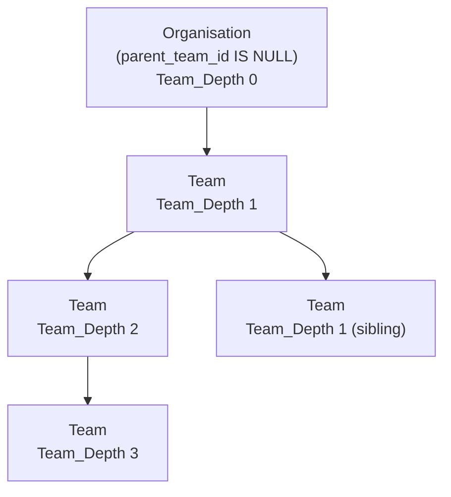
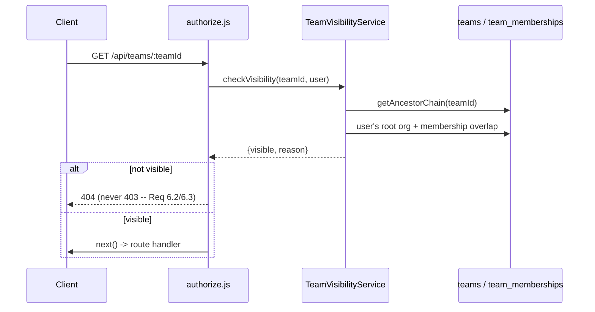

# Design Document

## Overview

This design reworks how the existing single-table `teams` hierarchy (self-referencing `parent_team_id`, queried recursively) is labelled, constrained, and secured, without introducing a new database table or a new entity type. A root `teams` row (`parent_team_id IS NULL`) becomes an "Organisation" in the UI; every other row stays a "Team". On top of that relabelling, this design adds:

- A fixed, non-configurable depth limit (Max_Team_Depth = 5).
- Organisation-only, read-only-at-Team-level colour and callsign-name-format settings.
- Ancestor-walking Team_Admin inheritance, implemented entirely inside `Team.isAdmin`.
- A configurable, non-contiguous Callsign_Level_Selection per Organisation.
- Organisation-scoped, private-branch-cascading visibility, enforced at the API/query layer.
- A rewritten three-segment callsign assembly algorithm.
- A two-phase (validate-the-whole-file, then create-in-dependency-order) CSV team import pipeline.
- A new, always-present, never-silently-recomputed `callsign_suffix` per user, with per-Team uniqueness.
- Member_List editing of name and a new `TAK_Role` attribute.
- A Client control for every one of the above.

Two design decisions go slightly beyond a literal reading of requirements.md and are called out explicitly for review before implementation (see "Flagged Design Decisions" at the end of the Overview):

1. **`teams.callsign_subteam_depth` is superseded and dropped.** Requirement 5 replaces the old "always the first N contiguous levels" dial with Callsign_Level_Selection (a non-contiguous set). Requirement 8 (which REPLACES `computeCallsignAttributes`' assembly algorithm) never reads `callsign_subteam_depth`. Since this application has no production deployment yet, there is no existing data to protect against an irreversible schema change, so this design removes the column outright via a migration rather than leaving dead schema in place.
2. **`UserAttributesService.updateUserAttributes` changes from a blind full-object PATCH to a fetch-merge-PATCH.** Today, every call to `updateUserAttributes` sends `{takCallsign, takColor, takRole}` together, and Authentik's PATCH replaces the whole `attributes` dict wholesale (this is why `clearUserAttributes` has to fetch-modify-put rather than PATCH a partial object). Because `computeCallsignAttributes` currently hardcodes `role: 'Team Member'` on every call, every callsign regeneration silently overwrites a Team_Admin's real TAK_Role edit back to the default. Requirement 13.8 ("a TAK_Role value changes only as the direct result of a Team_Admin or Global_Manager explicitly editing it") makes this existing behaviour a bug that must be fixed as part of this feature: `updateUserAttributes` is changed to fetch current Authentik attributes, merge in only the keys the caller supplies, and PATCH the merged result -- so a callsign-only regeneration (`{takCallsign, takColor}`) can no longer clobber `takRole`.

## Architecture

### Hierarchy and terminology

No schema change to `teams`' shape: `parent_team_id IS NULL` continues to mean "root". "Organisation" and "Team" are Client-side and doc-only labels layered on the existing `Team`/`Sub_Team` distinction; `Team_Management_API` request/response fields, routes, and DB columns are unchanged by Requirement 1.



### Shared ancestor-chain utility

Requirements 3, 4, 5, 6, and 8 all need the same primitive: "walk from a Team up to its Organisation, in order, with each level's `callsign_prefix`/`visibility`/`color`/`callsign_name_format`". Rather than repeating a recursive CTE in five different places (as the codebase currently does for the root-team lookup alone -- see `Team.getJoinableTeams`, `Team.createTeamChannel`, `server/routes/users.js`'s `/me` route, and `userAttributes.js`), this design adds one shared method:

```js
// server/models/Team.js
static async getAncestorChain(teamId) {
  // Returns rows ordered ROOT-FIRST (Organisation ... target team),
  // each with { id, name, callsign_prefix, color, callsign_name_format,
  // visibility, parent_team_id, depth }, depth 0 at the Organisation.
}
```

Implementation (single recursive CTE, walking upward from `teamId` and numbering hops from the target, then re-ordering by that hop count so the caller sees root-first with correct absolute depth):

```sql
WITH RECURSIVE ancestors AS (
  SELECT id, parent_team_id, name, callsign_prefix, color,
         callsign_name_format, visibility, 0 AS hops_from_target
  FROM teams WHERE id = $1
  UNION ALL
  SELECT t.id, t.parent_team_id, t.name, t.callsign_prefix, t.color,
         t.callsign_name_format, t.visibility, a.hops_from_target + 1
  FROM teams t JOIN ancestors a ON t.id = a.parent_team_id
)
SELECT *, (SELECT MAX(hops_from_target) FROM ancestors) - hops_from_target AS depth
FROM ancestors ORDER BY depth ASC;
```

Every consumer below (`isAdmin`, Max_Team_Depth checks, Organisation-only field enforcement, the Callsign_Generator, and the Visible_Branch resolver) is built on top of `getAncestorChain`, or its depth-only sibling `Team.getTeamDepth(teamId)` (same query, returning just `MAX(hops_from_target)`).

### Authorisation layering

Visibility (Requirement 6) is a new authorisation concern that sits alongside the existing `Permission_Registry` (`server/config/permissions.registry.js`) / `authorize.js` row-scoped resolver pattern (e.g. `team:update`), not a replacement for it. Today, `'team:read'` is granted unconditionally to every authenticated user via `roleDefaults.authenticated_user` -- there is no row-scoped check at all, so any authenticated user can currently read any Team in any Organisation. This design:

- Removes `'team:read'` from `roleDefaults.authenticated_user`.
- Adds a `'team:read'` row-scoped resolver in `authorize.js` that calls the new `TeamVisibilityService.checkVisibility(teamId, req.user)`.
- Global_Manager keeps its wildcard bypass (`roleDefaults.global_manager: ['*']`), satisfying Requirement 6 Criterion 4 for free.



Requirement 6.2/6.3 both require a 404 (not 403) so a non-member cannot distinguish "doesn't exist" from "exists but you can't see it". This means the `'team:read'` resolver's `false` result must map to `authorize.js`'s existing generic 403 -- so this design changes `authorize.js` for this one permission only: when the `'team:read'` row-scoped resolver returns `false`, `authorize()` responds 404 instead of 403 (a small, targeted branch keyed on the permission identifier, not a general behaviour change to `authorize()`). Every other permission identifier's denial is unaffected and still responds 403.

`TeamVisibilityService` is also used directly (not just via `authorize.js`) by:
- `Team.getSubTeams`/list-hierarchy endpoints, to filter out non-Visible_Branch rows from a list response (Requirement 6.5) rather than 404ing the whole list.
- `RequestApprovalService`/`requests.js`'s admin-visible-request-list logic is unaffected (access requests target teams by id already resolved server-side, not by user-supplied navigation).
- `BulkImportService`/the public joinable-teams query, for Requirement 7's separate (unauthenticated) exclusion rule -- see Requirement 7's own section below; Requirement 7 is intentionally NOT layered on `TeamVisibilityService`, since it has a different, simpler rule (exclude private branches, full stop, no Global_Manager/membership exception) and runs with no `req.user` at all.

### Max_Team_Depth as a shared constant

```js
// server/config/constants.js (new file)
module.exports.MAX_TEAM_DEPTH = 5;
```

Every enforcement point (`POST /api/teams`, `PUT /api/teams/:teamId` for `callsignLevelSelection`, `BulkImportService.importTeamRow`, the Client's "Add Sub-team" disable logic) imports this single constant. No `teams` column, no `system_config` row -- Requirement 2.1 is explicit that this must not be per-Organisation or updatable.

## Components and Interfaces

### `server/config/constants.js` (new)

`MAX_TEAM_DEPTH = 5`. Exported for both server code and referenced by name in Client-facing API responses (`GET /api/config/public` gains a `maxTeamDepth` field so the Client never hardcodes `5` twice -- see "Data Models" for the response shape).

### `server/models/Team.js` (modified)

- **`getAncestorChain(teamId)`** (new): described above.
- **`getTeamDepth(teamId)`** (new): `SELECT` variant of the same CTE returning only the integer depth. Used by the create-Sub_Team depth check and the Client's `maxTeamDepth`-driven disable logic (surfaced via the Team payload's existing implicit depth, computed the same way `getAncestorChain` computes it -- see below).
- **`isAdmin(teamId, userId)` (Requirement 4.1-4.3)**: rewritten to walk the Ancestor_Chain rather than checking only the exact `teamId` row:

  ```js
  static async isAdmin(teamId, userId) {
    try {
      const result = await pool.query(`
        WITH RECURSIVE ancestors AS (
          SELECT id, parent_team_id FROM teams WHERE id = $1
          UNION ALL
          SELECT t.id, t.parent_team_id FROM teams t
          JOIN ancestors a ON t.id = a.parent_team_id
        )
        SELECT 1 FROM team_memberships tm
        JOIN ancestors a ON tm.team_id = a.id
        WHERE tm.user_id = $2 AND tm.role = 'admin' AND tm.inherited_from_team_id IS NULL
        LIMIT 1
      `, [teamId, userId]);
      return result.rows.length > 0;
    } catch (error) {
      logger.error({ err: error, teamId, userId }, 'Error checking admin status');
      return false;
    }
  }
  ```

  This is the ONLY change needed for Requirement 4: every one of the ~9 existing call sites enumerated in requirements.md's own investigation (`authorize.js`'s `team:update`/`team:members:add`/`team:create:root_or_sub`/`user:create:team_admin`/`user:holding_pen:team_admin`/`channel_request:create`/`channel_request:process` resolvers, `requests.js`'s admin-team filter via `User.getTeamMemberships` + this same check, and `RequestApprovalService`) calls `Team.isAdmin(teamId, userId)` exactly as before and transparently receives inherited-admin behaviour. `tm.role = 'admin' AND tm.inherited_from_team_id IS NULL` deliberately matches only a DIRECT admin row on an ancestor (including the Team itself, since `ancestors` includes `id = $1`) -- this is independent of, and does not touch, the pre-existing `inherited_from_team_id` upward-membership-inheritance mechanism (Requirement 4.4).
- **`create(teamData)`**: gains Max_Team_Depth enforcement (Requirement 2.2/2.3) and Organisation-only field inheritance (Requirement 3.2), described under "Data Models" / "API Changes" below. `callsignLevelSelection` accepted only when `parent_team_id` is null (Requirement 5.6).
- **`update(teamId, updateData)`**: gains the same Organisation-only-field-ignore behaviour (Requirement 3.3) and Callsign_Level_Selection validation/rejection-on-Sub_Team (Requirement 5.2/5.6).
- **`getMembers(teamId)`**: unchanged shape, but Requirement 13 adds a companion **`getFullMemberList(teamId)`** used by both the Client's Member_List view and the `callsign_suffix` uniqueness check (Requirement 11.14, see "Shared Member_List Roster Query" below) -- deliberately the SAME query, since requirements.md Requirement 11.14 explicitly asks for the Requirement 13 Member_List definition to be reused.
- **`getSubTeamsForCallsignLevel(organisationId)`** (new, Requirement 5.8-5.11): described under "Data Models".

### `server/services/TeamVisibilityService.js` (new)

```js
class TeamVisibilityService {
  // Requirement 6: resolves whether `team` is a Visible_Branch for `user`.
  static async isVisibleBranch(teamId, user) { /* ... */ }

  // Batched form for list endpoints (Requirement 6.5) -- avoids N+1 by
  // resolving every ancestor-private-flag and every membership-overlap
  // check for an entire Organisation's team list in one or two queries
  // (see "Visibility Resolution Query" below), rather than calling
  // isVisibleBranch() once per row.
  static async filterVisibleBranches(teams, user) { /* ... */ }
}
```

### `server/services/CallsignService.js` (new)

Extracted from, and replacing the callsign-assembly portion of, `userAttributes.js`'s `computeCallsignAttributes`. Kept as a separate module (rather than growing `userAttributes.js` further) because Requirement 8's assembly algorithm and Requirement 11's suffix-default-computation algorithm are both pure, independently testable, string-transform functions with no I/O -- the natural property-testing surface for this feature (see "Correctness Properties").

```js
class CallsignService {
  // Requirement 8: assembles Organisation/Team/Name segments per
  // Criteria 1-5. Pure function: no DB access.
  static assembleCallsign({ organisationPrefix, teamSegmentPrefixes, nameSegment }) { /* ... */ }

  // Requirement 11.7: computes a default callsign_suffix from a name and
  // a callsign_name_format value (full_name | first_initial_last |
  // first_last_initial | first_initial_dot_last | user_defined).
  // Returns null for user_defined (Requirement 11.5/11.6 -- caller must
  // require an explicit value instead).
  static computeDefaultCallsignSuffix(firstName, lastName, callsignNameFormat) { /* ... */ }
}
```

`userAttributes.js`'s `computeCallsignAttributes(userId or names, teamId)` becomes a thin orchestrator: it calls `Team.getAncestorChain(teamId)`, reads the target user's stored `callsign_suffix` (Requirement 11.2 -- no live computation), reads the Organisation's `callsign_level_selection`, filters the ancestor chain's `callsign_prefix` values by that selection (Requirement 5.4/5.5), and calls `CallsignService.assembleCallsign`. It intentionally no longer reads `callsign_subteam_depth` or `callsign_name_format` at generation time (Requirement 3.4/8.4).

### `server/services/BulkImportService.js` (modified -- Requirement 9)

`importTeams`/`importTeamRow` are replaced with a two-phase pipeline:

```js
static async importTeams(csvBuffer, importingUser) {
  if (!importingUser?.is_global_manager) throw new BulkImportAuthorizationError();
  const rows = await parseAllRows(csvBuffer);           // Phase 0: parse whole file first
  const graph = buildImportGraph(rows);                 // Phase 1: build+validate DAG in memory
  const { creationOrder, rowErrors } = graph;            // topologically sorted, or whole-file rejection
  if (graph.wholeFileErrors.length > 0) {
    return { successCount: 0, failureCount: rows.length, results: graph.wholeFileErrors, rejected: true };
  }
  return await createRowsInOrder(creationOrder, rowErrors, importingUser); // Phase 2
}
```

- **Phase 1 (`buildImportGraph`)**: builds an in-memory node per row (keyed by `rowId` when present, else a synthetic per-row key), resolves `parentRowRef`/`parentTeamName`/`parentTeamId` into edges, and:
  - Rejects the WHOLE import if any non-empty `rowId` is duplicated (Requirement 9.2).
  - Rejects the WHOLE import if any `parentRowRef`+`parentTeamName`/`parentTeamId` combination appears on the same row (Requirement 9.5).
  - Rejects the WHOLE import if a cycle exists among `parentRowRef` edges, using a standard DFS with a three-colour (white/grey/black) visited-state cycle detector; every row on every detected cycle is named in the single rejection error (Requirement 9.13).
  - For a `parentRowRef` that does not match any `rowId` in the file, that ROW (not the whole file) is marked as failed, and its transitive dependents are marked as failed via "parent not yet successfully created" (Requirement 9.4/9.12) -- this is resolved as a graph property (any node whose resolved parent-node is itself failed/absent is failed), not by re-attempting row-by-row.
  - Produces a topological ordering (Kahn's algorithm) of every row that is NOT already failed, so `parentTeamName`/`parentTeamId`-rooted rows (which have no in-file dependency) sort first, followed by `parentRowRef` chains in dependency order -- satisfying Requirement 9.6's "row order in the file must not matter".
- **Phase 2 (`createRowsInOrder`)**: iterates the topological order and calls `Team.create` per row (Requirement 9.7/9.9/9.10/9.11, Max_Team_Depth and Organisation-only-field enforcement reused directly from `Team.create`, so this pipeline cannot drift from the single-team-creation API's rules). A row created in this phase makes its resulting `teamId` available to any row that referenced it via `parentRowRef`, so multi-level chains (Organisation -> Region -> District -> Station) resolve correctly in one pass regardless of file order.

### `server/routes/settings.js` (modified -- Requirement 13.4)

`ROLE_KEY_LABELS`' 8 keys (already exported) become the shared TAK_Role allow-list. A new small helper `TAK_ROLE_VALUES = Object.values(ROLE_KEY_LABELS)` (`['Team Member', 'Team Lead', 'Sniper', 'Medic', 'Forward Observer', 'RTO', 'K9', 'HQ']`) is exported from `settings.js` and imported by `server/routes/teams.js`'s new Member_List-edit route, so the allow-list has exactly one source of truth (Requirement 13.4's "consistent with the existing Role Descriptions configuration surface").

## Data Models

### `teams` (no new columns beyond `callsign_level_selection`)

| Column | Change |
|---|---|
| `callsign_prefix` | Unchanged column; validation tightened (letters+digits only, Requirement 3.8-3.9) at the API layer, not the DB layer (no `CHECK` constraint exists on any `teams` text column today, per the established convention noted in the `callsign_name_format` migration's own comment -- this design follows that precedent rather than introducing the schema's first `CHECK` constraint). |
| `color`, `callsign_name_format` | Unchanged columns; Organisation-only-write enforcement (Requirement 3.2/3.3) is enforced in `Team.create`/`Team.update`, not a DB trigger -- consistent with how "sub-teams inherit color from parent" is already enforced today (`teams.js`'s existing inline `color = parentTeam.color` logic, now generalised to both fields and moved into the model layer for CSV-import reuse). |
| `callsign_subteam_depth` | **Dropped.** No longer read by `computeCallsignAttributes`/`CallsignService`. Removed via migration `<timestamp>_drop-teams-callsign-subteam-depth.cjs` -- see Flagged Design Decision 1. |
| `callsign_level_selection` | **New**, migration `<timestamp>_add-teams-callsign-level-selection.cjs`: `integer[]`, nullable, no default at the column level (Requirement 5.3's "default to every Team_Depth 1..Max_Team_Depth" is an application-level default applied in `Team.create` when the field is omitted on an Organisation-creation request, mirroring how `callsign_subteam_depth`'s migration comment already documents the same nullable-with-app-level-default pattern). Only ever non-null on an Organisation row (`parent_team_id IS NULL`); a Sub_Team's value is always left `NULL` and is never read. |

```js
// migration: add-teams-callsign-level-selection.cjs
pgm.addColumn('teams', {
  callsign_level_selection: { type: 'integer[]', notNull: false },
});
```

```js
// migration: drop-teams-callsign-subteam-depth.cjs
pgm.dropColumn('teams', 'callsign_subteam_depth');
```

### `users` (new column -- Requirement 11.1)

| Column | Type | Notes |
|---|---|---|
| `callsign_suffix` | `varchar(255)` nullable | Requirement 11.1: present for every user (nullable at the DB level, since a pre-existing user row predates this feature and has no computed value; application code treats "no team yet" the same way `tak_role` already does -- see Requirement 13.7's default only applying "at creation time"). Populated at creation per Requirement 11.6/11.7, editable only via the new Member_List/user-management routes (Requirement 11.4). |

```js
// migration: add-users-callsign-suffix.cjs
pgm.addColumn('users', {
  callsign_suffix: { type: 'varchar(255)', notNull: false },
});
```

### `user_cache` (new column, mirroring the `users.callsign_suffix` source of truth)

Per the existing "every per-user display attribute is duplicated across `users` and `user_cache`" convention (explicitly documented in the `add-is-team-device-device-label` migration's own comment, citing `tak_role`/`tak_color`/`tak_callsign` as precedent), `user_cache` gains the same column:

```js
// migration: add-user-cache-callsign-suffix.cjs (same timestamp batch as above)
pgm.addColumn('user_cache', {
  callsign_suffix: { type: 'varchar(255)', notNull: false },
});
```

`authentikSync.js`'s periodic sync does NOT populate this from Authentik (there is no Authentik-side `callsign_suffix` attribute -- it is a local-only value, unlike `tak_role`/`tak_color`/`tak_callsign` which mirror Authentik user attributes). Instead, every write path that sets `users.callsign_suffix` (user creation, Member_List edit, access-request approval) writes the identical value to `user_cache.callsign_suffix` in the same transaction, matching how `tak_role_local` is already dual-written by `UserProvisioningService`/`RequestApprovalService` today.

### `users.tak_role` (new column -- Requirement 13)

Requirement 13.6 requires writes to land in "the local database" AND Authentik's `takRole` attribute. `user_cache.tak_role` already exists and already mirrors Authentik (per `authentikSync.js`). What's missing is a source-of-truth column on `users` itself (the table Team_Admin edits actually target), since `user_cache` is a read-mostly sync mirror that gets overwritten wholesale on the next periodic sync -- writing ONLY to `user_cache.tak_role` would be silently reverted at the next sync interval, violating Requirement 13.8's "never recomputed as a side effect" for the sync's own overwrite.

```js
// migration: add-users-tak-role.cjs (same batch)
pgm.addColumn('users', {
  tak_role: { type: 'varchar(50)', notNull: true, default: 'Team Member' },
});
```

`authentikSync.js`'s upsert is extended to prefer the Authentik-sourced `takRole` attribute for `user_cache.tak_role` (unchanged), and a new, narrow reconciliation is added: when Authentik's `takRole` attribute differs from `users.tak_role` for a given user, the sync updates `users.tak_role` to match Authentik's value, NOT the other way around -- Authentik remains the durable cross-system source of truth once a value has been pushed to it by a Member_List edit (Requirement 13.6 pushes to Authentik synchronously in the same request; the periodic sync then keeps `users.tak_role` consistent with it, exactly mirroring the existing `tak_callsign`/`tak_color` flow direction). This is a one-line addition to `authentikSync.js`'s existing per-user upsert loop, not a new code path.

### `GET /api/config/public` response (extended)

```json
{ "maxTeamDepth": 5, "...": "existing fields unchanged" }
```

Requirement 2's Client disable-logic and Requirement 5's toggle-count both need this value; exposing it via the existing public config endpoint avoids hardcoding `5` a second time in `client/src/`.

### Team response shape (extended, Requirements 1, 2, 5, 8)

`GET /api/teams/:teamId`, `GET /api/teams/my-teams`, `GET /api/teams/:teamId/sub-teams` responses gain, per team row:

```json
{
  "id": 42, "name": "...", "parent_team_id": null,
  "team_depth": 0,
  "is_organisation": true,
  "callsign_level_selection": [1, 2, 4],
  "...": "existing fields unchanged"
}
```

`team_depth`/`is_organisation` are computed server-side (via `getAncestorChain`/a simple `parent_team_id IS NULL` check) and included so the Client never re-derives depth by walking `parent_team_id` chains client-side across paginated/partial team lists (Requirement 1.1/1.2's "every page and control" labelling and Requirement 2.4/2.5's disable-logic both need this per-row, without an extra round trip).

### Visibility resolution query (Requirement 6)

`TeamVisibilityService.isVisibleBranch` implements the Visible_Branch definition directly as SQL, batchable for list endpoints:

```sql
-- Single-team check: is teamId visible to userId (non-Global_Manager)?
WITH RECURSIVE chain AS (
  SELECT id, parent_team_id, visibility FROM teams WHERE id = $1
  UNION ALL
  SELECT t.id, t.parent_team_id, t.visibility FROM teams t
  JOIN chain c ON t.id = c.parent_team_id
),
organisation AS (SELECT id FROM chain WHERE parent_team_id IS NULL),
has_private_ancestor AS (SELECT EXISTS(SELECT 1 FROM chain WHERE visibility = 'private') AS any_private),
viewer_org AS (
  -- the viewer's own Organisation, via any of their direct/inherited memberships
  SELECT DISTINCT root.id FROM team_memberships tm
  JOIN chain_of_membership root ON true -- resolved via getAncestorChain(tm.team_id) root, batched below
),
viewer_is_member_of_chain AS (
  SELECT EXISTS(
    SELECT 1 FROM team_memberships tm WHERE tm.user_id = $2 AND tm.team_id IN (SELECT id FROM chain)
  ) AS is_member
)
SELECT
  (SELECT id FROM organisation) = ANY(SELECT id FROM viewer_org) AS same_organisation,
  (SELECT any_private FROM has_private_ancestor) AS has_private_ancestor,
  (SELECT is_member FROM viewer_is_member_of_chain) AS is_member_or_admin_of_chain;
```

(The `viewer_org`/CTE-of-a-CTE shown above is illustrative; the actual implementation resolves the viewer's Organisation id once via `getAncestorChain(any of the viewer's team memberships)` in application code, then passes it as a plain parameter, since a user's own Organisation membership is small and already loaded as part of `req.user`/session context in most call sites -- avoiding a correlated subquery per row.)

Decision table applied in application code from the three booleans above:
- `same_organisation` is false and caller is not Global_Manager -> **not visible** (404, Requirement 6.2).
- `has_private_ancestor` is true and `is_member_or_admin_of_chain` is false -> **not visible** (404, Requirement 6.3/6.8).
- Otherwise -> **visible**.

For **list** endpoints (Requirement 6.5/6.6), `filterVisibleBranches` runs one batched query per Organisation (not per Team): it fetches every Team in the caller's Organisation with its `visibility` and `parent_team_id`, computes "has a private ancestor" for every row in a single pass in application code (a simple bottom-up/top-down walk over an already-small, already-fetched adjacency list -- an Organisation's whole hierarchy is bounded by `teams` table size, not user count), and separately fetches the caller's full membership/admin set (direct + inherited, one query) to test against each private-ancestored row's Ancestor_Chain membership. This is O(teams in one Organisation) + O(caller's memberships), with no N+1 across rows.

### Callsign_Level_Selection toggle-labelling query (Requirement 5.8-5.11)

```js
// Team.getSubTeamsForCallsignLevel(organisationId)
// Returns, for the Organisation's whole hierarchy in ONE recursive query:
// [{ team_depth: 1, callsign_prefix: 'CB' }, { team_depth: 1, callsign_prefix: 'AUK' }, ...]
```

```sql
WITH RECURSIVE tree AS (
  SELECT id, callsign_prefix, 0 AS team_depth FROM teams WHERE id = $1
  UNION ALL
  SELECT t.id, t.callsign_prefix, tree.team_depth + 1
  FROM teams t JOIN tree ON t.parent_team_id = tree.id
)
SELECT team_depth, callsign_prefix FROM tree
WHERE team_depth BETWEEN 1 AND $2 AND callsign_prefix IS NOT NULL AND callsign_prefix != '';
```

The Client (see "Client Changes") groups this flat list by `team_depth`, de-duplicates `callsign_prefix` values per depth, sorts, and applies the "up to 3, then an ellipsis" truncation (Requirement 5.10) purely in rendering code -- the query itself returns every distinct prefix per depth (bounded by the Organisation's total Team count, never large) rather than pre-truncating server-side, since the truncation is a presentation rule that may reasonably change independent of the API contract.

### Shared Member_List roster query (Requirements 11.14, 13)

```js
// Team.getFullMemberList(teamId)
// Every direct + inherited member/admin of teamId, i.e. exactly today's
// Team.getMembers(teamId) result -- reused verbatim, not reimplemented,
// per Requirement 11.14's explicit instruction.
```

`callsign_suffix` uniqueness (Requirement 11.14-11.18) is checked by calling `Team.getFullMemberList(teamId)` and comparing the candidate value case-insensitively against every returned row's `callsign_suffix` (excluding the row being edited, for an update). No new query is introduced for this check -- it is the existing `getMembers` query, given a second name (`getFullMemberList`) to make its dual use (display AND uniqueness-checking) explicit at call sites, and extended to also select `callsign_suffix`.

### CSV import row-graph model (Requirement 9)

In-memory shape built by `buildImportGraph`, never persisted:

```js
{
  nodes: Map<rowKey, { row, resolvedParentKey, resolvedParentTeamId, teamId, status }>,
  wholeFileErrors: [{ error: string, rowIds?: string[] }],  // duplicate rowId, cycle
  creationOrder: [rowKey, ...],                              // topological order
}
```

`rowKey` is the row's `rowId` when present, else `` `__row_${csvLineNumber}` `` (so a row with no `rowId` can still be a graph node, just not referenceable by any other row's `parentRowRef`).

### Team CSV import template (Requirement 9.14)

`public/templates/team-import-template.csv` is rewritten to demonstrate a 3-level hierarchy using `rowId`/`parentRowRef` (FENZ -> Te Ihu region -> Canterbury district -> Station 40), plus the existing `parentTeamName`/`parentTeamId` columns for attaching to a pre-existing team, and the new `visibility`/`callsignPrefix` columns:

```csv
rowId,parentRowRef,parentTeamName (optional),parentTeamId (optional),name,visibility,callsignPrefix,color,callsignNameFormat
org1,,,,Fire and Emergency New Zealand,public,FENZ,Red,full_name
region1,org1,,,Te Ihu,public,TEIHU,,
district1,region1,,,Canterbury,public,CHC,,
station1,district1,,,Station 40,private,S40,,
```

## API Changes

### `POST /api/teams` (Requirement 2, 3, 5, 9)

New/changed request body fields:

| Field | Change |
|---|---|
| `callsignLevelSelection` | New, optional, array of int 1..Max_Team_Depth. Accepted ONLY when `parentTeamId` is absent (root/Organisation creation). Defaults to `[1..5]` when omitted on Organisation creation (Requirement 5.3). Rejected with 400 if supplied alongside a `parentTeamId` (Requirement 5.6) or if any value is outside range (Requirement 5.2). |
| `callsignPrefix` | Validation tightened: `express-validator` chain gains `.matches(/^[A-Za-z0-9]*$/)` (Requirement 3.8-3.9), replacing the current unconstrained `.trim()`-only rule. |
| `color`, `callsignNameFormat` | On Sub_Team creation (`parentTeamId` present), any client-supplied value is now silently ignored and overwritten with the parent's Organisation-level value (generalising the existing `color`-only inheritance already in `teams.js` to also cover `callsignNameFormat`, per Requirement 3.2). |
| `callsignNameFormat` enum | Gains `'first_initial_dot_last'` (Requirement 8.6) and `'user_defined'` (Requirement 11.5) alongside the existing three values. |
| (Max_Team_Depth) | Before insert, the handler computes the target depth (`parentTeamId` present ? `Team.getTeamDepth(parentTeamId) + 1` : `0`) and returns 400 (`"Maximum team depth (5) exceeded"`) without inserting if it exceeds `MAX_TEAM_DEPTH` (Requirement 2.2/2.3). |

### `PUT /api/teams/:teamId` (Requirement 3, 5)

- `callsignLevelSelection`: same validation as create; additionally rejected with 400 if `teamId`'s row has a non-null `parent_team_id` (Requirement 5.6).
- `color`/`callsignNameFormat`: silently ignored (not merely rejected) when `teamId` is a Sub_Team, per Requirement 3.3's "ignore ... and SHALL NOT change" wording -- the response still returns 200 with the team's unchanged actual values, not a 400, since this mirrors the existing (pre-this-feature) handling of `color` being "intentionally excluded" from `Team.update`'s column list.
- When `callsignLevelSelection` changes, the same post-update regeneration call already made for `callsignSubteamDepth`/`callsignNameFormat` changes (`UserAttributesService.updateTeamUserAttributes`) is triggered, but the regeneration explicitly preserves each affected user's `callsign_suffix` (Requirement 5.12/11.8 -- `updateTeamUserAttributes`'s per-user loop already only ever touches `takCallsign`/`takColor`/`takRole` via `generateCallsign`, and `generateCallsign` under this design reads the user's existing stored `callsign_suffix` rather than computing a new one, so no code change is needed here beyond the Callsign_Generator rewrite itself -- this is called out because it would be an easy regression to reintroduce).

### `GET /api/teams/:teamId`, `GET /api/teams/:teamId/hierarchy`, `GET /api/teams/:teamId/sub-teams` (Requirement 6)

Authorization changes from unconditional (`roleDefaults.authenticated_user` grant) to the new `'team:read'` row-scoped resolver backed by `TeamVisibilityService`. A denied request returns 404 (Requirement 6.2/6.3), not 403. `GET /api/teams/:teamId/sub-teams` additionally filters its result list through `TeamVisibilityService.filterVisibleBranches` (Requirement 6.5) rather than 404ing the whole list when only some children are hidden.

### `GET /api/teams/my-teams` (Requirement 6.6)

New optional `?scope=organisation` query parameter: when present (and the caller is an Org_Member, i.e. has at least one team membership), returns every Visible_Branch Team in the caller's own Organisation (via `filterVisibleBranches`) instead of only teams the caller directly/inherited-belongs to -- this is the API surface for Requirement 6.6's "means of browsing every Visible_Branch Team", additive to the existing default (unscoped) behaviour so no existing caller's response shape changes.

### `POST /api/requests/team-access` (public, Requirement 7, 11.9)

- The existing `Team.getJoinableTeams()` query gains a `WHERE NOT EXISTS (a private ancestor)` clause (Requirement 7.1/7.2), implemented as the same "has a private ancestor" boolean used by `TeamVisibilityService`, applied without any per-user context (this route is unauthenticated) -- i.e. it is a pure Ancestor_Chain-private-flag check, no membership/Global_Manager exception, matching Requirement 7's simpler unconditional-exclusion rule.
- Request body gains an optional `callsignSuffix` field, required (400 if absent) when the target team's Organisation's `callsign_name_format` is `user_defined` (Requirement 11.9), and rejected/ignored otherwise-present-but-not-required case is simply accepted and stored either way -- Requirement 11.10 only constrains the Client's prompting behaviour, not a server-side rejection of an unexpectedly-present value.
- `access_requests` gains a `callsign_suffix varchar(255)` column (new migration) to carry this value through to approval (Requirement 11.9/11.11/11.12).

### `POST /api/requests/:requestId/approve` (Requirement 11.11, 11.12, 11.17)

- Request body gains an optional `callsignSuffix` override field. `RequestApprovalService.approveRequest`'s `new_account` branch resolves the effective value as: reviewer-supplied override > request's own stored `callsign_suffix` (from Requirement 11.9's submission) > computed default (via `CallsignService.computeDefaultCallsignSuffix`, Requirement 11.7/11.11).
- Before committing, the effective value is checked against the target Team's `getFullMemberList` for a case-insensitive collision (Requirement 11.17); on collision, the approval is rejected (transaction rolled back, matching the existing Phase 1/Phase 2 split's compensating-action pattern for the already-created Authentik user) and the response includes the conflicting value so the Client can prompt the reviewer to retry with a different one.

### `POST /api/users`, `POST /api/users/create-and-add`, `BulkImportService.importUserRow` (Requirement 11.6, 11.7, 11.14, 11.15)

All three user-creation paths converge on one new shared helper, `UserProvisioningService.resolveCallsignSuffixForNewUser(client, { firstName, lastName, teamId, requestedCallsignSuffix })`:

1. Resolves the user's Organisation's `callsign_name_format` (via `Team.getAncestorChain(teamId)`'s root row).
2. If `user_defined`: requires `requestedCallsignSuffix` to be non-empty (400 otherwise, Requirement 11.6).
3. Else: computes the default via `CallsignService.computeDefaultCallsignSuffix`, using `requestedCallsignSuffix` instead if supplied (Requirement 11.7).
4. Checks the effective value against `Team.getFullMemberList(teamId)` for a case-insensitive collision (Requirement 11.14); throws a typed `CallsignSuffixConflictError` if found, which each route maps to a 400 naming the conflicting user (Requirement 11.15).

This keeps the uniqueness/default-computation logic in exactly one place regardless of which of the three creation entry points is used, matching how `UserProvisioningService.createAndAddUser` is already the single shared local-write path for two of the three.

### `PUT /api/users/:userId` and Member_List edit route (new -- Requirement 11.4, 13)

New route `PATCH /api/teams/:teamId/members/:userId` (chosen over a bare `/api/users/:userId` route so the existing `Team.isAdmin`-of-`:teamId` authorization boundary applies directly, consistent with `team:members:add`'s existing pattern):

```
PATCH /api/teams/:teamId/members/:userId
Body: { firstName?, lastName?, takRole?, callsignSuffix? }
```

- Authorization: new `'team:members:edit'` resolver, identical shape to `team:members:add` (Team_Admin of `:teamId` -- inherited, per Requirement 4 -- or Global_Manager), additionally gated by `TeamVisibilityService` (Requirement 13.10).
- `email` is not an accepted field; if present in the body it is ignored (Requirement 13.3's "no control to edit email" is a Client-side omission, but the Team_Management_API independently never applies an `email` field here even if sent directly, as defense in depth).
- `firstName`/`lastName`: written directly to `users` (Requirement 13.9), no request/approval flow (that flow remains for the existing self-service `name_change` access-request path, untouched).
- `takRole`: validated against the shared `TAK_ROLE_VALUES` allow-list (400 otherwise, Requirement 13.4); written to `users.tak_role` and pushed to Authentik via `UserAttributesService.updateUserAttributes(authentikUserId, {role: takRole})` using the new fetch-merge-PATCH behaviour (Flagged Design Decision 2), so this write cannot be clobbered by, and does not clobber, any concurrent callsign regeneration.
- `callsignSuffix`: validated against the Requirement 11.3 character set, checked for uniqueness via `getFullMemberList` (excluding the user being edited), rejected with 400 on conflict without changing the stored value (Requirement 11.16).

### `GET /api/teams/:teamId` member/admin response (Requirement 13.1)

`members`/response rows gain `tak_role` and `callsign_suffix` fields (both already selectable from `users`/`user_cache` once the migrations above land); no new query needed beyond adding these two columns to `Team.getMembers`'s existing `SELECT u.*`.

### CSV import routes (`POST /api/bulk-import/teams`) (Requirement 9)

Response shape gains a `rejected: true` + a single combined error array for the two whole-file-rejection cases (duplicate `rowId`, cycle) -- distinguishable from the existing per-row `results` array shape (which still applies to individual `parentRowRef`-unresolved failures, Requirement 9.4), so the Client can render "the whole file was rejected: <reason>" versus "N of M rows failed" differently.

## Client Changes

Per Requirement 14, every capability above needs a reachable Client control. This section enumerates each new/changed page, dialog, and control.

### `client/src/pages/Teams.jsx`

- **Terminology (Req 1)**: every literal `"Team"`/`"Create Team"` label is switched to a helper `labelFor(team)` (`team.is_organisation ? 'Organisation' : 'Team'`) and `labelForNew(parentTeamId)` (`parentTeamId ? 'Team' : 'Organisation'`), applied to the page heading is left as "Orgs & Teams" (already correct), table header ("Team Name" -> kept generic since the column mixes both), the create/edit dialog title and submit button, and the row-level "Team" text used in delete-confirmation copy.
- **Max_Team_Depth (Req 2.4/2.5)**: the row-level "Add Sub-team"-equivalent affordance in this page is the Parent-Team dropdown in the create dialog; it now excludes (`<option disabled>`, greyed) any team whose `team_depth === maxTeamDepth` (fetched once from `GET /api/config/public`), with a tooltip "Maximum team depth (5) reached".
- **Organisation-only colour/format fields (Req 3.5/3.6)**: the "TAK Color" and (new) "Callsign Name Format" selects already disable when `formData.parentTeamId` is set; the new `first_initial_dot_last`/`user_defined` options are added to the format `<select>`, with `user_defined` additionally showing inline help text ("New members will require a manually entered suffix").
- **Callsign_Level_Selection editor (Req 5.7-5.11)**: replaces the single "Callsign Sub-team Depth" `<select>` (root-only section of the create/edit form) with a row of toggle buttons, one per Team_Depth 1..maxTeamDepth, each labelled via `Team_Depth`'s existing-Sub_Team-prefixes lookup (`GET /api/teams/:teamId/callsign-level-options`, a thin new route wrapping `Team.getSubTeamsForCallsignLevel`, called only when editing an existing Organisation -- a brand-new Organisation has no Sub_Teams yet, so every toggle renders with no parenthetical per Requirement 5.11). Client-side grouping/truncation-to-3-plus-ellipsis (Requirement 5.10) happens in a small pure helper, `formatLevelLabel(depth, prefixes)`.
- **`callsignPrefix` input (Req 3.10)**: gains `pattern="[A-Za-z0-9]*"` and an inline validation message, matching the stricter (no `-`) rule.

### `client/src/pages/TeamDetail.jsx`

- **Terminology (Req 1)**: header ("Organisation"/"Team" in place of the hardcoded implicit "Team"), breadcrumb ("Root" -> "Organisation" for a top-level parent link), Edit/Sub-team dialog titles, all switched via the same `labelFor` helper.
- **Add Sub-team disable (Req 2.4/2.5)**: the "Add Sub-team" button is disabled (greyed, with a tooltip) when `team.team_depth === maxTeamDepth`.
- **Member_List columns and inline edit (Req 13.1/13.2/13.5)**: the Members and Team Admins tabs' tables gain a `TAK_Role` column (rendered as a badge, matching the existing role-badge visual language already used for `Member`/`Admin`/`Inherited`) and gain per-row inline "Edit" affordance (pencil icon, matching the existing per-team edit pattern) opening a small inline edit form (first name, last name, a `<select>` of the 8 `TAK_ROLE_VALUES`, and -- Req 11.13 -- a `callsign_suffix` text input with the Requirement 11.3 pattern) that PATCHes the new `PATCH /api/teams/:teamId/members/:userId` route. Email is rendered as plain, non-editable text (Req 13.3) -- there is no input control for it anywhere in this form.
- **Inherited-admin attribution (Req 4.5)**: already implemented today (`inherited_from_team_name` badge) -- unchanged, confirmed compatible with the new `isAdmin` implementation since the badge is driven by `Team.getMembers`'s existing `inherited_from_team_id` column, independent of the admin-check rewrite.
- **Callsign summary badges**: the root-only "Depth N" / name-format badge pair is replaced with a compact "Levels: 1, 2, 4" summary (reading the Organisation's `callsign_level_selection`) plus the unchanged name-format badge (with the two new format values' example strings: "J.Doe", and "Custom" for `user_defined`).
- **Sub-team creation dialog**: `callsignPrefix` gains the same stricter pattern validation as Teams.jsx.

### `client/src/pages/RequestAccess.jsx` (Requirement 11.9/11.10)

After a team is selected, the form conditionally fetches that team's Organisation's `callsign_name_format` (a small addition to the existing `teamsAPI.getJoinable()` response -- joinable-team rows gain a `callsignNameFormat` field) and, only when it is `user_defined`, renders an additional "Preferred Callsign Suffix" text input (required, same character-set pattern), wired into the existing `react-hook-form` `register` set and submitted as `callsignSuffix`.

### `client/src/pages/Requests.jsx` (Requirement 11.11/11.12, 11.17)

The pending-request card gains, for a request targeting a `user_defined`-format team, an editable "Callsign Suffix" field pre-filled with the request's submitted value (Req 11.12); for a non-`user_defined`-format team, the same field is pre-filled with the SERVER-computed default (a new field returned by `GET /api/requests/pending`, computed via `CallsignService.computeDefaultCallsignSuffix` against the request's stored requester name) and is likewise editable before approving (Req 11.11). On a 400 collision response from `POST /api/requests/:requestId/approve` (Req 11.17), the card surfaces the conflicting value inline (replacing the current bare `toast.error`) and keeps the edit field open for a retry, rather than only showing a generic toast.

### `client/src/pages/Admin.jsx` (Requirement 9 -- CSV team import UI)

Today there is no Client entry point for team CSV import at all (`server/routes/bulkImport.js` exists with no Client caller) -- this is exactly the gap Requirement 14 exists to close. A new "Bulk Import" tab is added to `Admin.jsx`'s existing tab set (alongside Color Mappings/Role Descriptions/Site Content), Global_Manager-only (this page already gates on `user.isAdmin`), containing:
- A file picker + "Upload Team CSV" button posting to `POST /api/bulk-import/teams` (`multipart/form-data`, field name `csv`, matching the existing route's contract).
- A link to download the (Req 9.14-updated) template from `/templates/team-import-template.csv` (already statically served).
- A results table rendering the response's per-row `results` array (row number, success/failure, error message) for a partial-success import, or a single prominent error panel listing every offending row for a whole-file rejection (duplicate `rowId` / cycle detected).

### `client/src/services/api.js`

```js
export const teamsAPI = {
  // ...existing...
  getCallsignLevelOptions: (id) => api.get(`/teams/${id}/callsign-level-options`),
  updateMember: (teamId, userId, data) => api.patch(`/teams/${teamId}/members/${userId}`, data),
};
export const bulkImportAPI = {
  importTeams: (formData) => api.post('/bulk-import/teams', formData, { headers: { 'Content-Type': 'multipart/form-data' } }),
};
export const configAPI = {
  // ...existing...
  // getPublic() response now also carries maxTeamDepth -- no new method needed.
};
```

## Correctness Properties Prework

*Property-based testing is appropriate here*: the feature's core logic is dominated by pure, input-varying transforms (callsign assembly, suffix default computation, CSV dependency-graph resolution) and query-shaped invariants (Max_Team_Depth, admin inheritance, visibility, uniqueness) that hold "for all" inputs in a large space -- not infrastructure wiring, not UI rendering, not simple CRUD. Requirement 1 (pure labelling) and Requirement 14 (Client wiring/error-handling) are UI/integration concerns with no meaningful "for all inputs" property and are excluded below; they get unit/integration tests only (see Testing Strategy).

Acceptance Criteria Testing Prework:

2.1-2.3 Max_Team_Depth enforcement (fixed constant; reject Sub_Team creation beyond depth 5)
  Thoughts: For any chain of N nested creation requests, the Nth request should succeed iff N <= Max_Team_Depth+1 (root counts as depth 0). This is a universal property over the shape/length of an arbitrary hierarchy, not one specific example.
  Classification: PROPERTY
  Test Strategy: Generate a random chain length 0..8, attempt to create that many nested teams, assert every creation at depth <= 5 succeeds and the first creation attempted at depth 6+ is rejected with 400, for all generated chain shapes (including branching, not just a single linear chain).
2.4-2.5 Client Add-Sub-team disable state
  Thoughts: A rendering/disabled-attribute concern tied to a specific depth value, not a transform with a wide input space beyond "depth >= max or not". Better covered by a couple of concrete examples (depth 4 enabled, depth 5 disabled).
  Classification: EXAMPLE
  Test Strategy: Two example-based component tests: depth < max renders enabled, depth == max renders disabled+greyed.
3.1-3.4 Organisation-only color/callsign_name_format: Sub_Team always inherits, any client-supplied override ignored
  Thoughts: For any Organisation with any color/format and any Sub_Team creation/update request supplying arbitrary conflicting values, the resulting Sub_Team's stored color/format must equal the Organisation's, never the supplied value. Wide input space (arbitrary supplied override values), one clear invariant.
  Classification: PROPERTY
  Test Strategy: Generate a random Organisation (color, format) and a random Sub_Team creation/update payload with arbitrary (possibly different) color/format values; assert the created/updated Sub_Team's color/format always equals the Organisation's current values.
3.8-3.9 callsign_prefix character restriction (letters+digits only, no '-')
  Thoughts: A validation predicate over the full string space -- classic "for all strings, acceptance iff matches character class" property, and the stated contrast with callsign_suffix's broader class makes a differential property valuable (same string accepted by suffix, rejected by prefix, whenever it contains '-' or '.').
  Classification: PROPERTY
  Test Strategy: Generate arbitrary strings; assert callsign_prefix validation accepts iff every character is [A-Za-z0-9]; separately, for strings containing '-' or '.', assert prefix validation rejects while suffix validation (Req 11.3) accepts (differential property, ties directly to the "different allowed character sets" rationale called out in the task).
4.1-4.4 Inherited Team_Admin status via isAdmin walking the Ancestor_Chain
  Thoughts: For any generated hierarchy and any placement of a direct admin membership at some ancestor, isAdmin must return true for every descendant of that ancestor and must be unaffected by the pre-existing inherited_from_team_id membership rows. This is exactly the kind of "holds for all hierarchy shapes and admin placements" property PBT is for.
  Classification: PROPERTY
  Test Strategy: Generate a random tree of teams and a random subset of (team, user) direct-admin memberships; assert isAdmin(descendantId, userId) is true iff userId holds a direct admin row on descendantId or any ancestor of it, for every (descendant, user) pair in the generated tree -- using mocked pool.query results, consistent with existing Team.test.js conventions.
4.5 Client Team Admins tab shows inherited admin attributed to ancestor
  Thoughts: A specific rendering behavior tied to one relationship (this user, this ancestor), not a wide input-varying transform.
  Classification: EXAMPLE
  Test Strategy: One example-based test: an admin of a parent team appears in a child team's admin tab with an "inherited from <parent>" badge.
5.1-5.6 Callsign_Level_Selection accept/reject range, default, Sub_Team rejection
  Thoughts: For any array of integers, acceptance must hold iff every element is in [1, Max_Team_Depth] AND the request targets a root team. Wide input space (arbitrary integer arrays), one invariant.
  Classification: PROPERTY
  Test Strategy: Generate arbitrary integer arrays (including empty, out-of-range, negative, duplicate values) and a random root-or-not flag; assert acceptance iff (not a Sub_Team) AND every element in [1,5].
5.4-5.5 Callsign_Generator includes only selected, present levels; omits absent ones without error
  Thoughts: For any Ancestor_Chain (of varying depth) and any Callsign_Level_Selection, the assembled Team segment must include exactly the selected depths that exist in this chain, in ascending order, and must never throw when a selected depth exceeds the chain's actual depth.
  Classification: PROPERTY
  Test Strategy: Generate a random Ancestor_Chain (0..5 levels, random prefixes) and a random selection subset of [1..5]; assert the Team segment equals the prefixes at (selection ∩ present depths), in ascending depth order, for all generated combinations.
5.8-5.11 Client toggle labelling (Level N + up-to-3-examples + ellipsis)
  Thoughts: A pure string-formatting function of (depth, list of distinct prefixes) -- "for all lists of prefixes, the formatted label shows at most 3 examples and an ellipsis iff more than 3 exist" is a clean universal property over list length/content.
  Classification: PROPERTY
  Test Strategy: Generate an arbitrary list of distinct prefix strings (0..10 elements); assert formatLevelLabel always starts with "Level N", contains no parenthetical iff the list is empty, otherwise contains up to 3 comma-joined values, with a trailing "..." iff the list has more than 3 distinct values.
5.12 Level-selection change regenerates callsign but never touches callsign_suffix
  Thoughts: For any set of users under an Organisation and any change to callsign_level_selection, every affected user's callsign_suffix must be byte-identical before and after regeneration, while callsign/color may change. A clear invariant over an otherwise-mutating operation.
  Classification: PROPERTY
  Test Strategy: Generate a random set of users (each with an existing callsign_suffix) under a random hierarchy, apply a random new callsign_level_selection, run the regeneration, and assert every user's stored callsign_suffix is unchanged while callsign/color are recomputed.
6.1-6.3, 6.7-6.8 Visible_Branch resolution (cross-org exclusion, private-ancestor cascade, Global_Manager bypass)
  Thoughts: This is the highest-value property in the whole feature: for any randomly generated hierarchy (with random visibility per node) and any randomly generated viewer (random org membership, random admin placement, random Global_Manager flag), isVisibleBranch's boolean result must match the Visible_Branch definition computed independently via a naive reference walk of the Ancestor_Chain. Textbook "optimized implementation vs. naive model" (model-based testing) plus a metamorphic property (marking any ancestor private can only ever shrink visibility, never grow it).
  Classification: PROPERTY
  Test Strategy: (a) Model-based: generate a random tree with random per-node visibility and a random viewer (org membership + admin flags + global-manager flag); assert TeamVisibilityService.isVisibleBranch's result equals a naive reference implementation that walks the full Ancestor_Chain in plain JS. (b) Metamorphic: for any tree/viewer pair where a Team is currently visible, flipping any ancestor's visibility from public to private must never make it visible if it was previously invisible for that reason, and can only remove visibility, never add it, when the viewer is not a member of the newly-privatized branch and not a Global_Manager.
6.5-6.6 List-filtering excludes exactly the non-Visible_Branch teams
  Thoughts: For any generated Organisation's team list and viewer, filterVisibleBranches's output set must equal calling isVisibleBranch on every row individually (a consistency/equivalence property between the batched and single-row paths -- catches an N+1-avoidance implementation from silently diverging from the semantics it's supposed to batch).
  Classification: PROPERTY
  Test Strategy: Generate a random Organisation's team list and viewer; assert filterVisibleBranches(list, viewer) === list.filter(t => isVisibleBranch(t.id, viewer)) for all generated inputs.
7.1-7.2 Public joinable-teams list excludes private branches
  Thoughts: For any generated hierarchy with random visibility, the joinable-teams query result must never include a team with a private ancestor (including itself), regardless of can_join/public status otherwise. A clear universal exclusion property, testable against a naive reference walk.
  Classification: PROPERTY
  Test Strategy: Generate a random hierarchy with random visibility/can_join flags; assert every team returned by the joinable-teams query has no private team in its Ancestor_Chain (via a naive reference check), for all generated hierarchies.
7.4 Access-request rejected for an excluded team
  Thoughts: A specific example (submit a request naming an excluded team, expect rejection), not a wide transform.
  Classification: EXAMPLE
  Test Strategy: One example-based integration test: submit a team-access request naming a team under a private ancestor; assert 400.
8.1-8.5 Callsign assembly: 3 segments, org segment unconditional, team segment concatenated no-separator in ascending depth order, name segment always the stored suffix, '-' join with empty-segment omission
  Thoughts: The core pure function of this whole feature. For any (orgPrefix, list of team-level prefixes, nameSegment) combination -- including any being empty -- the assembled string must satisfy: no leading/trailing/double '-', segments appear in the documented order, and removing any single non-empty segment from the inputs removes exactly that segment (and its one adjoining separator) from the output. This is exactly a "for all inputs" invariant over a pure string-building function -- the highest-priority property to actually implement, since a subtly wrong separator rule is the easiest thing to get wrong here and the hardest to catch with a handful of examples.
  Classification: PROPERTY
  Test Strategy: Generate arbitrary (possibly-empty) orgPrefix, arbitrary list of 0..5 team-level prefix strings, arbitrary (possibly-empty) nameSegment; assert: (a) the result contains exactly count(non-empty segments)-1 '-' separators used purely as segment joins (never leading/trailing), (b) the team segment is the exact concatenation of the given list with no internal separator, (c) the org segment appears first when non-empty and the name segment appears last when non-empty, (d) round-trip-style: splitting the result back apart using the known segment boundaries recovers the three original (non-empty) segments unchanged.
8.6-8.7 New callsign_name_format value (first_initial_dot_last) accepted everywhere the other 3 are
  Thoughts: A specific enum-membership example (this string is now valid wherever the others are), not a wide transform in itself -- covered by the broader computeDefaultCallsignSuffix property (11.7) which already exercises this format value as one of its generated cases.
  Classification: EXAMPLE
  Test Strategy: One example-based test per accepting endpoint (create/update team, create user) confirming 'first_initial_dot_last' is accepted; the actual output format is covered by 11.7's property below.
9.2 Duplicate rowId across rows rejects the whole import before any creation
  Thoughts: For any generated set of rows with any duplicate rowId placement, the whole-file rejection must fire and zero teams must be created. A universal property over "any" duplicate arrangement (which row, how many duplicates, mixed with otherwise-valid rows).
  Classification: PROPERTY
  Test Strategy: Generate a random set of rows where at least one non-empty rowId value appears 2+ times (arbitrary placement/count); assert buildImportGraph reports a whole-file rejection naming every duplicated value, and no Team.create call is ever issued for that file.
9.4, 9.12 Unresolved/failed-parent rows fail without blocking unrelated rows
  Thoughts: For any generated row-graph containing some rows with a dangling parentRowRef and some independent valid rows, exactly the dependent subtree fails and every independent row still succeeds -- a clear "failure isolation" invariant over arbitrary graph shapes.
  Classification: PROPERTY
  Test Strategy: Generate a random forest of rows, then randomly break some parentRowRef edges to point at a nonexistent rowId; assert every row transitively depending on a broken edge is marked failed, and every row NOT reachable from a broken edge succeeds, for all generated forests.
9.5 parentRowRef + parentTeamName/Id together on one row is rejected
  Thoughts: A specific combination-detection example, not a wide transform (the check is a simple presence-of-both-fields test).
  Classification: EXAMPLE
  Test Strategy: One example-based test: a row with both parentRowRef and parentTeamId set is rejected with a row-level error.
9.6 Row order in the file does not affect the outcome
  Thoughts: For any valid DAG of rows, every permutation of the rows' order in the file must produce an identical creation outcome (same teams created, same parent-child relationships) -- a textbook confluence property (order of application doesn't matter).
  Classification: PROPERTY
  Test Strategy: Generate a random valid DAG of rows (no cycle, no duplicate rowId), generate several random permutations of row order, run buildImportGraph+createRowsInOrder on each permutation, and assert the resulting parent-child structure (by rowId, not by insertion-order-dependent database id) is identical across all permutations.
9.9-9.11 Row-level Max_Team_Depth and Organisation-only-field enforcement match the single-creation API
  Thoughts: Already covered as the general Max_Team_Depth property (2.1-2.3) and Organisation-only-field property (3.1-3.4), since this design deliberately routes CSV import through the exact same Team.create enforcement -- no separate property needed; noted here to avoid silently dropping this criterion from prework.
  Classification: PROPERTY (subsumed by 2.1-2.3 / 3.1-3.4 -- see Property Reflection)
  Test Strategy: n/a -- covered by reuse, confirmed instead by one integration-style example (a CSV row exceeding depth is rejected with the same error shape as the direct API).
9.13 Cycle detection (direct and indirect chains) rejects the whole import, naming every participant
  Thoughts: For any generated graph containing a cycle of any length (2, 3, or longer, possibly with extra non-cycle rows attached), the whole-file rejection must fire and name every row on the cycle (and only rows genuinely on a cycle, not merely downstream of one). A universal graph-property, ideal for PBT with a random-graph generator plus a reference cycle detector (e.g. via a well-known graph library or a naive DFS) to compare against.
  Classification: PROPERTY
  Test Strategy: Generate a random directed graph over rowIds (mix of tree edges and randomly-added extra edges), and for graphs that contain at least one cycle, assert buildImportGraph's whole-file rejection names exactly the set of rowIds that are on some cycle (verified against a reference Tarjan/DFS-based cycle detector), for all generated graphs.
9.14 CSV template demonstrates >= 3 levels
  Thoughts: A specific fixture-content check, not a transform.
  Classification: EXAMPLE
  Test Strategy: One example-based test: parse the shipped template file and assert it contains rows reaching Team_Depth >= 3 via rowId/parentRowRef chaining.
11.3 callsign_suffix character restriction (letters, digits, '-', '.')
  Thoughts: Same shape as 3.8-3.9's property, mirrored for the broader class; combine into one shared differential property (see Property Reflection) rather than a duplicate standalone property.
  Classification: PROPERTY (combine with 3.8-3.9)
11.7-11.8 Default callsign_suffix computation per format, non-alphanumeric-replaced-with-'-', never recomputed afterward
  Thoughts: For any (firstName, lastName, format) combination, the computed default must (a) contain only [A-Za-z0-9.-] characters (every other input character replaced by exactly one '-', with the '.' produced by first_initial_dot_last preserved), and (b) once stored, must be provably unaffected by any subsequent name/format/team-move change fed through the regeneration path. Two related but distinct universal properties over a pure function and over a "never touched again" invariant across arbitrary follow-on mutations.
  Classification: PROPERTY
  Test Strategy: (a) Generate arbitrary Unicode-including firstName/lastName strings and a random format value (excluding user_defined); assert the computed suffix matches /^[A-Za-z0-9.-]*$/ and that every input character outside that class was replaced by exactly one '-' (except the synthesized '.' for first_initial_dot_last). (b) Generate a random stored callsign_suffix, then apply a random sequence of name edits / format changes / team moves via the regeneration paths; assert the stored callsign_suffix is byte-identical after every step.
11.9-11.13 Public request-flow prompts for callsignSuffix iff user_defined; reviewer sees/can edit effective value
  Thoughts: Conditional-rendering/example behavior tied to one specific format value, not a wide transform.
  Classification: EXAMPLE
  Test Strategy: Example-based Client tests: format=user_defined renders the extra field and requires it; any other format does not render it.
11.14-11.18 Per-Team, case-insensitive callsign_suffix uniqueness (creation default-collision rejection, edit-collision rejection, membership-change-collision rejection)
  Thoughts: For any generated Team roster (with existing suffix values) and any candidate value that is a case-insensitive match of an existing member's value, every one of the three enforcement points (create, edit, membership-change) must reject; for any candidate that does NOT case-insensitively match any existing member's value (including the member being edited themselves, for the edit case), it must be accepted. A clean universal property over the whole roster/candidate-value space, and the single most safety-critical property in Requirement 11 (a silent collision defeats the entire point of the feature).
  Classification: PROPERTY
  Test Strategy: Generate a random Team roster of existing callsign_suffix values (including mixed-case variants) and a random candidate value; assert the uniqueness check rejects iff the candidate case-insensitively equals some OTHER member's value (excluding the member being edited, when applicable), for all generated rosters/candidates, exercised against all three call sites (create, edit, membership-change) sharing the same underlying check function.
13.4 TAK_Role accepted only from the 8 predefined values
  Thoughts: For any arbitrary string, acceptance must hold iff it is exactly one of the 8 allow-listed values (case-sensitive, per the existing ROLE_KEY_LABELS values) -- a clean membership-predicate property over the full string space.
  Classification: PROPERTY
  Test Strategy: Generate arbitrary strings (including near-misses: different case, extra whitespace, valid-but-wrong role names); assert acceptance iff the string is exactly one of the 8 TAK_ROLE_VALUES.
13.6 TAK_Role edit writes both users.tak_role and Authentik's takRole without clobbering other attributes
  Thoughts: For any existing Authentik attributes object (arbitrary keys/values) and any new takRole value, the post-PATCH attributes must equal the original attributes with only takRole replaced -- directly targeting Flagged Design Decision 2's fetch-merge-PATCH fix. A clear "partial update preserves the rest" invariant.
  Classification: PROPERTY
  Test Strategy: Generate an arbitrary existing Authentik attributes object (random extra keys/values, e.g. takCallsign/takColor/arbitrary others) and a random new takRole value; assert updateUserAttributes's resulting PATCH body equals the original object with only the supplied keys overwritten, for all generated attribute sets and any subset of {takCallsign, takColor, takRole} supplied.
13.8 TAK_Role never recomputed as a side effect of unrelated changes
  Thoughts: Same "never touched again" shape as 11.8; a distinct invariant (different field) but the same test pattern -- kept as its own property since it protects a different bug class (the existing hardcoded 'Team Member' regression this design explicitly calls out and fixes).
  Classification: PROPERTY
  Test Strategy: Generate a random stored tak_role value, then apply a random sequence of name edits / callsign_level_selection changes / team moves via the regeneration paths; assert the stored tak_role (both users.tak_role and the Authentik takRole attribute) is unchanged after every step, for all generated sequences.
13.9 Name edit updates users.first_name/last_name (no request/approval flow needed for admin-direct edit)
  Thoughts: A specific integration example (call the route, check the row), not a wide transform.
  Classification: EXAMPLE
  Test Strategy: One example-based test: PATCH with a new firstName/lastName updates the users row directly with no access_requests row created.

## Property Reflection

- 9.9-9.11 are fully subsumed by 2.1-2.3 (Max_Team_Depth) and 3.1-3.4 (Organisation-only fields) by deliberate design (CSV import reuses `Team.create`'s own enforcement) -- not restated as separate properties, to avoid two property-tests asserting the same underlying invariant through two different call paths. Reduced to one confirming example per criterion instead.
- 11.3 (callsign_suffix character set) is merged into 3.8-3.9's differential property rather than kept standalone: both are the same "does this string match this character class" shape over the same generated string space, and the requirement text itself frames them as a single contrast ("this is deliberately broader than callsign_prefix"). One combined differential property covers both directions.
- 5.4-5.5 (Callsign_Generator level-filtering) and 8.1-8.5 (segment assembly) are kept as two SEPARATE properties rather than combined: 5.4-5.5 is about WHICH prefixes are selected from the Ancestor_Chain (a filtering/selection concern), while 8.1-8.5 is about HOW an already-selected list of segments is joined into a string (a pure string-formatting concern). `CallsignService.assembleCallsign` takes an already-filtered list as input specifically so these two concerns can be tested independently without one property's generator needing to also model the other's logic.
- 6.1-6.3/6.7-6.8 (single-team visibility) and 6.5-6.6 (list filtering) are kept separate: the first is a model-based-testing property against a naive reference walk (correctness of the boolean itself); the second is a consistency property between the batched and non-batched code paths (correctness of the batching optimization, given the first property already established the non-batched path is correct). Collapsing them would hide a batching-specific bug behind a semantics-only test.
- 9.4/9.12 (failure isolation) and 9.13 (cycle detection) are kept separate despite both being graph properties: failure isolation is about a DANGLING reference (no cycle at all, a strictly simpler graph shape needing its own generator bias), while cycle detection specifically needs graphs engineered to contain cycles. A single combined generator would dilute coverage of the specific edge (cyclic) that criterion 9.13 calls out as needing "detect before creating any Team" -- distinct from 9.12's "reject rows waiting on an already-failed parent".
- 11.7-11.8's two sub-properties (pure computation; never-recomputed invariant) are kept as two properties rather than one: (a) is a property of a pure function with no state, (b) is a property of a stateful sequence of operations over time. Different generator shapes (single tuple vs. a sequence of mutations), so combining would either weaken one or overcomplicate the other's shrinking behaviour.
- 13.8 is kept distinct from 11.8 (not merged) because they protect two different columns/bug classes discovered independently during design (Flagged Design Decision 2's TAK_Role clobbering bug vs. Requirement 11's callsign_suffix stability requirement) -- a single merged property would obscure which invariant broke if either regressed.

## Correctness Properties

*A property is a characteristic or behavior that should hold true across all valid executions of a system -- essentially, a formal statement about what the system should do. Properties serve as the bridge between human-readable specifications and machine-verifiable correctness guarantees.*

### Property 1: Depth-bounded creation

For any sequence of nested team-creation requests forming a chain or tree of arbitrary shape, a creation request succeeds if and only if the resulting Team_Depth does not exceed Max_Team_Depth (5).

**Validates: Requirements 2.1, 2.2, 2.3**

### Property 2: Sub_Team always inherits Organisation-only fields, ignoring any supplied override

For any Organisation with a given `color`/`callsign_name_format`, and for any Sub_Team creation or update request supplying arbitrary `color`/`callsign_name_format` values, the resulting Sub_Team's stored `color`/`callsign_name_format` always equals the Organisation's current values, never the supplied ones.

**Validates: Requirements 3.2, 3.3**

### Property 3: `callsign_prefix` and `callsign_suffix` accept disjoint-but-overlapping character classes

For any string, `callsign_prefix` validation accepts it if and only if every character is a letter or digit; `callsign_suffix` validation accepts it if and only if every character is a letter, digit, `-`, or `.`. For any string containing a `-` or `.`, `callsign_prefix` rejects it while `callsign_suffix` accepts it.

**Validates: Requirements 3.8, 3.9, 11.3**

### Property 4: Admin inheritance walks the full Ancestor_Chain

For any generated team hierarchy and any placement of direct admin memberships, `Team.isAdmin(teamId, userId)` returns true if and only if `userId` holds a direct, non-inherited `admin` membership on `teamId` or on any ancestor of `teamId`.

**Validates: Requirements 4.1, 4.2, 4.3**

### Property 5: Callsign_Level_Selection range validation

For any array of integers submitted as a Callsign_Level_Selection value on a root-team request, the request is accepted if and only if every element is between 1 and Max_Team_Depth inclusive and the target team is a root team (not a Sub_Team).

**Validates: Requirements 5.1, 5.2, 5.6**

### Property 6: Callsign_Generator selects exactly the present, selected levels

For any generated Ancestor_Chain and any Callsign_Level_Selection, the Team segment's constituent prefixes are exactly the `callsign_prefix` values at Team_Depth positions that are both selected and present in the chain, in ascending Team_Depth order, with no error raised for a selected position absent from the chain.

**Validates: Requirements 5.4, 5.5**

### Property 7: Level-toggle label formatting

For any list of distinct `callsign_prefix` values observed at a given Team_Depth position, the formatted toggle label always begins with "Level N", includes no parenthetical when the list is empty, otherwise includes up to 3 comma-separated example values, and includes a trailing ellipsis if and only if more than 3 distinct values exist.

**Validates: Requirements 5.9, 5.10, 5.11**

### Property 8: Callsign_Level_Selection changes never alter `callsign_suffix`

For any set of users under an Organisation and any change applied to that Organisation's Callsign_Level_Selection, every affected user's stored `callsign_suffix` is unchanged before and after the resulting regeneration.

**Validates: Requirements 5.12**

### Property 9: Visible_Branch resolution matches the reference definition

For any generated team hierarchy with arbitrary per-team `visibility` and any generated viewer (arbitrary Organisation membership, admin placement, and Global_Manager flag), `TeamVisibilityService.isVisibleBranch`'s result equals a naive reference implementation that independently walks the full Ancestor_Chain per the Visible_Branch definition.

**Validates: Requirements 6.1, 6.2, 6.3, 6.4, 6.7, 6.8**

### Property 10: Batched visibility filtering is consistent with per-team resolution

For any generated Organisation's team list and viewer, `TeamVisibilityService.filterVisibleBranches` returns exactly the subset of teams for which `isVisibleBranch` independently returns true.

**Validates: Requirements 6.5, 6.6**

### Property 11: Public joinable-teams listing excludes every private branch

For any generated hierarchy with arbitrary `visibility`/`can_join` values, the unauthenticated joinable-teams query never returns a team that has a `private` team anywhere in its own Ancestor_Chain (including itself).

**Validates: Requirements 7.1, 7.2**

### Property 12: Callsign segment assembly preserves segment identity and separator placement

For any Organisation-prefix string, any list of team-level prefix strings, and any name-segment string (each independently possibly empty), the assembled callsign has no leading or trailing `-`, contains exactly one `-` between each pair of adjacent non-empty segments, concatenates the team-level prefixes with no internal separator, and yields back the original non-empty segments unchanged when split at the known boundaries.

**Validates: Requirements 8.1, 8.2, 8.3, 8.4, 8.5**

### Property 13: Duplicate `rowId` values reject the entire import before any creation

For any CSV import row set containing one or more duplicated non-empty `rowId` values in any arrangement, the import is rejected in its entirety, naming every duplicated value, and no team is created from that file.

**Validates: Requirements 9.2**

### Property 14: Parent-resolution failure isolates exactly its dependent subtree

For any generated forest of import rows with some `parentRowRef` edges pointing at a nonexistent `rowId`, every row transitively dependent on a broken edge fails, and every row not reachable from a broken edge succeeds.

**Validates: Requirements 9.4, 9.12**

### Property 15: CSV import outcome is independent of row order

For any valid (acyclic, non-duplicated) set of import rows, every permutation of that file's row order produces an identical resulting parent-child team structure.

**Validates: Requirements 9.6**

### Property 16: Cycle detection identifies exactly the rows on a cycle

For any generated directed graph of import rows containing at least one `parentRowRef` cycle, the import is rejected in its entirety, naming exactly the set of rows that participate in some cycle -- no more, no fewer -- as verified against a reference cycle detector.

**Validates: Requirements 9.13**

### Property 17: Default `callsign_suffix` computation is a well-formed, character-class-safe transform

For any first/last name pair and any non-`user_defined` `callsign_name_format` value, the computed default `callsign_suffix` contains only letters, digits, `-`, and `.`, with every input character outside that class replaced by exactly one `-` (except a `.` synthesized by the `first_initial_dot_last` format, which is preserved).

**Validates: Requirements 11.7**

### Property 18: A stored `callsign_suffix` is stable across unrelated changes

For any stored `callsign_suffix` value and any sequence of name edits, `callsign_name_format` changes, or Organisation/Team moves applied afterward, the stored value is byte-identical after every step in the sequence.

**Validates: Requirements 11.8**

### Property 19: Per-Team `callsign_suffix` uniqueness is case-insensitive and self-exclusive

For any Team roster of existing `callsign_suffix` values and any candidate value, the uniqueness check rejects the candidate if and only if it case-insensitively matches some OTHER member's value (excluding the member being edited, when applicable), consistently across the creation-default, direct-edit, and membership-change enforcement points.

**Validates: Requirements 11.14, 11.15, 11.16, 11.18**

### Property 20: TAK_Role acceptance is an exact membership predicate

For any arbitrary string, TAK_Role validation accepts it if and only if it exactly equals one of the 8 predefined values.

**Validates: Requirements 13.4**

### Property 21: Authentik attribute updates are a partial merge, never a wholesale replace

For any existing Authentik user attributes object and any subset of `{takCallsign, takColor, takRole}` supplied to an update, the resulting PATCH body equals the original object with only the supplied keys overwritten, leaving every other existing key (including any not modeled by this feature) unchanged.

**Validates: Requirements 13.6**

### Property 22: A stored TAK_Role is stable across unrelated changes

For any stored TAK_Role value (in both `users.tak_role` and Authentik's `takRole` attribute) and any sequence of name edits, Callsign_Level_Selection changes, or team moves applied afterward, the stored value is unchanged after every step in the sequence.

**Validates: Requirements 13.8**

## Error Handling

| Scenario | Response | Requirement |
|---|---|---|
| Sub_Team creation would exceed Max_Team_Depth | 400, `{ error: "Maximum team depth (5) exceeded" }`, no row created | 2.3 |
| `callsignPrefix` contains a disallowed character | 400 (single-create) or row-level error naming the character (CSV row) | 3.9 |
| `color`/`callsignNameFormat` supplied on a Sub_Team update | Ignored, 200 with unchanged actual values (not an error) | 3.3 |
| `callsignLevelSelection` out of range | 400, `{ error: "callsignLevelSelection values must be between 1 and 5" }` | 5.2 |
| `callsignLevelSelection` supplied on a Sub_Team | 400, `{ error: "callsignLevelSelection can only be set on an Organisation" }` | 5.6 |
| Non-Global_Manager requests a Team outside their Organisation, or a non-Visible_Branch Team | 404 (never 403 -- indistinguishable from nonexistent) | 6.2, 6.3 |
| Unauthenticated join-request names an excluded (private-branch) team | 400, consistent with existing "team is not available for joining" | 7.4 |
| CSV import: duplicate `rowId` | Whole-file 200 response with `rejected: true` and an error naming every duplicated value; zero teams created | 9.2 |
| CSV import: unresolved `parentRowRef` | That row (and its dependents) recorded as a per-row failure in `results`; independent rows still succeed | 9.4, 9.12 |
| CSV import: both `parentRowRef` and `parentTeamName`/`parentTeamId` on one row | Row-level error, "only one parent-reference method may be used per row" | 9.5 |
| CSV import: cycle detected | Whole-file `rejected: true`, naming every row on the cycle; zero teams created | 9.13 |
| User creation in a `user_defined`-format Organisation with no `callsignSuffix` supplied | 400, `{ error: "callsignSuffix is required for this Organisation" }` | 11.6 |
| Computed/supplied `callsign_suffix` collides (case-insensitive) with an existing Team member | 400, `{ error: "callsign_suffix conflicts with existing member", conflictingUser: {...} }`; nothing created/changed | 11.15, 11.16, 11.17, 11.18 |
| `takRole` value outside the 8 predefined values | 400, `{ error: "Invalid takRole value" }` | 13.4 |
| Member_List edit attempts to change `email` | Field silently ignored server-side (defense in depth; Client never sends it) | 13.3 |
| Any Client-invoked API call fails (4xx/5xx) | Client surfaces a user-visible error (toast/inline), never an unhandled console-only failure | 14.2 |

## Testing Strategy

**Unit tests** cover specific examples, edge cases, and integration points not suited to PBT:
- Requirement 1's labelling helpers (`labelFor`/`labelForNew`) against concrete `is_organisation` values.
- Requirement 2.4/2.5's disable-state rendering at depth-4-vs-5.
- Requirement 4.5's inherited-admin badge attribution.
- Requirement 7.4's excluded-team access-request rejection.
- Requirement 8.6/8.7's new enum-value acceptance at each accepting endpoint.
- Requirement 9.5's both-parent-reference-methods rejection, and 9.14's template-content check.
- Requirement 9.9-9.11's CSV-reuses-Team.create confirming examples.
- Requirement 11.9-11.13's conditional-field-rendering Client tests.
- Requirement 13.9's direct name-edit-no-approval-flow integration test.
- Every route added/changed above gets at least one integration test (via `supertest`, matching this repo's existing convention in e.g. `Team.test.js`/`permissions.registry.completeness.test.js`) confirming the authorization boundary (Global_Manager vs. inherited Team_Admin vs. neither) and the 400/404 error shapes in the table above.
- Migration idempotency/shape tests, matching the existing `add-teams-callsign-subteam-depth-and-name-format`-style convention (schema-consistency check that every column referenced by application code actually exists).

**Property tests** (library: `fast-check`, already a `devDependency` via `@fast-check/jest`, matching `userAttributes.test.js`'s existing usage) implement the 22 Correctness Properties above, each as a single property-based test configured for a minimum of 100 iterations. Each test is tagged in a comment referencing its design property, e.g.:

```js
// Feature: org-team-hierarchy, Property 12: Callsign segment assembly
// preserves segment identity and separator placement
test.prop([orgPrefixArb, teamPrefixListArb, nameSegmentArb], { numRuns: 100 })(
  'assembleCallsign never produces a leading/trailing/doubled separator', ...
);
```

Properties 9-11 (visibility resolution) and 4 (admin inheritance) generate random trees via a shared `teamTreeArb` helper (new, `server/test-helpers/teamTreeArb.js`) so hierarchy-shape generation logic is written once and reused across every hierarchy-shaped property in this feature, rather than four ad hoc tree generators drifting apart. Properties 9/10/11's reference implementations (naive Ancestor_Chain walkers) are deliberately re-derived from the requirements text directly in the test file, not by calling into the same production `getAncestorChain` SQL the implementation under test uses -- otherwise the property would tautologically always pass regardless of a real bug in the shared query.

Properties that exercise database-backed code (`Team.isAdmin`, `TeamVisibilityService`, `Team.getAncestorChain`) use mocked `pool.query` results driven by an in-memory hierarchy model, consistent with the existing mocking convention already used throughout `Team.test.js`/`userAttributes.test.js` -- not a real database -- keeping iteration cost low enough to justify 100+ runs per property.

## Requirements Coverage

Every requirement in requirements.md is addressed by at least one item in Architecture, Data Models, API Changes, Client Changes, Error Handling, or Correctness Properties above, with Requirement 14 addressed by the Client Changes section as a whole (a Client control is named for every capability in Requirements 1-9, 11, 13) plus the integration-test and manual-verification expectations under Testing Strategy.
