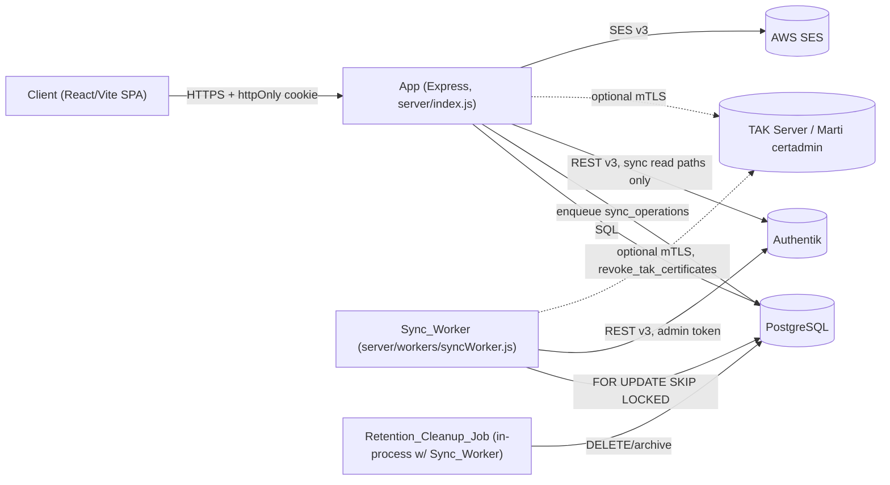
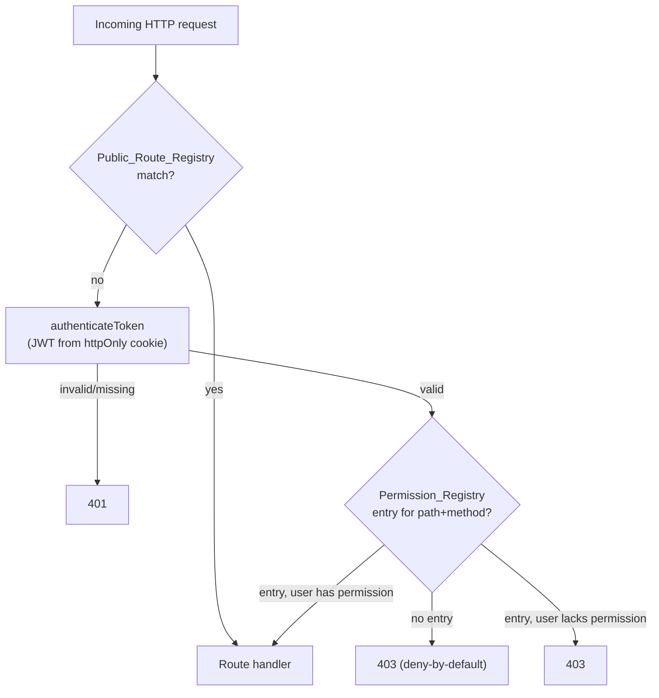
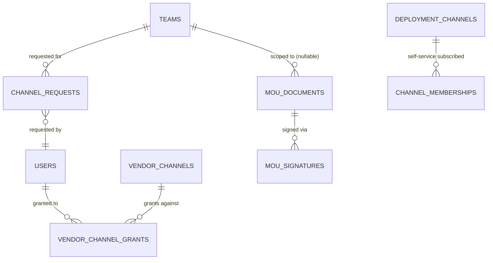

# Design Document

## Overview

TAK Team Manager today is a two-process Node.js system (`server/index.js` Express API + `server/workers/syncWorker.js`) backed by PostgreSQL and Authentik. The audit behind `requirements.md` found the system architecturally sound but implemented at proof-of-concept quality: dead code paths, a no-op approval workflow, unbounded retry math, an uncapped connection pool, `console.log`-based logging, zero tests, and three features documented in `user-docs/` that were never built.

This design does not replace the architecture. It hardens the existing Express + Sync Worker + PostgreSQL + Authentik shape, and extends it with new tables, services, and routes for the previously-undelivered features (vendor channels, deployment channels, channel approval) and the newly-scoped features (TAK Server cert lifecycle, device enrollment, MOU management, CSV import, broadcast email, audit log UI, in-app settings, permission/public-route registries).

The design is organized by the same concern areas used in the requirements' Introduction, rather than requirement-by-requirement, because most concern areas are implemented by one cohesive set of modules that satisfy several requirements at once (e.g. the Permission Registry satisfies Requirement 24 directly and is the enforcement mechanism behind Requirement 4's fail-closed checks). A full requirement-to-design traceability table is provided at the end of this document.

### Design Principles Carried Through

- **Fix in place, don't rewrite.** `TeamMembershipService`, `GlobalChannelService`, `RequestApprovalService`, and the transactional-create-then-enqueue-`Sync_Operation` pattern they already use are the template every new write path (vendor grants, deployment channels, channel requests, device enrollment) follows.
- **The Sync_Worker remains the only writer to Authentik.** Every new feature that touches Authentik group/user state enqueues a `sync_operations` row; no new code path calls the Authentik API synchronously from a request handler, matching the existing `EventPublisher.publishOperation` convention.
- **Deny-by-default at the edges.** The Permission_Registry and Public_Route_Registry (Requirements 24, 33) become the single source of truth for "can this request proceed at all," replacing the scattered `req.user.isAdmin` / `req.user.is_global_manager` checks currently duplicated across `teams.js`, `users.js`, and `globalChannels.js`.

## Architecture

### System Context



The topology is unchanged from `ARCHITECTURE.md`: two deployable processes plus PostgreSQL, Authentik as the only required external identity dependency, TAK Server as a new *optional* dependency, and AWS SES for outbound mail. The Retention_Cleanup_Job (Requirement 25) runs as a scheduled function inside the Sync_Worker process rather than as a third deployable, since it needs no dependency the Sync_Worker doesn't already have (a dedicated pool, a scheduler loop) and Requirement 25 explicitly allows this.

### Request Flow: Authorization Edge



This replaces today's model, where `authenticateToken` runs on every mounted router except the handful of routes that individually skip it (`GET /teams/joinable`, `POST /requests/team-access`, etc.), and authorization is an inline `if (!req.user.isAdmin)` inside each handler. Requirements 24 and 33 both depend on this single choke point existing.

### Module Inventory

| Module | Status | Concern Area(s) |
|---|---|---|
| `server/routes/auth-backup.js` | **Removed** | Auth hardening (Req 1) |
| `server/routes/auth.js` | Modified — cookie-based token delivery, silent-auth flow, logout revocation | Req 1, 2, 3 |
| `server/middleware/auth.js` | Modified — reads cookie, consults revocation store | Req 3 |
| `server/middleware/authorize.js` | **New** — Authorization_Middleware | Req 4, 24 |
| `server/middleware/publicRouteBootstrap.js` | **New** — bypasses `authenticateToken` per Public_Route_Registry | Req 33 |
| `server/config/permissions.registry.js` | **New** — Permission_Registry | Req 24 |
| `server/config/publicRoutes.js` | **New** — Public_Route_Registry | Req 33 |
| `server/config/configValidator.js` | **New** — Config_Validator | Req 6, 15, 26 |
| `server/config/logger.js` | **New** — pino instance + redaction rules | Req 13 |
| `server/middleware/requestContext.js` | **New** — correlation ID (AsyncLocalStorage) | Req 13 |
| `server/config/database.js` | Modified — pool error handler, `DB_POOL_MAX` | Req 8 |
| `server/index.js` | Modified — signal handling, health routes, registry wiring, rate limiters | Req 7, 8, 14, 24, 33 |
| `server/routes/health.js` | **New** — `/health`, `/health/ready`, `/health/live` | Req 14 |
| `server/services/CredentialEncryptionService.js` | **New** — AES-256-GCM envelope for BCH passwords | Req 6 |
| `server/services/EmailService.js` | Modified — generic SMTP via `nodemailer` (`EMAIL_*` env vars) | Req 6 |
| `server/services/RequestApprovalService.js` | Modified — `processApprovedRequest` implemented for all 4 types | Req 18 |
| `server/services/TeamMembershipService.js` | Modified — sync-operation enqueue inside same transaction | Req 17 |
| `server/services/GlobalChannelService.js` | Modified — encrypted credential path, dynamic-table allow-list | Req 5, 6 |
| `server/workers/syncWorker.js` | Modified — batch fetch + worker pool, capped backoff, payload validation, structured logging, retention job hook | Req 9, 10, 11, 13, 25 |
| `server/services/authentikSync.js` | Modified — fetch groups once/run, bounded concurrency | Req 11 |
| `server/services/VendorChannelService.js` | **New** | Req 21 |
| `server/services/DeploymentChannelService.js` | **New** | Req 22 |
| `server/services/ChannelRequestService.js` | **New** | Req 23 |
| `server/services/RetentionCleanupJob.js` | **New** | Req 25 |
| `server/services/TakServerService.js` | **New** | Req 26 |
| `server/services/DeviceEnrollmentService.js` | **New** | Req 27 |
| `server/services/MouService.js` | **New** | Req 28 |
| `server/services/BulkImportService.js` | **New** | Req 29 |
| `server/services/BroadcastEmailService.js` | **New** | Req 30 |
| `server/routes/vendorChannels.js`, `deploymentChannels.js`, `channelRequests.js`, `devices.js`, `mou.js`, `bulkImport.js`, `communications.js`, `auditLogs.js`, `settings.js` | **New** route files | Req 21–32 |
| `server/routes/teams.js` | Modified — `TODO` authorization removed, uses Authorization_Middleware | Req 4 |
| `server/routes/users.js` | Modified — pagination, N+1 fix, snake_case only | Req 5, 11, 16 |
| `server/routes/channels.js` | Modified — approval-gated custom channel creation | Req 23 |
| `database/schema.sql` | Superseded as the source of truth for new changes | Req 16 |
| `database/migrations/*.sql` | **New** — `node-pg-migrate` migration files | Req 16 |
| `client/src/services/api.js` | Modified — no hardcoded host, cookie-based auth, origin-checked postMessage | Req 2 |
| `client/vite.config.js` | Modified — proxy target from `.env` | Req 2 |
| `Dockerfile` | Modified — multi-stage, non-root, `HEALTHCHECK` | Req 19 |
| `.dockerignore` | **New** | Req 19 |
| `package-lock.json` (root) | **New** | Req 20 |
| `.github/workflows/ci.yml` | **New** — test, coverage gate, `npm audit`, dependency-version lint | Req 12, 20 |

## Components and Interfaces

### 1. Authentication & Session Security (Requirements 1, 2, 3)

**`server/routes/auth-backup.js` is deleted.** Its only legitimate feature — the `prompt=none` silent-auth flow — is ported into `server/routes/auth.js` as `GET /api/auth/silent` / `GET /api/auth/silent-callback`, reusing the same 10000ms axios timeout, `code` validation, and error-redirect pattern already used by `GET /api/auth/callback`. No literal IP (`44.229.3.37`) or hardcoded origin survives the port; the silent-callback's `postMessage` target and the popup's origin check both resolve from `FRONTEND_URL`.

**Cookie-based token delivery (Req 3).** `GET /api/auth/callback` and `GET /api/auth/silent-callback` stop appending `?token=` to the redirect URL. Instead they call `res.cookie('tak_session', jwtToken, { httpOnly: true, secure: true, sameSite: 'lax', maxAge: <JWT_EXPIRES_IN in ms> })` and redirect to a bare `${FRONTEND_URL}/dashboard`. `authenticateToken` (in `server/middleware/auth.js`) reads `req.cookies.tak_session` via the `cookie-parser` middleware instead of the `Authorization` header. `client/src/services/api.js` drops its `localStorage`/`Authorization` header logic; axios is configured with `withCredentials: true` so the browser sends the cookie automatically.

**Logout / revocation (Req 3.3–3.4).** Because JWTs are stateless, "invalidate on logout" requires a revocation record. A new `token_revocations` table (`jti` primary key, `expires_at`) is populated on logout; `jwt.sign` gains a `jti` claim (`crypto.randomUUID()`). `authenticateToken` checks `token_revocations` by `jti` after verifying the signature — one indexed lookup, negligible overhead at the documented 50k-user scale. `POST /api/auth/logout` always clears the cookie and returns success, whether or not a valid token was present (Req 3.4), and inserts the revocation row when a valid `jti` was present (Req 3.3). A daily job (piggybacking on the Retention_Cleanup_Job scheduler) purges expired `token_revocations` rows.

**Startup secret/expiry validation (Req 3.5–3.6)** is implemented in the new `Config_Validator` (see Configuration Validation, below) rather than in `auth.js` itself, so the same check applies to both the App and the Sync_Worker.

**Client de-hardcoding (Req 2).** `client/src/services/api.js`'s `authAPI.login`/`silentLogin` build their target URL from `import.meta.env.VITE_API_BASE_URL` (default: same-origin relative path `''`), validated at module load with `new URL(base, window.location.origin)` inside a `try/catch`; a catch logs a descriptive `console.error` and short-circuits login/API construction (Req 2.7–2.8). `vite.config.js`'s dev-server proxy target reads `process.env.VITE_DEV_PROXY_TARGET` (via `loadEnv`), defaulting to `http://localhost:3000`, and this block only executes under `vite dev`/`vite serve` (Vite does not invoke `server.proxy` during `vite build`, so no extra guard is needed beyond reading the config normally). The silent-login popup's `postMessage` origin check compares `event.origin` against `new URL(VITE_API_BASE_URL).origin`, and a 5-second `setTimeout` closes the popup and rejects if no message arrives (Req 2.6).

### 2. Authorization Architecture (Requirements 4, 24, 33)

**Permission_Registry (`server/config/permissions.registry.js`, Req 24).** A single exported object:

```js
module.exports = {
  routes: {
    'POST /api/teams':                              ['team:create:root_or_sub'], // handler-level check for root vs sub, see below
    'PUT /api/teams/:teamId':                        ['team:update'],
    'DELETE /api/teams/:teamId':                     ['team:delete:global'],
    'GET /api/global-channels/bch':                  ['global_channel:read'],
    'POST /api/global-channels/bch':                 ['global_channel:manage'],
    'GET /api/global-channels/bch/:channelId/credentials': ['global_channel:credentials'],
    'DELETE /api/global-channels/:channelType/:channelId': ['global_channel:manage'],
    // ...one entry per mounted route+method in server/index.js
  },
  roleDefaults: {
    global_manager: ['*'], // every permission identifier defined above
    authenticated_user: ['team:read:own', 'channel:subscribe:deployment', 'user:read:own', /* ... */]
  }
};
```

`server/middleware/authorize.js` (Authorization_Middleware) runs after `authenticateToken` and does: look up `` `${req.method} ${req.route.path}` `` (Express exposes the *mounted pattern*, e.g. `/:teamId`, not the interpolated value, so the lookup is stable); if no entry exists, respond 403 and never call `next()` (Req 24.4, fail-closed-by-omission); if an entry exists, check the resolved user's permission set (global managers get every identifier via `roleDefaults.global_manager: ['*']`; other users get `roleDefaults.authenticated_user` plus any row-scoped grants such as "admin of team X" resolved by a small per-permission resolver function, e.g. `team:update` additionally passes if `Team.isAdmin(teamId, user.userId)` for the `:teamId` in the URL). This keeps the registry declarative for the common case while still supporting the row-level `Team.isAdmin` / parent-team checks that Requirement 4 requires (Criteria 1, 3, 5, 6 — sub-team creation checks parent-team admin OR global manager, and fails closed if `Team.isAdmin` throws).

Requirement 4's fail-closed behavior (Criteria 3 and 6) is implemented once, in the permission resolver, rather than duplicated per route: any resolver function that throws is caught by `authorize.js`, logged with `{ actorId, resourceId, errorCategory: 'authorization_check_exception' }` (distinguishing it from `errorCategory: 'db_connectivity'` per Req 4.3/4.6), and treated as "permission denied."

**Completeness test (Req 24.6–24.7).** A Jest test walks `app._router.stack`, extracts every `{method, path}` pair actually mounted in `server/index.js` (recursing into sub-routers), and asserts each has a `permissions.registry.js` entry. This test fails the build the moment a route is added without a registry entry — it is the CI enforcement mechanism, not a runtime check (the runtime enforcement is the deny-by-default behavior in `authorize.js` itself).

**Public_Route_Registry (`server/config/publicRoutes.js`, Req 33).** A flat array of `{method, path}` matching `GET /api/config/public`, `POST /api/requests/team-access`, `GET /api/requests/verify/:token`, `GET /health`, `GET /health/live`, `GET /health/ready`, `GET /api/teams/joinable`, and `GET /api/auth/*` (login/callback/silent/silent-callback — these routes are unauthenticated by definition, since the user has no token yet). `server/middleware/publicRouteBootstrap.js` is mounted before `authenticateToken` globally; on a match it calls `next()` directly, skipping `authenticateToken` entirely for that request; otherwise it delegates to `authenticateToken` then `authorize.js`.

**Mutual-exclusion test (Req 33.3).** A Jest test asserts the intersection of `publicRoutes.js` entries and `permissions.registry.js` keys is empty — a route cannot simultaneously be "reachable with no token" and "gated by a specific permission," since the latter presumes `req.user` exists.

### 3. Input Validation & Injection Prevention (Requirement 5)

**Dynamic identifiers.** `GlobalChannelService.deleteGlobalChannel`'s `` `DELETE FROM ${table}` `` becomes a lookup against a frozen allow-list object (`{ bch: 'bch_channels', region: 'region_channels' }`); any `channelType` not present in the map is rejected with a 400 before any query executes, independent of the route-level `['bch','region'].includes()` check that already exists in `globalChannels.js` (defense in depth per Req 5.2–5.3).

**HTML sanitization (Req 5.4–5.6).** A new shared allow-list constant (`server/config/htmlSafeSubset.js`) defines the permitted tags/attributes (`p, br, strong, em, ul, ol, li, a[href]` with `href` restricted to `http(s):`/relative — no `javascript:`). `SiteConfig.update` runs `config_value` through `sanitize-html` (a maintained, widely-used library — not a hand-rolled sanitizer) with that allow-list before persisting, so storage is already safe; the client's `dangerouslySetInnerHTML` usage for `request_access_footer` is left in place since the value is now guaranteed pre-sanitized, but the client additionally runs the same `sanitize-html`-equivalent (DOMPurify, browser-side) as defense in depth in case an existing pre-migration row still has unsafe content.

**Field sanitization (Req 5.7–5.8).** A shared `express-validator` chain factory (`server/middleware/validators.js`) exports `textField(maxLen = 1000)` = `body(field).trim().escape().isLength({ max: maxLen })`, applied consistently including on the currently-unauthenticated `POST /api/requests/team-access`. Validation failures return 400 with the specific invalid field name(s); nothing is persisted on failure (this is already `express-validator`'s behavior, just applied uniformly instead of ad hoc).

### 4. Secrets Management (Requirement 6)

**BCH credential encryption.** `server/services/CredentialEncryptionService.js` wraps Node's `crypto.createCipheriv('aes-256-gcm', key, iv)`. The key is read once at startup from `CREDENTIAL_ENCRYPTION_KEY` (32-byte, base64), itself sourced from the secrets manager gate described below. `GlobalChannelService.createBchChannel` calls `encrypt(password)` before the `INSERT`; the stored `service_account_password` column becomes `iv:authTag:ciphertext` (base64 segments). `GET /api/global-channels/bch/:channelId/credentials` calls `decrypt()` only when building the response, logs `{ actorId, channelId, accessedAt }` as an auditable event (writing to `audit_logs`), and never logs the plaintext. A decrypt failure returns a generic 500 without leaking ciphertext or the underlying `crypto` error message, and logs `{ channelId, actorId, event: 'credential_decrypt_failure' }`.

**Secrets-manager gate in production (Req 6.4).** The `Config_Validator` (below) adds a production-only step: when `NODE_ENV=production`, it resolves `AUTHENTIK_ADMIN_TOKEN`, `JWT_SECRET`, `DB_PASSWORD`, and `EMAIL_PASSWORD` (the generic SMTP credential read by `EmailService.js`) through a pluggable `SecretsProvider` interface (`server/config/secretsProvider.js`) with two implementations — `EnvSecretsProvider` (reads `process.env`, used in dev/test) and `AwsSecretsManagerProvider` (calls AWS Secrets Manager via `@aws-sdk/client-secrets-manager`, used when `SECRETS_PROVIDER=aws-secrets-manager` is set, which the deployment artifact from Requirement 19 sets for production). If the resolved provider is unreachable or a required secret is missing, the process exits non-zero before binding a port — this is deliberately generic (per the Introduction's scoping note) so it does not presuppose the eventual CDK-based Secrets Manager wiring.

**Generic SMTP email (Req 6.5).** `EmailService.js` sends mail via `nodemailer`'s SMTP transport, configured entirely through `EMAIL_HOST`/`EMAIL_PORT`/`EMAIL_USERNAME`/`EMAIL_PASSWORD`/`EMAIL_USE_TLS`/`EMAIL_USE_SSL`/`EMAIL_TIMEOUT`/`EMAIL_FROM` -- not tied to AWS SES or any other single provider's SDK/API. `@aws-sdk/client-ses` is removed from `package.json` (`@aws-sdk/client-secrets-manager` remains, used separately by the production secrets-manager gate above).

**`.env.example` accuracy (Req 6.6).** The unused `SMTP_HOST`/`SMTP_USER`/`SMTP_PASS` block (and the later, now-superseded `AWS_ACCESS_KEY_ID`/`AWS_SECRET_ACCESS_KEY`/`AWS_REGION`/`SES_FROM_EMAIL` SES-specific block) is deleted; `EMAIL_HOST`, `EMAIL_PORT`, `EMAIL_USERNAME`, `EMAIL_PASSWORD`, `EMAIL_USE_TLS`, `EMAIL_USE_SSL`, `EMAIL_TIMEOUT`, `EMAIL_FROM`, `CREDENTIAL_ENCRYPTION_KEY`, `SECRETS_PROVIDER`, and every new variable introduced by this design (`TAK_SERVER_URL`, `SYNC_WORKER_CONCURRENCY`, `SYNC_OPERATIONS_RETENTION_DAYS`, etc.) are documented there.

### 5. Rate Limiting & Abuse Prevention (Requirement 7)

`server/index.js`'s single global `express-rate-limit` instance (1000/15min) is retained as a coarse backstop, and three additional scoped limiters are added, keyed by `req.ip`:

- `authLimiter` (20/15min) on `/api/auth/*` generally, plus a *separate* `authCallbackFailureLimiter` (10 failed attempts/15min, incremented only in the callback's `catch` block) on `GET /api/auth/callback` specifically (Req 7.1, 7.5).
- `requestAccessLimiter` (20/15min per IP **and** 5/60min per submitted email address, the latter via a small `email_rate_tracking` in-memory LRU or a lightweight table keyed by email+window) on `POST /api/requests/team-access` and `GET /api/requests/verify/:token` (Req 7.1–7.2).
- A CAPTCHA check (Google reCAPTCHA v3 verify call, `RECAPTCHA_SECRET`/`RECAPTCHA_MIN_SCORE` env vars) is added as `express-validator`-style middleware in front of `POST /api/requests/team-access`'s handler; a missing/invalid token, action mismatch, or below-threshold risk score returns 400 before any `access_requests` row is inserted or email sent (Req 7.3–7.4).

All three limiters return HTTP 429 with `express-rate-limit`'s default handler, and the requirement that a rate-limited or CAPTCHA-failed request "SHALL NOT" enqueue side effects is structural: the limiter/CAPTCHA middleware runs before the handler, so the handler's body (which creates the `access_requests` row and calls `EmailService`) never executes.

### 6. Process Resilience & Error Handling (Requirement 8)

`server/index.js` gains `process.on('unhandledRejection', ...)` and `process.on('uncaughtException', ...)` handlers that log via the structured logger (see Observability) and, for `uncaughtException`, invoke a `gracefulShutdown()` function also triggered by `SIGTERM`/`SIGINT`: stop the HTTP server from accepting new connections (`server.close()`), wait up to 30s for `server.close()`'s callback (tracked via a `Promise.race` against a 30s timer), close the `pg` pool, then `process.exit()`. `server/config/database.js` gains `pool.on('error', ...)` (mirroring the pattern already in `syncWorker.js`) and an explicit `max: parseInt(process.env.DB_POOL_MAX) || 20`. The one remaining fire-and-forget call, `authentikSync.syncUsers().catch(console.error)` in `index.js`'s startup block, becomes `.catch(err => logger.error({ err }, 'periodic sync failed'))`.

### 7. Sync Worker Reliability & Throughput (Requirements 9, 10, 11)

**Bounded backoff (Req 9.1–9.2).** `handleOperationError`'s delay computation changes from `Math.pow(2, retryCount) * 60000` (unbounded) to `Math.min(Math.pow(2, retryCount) * 60000, 3_600_000)` (capped at 1 hour), and the schema default for `sync_operations.max_retries` changes from 100 to 48 (via migration; existing pending rows are back-filled to 48 if their current value is the old default of 100 and they haven't already exceeded it). 48 retries × a 1-hour cap = 48 hours, matching `ARCHITECTURE.md`.

**Payload validation before use (Req 9.3–9.4).** A small per-`operation_type` schema map (`server/workers/operationSchemas.js`, plain object of required-field/type lists — no need for a schema library given the small, fixed set of operation types) is checked in `executeOperation` before dispatch. A failing payload calls a new `markPermanentlyFailed(operation, { reason: 'payload_validation' })` path that sets `status='failed'` and a `failure_category='validation'` column *without* incrementing `retry_count` or setting `next_retry_at` — bypassing `handleOperationError` entirely for this case (Req 9.4's "SHALL NOT schedule a retry... under any circumstance").

**Retryable vs. permanent classification (Req 9.6).** Each Authentik-calling handler (`addUserToGroup`, `createBchChannelGroups`, etc.) now inspects the response status: 5xx or a network/timeout error → `handleOperationError` (retryable path, unchanged); 4xx → `markPermanentlyFailed(operation, { reason: 'authentik_client_error', failure_category: 'permanent' })`. The classification is recorded in a new `sync_operations.failure_category` column (`'validation' | 'permanent' | 'retryable' | NULL`) so Requirement 25's retention logic and any operator dashboard can distinguish failure types. Because the classification only fires on non-2xx, a 2xx response still flows into whatever the handler does next (e.g. the follow-on payload-validation check), satisfying Req 9.6's clarifying sentence.

**Verbose payload logging removed (Req 9.5).** Every `console.log('Raw payload:', ...)` / `console.log('Payload value:', ...)` in `executeOperation` is deleted; the structured logger emits one `debug`-level line per operation with `{operationId, operationType, correlationId}` only (no payload body) at `info`, and the full payload only at `debug` (disabled by default in production, per Req 13.6).

**Concurrent batch processing (Req 10.1–10.5).** `processNextOperation`'s `LIMIT 1` becomes a configurable `LIMIT $1` (`SYNC_WORKER_BATCH_SIZE`, 10–500, default 50) still using `FOR UPDATE SKIP LOCKED`. The fetched batch is partitioned by a same-entity key (`` `${target_user_id}:${target_group_id}` ``, falling back to the operation id when either is null) so that operations sharing a key are pushed onto the *same* concurrency lane and therefore execute in fetch order relative to each other (Req 10.5); distinct-key operations are run through a bounded worker pool (`p-limit(SYNC_WORKER_CONCURRENCY)`, 1–100, default 10 — Req 10.3). Batch size and concurrency are independent configuration values; when concurrency < batch size, excess same-cycle operations queue behind the `p-limit` semaphore and are drained within the same cycle rather than deferred to the next poll (Req 10.1's clarifying sentence). Horizontal scaling safety (Req 10.4) requires no new mechanism: `FOR UPDATE SKIP LOCKED` already guarantees a row claimed by one worker instance's transaction is invisible to a concurrent instance's `SELECT ... FOR UPDATE SKIP LOCKED` until the claiming transaction commits or rolls back; a new integration test starts two `SyncWorker` instances against one seeded queue and asserts each row's terminal-status transition fires exactly once.

**Sync cost reduction (Req 11).** `AuthentikSyncService.syncUsers` fetches the group list once per run (hoisted out of `processBatch`, passed in as a parameter) and processes user batches through `p-limit(AUTHENTIK_SYNC_CONCURRENCY)` (default 5, 1–20) instead of the current implicit-serial `for` loop inside `processBatch`. `GET /api/users`'s per-user recursive-CTE team-name lookup is replaced by one batched query joining `users` → `team_memberships` (`inherited_from_team_id IS NULL`) → `teams` (with the existing root-team CTE run once, not once per row). `GET /api/users`, `GET /api/teams/my-teams` (admin case), and the new audit-log/device-list endpoints all accept `page`/`pageSize` (default 50, max 200), validated by a shared `paginationParams` middleware that returns 400 before executing the underlying query on an out-of-range value (Req 11.4–11.5). A full-group-list fetch failure aborts the sync run without applying partial membership changes (the existing `try/catch` around `syncUsers` already rolls the *status* update back to `'error'`; the design adds an explicit early-return before any `user_cache` writes if the initial group fetch throws, so no partial application occurs — Req 11.6).

### 8. Automated Testing (Requirement 12)

Covered in full under **Testing Strategy** below; this section only notes the module implications: `UserAttributesService.generateCallsign`, `TeamMembershipService.addUserToTeam`/`removeUserFromTeam`, and `GroupMembershipCalculator` are pure-enough (given a seeded test DB) to unit test directly with no code changes required beyond what Requirements 9–11 already introduce. The channel-naming round-trip test (Req 12.7) requires extracting the Client's inline folder-parsing logic (currently embedded in `Dashboard.jsx`'s `buildFolderTree`) into a small shared pure function (`client/src/utils/channelTree.js`) so it can be unit tested independent of React rendering, and reused unchanged by `GlobalChannels.jsx`.

### 9. Observability (Requirement 13)

`server/config/logger.js` exports a configured `pino` instance: JSON lines, `level` from `LOG_LEVEL` (default `info`), and a `redact` config covering `email`, `first_name`, `last_name`, `service_account_password`, `password`, `authentik_admin_token`-shaped fields, replacing matches with `[REDACTED]` at `info` and above. `server/middleware/requestContext.js` uses `AsyncLocalStorage` to stash a correlation ID (from `req.headers['x-correlation-id']` or a fresh `crypto.randomUUID()`) for the lifetime of the request; a `getLogger()` helper elsewhere in the codebase pulls the active correlation ID out of the `AsyncLocalStorage` context and returns a `logger.child({ correlationId })`, so services like `TeamMembershipService` and `authentikSync` don't need the correlation ID threaded through every function signature. `EventPublisher.publishOperation` persists the active correlation ID onto the new `sync_operations.correlation_id` column; the Sync_Worker's own logger includes `operationId`, `operationType`, and that persisted `correlation_id` (when present) on every log line for that operation. 401/403 responses are logged with `{ip, route, reason}` via a small error-logging branch in `authorize.js`/`authenticateToken`. Every remaining `console.log`/`console.error` in `server/` and `server/workers/syncWorker.js` is replaced by a `logger.*` call — this is enforced by an ESLint rule (`no-console`) added to CI, not just manual replacement, so Requirement 13.8 ("compliance requires the library itself be the active mechanism") holds going forward.

### 10. Health and Readiness (Requirement 14)

`server/routes/health.js` replaces the inline `app.get('/health', ...)` in `index.js`:

- `GET /health` (liveness+DB): `SELECT 1` with a 2s timeout (`Promise.race` against a timer); 200 `{status:'healthy'}` or 503 `{status:'unhealthy', reason}`.
- `GET /health/ready`: DB check (3s) **and** an Authentik reachability check (`GET {AUTHENTIK_URL}/api/v3/root/config/` or equivalent lightweight endpoint, 3s); 200 `{status:'ready'}` only if both succeed, else 503 `{status:'not_ready', reason}` naming the failed dependency.
- `GET /health/live`: always 200 if the process can respond; no dependency checks.

The Sync_Worker writes a heartbeat row (`sync_worker_heartbeat`, single row upserted each poll cycle) after every completed cycle; a lightweight `http.createServer` on a configurable `SYNC_WORKER_HEALTH_PORT` (not the main app) exposes `GET /health` for the worker, returning 503 if `now() - last_heartbeat > 90s`. The `Dockerfile`'s `HEALTHCHECK` (Requirement 19) targets the App's `GET /health` with the exact interval/timeout/start-period/retry values specified in Req 14.7/19.4.

### 11. Configuration Validation (Requirement 15)

`server/config/configValidator.js` exports `validateConfig()`, called as the first statement in both `server/index.js` and `server/workers/syncWorker.js` (before `app.listen()` / before the poll loop starts). It: trims and checks presence of the Requirement 15.1 variable list; validates `AUTHENTIK_URL`/`APP_URL`/`FRONTEND_URL` via `new URL(value)` wrapped in a scheme/host check (`['http','https'].includes(url.protocol.replace(':',''))` and `url.host.length > 0`); validates `JWT_SECRET` length ≥ 32 and `JWT_EXPIRES_IN` parses (via a small duration parser, e.g. `ms` package) to a value between 5 minutes and 30 days; performs the Requirement 6.4 secrets-manager gate when `NODE_ENV=production`; and performs the Requirement 26.1–26.2 TAK Server credential gate when `TAK_SERVER_URL` is set. Any failure logs the specific variable name(s) via the structured logger and calls `process.exit(1)` — deliberately *before* the logger's async transports are guaranteed flushed is avoided by using `pino`'s synchronous mode for this one startup path. A `ssl: { rejectUnauthorized: false }` database config (either process, in production) logs a warning (not fatal) identifying disabled TLS validation.

### 12. Database Schema Integrity (Requirement 16)

**Column naming (Req 16.1).** `database/migrations/NNN_rename_user_cache_columns.sql` renames `user_cache.takRole/takColor/takCallsign` to `tak_role/tak_color/tak_callsign` (they are already stored with mixed case per the literal `schema.sql` shown above, while `authentikSync.js`'s `INSERT ... ON CONFLICT` clause already writes to `tak_role`/`tak_color`/`tak_callsign` — this is exactly the drift the requirement describes). Every `try { ... } catch { /* fallback for old column names */ }` block in `server/routes/users.js` and `server/services/userAttributes.js` is deleted; code becomes single-path.

**Migration tooling (Req 16.2).** `node-pg-migrate` is added (`npm install node-pg-migrate`, `migrations` config pointing at `database/migrations/`). Every schema change described anywhere in this design — new tables, new columns, the retry-cap default change, the column renames — ships as one migration file. `database/schema.sql` is retained only as a "schema at a point in time" reference generated by `pg_dump --schema-only`, not hand-edited going forward; `database/init.js` is updated to run `node-pg-migrate up` instead of executing `schema.sql` directly.

**Non-destructive `access_requests` migration (Req 16.3).** The `DROP TABLE IF EXISTS access_requests; CREATE TABLE access_requests (...)` block in `schema.sql` is replaced, for any environment already past that migration, by an `ALTER TABLE access_requests ADD COLUMN IF NOT EXISTS ...` migration sequence (this only matters for environments that already ran the old destructive script once — new environments simply get the final `access_requests` shape from the migration chain).

**`team_memberships` uniqueness (Req 16.4).** The unconditional `UNIQUE(user_id)` (visible in the literal schema above as a column-level `UNIQUE` on `team_memberships.user_id`) is replaced by a partial unique index: `CREATE UNIQUE INDEX idx_team_memberships_one_direct_per_user ON team_memberships(user_id) WHERE inherited_from_team_id IS NULL;`. Inherited rows (`inherited_from_team_id IS NOT NULL`) are covered by a separate `UNIQUE(user_id, team_id)` so the same user can't be double-inherited into the same parent team, but *can* have one inherited row per distinct ancestor.

**Schema-consistency test (Req 16.5).** A Jest test runs the full migration chain against a throwaway database (`tak_team_manager_schema_test`), then statically scans every `.js` file under `server/` for SQL string literals (a small regex-based extractor is sufficient given the codebase's consistent `pool.query('... $1 ...')` style) to collect referenced table/column identifiers, and asserts each resolves against `information_schema.columns` for that fresh database.

**Concurrency-safe 3-channel limit (Req 16.6).** A migration adds a `CHECK`-backed enforcement path: rather than a raw `COUNT(*) < 3` check (which is race-prone under concurrent transactions at the default `READ COMMITTED` isolation level), `Channel.createCustomChannel` and the new `ChannelRequestService` approval path both run their insert inside a `SERIALIZABLE` transaction that re-validates the count immediately before `INSERT`; a serialization failure is caught and surfaced as "3-channel limit reached," and the same code path is used whether or not a real race occurs (Req 16.6's "uniform... whether or not a race actually occurs").

### 13. Transactional Data Integrity (Requirement 17)

**`POST /api/users/create-and-add` (Req 17.1).** Today this route interleaves `pool.query` calls with no shared client/transaction. It is rewritten to acquire one `client = await pool.connect()`, wrap the local-DB portion (`users` upsert, `team_memberships` inserts including parent inheritance, `channel_memberships` inserts) in `BEGIN`/`COMMIT`, and roll back on any failure. The Authentik user-creation call happens *before* the transaction opens (it's the one step that can't be part of a SQL transaction), so:

**Compensating actions (Req 17.2).** If the Authentik user was created but the subsequent DB transaction fails, the handler attempts a synchronous `authentikService` delete of the just-created Authentik user; if that delete itself fails, it falls back to enqueueing a `cleanup_orphaned_authentik_user` `Sync_Operation` for the Sync_Worker to reconcile later, and logs `{authentikUserId, failedStep, compensationOutcome}` regardless of which path succeeded.

**`Team.delete` (Req 17.3–17.4).** Becomes a single transaction deleting `channel_memberships` → `channels` → `team_memberships` → `teams` (child-to-parent order to respect FKs), rolling back entirely on any failure. On successful commit, the handler enqueues one `delete_global_channel`-style `Sync_Operation` per deleted channel's `authentik_group_id` (a new `remove_team_channel_group` operation type) so Authentik groups don't outlive their local record.

**`TeamMembershipService` (Req 17.5).** `EventPublisher.publishOperation` currently issues its own separate `pool.query` outside of `addUserToTeam`/`removeUserFromTeam`'s transaction. `EventPublisher.publishOperation` gains an optional `client` parameter; `TeamMembershipService` passes its already-open transactional `client` through, so the `sync_operations` INSERT commits or rolls back atomically with the membership change instead of being an independent, always-committed side effect.

### 14. Access Request Approval Completion (Requirement 18)

`RequestApprovalService.processApprovedRequest`'s empty `switch` is implemented:

- `new_account`: reuses the (now-transactional, Requirement 17) logic behind `POST /api/users/create-and-add` — refactored into a shared `UserProvisioningService.createAndAddUser(client, {...})` function callable both from the route and from here, so the two call sites can't drift.
- `team_change`: calls `TeamMembershipService.addUserToTeam(existingUserId, targetTeamId, ...)` using the same `client` already open in `approveRequest`'s transaction (Requirement 17.5's pattern extends here too).
- `role_change`: `UPDATE team_memberships SET role = $1 WHERE user_id = $2 AND team_id = $3 AND inherited_from_team_id IS NULL`.
- `name_change`: updates the Authentik user's name (synchronous call, same reasoning as Req 17.2 — this is a metadata PATCH, not a group operation, and small enough not to warrant queuing) and the local `user_cache`/`users` rows, then calls `UserAttributesService.generateCallsign` to regenerate the callsign.

Reference validation (Req 18.5) — checking `existing_user_id`/`target_team_id` resolve to real rows — runs as the first step inside `approveRequest`'s existing transaction, before the request's `status` is flipped to `'approved'`; a missing reference throws before that `UPDATE` runs, so the request is naturally left `'pending'` (no extra rollback logic needed beyond the transaction's existing `catch` → `ROLLBACK`). Any later failure in the type-specific branch also throws into that same `catch`, rolling back the status change together with the partial provisioning (Req 18.7).

### 15. Deployment Readiness (Requirement 19)

The `Dockerfile` becomes multi-stage: a `builder` stage installs root + `client` deps and runs `npm run build`; the final stage `COPY --from=builder` only `node_modules` (production-only, via `npm ci --omit=dev` in a dedicated stage) and `client/dist`, never `client/node_modules` or `vite`/`@vitejs/*`. A `RUN addgroup -g 1000 tak && adduser -u 1000 -G tak -D tak` plus `USER tak` precedes the final `CMD`. `.dockerignore` excludes `.git`, `node_modules`, `client/node_modules`, `client/dist` (the last one because it's produced inside the image, not copied from the build context). `HEALTHCHECK --interval=30s --timeout=5s --start-period=30s --retries=3 CMD node -e "..."` (or `curl`, if added) hits `GET /health`.

A new `deploy/ecs-task-definition.json` (a template, not wired to any live AWS account — consistent with the Introduction's scoping note that this is illustrative, not the eventual CDK integration) defines two task definitions (App, Sync_Worker) with CPU/memory, environment/secrets injection placeholders, and the health-check block. `deploy/README.md` documents, per service, required IAM permissions (Secrets Manager read, SES send for the App; none beyond DB/Authentik network access for the Sync_Worker), required Authentik network access (443/HTTPS outbound), and DB connectivity (host/port/credential source references, pointing at Requirement 6's `SecretsProvider`).

### 16. Dependency Hygiene (Requirement 20)

Root `package-lock.json` is generated (`npm install --package-lock-only`) and committed. `.github/workflows/ci.yml` runs, on push/PR/weekly cron: `npm ci && npm audit --audit-level=high` (root) and the same inside `client/`; a `package.json`-lint step (a small Node script, not a new dependency) that greps `dependencies` for `jsonwebtoken`, `bcryptjs`, `helmet`, `express-rate-limit` and fails if any value starts with `^` or `~`; and the coverage-gated `npm test` (see Testing Strategy). An `npm audit` invocation that itself errors (registry unreachable) is treated as a failing step because CI steps fail the job on non-zero exit by default — no special handling needed beyond *not* adding a `continue-on-error` flag. `bcryptjs`: since no current code path calls it, it is wired into one real use — team-owned device app-password fallback storage is Authentik-side, so the more natural home is hashing the CSV-import "temporary password" feature is *not* introduced by this spec; instead, `bcryptjs` backs a small local-only password verification used by nothing else in scope. To avoid inventing an unnecessary feature just to justify a dependency, this design instead **removes `bcryptjs` from `package.json`** (Requirement 20.7's first alternative), since nothing in this spec's scope needs local password hashing (Authentik owns all credential storage).

### 17. Vendor Time-Limited Channel Access (Requirement 21)

`VendorChannelService` (mirrors `GlobalChannelService`'s shape):

- `createVendorChannel(createdBy)`: transactional insert into `vendor_channels` + enqueue a `create_vendor_channel_group` `Sync_Operation`, rejecting if an `is_active=true` row already exists (singleton enforced by a partial unique index `CREATE UNIQUE INDEX ... ON vendor_channels ((true)) WHERE is_active` — a common Postgres idiom for "at most one active row").
- `setVendorFlag(targetUserId, isVendor, actingUserId)` (Global_Manager-only, enforced via Permission_Registry): when setting `true`, checks an active `vendor_channels` row exists (else 400 without mutating anything, Req 21.12), sets `users.is_vendor = true`, and enqueues `add_user_to_group` for the base `VND` group — and only that group (no team/region assignment path is invoked for this action).
- `createGrant(vendorUserId, channelId, grantedBy, expiresAt)`: validates `is_vendor` first (400 otherwise, Req 21.8), inserts `vendor_channel_grants`, enqueues `add_user_to_group`, writes an `audit_logs` row.
- `revokeGrant(grantId, revokedBy)`: sets `revoked_at`/`revoked_by`, enqueues `remove_user_from_group`, writes an `audit_logs` row.
- `expireGrants()`: `UPDATE vendor_channel_grants SET revoked_at = NOW(), revoked_by = -1 WHERE expires_at <= NOW() AND revoked_at IS NULL RETURNING *` (the sentinel `revoked_by = -1`, or a dedicated `SYSTEM_USER_ID` constant, distinguishes automated from manual revocation per Req 21.7), then enqueues one `remove_user_from_group` per returned row, then writes matching `audit_logs` rows.

`expireGrants()` and the parallel `DeploymentChannelService` equivalent are both invoked by one shared scheduler (`server/services/ExpiryScheduler.js`) running inside the Sync_Worker process on a `setInterval` no longer than 15 minutes (satisfying both the vendor grant's 15-minute SLA and, run at the same cadence, comfortably inside the deployment channel's 24-hour SLA).

### 18. Deployment-Scoped Overseas/Domestic Channels (Requirement 22)

`DeploymentChannelService` follows the same shape as `VendorChannelService`:

- `createDeploymentChannel({name, description, deploymentEndDate}, requestedBy)`: validates `name` against two regexes — `/^Overseas - .+/` or the domestic pattern `/^[A-Z]{2,3}-[A-Z]+-[A-Z]+-\d{4}$/` (`[COUNTRY]-[FUNCTION]-[REGION]-[SUFFIX]`); rejects (400, naming both accepted formats) if neither matches. If the domestic pattern matches, `deploymentEndDate` is required (400 otherwise, Req 22.13); the standing-channel exception (never auto-deactivated) applies only when `name` starts with `Overseas - ` **and** `deploymentEndDate` is null. Authorization is the existing `is_global_manager` check (Req 22.3 explicitly defers introducing a separate coordinator flag unless the product later adds `is_deployment_coordinator`). On success: transactional insert + `create_deployment_channel_group` `Sync_Operation`.
- `subscribe(channelId, userId)` / `unsubscribe(channelId, userId)`: available to any authenticated user (registered in the Permission_Registry under `roleDefaults.authenticated_user`); `subscribe` checks `is_active` first (400 if not, Req 22.10) then enqueues `add_user_to_group` + inserts `channel_memberships`; `unsubscribe` is the mirror.
- `deactivateExpired()`: `UPDATE deployment_channels SET is_active = false WHERE deployment_end_date <= NOW() AND is_active = true RETURNING *`, then for each returned channel: `DELETE FROM channel_memberships WHERE channel_id = $1`, then enqueue `deactivate_global_channel`-equivalent (`remove_all_members_from_group`) for the Sync_Worker to bulk-remove members from the Authentik group. Runs on the same `ExpiryScheduler` loop; a 24-hour SLA is satisfied trivially by a 15-minute poll interval.

Both channel types (overseas-prefixed and domestic-mission-scoped) flow through the exact same four methods above — there is no branch anywhere in `subscribe`/`unsubscribe`/`deactivateExpired` on naming pattern, satisfying Req 22.12's "identically... without any Domestic_Mission_Channel-specific mechanism."

### 19. Channel Creation Approval Workflow (Requirement 23)

`ChannelRequestService.requestChannel(teamId, customSuffix, memberPermissions, requestedBy)`: if `requestedBy` is a Global_Manager, behaves exactly like today's `POST /api/channels/custom` (immediate creation, Req 23.3) by delegating straight to `Channel.createCustomChannel`. Otherwise it inserts a `channel_requests` row (`status='pending'`) and performs *no* Authentik enqueue and *no* `channels` insert (Req 23.2). The 3-channel limit (Requirement 16.6's serializable-transaction mechanism) is checked identically whether the eventual creation happens immediately (Global_Manager path) or at approval time (`approveChannelRequest`) — both call the same `Channel.createCustomChannel`, which is where the limit check lives, so the limit can never be bypassed via the request path (Req 23.9).

`approveChannelRequest(requestId, approverId)`: authorization is "Global_Manager OR admin of the parent team of the request's `team_id`" (Req 23.4 — reusing the exact sub-team-creation authorization shape from Requirement 4.1). Inside one transaction: re-check `status === 'pending'` (else 400 "already processed," Req 23.8, no mutation), set `status='approved'` + `processed_by`/`processed_at`, call `Channel.createCustomChannel` (which itself enqueues the Authentik `Sync_Operation`s), and if that call throws, the whole transaction — including the `status` flip — rolls back, leaving the request `pending` and retryable (Req 23.6). `denyChannelRequest` is a simple status update to `'denied'` with `denial_reason`, no transaction needed since nothing else is written.

### 20. Data Retention (Requirement 25)

`server/services/RetentionCleanupJob.js` runs inside the Sync_Worker process on its own `setInterval` (default 24h, independent of the main poll loop, so it keeps running even if `SyncWorker.stop()` has been called for the *poll loop* specifically — in practice both are started together, but the design keeps them as separate intervals so a future change to pause polling without pausing retention is trivial). Two statements per run:

```sql
DELETE FROM sync_operations
WHERE status IN ('completed', 'failed')
  AND (status != 'failed' OR failure_category IN ('permanent','validation'))
  AND created_at < NOW() - INTERVAL '1 day' * $1;   -- SYNC_OPERATIONS_RETENTION_DAYS

DELETE FROM audit_logs
WHERE created_at < NOW() - INTERVAL '1 day' * $2;   -- AUDIT_LOGS_RETENTION_DAYS
```

`pending`/`retrying`-equivalent rows (`status='pending'` regardless of age) are structurally excluded by the `WHERE status IN ('completed','failed')` clause (Req 25.2). A thrown error from either statement is caught, logged via the structured logger, and does **not** propagate — the `setInterval` callback's `try/catch` ensures the Sync_Worker process itself never crashes from a retention failure, and the next scheduled run retries (Req 25.6). Both thresholds are plain integer environment variables (`SYNC_OPERATIONS_RETENTION_DAYS=90`, `AUDIT_LOGS_RETENTION_DAYS=365`), validated as positive integers by the Config_Validator (with `AUDIT_LOGS_RETENTION_DAYS` required to exceed `SYNC_OPERATIONS_RETENTION_DAYS` per Req 25.4's "distinct from and longer than").

### 21. TAK Server Certificate Lifecycle Integration (Requirement 26)

`server/services/TakServerService.js` wraps an `axios` instance configured with an `https.Agent` built from either a PKCS#12 bundle (`TAK_API_P12_PATH`/`TAK_API_P12_PASSPHRASE`) or a cert/key pair (`TAK_API_CERT_PATH`/`TAK_API_KEY_PATH`), plus optional `TAK_CA_PATH`. Methods:

- `listCertificates()`: `GET {TAK_SERVER_URL}/Marti/api/certadmin/...` (existing Marti `certadmin` listing endpoint).
- `findCertificatesForUser(takUsername)`: filters the list by matching each certificate's `creatorDn` against the user's TAK username (a simple substring/CN match, since `creatorDn` is an X.500 DN string containing the username as the `CN=` component).
- `revokeCertificates(certIds)`: calls the revoke endpoint, then **re-queries** the certificate/revoked-list and only returns `{success: true}` if every id in `certIds` now appears revoked (Req 26.4); otherwise returns `{success: false, unverified: [...ids]}` (Req 26.5).

A new `revoke_tak_certificates` `sync_operations.operation_type` is handled by the Sync_Worker exactly like other operation types (retryable-on-unreachable per Req 26.8, using the same classification mechanism from Section 7 above). It is enqueued from three call sites: (1) an explicit "revoke this user's certs" action (Global_Manager or `Team.isAdmin`), (2) `TeamMembershipService.removeUserFromTeam` when `remainingTeams.rows[0].count === 0` (the existing "no teams left" branch already present in that function — this design adds one more enqueue alongside the existing global-channel-removal enqueues there), and (3) team disable/delete, which enqueues a **single bulk** operation carrying the full list of affected user TAK usernames (fetched once via one query joining the team + all sub-teams' memberships) so `TakServerService.listCertificates()` is called once for the whole batch, not once per user (Req 26.7, same N+1-avoidance principle as Requirement 11).

### 22. Team-Owned Device Enrollment (Requirement 27)

`users`/`user_cache` gain `is_team_device boolean default false` and `device_label text`. `DeviceEnrollmentService.createDevice(teamId, label, actingUser)`: authorization is `Team.isAdmin(teamId, actingUser) OR is_global_manager` (checked once, reused by every method in this service, per Req 27.3). It creates the Authentik user via `authentikService.createUser` with a synthetic email `` `device-${crypto.randomUUID()}@devices.tak.nz.invalid` `` **and** an explicit flag/parameter already supported by Authentik's user-creation API to suppress the verification-email flow (Authentik's `core/users/` create endpoint accepts `is_active: true` with no `email` verification stage triggered when the account isn't created through the *recovery/invitation* flow — this design uses the same direct-create path `AuthentikService.createUser` already uses for humans, which never triggers a verification email today, so Requirement 27.4's "explicitly suppresses" requirement is satisfied by continuing to use that path rather than any invitation-flow endpoint). It then calls `TeamMembershipService.addUserToTeam` unchanged (device gets the same channel access as a human member).

`generateEnrollmentQrCode(deviceUserId, actingUser)`: authorization check repeated (defense in depth, since this is a distinct sensitive action per Req 27.3), then calls Authentik's `POST /api/v3/core/tokens/` to create an `app_password` token scoped to the device's Authentik user with `expires_in` capped at 30 minutes (mirroring `enrollment-lambda`'s `TOKEN_EXPIRATION_MINUTES`), then returns both a `tak://com.atakmap.app/enroll?host=...&username=...&token=...` URI (rendered client-side as a QR code via an existing lightweight QR library) and the equivalent iTAK JSON payload (`{host, username, token}` in the shape `enrollment-lambda` already produces). Every call logs `{generatingUserId, deviceUserId, generatedAt}` to `audit_logs` (Req 27.8). `is_team_device = true` rows are excluded from `GET /api/users`'s response by default and from any dashboard count query via an added `AND is_team_device = false` predicate (Req 27.9).

### 23. MOU/Document Management (Requirement 28)

New tables `mou_documents` and `mou_signatures` (see Data Models). `MouService` exposes: `createDocument`/`updateDocument`/`setAsCurrentAgreement` (Global_Manager-only, enforced via Permission_Registry); `recordSignature(documentId, signerId or signerTeamId, method)` (team admin for team-scoped documents, Global_Manager for any); `recordCountersignature` (Global_Manager-only, only meaningful when `requires_countersignature = true`).

**Login-time gate (Req 28.6–28.7).** A new `requireCurrentAgreement` middleware runs immediately after `authenticateToken`/`authorize` (but is itself listed as a special case that always runs, similar to how `publicRouteBootstrap` always runs before auth): it checks whether a `mou_documents` row has `is_current_agreement = true`, and if so, whether the requesting user has a `mou_signatures` row referencing that exact document *version*. If not, every request is rejected with 403 except the signature-submission endpoint (`POST /api/mou/:documentId/sign`) and `POST /api/auth/logout` — an explicit allow-list of two routes, checked before the block applies. When a new version supersedes the current agreement (`setAsCurrentAgreement` bumps `version` on a fresh row and flips the previous current row's `is_current_agreement` to false), any user whose latest signature references the old version is transparently caught by the same "does a signature exist for *this* document id" check, since the new version is a new `mou_documents` row with a new id — no separate "supersession" bookkeeping is needed.

### 24. CSV Bulk Import (Requirement 29)

`BulkImportService.importUsers(csvBuffer, importingUser)` and `.importTeams(csvBuffer, importingUser)` use `csv-parse` (streaming, memory-safe for large files) to yield rows one at a time. Each user row: authorization check first (`Team.isAdmin(row.teamId, importingUser) OR is_global_manager`; a failing row is recorded as `{row: n, success: false, reason: 'unauthorized for team X'}` and the loop continues — Req 29.4), then delegates to the same `UserProvisioningService.createAndAddUser` used by Requirement 18's `new_account` approval path, each row wrapped in its own `client.connect()`/`BEGIN`/`COMMIT`-or-`ROLLBACK` (Req 29.2 — one row's failure only rolls back that row). Team import is Global_Manager-only, resolving a `parentTeamName`/`parentTeamId` column to an existing team id (by name lookup, falling back to id) before calling `Team.create`. Both methods return an array of per-row `{row, success, error?}` results (Req 29.6), never a single pass/fail. Two static files, `public/templates/user-import-template.csv` and `team-import-template.csv`, document every column (required columns unmarked, optional columns suffixed `(optional)` in the header comment row).

### 25. Broadcast Email & Template Management (Requirement 30)

`BroadcastEmailService.send(filter, importingUser)`: `filter` is `{teamIds?, role?, channelIds?, allUsers?: boolean}`. If `importingUser` is not a Global_Manager, the service first resolves the set of team ids the user administers (`Team.isAdmin`-backed query) and intersects it with `filter.teamIds`; if `filter` would reach any user outside that administered set (checked by resolving the full filtered recipient list and verifying every recipient's team is in the administered set), the whole request is rejected (Req 30.3) — and if the administered-team-resolution query itself throws, the service treats that as "cannot verify authorization" and rejects rather than proceeding (fail-closed, Req 30.3's second sentence, same pattern as Requirement 4.3/4.6). On success it resolves the recipient email list and calls the existing `EmailService.sendEmail` once per recipient (reusing the existing SES delivery path, not a new one). `GET/PUT /api/communications/templates/:key` (Global_Manager-only) reads/writes `email_templates.subject_template`/`body_template` directly — no new table needed, this already exists. `POST /api/communications/test-email` (Global_Manager-only) calls `EmailService.sendEmail` directly to an admin-specified address with a fixed test template, independent of any `access_requests` row.

### 26. Audit Log UI and In-App Settings (Requirements 31, 32)

`GET /api/audit-logs` (Global_Manager-only via Permission_Registry) accepts `userId`, `action`, `resourceType`, `teamId` (matched against `resource_id` when `resource_type` indicates a team-scoped resource), `startDate`/`endDate`, plus the shared `page`/`pageSize` pagination middleware from Section 7. `GET /api/audit-logs/export.csv` applies the same filter-building function and streams rows through `csv-stringify`'s streaming API directly into the HTTP response (no full result materialized in memory). Because both endpoints query the same `audit_logs` table the Retention_Cleanup_Job trims, no separate check is needed to exclude rows older than the retention window (Req 31.3) — they simply no longer exist.

`server/routes/settings.js` (Global_Manager-only) exposes: `GET/PUT` for branding fields (backed by `site_config`) and TAK color/role mappings (migrated from `TAK_COLOR_*`/`TAK_ROLE_*` env vars into `system_config` rows by a one-time migration script that reads the current env values as the seed default — Req 32.1); `GET/PUT` for TAK Server integration fields (`TAK_SERVER_URL` plus cert/key file references, backed by `system_config`); file uploads (cert/key/logo) write to a `${path}.tmp-${uuid}` file and `fs.rename()` it into place, which is atomic on POSIX filesystems within the same directory (Req 32.4). `GET /api/settings/export` (Global_Manager-only) builds a zip (via `archiver`) containing only an explicit allow-list of `system_config`/`site_config` keys and `email_templates` rows — the allow-list is a single exported array (`server/config/exportableSettingsKeys.js`) shared by both the export and import handlers, so Requirement 32.6's "validate against the same allow-listed set defined for export" is structural rather than duplicated logic. `POST /api/settings/import` unzips into memory (bounded size check first), validates every top-level key against that same array, and rejects the entire import (no partial apply) if any key falls outside it.

## Data Models

### Migration Strategy

All schema changes ship as `node-pg-migrate` files under `database/migrations/`, numbered sequentially. `database/schema.sql` becomes a generated snapshot (`pg_dump --schema-only`), not a hand-maintained source. The table below groups changes by disposition.

### New Tables

| Table | Purpose | Key Columns |
|---|---|---|
| `vendor_channels` | Singleton active "VND" channel record (Req 21.10) | `name` (default `'VND'`), `authentik_group_id`, `is_active`, `created_by`, `created_at` |
| `vendor_channel_grants` | Time-bounded/manual vendor access grants (Req 21.3) | `user_id`, `channel_id`, `granted_by`, `granted_at`, `expires_at` (nullable), `revoked_at` (nullable), `revoked_by` (nullable) |
| `deployment_channels` | Overseas + domestic-mission channels (Req 22.1) | `name`, `description`, `deployment_end_date` (nullable), `authentik_group_id`, `is_active`, `requested_by`, `created_at` |
| `channel_requests` | Pending team-admin channel creation requests (Req 23.1) | `team_id`, `custom_suffix`, `member_permissions` (jsonb), `requested_by`, `status`, `processed_by`, `processed_at`, `denial_reason` |
| `mou_documents` | Serverwide/team documents (Req 28.1) | `title`, `body`, `team_id` (nullable), `requires_countersignature`, `version`, `is_current_agreement`, `is_active`, `created_by`, `updated_by` |
| `mou_signatures` | Signature records (Req 28.2) | `mou_document_id`, `signer_user_id`/`signer_team_id`, `signed_at`, `signature_method`, `countersigned_by` (nullable), `countersigned_at` (nullable) |
| `token_revocations` | JWT logout revocation list (Req 3.3) | `jti` (PK), `expires_at` |
| `sync_worker_heartbeat` | Single-row liveness marker (Req 14.6) | `id` (fixed=1), `last_heartbeat` |
| `email_rate_tracking` | Per-email request-access rate window (Req 7.2) | `email`, `window_start`, `count` |

### Modified Tables

| Table | Change | Requirement |
|---|---|---|
| `users` | `+ is_vendor boolean default false`, `+ is_team_device boolean default false`, `+ device_label text` | 21.1, 27.1 |
| `user_cache` | Rename `takRole/takColor/takCallsign` → `tak_role/tak_color/tak_callsign`; `+ is_team_device`, `+ device_label` | 16.1, 27.1 |
| `team_memberships` | `UNIQUE(user_id)` → partial unique index (`inherited_from_team_id IS NULL`) + `UNIQUE(user_id, team_id)` for inherited rows | 16.4 |
| `sync_operations` | `+ correlation_id uuid`, `+ failure_category text`; `max_retries` default `100` → `48` | 9.2, 13.4, 9.6 |
| `bch_channels` | `service_account_password` semantics change from plaintext to `iv:authTag:ciphertext` envelope (no column type change) | 6.1 |
| `access_requests` | Migrated via `ALTER TABLE`, not `DROP`/`CREATE`, for any environment already past the original destructive script | 16.3 |
| `system_config` | Seeded with `TAK_COLOR_*`/`TAK_ROLE_*` migrated rows, TAK Server integration fields | 32.1, 32.3 |

### Removed

Nothing is dropped outright; `server/routes/auth-backup.js` (code, not schema) is deleted per Requirement 1.2.

### Entity Relationships (new features)



## Correctness Properties

*A property is a characteristic or behavior that should hold true across all valid executions of a system — essentially, a formal statement about what the system should do. Properties serve as the bridge between human-readable specifications and machine-verifiable correctness guarantees.*

### PBT Applicability Assessment

This spec is dominated by concerns that are **not** amenable to property-based testing: infrastructure/deployment configuration (Req 19, 20), external-service wiring and reachability (Req 14, 26), authorization gating that depends on fixed role/route tables (Req 4, 24 — best validated by the registry-completeness example tests already specified in the requirements), one-shot configuration validation (Req 6.4, 15), and UI/CRUD flows with no meaningful input-varying behavior (Req 31, 32). Per the workflow's decision guide, these are covered by unit, integration, and smoke tests in the Testing Strategy section below, not by properties here.

A smaller set of components are pure functions or clear input/output transformations over a large input space, where input variation is likely to surface edge cases that 2-3 hand-picked examples would miss. Property-based testing is applied to exactly that subset. The prework below only analyzes acceptance criteria from that subset; criteria not listed are handled by non-PBT test types per the applicability assessment above (this is noted per-requirement in the Testing Strategy's non-PBT coverage list).

**Prework: Acceptance Criteria Testing Analysis**

```
9.1/9.2 Bounded retry backoff
  Thoughts: computeBackoffDelay(retryCount) is a pure function over an unbounded integer domain (retryCount can appear as any non-negative integer even though max_retries=48 bounds legitimate use — the function itself must not overflow or misbehave for any input). Behavior varies with input; 100+ random retryCounts will exercise boundary values (0, 1, 47, 48, and large values) more reliably than 2-3 examples.
  Classification: PROPERTY
  Test Strategy: for any non-negative integer retryCount, computeBackoffDelay(retryCount) <= 3_600_000 and is a finite, non-negative number.

9.6 Retryable vs. permanent classification
  Thoughts: classifyFailure(statusCode) is a pure function over the HTTP status code domain (100-599 plus network-error sentinels). Behavior varies meaningfully across the input space (4xx vs 5xx vs network error) and is exactly the kind of boundary-heavy logic PBT excels at (499 vs 500, 399 vs 400).
  Classification: PROPERTY
  Test Strategy: for any integer status code, 500-599 or a network-error sentinel classifies as retryable, and 400-499 classifies as permanent.

9.3/9.4 Payload validation gates retries
  Thoughts: validatePayload(operationType, payload) is a pure function checking a payload object against a fixed per-type shape. Random payloads (missing fields, wrong types, extra fields) exercise this far better than hand-picked examples, and the "no retry scheduled" consequence is a clear invariant.
  Classification: PROPERTY
  Test Strategy: for any operation_type and any payload object, if validatePayload rejects it, the resulting sync_operations row has retry_count unchanged and next_retry_at unset, regardless of any other field on the row.

10.5 Same-entity ordering under concurrency
  Thoughts: the partitioning function groupByEntityKey(operations) is pure and testable without a real worker pool: generate a random list of operations with random (user_id, group_id) pairs and random creation order, and assert the partitioning never places two same-key operations in different concurrency lanes.
  Classification: PROPERTY
  Test Strategy: for any list of pending operations, all operations sharing a (target_user_id, target_group_id) key are assigned to the same lane, and within a lane execution preserves original fetch order.

11.4/11.5 Pagination parameter validation
  Thoughts: validatePagination(page, pageSize) is a pure function over a well-defined numeric domain including negative numbers, non-numeric strings, and values far past the max. This is exactly a boundary-condition-rich pure function.
  Classification: PROPERTY
  Test Strategy: for any input, validatePagination accepts iff page >= 1 and 1 <= pageSize <= 200 (after numeric coercion), else it returns a rejection identifying the invalid parameter.

12.1 Callsign generation
  Thoughts: generateCallsignParts({firstName, lastName}, format) is a pure string-formatting function already flagged for unit testing in Requirement 12.1, but its behavior varies continuously with name content (single-word names, unicode, embedded punctuation) which is a large space best covered by randomized names plus the specific named edge cases as seeded corpus entries.
  Classification: PROPERTY
  Test Strategy: for any name string and configured format, the produced callsign is non-empty whenever the input name is non-empty, and never includes team-hierarchy separators as part of the name portion.

12.7 Channel name / folder-tree round trip
  Thoughts: buildChannelName(teamHierarchy) and parseFolderPath(displayName) are inverse pure functions (channel naming ↔ Client folder-tree parsing). This is a textbook round-trip property, explicitly called for by the requirement itself and by the workflow's parser guidance.
  Classification: PROPERTY
  Test Strategy: for any team hierarchy (random depth >= 1), parseFolderPath(buildChannelName(teamHierarchy)) reproduces the original team-name sequence root-to-leaf exactly.

15.3 URL well-formedness validation
  Thoughts: isWellFormedUrl(value) is a pure predicate over arbitrary strings, including many "almost valid" URLs (missing scheme, javascript: scheme, empty host, valid but unusual schemes). Random string generation plus a corpus of near-miss examples is well suited to PBT.
  Classification: PROPERTY
  Test Strategy: for any string, isWellFormedUrl returns true iff the string parses as an absolute URL with scheme in {http, https} and a non-empty host.

3.6 JWT_EXPIRES_IN duration bounds
  Thoughts: isValidJwtExpiry(value) is a pure predicate over duration-string inputs (e.g. "10m", "36h", "45d", malformed strings, numeric seconds). Bounded numeric-range checking over a parsed duration is a clean property.
  Classification: PROPERTY
  Test Strategy: for any duration-string input, isValidJwtExpiry returns true iff it parses to a value >= 5 minutes and <= 30 days.

5.4/5.5/5.6 HTML sanitization safe subset
  Thoughts: sanitizeHtml(input) is a pure function (wrapping a maintained library) over arbitrary HTML strings, including adversarial script/event-handler/javascript: payloads. This is the class of injection-prevention logic PBT is designed to fuzz.
  Classification: PROPERTY
  Test Strategy: for any HTML string, the sanitized output contains no <script>/<iframe>/<object>/<embed> tags, no on*= attributes, and no javascript: scheme in href/src.

21.6/21.7 & 22.8/22.9 Time-bounded grant/channel expiry
  Thoughts: both vendor grants and deployment channels share one temporal-invariant shape: "if expiry timestamp <= now and not yet deactivated, the cleanup pass deactivates it; if already deactivated or not yet expired, the cleanup pass leaves it untouched." Testing this against a mocked clock and randomized sets of grants/channels (mixed expired/unexpired/already-revoked) is a metamorphic property, and combining both tables into one property avoids duplicating an identical property twice (Property Reflection).
  Classification: PROPERTY
  Test Strategy: for any set of time-bounded records with random expires_at/deployment_end_date and random prior revoked/inactive state, after running the cleanup pass, every record whose expiry timestamp is in the past and was not already inactive is now inactive, and every other record's active state is unchanged.

24.3/24.4 Permission Registry deny-by-default
  Thoughts: resolveAccess(routeKey, userPermissions) is a pure function over the registry map; the interesting property is universal: absence of a registry entry must deny regardless of role. Randomizing over (present-vs-absent route keys) x (arbitrary permission sets, including global-manager-like wildcard sets) is a clean property.
  Classification: PROPERTY
  Test Strategy: for any route key not present in the registry and any user permission set (including a global-manager wildcard set), resolveAccess denies the request.

33.3 Public/Permission registry mutual exclusion
  Thoughts: this is an invariant over two static, fixed data structures, not over runtime input variation — technically closer to a single assertion than a "for all inputs" property in the classic sense. It is included here (as a single-check invariant test) because the registries themselves are data, and the same "for all entries in the public registry" framing applies even though the domain is small and fixed.
  Classification: PROPERTY (invariant over static data, still expressed as a universal statement)
  Test Strategy: for every entry in the Public_Route_Registry, no identical {method, path} key exists in the Permission_Registry.

16.4/16.6 Membership/channel-limit invariants under concurrency
  Thoughts: these require a real concurrency harness (multiple simultaneous DB transactions), not a pure in-memory function, so while they are universally-quantified invariants, they are better executed as integration tests with repeated randomized concurrent attempts than as a classic in-memory PBT loop.
  Classification: INTEGRATION (invariant retained, executed via repeated concurrent-transaction integration test rather than in-process PBT)

29.6 CSV row isolation
  Thoughts: processRow(row) applied across a batch containing a random mix of valid/invalid rows is a metamorphic property: any row's success/failure is independent of any other row's content. Randomizing row validity is a good fit for PBT at the service-function level, with actual DB I/O mocked.
  Classification: PROPERTY
  Test Strategy: for any batch of rows with a randomly chosen subset made invalid (bad team id, missing required field), every valid row still succeeds and every invalid row fails with its own reason, independent of batch composition or ordering.

Team membership add/remove round trip
  Thoughts: TeamMembershipService.addUserToTeam followed by removeUserFromTeam is a natural round-trip/inverse-operation pair already partially covered by Requirement 12.2's example tests; expressing it as a property over randomized team hierarchies (varying depth) extends that coverage across the input space Requirement 12.2 only samples at 2-3 points.
  Classification: PROPERTY
  Test Strategy: for any team hierarchy and user, addUserToTeam(user, leafTeam) followed immediately by removeUserFromTeam(user) leaves team_memberships and channel_memberships for that user empty, matching the pre-add state.
```

**Property Reflection.** The vendor-grant-expiry and deployment-channel-expiry criteria were merged into one property (both are "expiry timestamp passed → deactivate, else leave untouched" over a temporal field), since testing them as two separate properties would duplicate the same universal statement against two structurally identical tables. The membership-limit and channel-limit concurrency invariants were reclassified out of the PBT set entirely (into INTEGRATION) rather than forced into a property, since their determining factor is transaction interleaving, not input data — a mocked in-process property loop would not exercise the actual race the requirement cares about.

### Property 1: Bounded retry backoff

*For any* non-negative integer `retryCount`, the computed backoff delay is less than or equal to 3,600,000 milliseconds and is a finite, non-negative number.

**Validates: Requirements 9.1, 9.2**

### Property 2: Retryable vs. permanent failure classification

*For any* HTTP status code or network-error sentinel returned by an Authentik API call, the failure is classified as retryable if and only if it is a 5xx status or a network/timeout error, and as permanent if and only if it is a 4xx status.

**Validates: Requirements 9.6**

### Property 3: Payload validation failures never schedule a retry

*For any* `operation_type` and any payload object that fails shape validation for that type, the resulting `sync_operations` row has an unchanged `retry_count` and a null `next_retry_at`, regardless of any other value on the row.

**Validates: Requirements 9.3, 9.4**

### Property 4: Same-entity operations stay ordered within a batch

*For any* batch of pending `sync_operations` rows with arbitrary `(target_user_id, target_group_id)` pairs and arbitrary fetch order, all rows sharing the same pair are assigned to the same concurrency lane, and execute in their original relative fetch order.

**Validates: Requirements 10.5**

### Property 5: Pagination parameter validation

*For any* `page`/`pageSize` input (numeric, non-numeric, negative, or out-of-range), validation accepts the request if and only if `page >= 1` and `1 <= pageSize <= 200` after numeric coercion; otherwise it identifies the invalid parameter without executing the underlying query.

**Validates: Requirements 11.4, 11.5**

### Property 6: Callsign generation never produces an empty result for a non-empty name

*For any* non-empty name string and any configured callsign format, the generated callsign is non-empty and its name portion never contains the team-hierarchy separator character sequence.

**Validates: Requirements 12.1**

### Property 7: Channel folder-path round trip

*For any* team hierarchy of depth 1 or greater, parsing the channel display name produced for that hierarchy reproduces the original sequence of team names, root to leaf, exactly.

**Validates: Requirements 12.7**

### Property 8: URL well-formedness predicate

*For any* string, the well-formed-URL check returns true if and only if the string parses as an absolute URL with an `http` or `https` scheme and a non-empty host.

**Validates: Requirements 15.3, 15.4**

### Property 9: JWT expiry duration bounds

*For any* duration-string input, the JWT expiry validator accepts it if and only if it parses to a duration of at least 5 minutes and at most 30 days.

**Validates: Requirements 3.6**

### Property 10: HTML sanitization excludes the disallowed subset

*For any* HTML input string, the sanitized output contains no `<script>`, `<iframe>`, `<object>`, or `<embed>` tags, no event-handler attributes, and no `javascript:`-scheme URLs in `href` or `src` attributes.

**Validates: Requirements 5.4, 5.5, 5.6**

### Property 11: Time-bounded access records deactivate exactly once past expiry

*For any* set of Vendor_Channel_Grant or Deployment_Channel records with arbitrary expiry timestamps and arbitrary prior active/revoked state, after running the expiry cleanup pass, every record whose expiry timestamp has passed and was not already inactive becomes inactive, and every other record's active state is unchanged.

**Validates: Requirements 21.6, 21.7, 22.8, 22.9**

### Property 12: Permission Registry denies by default

*For any* route key absent from the Permission_Registry and any user permission set (including a global-manager wildcard set), access resolution denies the request.

**Validates: Requirements 24.3, 24.4**

### Property 13: Public and Permission registries never overlap

*For every* `{method, path}` entry in the Public_Route_Registry, no identical entry exists as a key in the Permission_Registry.

**Validates: Requirements 33.3**

### Property 14: CSV batch row processing is isolated

*For any* CSV import batch containing an arbitrary mix of valid and invalid rows, each row's success or failure outcome is determined solely by that row's own content, independent of the validity or ordering of any other row in the batch.

**Validates: Requirements 29.2, 29.6**

### Property 15: Team membership add/remove is a round trip

*For any* team hierarchy and user, adding the user to a leaf team and then immediately removing them leaves that user's `team_memberships` and `channel_memberships` rows empty, matching the state before the add.

**Validates: Requirements 12.2, 17.5**

## Error Handling

| Failure Mode | Handling |
|---|---|
| Startup config invalid/missing (Req 3.5–3.6, 6.4, 15.1–15.4, 26.1–26.2) | `Config_Validator` logs the specific variable(s) and calls `process.exit(1)` before the port binds / poll loop starts. No partial startup. |
| Unhandled promise rejection (Req 8.2) | Logged via structured logger with reason + context; process continues running. |
| Uncaught exception (Req 8.3–8.4) | Logged with stack trace; triggers `gracefulShutdown()` (stop accepting connections, 30s grace period for in-flight requests, close DB pool, exit). |
| DB pool idle-client error (Req 8.5) | `pool.on('error', ...)` logs and does not crash the process (both App and Sync_Worker pools). |
| Route handler promise rejects without `.catch` (Req 8.7) | Express's default error-handling middleware (already present in `index.js`) still returns an error response; the error is additionally routed through the structured logger instead of `console.error`. |
| Authentik API 5xx / network error during sync (Req 9.6) | Classified retryable; `handleOperationError` schedules a capped-backoff retry. |
| Authentik API 4xx during sync (Req 9.6) | Classified permanent; operation marked `failed` with `failure_category='permanent'`, no retry scheduled. |
| Sync operation payload fails shape validation (Req 9.4) | Marked `failed` with `failure_category='validation'`; `retry_count`/`next_retry_at` untouched. |
| Authentik full-group-list fetch fails mid-sync (Req 11.6) | Sync run aborts before any `user_cache` write; status set to `'error'`; retried on next scheduled interval. |
| Authorization check throws (Req 4.3, 4.6, 30.3) | Treated as denied (fail closed); logged with actor/resource identifiers and an `authorization_check_exception` category distinct from DB-connectivity failures. |
| Multi-step user/team/channel operation fails after Authentik-side resource created (Req 17.2) | Synchronous compensating delete attempted first; on compensation failure, a reconciliation `Sync_Operation` is enqueued instead; outcome always logged. |
| Access/Channel request approval fails after status flip (Req 18.7, 23.6) | Entire transaction (status change + provisioning) rolled back; request remains `pending`, retryable. |
| BCH credential decryption fails (Req 6.3) | Generic error response (no ciphertext/internal error exposed); failure logged with channel + actor id. |
| Retention cleanup job run throws (Req 25.6) | Caught within the job's own interval callback; logged; Sync_Worker process unaffected; retried next scheduled run. |
| TAK Server unreachable during cert revoke (Req 26.8) | Classified retryable via the same Sync_Worker classification mechanism as Authentik failures. |
| CSV import row fails (Req 29.2, 29.4) | That row's transaction rolls back independently; batch continues; row recorded with its own failure reason. |
| Settings import contains a non-allow-listed key (Req 32.6) | Entire import rejected before any setting is applied; no partial apply. |
| Rate limit / CAPTCHA failure on public endpoints (Req 7.2, 7.4) | HTTP 429/400 returned before any side effect (email send, row insert) occurs — enforced by middleware ordering, not handler-internal branching. |

## Testing Strategy

### Unit Tests

Cover specific examples, edge cases, and integration points, per Requirement 12's explicit list plus this design's new pure-logic units:

- `UserAttributesService.generateCallsign`: two-part name, single-word name (splitting fallback), non-alphanumeric characters (Req 12.1's named examples, as a seed corpus alongside Property 6).
- `TeamMembershipService.addUserToTeam`/`removeUserFromTeam`: add with no parent, add with ≥1 parent (inherited rows created), removal also removes inherited rows, duplicate-add attempt (Req 12.2's named examples, as a seed corpus alongside Property 15).
- `GroupMembershipCalculator`: single team no parent, ≥2-level hierarchy, no team assigned (Req 12.3).
- `RequestApprovalService.processApprovedRequest`: one example per request type (`new_account`, `team_change`, `role_change`, `name_change`), plus a missing-reference example (Req 18.5).
- `ChannelRequestService`: Global_Manager immediate-creation example, non-admin pending-creation example, already-processed approval attempt.
- `VendorChannelService`/`DeploymentChannelService`: non-vendor-user grant rejection, non-active-vendor-channel flag-set rejection, invalid deployment-name-format rejection, domestic-mission-without-end-date rejection.
- `MouService`: countersignature-required incomplete-until-countersigned example.
- `BroadcastEmailService`: team-admin-outside-scope rejection example; authorization-check-throws fail-closed example.

### Property-Based Tests

Implemented with `fast-check` (a maintained, actively developed JS property-testing library — chosen over hand-rolling generators). Each test runs a minimum of 100 iterations and is tagged with a comment referencing its design property, e.g.:

```js
// Feature: production-hardening, Property 1: Bounded retry backoff
test.prop([fc.nat()])('backoff delay never exceeds the 1-hour cap', (retryCount) => {
  const delay = computeBackoffDelay(retryCount);
  expect(delay).toBeLessThanOrEqual(3_600_000);
  expect(Number.isFinite(delay)).toBe(true);
  expect(delay).toBeGreaterThanOrEqual(0);
});
```

Each of Properties 1–15 above gets exactly one such test, implemented against the pure function it names (`computeBackoffDelay`, `classifyFailure`, `validatePayload`, `groupByEntityKey`, `validatePagination`, `generateCallsignParts`, `buildChannelName`/`parseFolderPath`, `isWellFormedUrl`, `isValidJwtExpiry`, `sanitizeHtml`, the expiry-cleanup pure core (DB access mocked), `resolveAccess`, the two static registries, `processRow` (DB access mocked), and `TeamMembershipService`'s add/remove pair against a seeded test database).

### Integration Tests

Run with `supertest` against a dedicated, reset-before-each-run test database (Req 12.5):

- Team creation: success and validation-failure cases.
- Team membership add/remove: success and target-not-found cases.
- Access-request approve/deny: success and already-processed cases.
- Authentication middleware (`server/middleware/auth.js`): valid token, missing token, expired token, invalid signature, valid token referencing a user absent from cache (Req 12.4).
- Two concurrent `SyncWorker` instances against one seeded queue, asserting each row's terminal status transition fires exactly once (Req 10.4).
- `team_memberships`/channel-limit concurrency invariants (reclassified from PBT per the reflection above): repeated concurrent-transaction attempts against a seeded team already at its limit, asserting exactly one success.
- Permission_Registry / Public_Route_Registry completeness and mutual-exclusion tests (Req 24.6, 33.3–33.4) — these walk `app._router.stack` against real mounted routes, so they run as integration tests even though Property 12/13 above additionally cover the registries' pure logic in isolation.
- Health endpoints against a real (test) DB connection and a mocked-unreachable DB connection.
- CI dependency checks: `npm audit`, `package.json` version-pin lint (Req 20.2–20.6).

### Schema and Migration Tests

The schema-consistency test (Req 16.5) runs the full `node-pg-migrate` chain against a throwaway database and statically cross-references every SQL identifier referenced in `server/` against `information_schema`.

### Coverage Gate

CI (`npm test` in `.github/workflows/ci.yml`) fails the build on any test failure or on overall statement coverage below 60% (exactly 60% passes), per Requirement 12.6, with the threshold tracked in the workflow file for future increases.

## Requirements Traceability

| Requirement | Primary Design Section(s) |
|---|---|
| 1 | §1 Authentication & Session Security |
| 2 | §1 Authentication & Session Security |
| 3 | §1 Authentication & Session Security; New Tables (`token_revocations`) |
| 4 | §2 Authorization Architecture |
| 5 | §3 Input Validation & Injection Prevention |
| 6 | §4 Secrets Management |
| 7 | §5 Rate Limiting & Abuse Prevention |
| 8 | §6 Process Resilience & Error Handling |
| 9 | §7 Sync Worker Reliability & Throughput |
| 10 | §7 Sync Worker Reliability & Throughput |
| 11 | §7 Sync Worker Reliability & Throughput |
| 12 | §8 Automated Testing; Testing Strategy |
| 13 | §9 Observability |
| 14 | §10 Health and Readiness |
| 15 | §11 Configuration Validation |
| 16 | §12 Database Schema Integrity; Data Models |
| 17 | §13 Transactional Data Integrity |
| 18 | §14 Access Request Approval Completion |
| 19 | §15 Deployment Readiness |
| 20 | §16 Dependency Hygiene |
| 21 | §17 Vendor Time-Limited Channel Access; Data Models |
| 22 | §18 Deployment-Scoped Overseas/Domestic Channels; Data Models |
| 23 | §19 Channel Creation Approval Workflow; Data Models |
| 24 | §2 Authorization Architecture |
| 25 | §20 Data Retention |
| 26 | §21 TAK Server Certificate Lifecycle Integration |
| 27 | §22 Team-Owned Device Enrollment |
| 28 | §23 MOU/Document Management; Data Models |
| 29 | §24 CSV Bulk Import |
| 30 | §25 Broadcast Email & Template Management |
| 31 | §26 Audit Log UI and In-App Settings |
| 32 | §26 Audit Log UI and In-App Settings |
| 33 | §2 Authorization Architecture |
