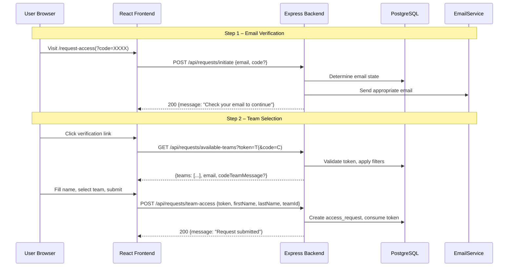
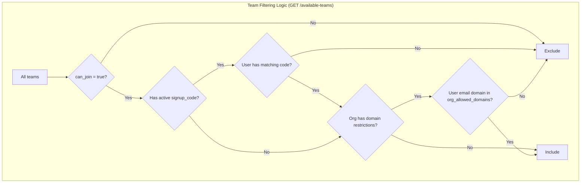
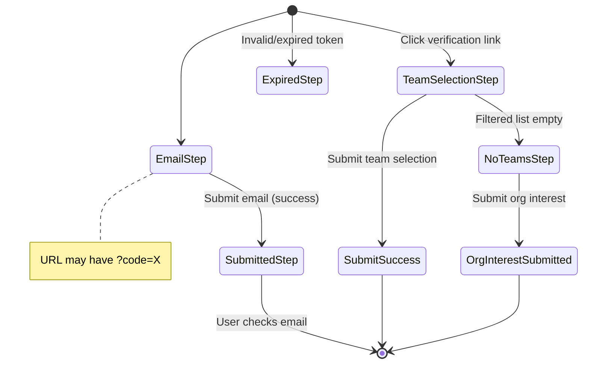
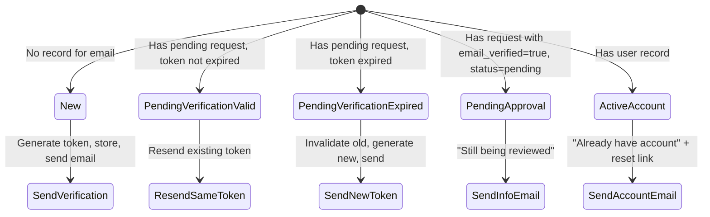

# Design Document: Sign-Up Flow Rework

## Overview

This design transforms the existing single-step public access request flow into a two-step email-verified sign-up flow with sign-up codes, org-level domain restrictions, and an org interest request fallback. The system is built on the existing Express/PostgreSQL/React stack, reusing established patterns (EmailService, RequestApprovalService, permission registry, branded templates).

Key architectural decisions:
- **Stateless token-based step progression**: The verification token in the URL is the sole proof of email ownership. No server-side session is needed between steps.
- **Query-time domain filtering**: Team eligibility is computed at request time by joining against `org_allowed_domains` and the team's ancestor chain, rather than pre-computing or caching eligibility.
- **On-demand asset generation**: QR codes and PDFs are generated server-side on each request, not stored. This avoids stale assets when codes are regenerated.
- **Uniform response pattern**: All email-state branches at Step 1 return identical HTTP 200 responses to prevent enumeration.

## Architecture





## Components and Interfaces

### New Services

#### `SignupCodeService` (`server/services/SignupCodeService.js`)

Responsible for sign-up code lifecycle: generation, validation, revocation, and asset generation (QR, PDF).

```javascript
class SignupCodeService {
  /**
   * Generate a new 8-char code for a team. Replaces any existing code.
   * Retries on unique constraint violation (negligible collision probability).
   * @param {number} teamId
   * @param {number} createdBy - user ID of the admin
   * @returns {Promise<{code: string, formatted: string, url: string}>}
   */
  async generateCode(teamId, createdBy) {}

  /**
   * Revoke (delete) the active code for a team.
   * @param {number} teamId
   * @returns {Promise<void>}
   */
  async revokeCode(teamId) {}

  /**
   * Get the active code for a team, or null.
   * @param {number} teamId
   * @returns {Promise<{code: string, formatted: string, url: string} | null>}
   */
  async getCode(teamId) {}

  /**
   * Look up a code globally. Returns {teamId, code} or null.
   * @param {string} rawCode - 8-char code (no dash)
   * @returns {Promise<{teamId: number, code: string} | null>}
   */
  async resolveCode(rawCode) {}

  /**
   * Generate a QR code PNG buffer for the sign-up URL.
   * @param {string} code - 8-char code
   * @returns {Promise<Buffer>}
   */
  async generateQrPng(code) {}

  /**
   * Generate a branded PDF with QR code, URL, and instructions.
   * @param {string} code - 8-char code
   * @param {string} teamName
   * @returns {Promise<Buffer>}
   */
  async generatePdf(code, teamName) {}

  /**
   * Generate a random 8-char code from the valid character set.
   * @returns {string}
   */
  static generateRandomCode() {}

  /**
   * Format a raw code with a dash (e.g. "4KP7NXRM" → "4KP7-NXRM").
   * @param {string} raw
   * @returns {string}
   */
  static formatCode(raw) {}

  /**
   * Validate that a string matches the code format.
   * @param {string} input - may include optional dash
   * @returns {boolean}
   */
  static isValidCodeFormat(input) {}
}
```

#### `SignupFlowService` (`server/services/SignupFlowService.js`)

Orchestrates the two-step sign-up flow: email state determination, token management, team filtering, and request creation.

```javascript
class SignupFlowService {
  /**
   * Step 1: Process an email submission. Determines email state and sends
   * the appropriate email. Always returns the same response shape.
   * @param {string} email - normalized email
   * @param {string|null} code - optional sign-up code (raw, no dash)
   * @returns {Promise<{message: string}>}
   */
  async initiateSignup(email, code) {}

  /**
   * Get available teams for a verified email.
   * Applies: can_join + code visibility + org domain restrictions.
   * @param {string} token - verification token
   * @param {string|null} code - optional sign-up code from session
   * @returns {Promise<{teams: Array, email: string, codeTeamMessage?: string}>}
   */
  async getAvailableTeams(token, code) {}

  /**
   * Step 2: Create an access request for a verified user.
   * Consumes the verification token.
   * @param {Object} data - {token, firstName, lastName, teamId}
   * @returns {Promise<{requestId: number}>}
   */
  async submitTeamAccess(data) {}

  /**
   * Determine the current state of an email in the system.
   * @param {string} email
   * @returns {Promise<'new'|'pending_verification_valid'|'pending_verification_expired'|'pending_approval'|'active'>}
   */
  async determineEmailState(email) {}
}
```

#### `OrgInterestService` (`server/services/OrgInterestService.js`)

Handles org interest request creation and management.

```javascript
class OrgInterestService {
  /**
   * Submit an org interest request.
   * @param {Object} data - {token, firstName, lastName, orgName}
   * @returns {Promise<{id: number}>}
   */
  async submitRequest(data) {}

  /**
   * Get all org interest requests (for admin panel).
   * @param {Object} filters - {status?: string}
   * @returns {Promise<Array>}
   */
  async listRequests(filters) {}

  /**
   * Update request status (pending → actioned | dismissed).
   * @param {number} requestId
   * @param {string} newStatus
   * @returns {Promise<void>}
   */
  async updateStatus(requestId, newStatus) {}

  /**
   * Check if an email domain is in the excluded list.
   * @param {string} email
   * @returns {Promise<boolean>}
   */
  async isExcludedDomain(email) {}
}
```

### New Routes

#### `server/routes/signup.js`

Public (unauthenticated) routes for the sign-up flow:

| Method | Path | Description |
|--------|------|-------------|
| POST | `/api/requests/initiate` | Step 1: submit email + optional code |
| GET | `/api/requests/available-teams` | Step 2: get filtered team list |
| POST | `/api/requests/team-access` | Step 2: submit team access request |
| POST | `/api/org-interest` | Submit org interest request |

Middleware chain for `/api/requests/initiate`:
1. `requestAccessLimiter` (IP-based rate limit)
2. `verifyCaptcha` (reCAPTCHA v3)
3. express-validator chain
4. handler

#### `server/routes/signupCodes.js`

Authenticated admin routes for sign-up code management:

| Method | Path | Permission | Description |
|--------|------|-----------|-------------|
| POST | `/api/signup-codes/generate` | `signup_code:manage` | Generate code for a team |
| GET | `/api/signup-codes/:teamId` | `signup_code:read` | Get team's active code |
| DELETE | `/api/signup-codes/:teamId` | `signup_code:manage` | Revoke team's code |
| GET | `/api/signup-codes/:teamId/qr` | `signup_code:read` | Download QR PNG |
| GET | `/api/signup-codes/:teamId/pdf` | `signup_code:read` | Download branded PDF |

#### `server/routes/orgDomains.js`

Authenticated admin routes for domain management:

| Method | Path | Permission | Description |
|--------|------|-----------|-------------|
| GET | `/api/orgs/:orgId/domains` | `org:domains:read` | Get org's allowed domains |
| PUT | `/api/orgs/:orgId/domains` | `org:domains:manage` | Update org's allowed domains |
| GET | `/api/admin/excluded-domains` | `admin:excluded_domains:manage` | Get excluded domains |
| PUT | `/api/admin/excluded-domains` | `admin:excluded_domains:manage` | Update excluded domains |
| GET | `/api/admin/org-interest` | `admin:org_interest:read` | List org interest requests |
| PATCH | `/api/admin/org-interest/:id` | `admin:org_interest:manage` | Update request status |

### Permission Registry Additions

```javascript
// signupCodes.js routes
'POST /api/signup-codes/generate': ['signup_code:manage'],
'GET /api/signup-codes/:teamId': ['signup_code:read'],
'DELETE /api/signup-codes/:teamId': ['signup_code:manage'],
'GET /api/signup-codes/:teamId/qr': ['signup_code:read'],
'GET /api/signup-codes/:teamId/pdf': ['signup_code:read'],

// orgDomains.js routes
'GET /api/orgs/:orgId/domains': ['org:domains:read'],
'PUT /api/orgs/:orgId/domains': ['org:domains:manage'],

// admin routes
'GET /api/admin/excluded-domains': ['admin:excluded_domains:manage'],
'PUT /api/admin/excluded-domains': ['admin:excluded_domains:manage'],
'GET /api/admin/org-interest': ['admin:org_interest:read'],
'PATCH /api/admin/org-interest/:id': ['admin:org_interest:manage'],
```

Row-scoped resolvers in `authorize.js`:
- `signup_code:manage` / `signup_code:read`: requires Global_Admin, OR Org_Admin of the team's org, OR Team_Admin of the specific team.
- `org:domains:read` / `org:domains:manage`: requires Global_Admin OR Org_Admin of the specified org.
- `admin:*` permissions: Global_Admin only.

### Client Components

#### New Pages/Components

| Component | Location | Purpose |
|-----------|----------|---------|
| `RequestAccess.jsx` (reworked) | `client/src/pages/RequestAccess.jsx` | Two-step sign-up flow |
| `SignupCodeManager.jsx` | `client/src/components/SignupCodeManager.jsx` | Code management panel for team detail |
| `OrgDomainManager.jsx` | `client/src/components/OrgDomainManager.jsx` | Domain management for org admins |
| `ExcludedDomainsManager.jsx` | `client/src/components/ExcludedDomainsManager.jsx` | Global admin excluded domains |
| `OrgInterestRequests.jsx` | `client/src/components/OrgInterestRequests.jsx` | Global admin org interest panel |

#### RequestAccess Page State Machine



## Data Models

### Database Schema

#### `signup_codes` table

```sql
CREATE TABLE signup_codes (
    id SERIAL PRIMARY KEY,
    team_id INTEGER NOT NULL UNIQUE REFERENCES teams(id) ON DELETE CASCADE,
    code VARCHAR(8) NOT NULL UNIQUE,
    created_by INTEGER NOT NULL REFERENCES users(id),
    created_at TIMESTAMP NOT NULL DEFAULT CURRENT_TIMESTAMP
);

CREATE INDEX idx_signup_codes_code ON signup_codes(code);
```

Design notes:
- `team_id UNIQUE`: enforces at most one active code per team (Req 3.5).
- `code UNIQUE`: enforces global uniqueness (Req 3.2).
- `ON DELETE CASCADE` on `team_id`: deleting a team auto-removes its code.
- No `expires_at` column: codes never expire (Req 3.8).

#### `org_allowed_domains` table

```sql
CREATE TABLE org_allowed_domains (
    id SERIAL PRIMARY KEY,
    org_id INTEGER NOT NULL REFERENCES teams(id) ON DELETE CASCADE,
    domain VARCHAR(255) NOT NULL,
    UNIQUE(org_id, domain)
);

CREATE INDEX idx_org_allowed_domains_org_id ON org_allowed_domains(org_id);
```

Design notes:
- `org_id` references `teams(id)` where the referenced team has `parent_team_id IS NULL` (enforced at application level, not DB constraint).
- `ON DELETE CASCADE`: deleting an org removes its domain entries.

#### `org_interest_requests` table

```sql
CREATE TABLE org_interest_requests (
    id SERIAL PRIMARY KEY,
    email VARCHAR(255) NOT NULL,
    first_name VARCHAR(255),
    last_name VARCHAR(255),
    org_name VARCHAR(255) NOT NULL,
    status VARCHAR(20) NOT NULL DEFAULT 'pending',
    created_at TIMESTAMP NOT NULL DEFAULT CURRENT_TIMESTAMP
);

CREATE INDEX idx_org_interest_requests_email_status ON org_interest_requests(email, status);
```

Design notes:
- No foreign key to `users` since these are unauthenticated submissions.
- `status` values: `'pending'`, `'actioned'`, `'dismissed'`.
- Index on `(email, status)` supports the "at most one pending per email" check.

#### `access_requests` table modification

```sql
ALTER TABLE access_requests
    ADD COLUMN signup_code_used VARCHAR(8);
```

Design notes:
- Nullable: only populated when a sign-up code was used.
- Not a foreign key to `signup_codes.code` because codes can be revoked/regenerated after the request is made (the code value is historical record).

### Email State Machine



The email state is determined by this priority chain (first match wins):
1. `users` table has a row with this email → `active`
2. `access_requests` has a row with `email_verified = true` AND `status = 'pending'` → `pending_approval`
3. `access_requests` has a row with `email_verified = false` AND `email_verification_expires_at > NOW()` → `pending_verification_valid`
4. `access_requests` has a row with `email_verified = false` AND `email_verification_expires_at <= NOW()` → `pending_verification_expired`
5. None of the above → `new`

### Team Filtering Query

The available-teams query combines all filters in a single SQL query:

```sql
SELECT t.id, t.name, t.description,
       CASE 
         WHEN t.parent_team_id IS NOT NULL THEN 
           COALESCE(org.callsign_prefix, org.name, '') || ' - ' || t.name
         ELSE t.name
       END as display_name
FROM teams t
-- Join to find the team's org (root ancestor)
JOIN LATERAL (
    WITH RECURSIVE ancestors AS (
        SELECT id, name, callsign_prefix, parent_team_id FROM teams WHERE id = t.id
        UNION ALL
        SELECT p.id, p.name, p.callsign_prefix, p.parent_team_id
        FROM teams p JOIN ancestors a ON p.id = a.parent_team_id
    )
    SELECT id, name, callsign_prefix FROM ancestors WHERE parent_team_id IS NULL
) org ON true
WHERE t.can_join = true
  -- Code-based visibility filter:
  -- If team has an active code, exclude UNLESS user has that code
  AND (
      NOT EXISTS (SELECT 1 FROM signup_codes sc WHERE sc.team_id = t.id)
      OR EXISTS (SELECT 1 FROM signup_codes sc WHERE sc.team_id = t.id AND sc.code = $1)
  )
  -- Domain restriction filter:
  -- If the org has domain entries, user's domain must match one
  AND (
      NOT EXISTS (SELECT 1 FROM org_allowed_domains oad WHERE oad.org_id = org.id)
      OR EXISTS (SELECT 1 FROM org_allowed_domains oad WHERE oad.org_id = org.id AND oad.domain = $2)
  )
ORDER BY display_name;
```

Parameters: `$1` = user's sign-up code (or NULL/empty), `$2` = user's email domain.

### Sign-Up Code Generation

Character set: `ABCDEFGHJKMNPQRSTUVWXYZ23456789` (30 characters — excludes I, L, O, 0, 1 to avoid ambiguity on printed materials).

Generation algorithm:
1. Generate 8 random characters from the character set using `crypto.randomBytes`.
2. Attempt INSERT into `signup_codes` within a transaction (DELETE old code for team first).
3. On unique constraint violation on `code` column, retry (max 3 attempts).
4. Collision probability: 1/30^8 ≈ 1.5×10⁻¹² per attempt — effectively impossible, but retry handles it.

```javascript
const CHARSET = 'ABCDEFGHJKMNPQRSTUVWXYZ23456789';
const CODE_LENGTH = 8;

static generateRandomCode() {
    const bytes = crypto.randomBytes(CODE_LENGTH);
    let code = '';
    for (let i = 0; i < CODE_LENGTH; i++) {
        code += CHARSET[bytes[i] % CHARSET.length];
    }
    return code;
}
```

Note: `bytes[i] % 30` has a slight modular bias (256 mod 30 = 16, so values 0–15 are ~0.4% more likely). This is acceptable for non-cryptographic code generation where the goal is human-readable uniqueness, not uniform distribution.

### QR Code and PDF Generation

**QR Code**: Use the `qrcode` npm package to generate PNG buffers encoding the full URL `{FRONTEND_URL}/request-access?code={CODE_WITHOUT_DASH}`.

**PDF**: Use `pdfkit` to generate a single-page A4 PDF containing:
- TAK.NZ logo (loaded from `server/assets/logo.png`)
- QR code image (generated in-memory via `qrcode`)
- Full sign-up URL as text
- Brief sign-up instructions

Both are generated on demand per request — not stored.

## Correctness Properties

*A property is a characteristic or behavior that should hold true across all valid executions of a system — essentially, a formal statement about what the system should do. Properties serve as the bridge between human-readable specifications and machine-verifiable correctness guarantees.*

### Property 1: Code generation produces valid format

*For any* invocation of the code generation function, the output must be exactly 8 characters where each character is from the set `ABCDEFGHJKMNPQRSTUVWXYZ23456789`.

**Validates: Requirements 3.1**

### Property 2: Code format validation round-trip

*For any* generated code, formatting it with a dash and then stripping the dash must produce the original code. Conversely, for any valid 8-character code, `formatCode(code)` must produce a string matching `XXXX-XXXX` where both halves are 4 characters from the valid set.

**Validates: Requirements 3.1, 3.11**

### Property 3: Uniform API response for all email states

*For any* email address submitted to the initiate endpoint, regardless of the email's state in the system (new, pending_verification_valid, pending_verification_expired, pending_approval, active), the HTTP response status code must be 200 and the response body must be `{message: "Check your email to continue"}`.

**Validates: Requirements 1.7, 10.1, 10.2, 10.3**

### Property 4: Verification token consumed only on record-creating POST

*For any* valid verification token, any number of GET requests (e.g., `GET /available-teams`) using that token must leave the token valid. A POST request that creates a record (team access or org interest) must invalidate the token so subsequent POST requests with the same token are rejected.

**Validates: Requirements 1.14**

### Property 5: Team filtering — can_join invariant

*For any* team returned by the available-teams endpoint, that team must have `can_join = true` in the database.

**Validates: Requirements 2.2**

### Property 6: Team filtering — code-based visibility

*For any* team with an active sign-up code, that team must NOT appear in the available-teams response UNLESS the request includes a matching code. Conversely, a team with no active sign-up code must appear (subject to other filters) regardless of whether a code is provided.

**Validates: Requirements 2.3, 2.4**

### Property 7: Team filtering — domain restriction enforcement

*For any* org with entries in `org_allowed_domains`, all teams under that org must be excluded from available-teams for a user whose email domain is NOT in the allowed list. Conversely, for any org with NO entries in `org_allowed_domains`, all can_join teams under that org must be eligible regardless of the user's email domain.

**Validates: Requirements 2.5, 2.7, 4.1, 4.2, 4.3**

### Property 8: Domain restrictions apply even with sign-up code

*For any* user with a sign-up code targeting a team in a domain-restricted org, if the user's email domain is not in the org's allowed domain list, the team must NOT appear in available-teams — the code does not bypass domain restrictions.

**Validates: Requirements 2.6**

### Property 9: Excluded domains block only org interest requests

*For any* email whose domain is in the `excluded_email_domains` list, submitting an org interest request must be rejected. However, the same email must NOT be blocked from the team sign-up flow (team access requests proceed normally if other filters pass).

**Validates: Requirements 5.5, 6.3**

### Property 10: At most one active code per team

*For any* team, after any sequence of generate/regenerate operations, the `signup_codes` table must contain at most one row with that team's `team_id`.

**Validates: Requirements 3.5**

### Property 11: At most one pending org interest request per email

*For any* email address, the `org_interest_requests` table must contain at most one row with that email and `status = 'pending'`. A second submission with the same email while a pending request exists must be rejected.

**Validates: Requirements 5.7**

## Error Handling

### Public Endpoints (Unauthenticated)

| Scenario | HTTP Status | Response |
|----------|-------------|----------|
| Invalid email format | 400 | `{errors: [...]}` (express-validator) |
| Missing CAPTCHA token | 400 | `{error: "CAPTCHA verification failed"}` |
| Failed CAPTCHA score | 400 | `{error: "CAPTCHA verification failed"}` |
| Rate limit exceeded (IP) | 429 | `{error: "Too many requests"}` |
| Invalid/expired verification token | 400 | `{error: "This link has expired..."}` |
| Token already consumed | 400 | `{error: "This link has already been used..."}` |
| Team not eligible | 400 | `{error: "Selected team is not available"}` |
| Excluded domain on org interest | 400 | `{error: "Please use an organisational email address"}` |
| Duplicate pending org interest | 409 | `{error: "A request is already pending for this email"}` |
| Internal server error | 500 | `{error: "An error occurred. Please try again."}` |

### Authenticated Admin Endpoints

| Scenario | HTTP Status | Response |
|----------|-------------|----------|
| Not authenticated | 401 | `{error: "Unauthorized"}` |
| Insufficient permissions | 403 | `{error: "Forbidden"}` |
| Team not found | 404 | `{error: "Team not found"}` |
| Team can_join is false (code gen) | 400 | `{error: "Team must have joining enabled"}` |
| Invalid org (not root team) | 400 | `{error: "Domain restrictions can only be set on organisations"}` |
| Invalid domain format | 400 | `{errors: [...]}` |

### Security Error Handling

For the initiate endpoint (`POST /api/requests/initiate`), error responses are carefully designed:
- All email-state branches return HTTP 200 with identical body — no state leakage.
- Validation errors (malformed email, invalid code format) return 400 — these reveal only format rules (public knowledge), not existence.
- Server errors return 500 with a generic message.

## Testing Strategy

### Unit Tests

Unit tests cover specific scenarios and edge cases using the project's existing Vitest setup:

- **SignupFlowService**: Each email state path (new, pending_valid, pending_expired, pending_approval, active). Mock `pool.query` and `EmailService`.
- **SignupCodeService**: Code generation, format validation, revoke, resolve. Mock `pool.query`.
- **OrgInterestService**: Submission, duplicate rejection, excluded domain check. Mock `pool.query`.
- **Team filtering query**: Specific scenarios with known data (team with code + matching user, domain-restricted org, etc.).
- **Route handlers**: Request validation, error responses, middleware integration.

### Property-Based Tests

Property-based tests use `fast-check` (already available in the project's test ecosystem via Vitest) to validate universal correctness properties with 100+ iterations each.

Tests target the pure logic layer (code generation, format validation, team filtering logic) with mocked database access for the stateful properties.

| Property | Test Target | Generator Strategy |
|----------|-------------|-------------------|
| Property 1 (code format) | `SignupCodeService.generateRandomCode()` | Call 100+ times, assert format |
| Property 2 (format round-trip) | `formatCode` / `isValidCodeFormat` | Generate arbitrary 8-char codes from charset |
| Property 3 (uniform response) | `SignupFlowService.initiateSignup()` | Generate emails × all 5 states |
| Property 4 (token consumption) | Token lifecycle logic | Generate sequences of GET/POST operations |
| Property 5 (can_join filter) | Team filtering function | Generate team sets with varying can_join |
| Property 6 (code visibility) | Team filtering function | Generate teams with/without codes × user codes |
| Property 7 (domain filtering) | Team filtering function | Generate orgs with/without domains × user emails |
| Property 8 (code + domain) | Team filtering function | Generate coded teams in restricted orgs |
| Property 9 (excluded domains scope) | Excluded domain check | Generate emails with excluded/non-excluded domains |
| Property 10 (one code per team) | `SignupCodeService.generateCode()` | Generate sequences of generate/regenerate on same team |
| Property 11 (one pending per email) | `OrgInterestService.submitRequest()` | Generate duplicate submissions |

### Integration Tests

Integration tests verify end-to-end flows against a real PostgreSQL database:
- Full sign-up flow: initiate → verify → available-teams → submit
- Code generation → use in sign-up flow
- Domain restriction enforcement across org hierarchy
- QR/PDF generation produces valid output
