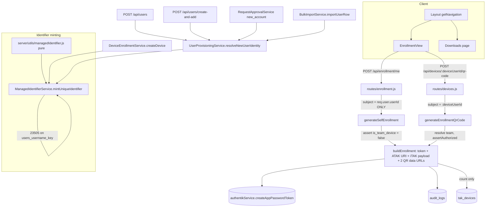

# Design Document: TAK Server Enrollment

## Overview

Takserver_Enrollment folds the standalone Enrollment_Lambda into TAK Team Manager. A signed-in human gets a self-service Enrollment_View for their OWN account — two QR codes, a live countdown, a re-enrollment date, their TAK attributes, the token as text — and a Team_Admin gets the same view for a Team_Owned_Device. The app-store badges move to a new Downloads_Page. Once both exist, the Lambda has nothing left to do.

The backend for the device half already shipped under `production-hardening` Requirement 27 and has never had a user interface (`BUGS.md` BUG-009). This design therefore does three things at once, and it is worth being explicit that they are three different kinds of work:

1. **It corrects the shipped backend** in the four ways the requirements' Corrections section sets out: the `device-<uuid>` username becomes a Managed_Identifier, the synthetic `.invalid` email becomes no email at all, the `{ host, username, token }` iTAK object becomes the payload iTAK actually parses, and the `NotATeamOwnedDeviceError` guard that blocks every human stops being a capability limit.
2. **It adds a second Enrollment_Principal** — a Human_Principal enrolling their own account — through the same minting core, under a different authorization rule and a different permission identifier.
3. **It adds two policy features the pseudonymity story needs**: a mandatory Organisation_Prefix (because a Managed_Identifier cannot be minted without one) and an Organisation-level Pseudonymous_Username_Policy that reaches all four user-creation paths.

The feature adds one environment variable: none. The TAK Server host comes from the already-configured `TAK_SERVER_URL`, the Enrollment_Port is a code constant, the Enrollment_Token_Lifetime is a code constant, and the Certificate_Lifetime is a code constant (Criterion 15.10).

**A naming note, because the repository already has two device features.** `/api/devices` + `device:manage` + `DeviceEnrollmentService` is Team-Owned Device Enrollment (`production-hardening` Requirement 27) — creating device *accounts* and minting enrollment tokens. `/api/device-management` + `device_mgmt:*` + `DeviceManagementService` is `device-management` — surfacing and revoking TAK Server *certificates*. This feature extends the FIRST of those and consumes one table from the second (`tak_devices`, read-only, for the Multiple_Certificate_Warning). It introduces a third path prefix, `/api/enrollment`, for the one route that serves neither a device nor a certificate but a human's own session.

This document specifies only this feature's behaviour. It does not restate the existing Authentik service, Authentik_Sync, permission registry, Callsign, visibility, `device-management` or `production-hardening` behaviour it builds on, except where a requirement below constrains that behaviour.

## Existing Infrastructure Reused

Every observation in this section was checked against the repository. They are recorded here so no section below has to re-derive them.

### The ambiguity-free alphabet already exists (`server/services/SignupCodeService.js`)

Line 7 is `const CHARSET = 'ABCDEFGHJKMNPQRSTUVWXYZ23456789'` — the identical 31-character Identifier_Alphabet the Managed_Identifier needs, already in the tree, alongside `CODE_LENGTH = 8` and `MAX_RETRY_ATTEMPTS = 3`. Three things about it constrain this design:

- **Its doc comment is wrong.** `generateRandomCode`'s comment says "modulo over the charset length (30 chars)". The literal is 31 characters — 23 letters (`A`–`Z` less `I`, `L`, `O`) and 8 digits (`2`–`9`). A count that is off by one in a comment beside the literal it describes is exactly the drift a second copy of the alphabet would institutionalise. Corrected in place, following the convention `device-management` tasks 25.2 / 28.5 established.
- **Its draw is biased, mildly and pre-existingly.** `bytes[i] % 31` over a uniform byte: 256 = 8 × 31 + 8, so the first eight alphabet characters (`A`–`H`) are drawn 9/256 of the time and the remaining 23 are drawn 8/256 — about 12.5% over-representation on eight of thirty-one characters. Criterion 1.10 forbids that construction for a Managed_Identifier. It is NOT fixed for the sign-up code here: see decision 2.
- **Its retry pattern is the one to follow.** `generateCode` catches `err.code === '23505' && err.constraint && err.constraint.includes('code')`, retries up to `MAX_RETRY_ATTEMPTS`, and rethrows anything else. That is the right shape; the `includes('code')` substring test is the part not to copy (see decision 3).

### QR generation already exists server-side, in the wrong return type

`SignupCodeService.generateQrPng` line 214 is `QRCode.toBuffer(url, { type: 'png', width: 300, margin: 2 })` — a **Buffer**, because its consumer is a `res.send` and a `pdfkit` `doc.image`. The Enrollment_Lambda uses `QRCode.toDataURL` (line 115), because its consumer is an `` in HTML. This feature's consumer is an `` in a React component fed by a JSON response, so `toDataURL` is the one that fits: a Buffer cannot travel inside a JSON body without being re-encoded on the way out, which would mean the server encodes to PNG, the transport encodes to base64, and the client decodes nothing — the same bytes with an extra conversion nobody reads. `qrcode` is already a root dependency at `^1.5.4`; no dependency changes and no client-side renderer (Criteria 11.1, 11.3).

### `server/services/DeviceEnrollmentService.js`

Static methods `assertAuthorized(teamId, actingUser)` (Global_Manager short-circuit, then `Team.isAdmin`), `createDevice(teamId, label, actingUser)`, `generateEnrollmentQrCode(deviceUserId, actingUser)`. Named errors `DeviceEnrollmentAuthorizationError`, `NotATeamOwnedDeviceError`, `TakServerNotConfiguredError`. Exported constants `DEVICE_EMAIL_DOMAIN` (removed by this design) and `ENROLLMENT_TOKEN_EXPIRATION_MINUTES = 30` (kept).

`createDevice`'s phasing is the one this design has to fit into: authorize → **Phase 1**, `authentikService.createUser` with no open transaction → **Phase 2**, one client, one `BEGIN`, the `users` INSERT and `TeamMembershipService.addUserToTeam` on that same client, `COMMIT`. Its own doc comment notes that compensating-action logic for a Phase-2 failure is deliberately absent and belongs with the caller. That gap matters here, because the Managed_Identifier's retry is driven by a constraint on a Phase-2 write while the Authentik user was already created in Phase 1 — see "Minting a Managed_Identifier" below, which resolves it by adding a phase rather than by adding a compensating delete.

`generateEnrollmentQrCode` already does the right things in the right order for the device path: resolve the row, resolve the Direct_Membership team, repeat `assertAuthorized` against the resolved team, mint the token with `expiresInMinutes: ENROLLMENT_TOKEN_EXPIRATION_MINUTES`, build the ATAK URI with `encodeURIComponent` on all three values. Its log line is `{ deviceUserId, teamId, actingUserId, expiresAt }` — no secret material, and that shape is preserved.

### `server/routes/devices.js`, mounted at `server/index.js:172`

Thin wrapper: `authenticateToken, authorize`, `express-validator`, then `DeviceEnrollmentService`, with `ERROR_STATUS_BY_NAME` / `handleServiceError` mapping the three named errors to 403/400/400 and everything else to a logged 500. `POST /:deviceUserId/qr-code` writes the Requirement 27.8 `audit_logs` row after a successful call and before responding, with `details` carrying `{ deviceUserId, generatedAt, expiresAt }` — notably NOT the token key, which is the discipline Requirement 11.5 generalises.

### `server/config/permissions.registry.js`

`'POST /api/devices': ['device:manage']` and `'POST /api/devices/:deviceUserId/qr-code': ['device:manage']` (lines 358–359), with a long comment explaining why `device:manage` sits in both `roleDefaults.global_manager` (via the `*` wildcard) and `roleDefaults.authenticated_user` (explicitly, line 476), mirroring `mou:sign`: the route layer gates general reachability and `assertAuthorized` performs the real team-scoped check. Authorization is deny-by-default in `resolveAccess`, so a route without an entry ships unreachable, and `permissions.registry.completeness.test.js` fails the build for one.

The registry also records, for `user:team:transfer` and the `device_mgmt:*:managed` pair, why a row-scoped identifier must be kept OUT of `roleDefaults`: a statically-held identifier satisfies `resolveAccess` outright, so `authorize.js` never consults the resolver. This design's one new listing route follows that rule; its one new self route deliberately does not need to (see the routes table).

### `server/services/authentikSync.js` — two `if (user.email)` guards, and a false premise

Line 211 guards the local `users` upsert; the guard around line 259 guards the push of local-authoritative attributes back to Authentik. The comment at lines 205–206 states the premise:

> Skipped when the Authentik user has no email: `users.email` is a UNIQUE NOT NULL column, and service-account users with no email would violate that constraint.

Criterion 5.3 falsifies the "NOT NULL" half. Left alone, the first guard means a Team_Owned_Device — which by Criterion 5.1 has no Authentik email at all — **never gets a local `users` row from the sync**. It would still have the row `createDevice` inserted, so the device would work; but any sync-driven correction to its username would never land, and the sync would silently exclude exactly the accounts this feature creates. Both guards are addressed below, and the comment is corrected in place rather than deleted, because the service-account case it was reaching for is real and the replacement predicate has to say so.

The `user_cache` upsert (line ~250) is unguarded and runs for every user. Its column list is `(authentik_id, username, email, first_name, last_name, is_active, tak_role, tak_color, tak_callsign, groups, is_admin)` — `is_team_device` is **absent**, so it defaults to `false`. That is the interaction that makes the CHECK constraint of Criterion 5.4 bite, and it is designed for below.

The sync's `users` upsert is `ON CONFLICT (authentik_user_id) DO UPDATE SET username = $2, email = $3`. That overwrite is why a Pseudonymous_Username must BE the Authentik username rather than a local alias (Criterion 6.4), and it is left unchanged (Criterion 7.5).

`syncSingleUser` wraps its whole body in `try { … } catch (error) { logger.error({ err: error, username: user.username }, 'Failed to sync user'); }`, and is invoked under `Promise.all` with `pLimit`. So a per-user failure is already non-fatal and already logged — but it is logged with one undifferentiated message, which is not good enough for a condition the design intends to be normal.

### The four user-creation paths, and the choke point that already exists

| Path | Username derivation | Callsign_Suffix resolution |
|---|---|---|
| `POST /api/users` (`server/routes/users.js:306`) | caller-supplied `req.body.username` | `resolveCallsignSuffixForNewUser` at line ~332, Phase 0 |
| `POST /api/users/create-and-add` (`:759`) | `const username = email` (`:771`) | `resolveCallsignSuffixForNewUser` at `:783`, Phase 0 |
| Approval (`RequestApprovalService.processApprovedRequest`, `new_account` branch, `:737`) | `const username = email` | `resolveAndCheckCallsignSuffixForApproval` (`:520`), Phase 1, **its own copy** |
| Bulk import (`BulkImportService.importUserRow:839`) | `row.username \|\| email.split('@')[0]` | `resolveCallsignSuffixForNewUser` at `:853`, Phase 0 |

Three facts follow, and the first two are the ones the design turns on:

1. **Every path already has a "Phase 0" that resolves policy-derived identity fields BEFORE the Authentik user is created**, for a reason each site documents in the same words: a `CallsignSuffixRequiredError` is a request-validation failure, so returning early avoids orphaning an Authentik account for it. That is exactly the position the Pseudonymous_Username has to be resolved in, since it is the username handed to the Authentik create call. So the choke point is not `createAndAddUser` — by the time that runs the Authentik user exists with whatever username it was given — it is the Phase-0 resolver.
2. **Criterion 9.3's premise is false as written.** It says `resolveCallsignSuffixForNewUser` is "the single place the default is computed". `CallsignService.computeDefaultCallsignSuffix` has three callers: `UserProvisioningService.js:283`, `RequestApprovalService.js:533`, and `server/routes/requests.js:111` (a read-only `effective_callsign_suffix` preview). Suppressing the default in one of them would leave the approval path putting the member's name straight into the Callsign — the exact defect Requirement 9 exists to prevent, on the path a self-signing-up member actually arrives through. The design consolidates first, then suppresses.
3. `POST /api/users` accepts a caller-supplied `username`. Under a Pseudonymous_Organisation that value cannot be honoured, which needs a stated resolution (decision 7).

There is **no user-edit route at all** in `server/routes/users.js` — the verbs are `GET /`, `GET /me`, `POST /`, `GET /search`, `GET /available`, `POST /callsign-suffix-preview`, `POST /create-and-add`, `POST /add-to-team`, `DELETE /remove-from-team/:userId`, `POST /:userId/transfer`, `POST /:userId/resend-welcome`. Requirement 7.1 is therefore satisfied today by absence, and what it actually needs is a guard that keeps it absent. The statements that write `users.username` are exactly four: `authentikSync.js:213`, `UserProvisioningService.js:122`, `routes/users.js:1034` (the add-to-team propagation upsert, whose values come from Authentik), and `DeviceEnrollmentService.createDevice`.

### `GET /api/users` already has the batched query the certificate count belongs in

`server/routes/users.js:129` runs ONE query with a recursive `team_root` CTE that projects, per Authentik user id, the local `users.id`, `is_team_device`, `origin_org_id`, the Direct_Membership Organisation id and a composed `team_name`, into four `Map`s. Its comment records that `local_user_id` was added by `device-management` task 15.4 precisely so the Users view could address local per-user resources "without a second round trip per row". The Multiple_Certificate_Warning's count joins that query. No new query, no new round trip (Criterion 13.6).

### Client structure and the conventions that constrain this feature

`client/src/components/Layout.jsx`'s `getNavigation(user)` builds `{ name, href, icon }` objects, starting from a two-item `baseNavigation` and appending role-gated items (lines 19–40). Routes are registered in `client/src/App.jsx` lines 148–172, inside the `user`-present branch, behind a `loading` gate.

Four client conventions bind here, and each changes a design decision:

- **`client/src/components/FormattedDate.jsx` is the only non-test module permitted to import `formatDate`/`formatDateTime`**, enforced as a set EQUALITY against a one-entry allow-list by `client/src/utils/dateFormatConsumers.test.js`. So the Enrollment_View renders its dates through `<FormattedDate>`, and Criterion 10.9 needs no new mechanism.
- **Tooltips open sideways only** (`left-full`/`ml-2` or `right-full`/`mr-2` plus `top-1/2 -translate-y-1/2`), because a box with one overflow axis `auto` clips on both. This feature adds no table with `overflow-x-auto`, but it inherits the rule.
- **State a user must perceive is carried in TEXT.** That decides the Multiple_Certificate_Warning (Criterion 13.3), the `EXPIRED` countdown state, and the Recommended_Option_Marker's accessible name (Criterion 12.6) — the last of which means the EJS partial's `title="Recommended option"` attribute is NOT copied, since `title` is not disclosed on focus.
- **There is no `@testing-library/react`.** Client tests are vitest + jsdom, with `fast-check` 4.9.0 already a `client/package.json` devDependency and several `*.property.test.js` files already present.

### `server/config/logger.js` — redaction is a backstop, not a control

Two verified properties of the pino configuration decide how Criterion 11.5 has to be satisfied:

- `LOG_LEVEL=debug` omits the `redact` option **entirely**. So on a debug deployment, anything handed to the logger is printed verbatim. Redaction cannot be the mechanism that protects a live credential.
- `REDACT_PATHS` contains `token`, but not `key`, `atakEnrollmentUri`, `atakQrDataUrl`, `itakQrDataUrl` or `itakRegistrationPayload`. A token embedded inside a URI string matches no path, because pino redacts by path, not by value.

The control is therefore: the enrollment artifacts are never passed to a log call at any level. The four paths are added to `REDACT_PATHS` anyway, as a cheap net for an accidental `logger.info({ qrCode })` on a non-debug deployment, and the design says plainly that it is a net rather than a wall.

### Migrations

`database/migrations/` holds the squashed baseline `1786596755665_baseline-schema.cjs` plus two incremental `device-management` migrations (`1787518155760_tak-devices.cjs`, `1787555044446_tak-devices-connected.cjs`). New schema is a new `.cjs` migration; `schema.sql` is never a source of truth. One recorded gotcha: a backtick inside a `pgm.sql(\`…\`)` template literal breaks the migration loader with a ParseError, so column comments in this feature's migrations use plain quotes and no backticks.

Schema facts read from the baseline:

| Object | Fact |
|---|---|
| `users.email` | `character varying(254) NOT NULL`, `users_email_key UNIQUE (email)` |
| `users.username` | `character varying(150) NOT NULL`, `users_username_key UNIQUE (username)` |
| `users.authentik_user_id` | `integer`, **nullable**, `ON CONFLICT` target of every creation upsert |
| `users.is_team_device` | `boolean DEFAULT false NOT NULL` |
| `users.device_label` | `text` |
| `user_cache.email` | `character varying(255) NOT NULL`, **no unique constraint** (only `user_cache_authentik_id_key`) |
| `user_cache.is_team_device` | `boolean DEFAULT false NOT NULL` — **present**, checked rather than assumed |
| `user_cache.device_label` | `text` |
| `teams.callsign_prefix` | `character varying(255)`, nullable, `idx_teams_callsign_prefix` UNIQUE partial `WHERE callsign_prefix IS NOT NULL` |
| `teams.callsign_level_selection` | `integer[]` — the Organisation-only precedent Criterion 6.2 points at |

The `user_cache.is_team_device` row is the one that mattered to check: Criterion 5.4 asks for the same CHECK constraint on a table that "may not carry `is_team_device`". It does carry it, so the constraint is expressible on both tables identically and no asymmetry has to be designed around. The `user_cache.email` row is the second: it has no unique index, so nothing about `user_cache` needs the multiple-NULLs argument that `users_email_key` needs.

## Architecture



The diagram earns its place on one point only: the two arrows into `CORE`. Everything upstream of them differs between the two principals — the route shape, the subject resolution, the authorization rule, the permission identifier — and everything downstream is identical. A design in which the two paths converged EARLIER, on a shared entry point taking an optional subject, is the wrong design, and the diagram is the shortest way to show where the convergence has to sit.

### The Identifier_Alphabet lives in exactly one place

A new `server/utils/identifierAlphabet.js`:

```
AMBIGUITY_FREE_ALPHABET = 'ABCDEFGHJKMNPQRSTUVWXYZ23456789'   // 31 characters
AMBIGUITY_FREE_ALPHABET_LENGTH = 31
EXCLUDED_AMBIGUOUS_CHARACTERS = 'O0I1L'
```

Both `server/utils/managedIdentifier.js` and `server/services/SignupCodeService.js` import from it, and the literal appears nowhere else in non-test server code (asserted structurally, Criterion 1.4).

The module is named for the *property* the alphabet has rather than for either consumer, and that is the whole decision. Putting the constant in `managedIdentifier.js` and having `SignupCodeService` import it would work — the dependency direction is legal, since a service may import a util — but it would file the sign-up code's alphabet under a concept the sign-up code has nothing to do with, so a reader changing the sign-up code would not find it. Putting it in `SignupCodeService` and having the util import it is not legal at all: `SignupCodeService` requires `../config/database`, `pdfkit` and `qrcode`, and Criterion 1.5 requires the generator to import no framework and touch no database so a property test can call it directly. A neutral third module is the only placement where neither consumer owns the other and neither drags a dependency into the other.

`EXCLUDED_AMBIGUOUS_CHARACTERS` is exported even though nothing in production reads it, because Property 1's negative clause — no body character is ever one of the five — should assert against a declared set rather than a set the test re-types. A test that re-types the exclusions is a test that agrees with itself.

### Generating a Managed_Identifier (pure)

`server/utils/managedIdentifier.js`, in `server/utils/` per Criterion 1.5, importing only `crypto` and the alphabet module:

```
IDENTIFIER_BODY_LENGTH = 7
IDENTIFIER_TYPE_MARKERS = Object.freeze({ DEVICE: 'D', USER: 'U' })
IDENTIFIER_SEPARATOR = '-'

generateIdentifierBody(randomInt = crypto.randomInt) -> string   // 7 chars
generateManagedIdentifier(organisationPrefix, typeMarker, randomInt = crypto.randomInt) -> string
  // `<organisationPrefix>-<typeMarker><body>`
  // throws TypeError for a prefix that is not a non-empty string of [A-Za-z0-9],
  // or a marker that is not one of IDENTIFIER_TYPE_MARKERS' values
```

**The draw.** `crypto.randomInt(31)` is called exactly seven times, once per character, and its result is used as a direct index into the alphabet. No modulo, no `randomBytes`, no `Math.random` (Criterion 1.10). `crypto.randomInt` is the right primitive rather than a hand-rolled rejection sampler because it already *is* one: Node draws enough random bytes for the range, rejects any draw landing in the incomplete final block, and redraws — which is precisely the correction the `% 31` construction is missing, implemented once by the platform instead of once per caller. The alternative that looks equivalent and is not is `randomBytes(7)` followed by `% 31`: that is the biased construction Criterion 1.10 names, over-representing `A`–`H` by about an eighth, and its bias is invisible in any output a human will ever read.

`randomInt` is injected as a parameter with a default rather than reached through the module's own `crypto` import, so a property test can drive the generator over a chosen index sequence and assert the index→character mapping directly. That is what makes Property 2 possible: a modulo implementation cannot satisfy "seven calls, each with the single argument 31, results used as indices in order", because it never asks for a value above 30 and its mapping is not injective.

**Totality.** The generator is total on its random source and deliberately NOT total on its configuration arguments. A prefix that is absent, empty, or carries a character outside `[A-Za-z0-9]` is a caller defect, and Criterion 2.9 requires it to fail rather than be papered over with a placeholder — so it throws a `TypeError` with the offending value named, and the mint path above it turns that into the operator-facing error. The `-` exclusion is load-bearing twice: it is the Callsign segment separator AND the Managed_Identifier separator, so a prefix containing one would make the boundary between prefix and Identifier_Type_Marker ambiguous. Validation reuses `isValidCallsignPrefix` from `server/utils/callsignValidation.js` (Criterion 2.5) rather than a second regex.

**No cross-type collision check.** The Identifier_Type_Marker occupies the fixed index `prefix.length + 1`, so a `D` identifier and a `U` identifier for one Organisation_Prefix differ at that index for every possible pair of bodies. A runtime check could never fire, and a check that can never fire is a check nobody maintains (Criterion 1.6). The claim is asserted once, as a clause of Property 1, where it costs nothing.

### Minting a unique Managed_Identifier (the Claim_Row)

Generation is pure; uniqueness is not. `server/services/ManagedIdentifierService.js`:

```
MAX_IDENTIFIER_ATTEMPTS = 5
USERNAME_UNIQUE_CONSTRAINT = 'users_username_key'

class ManagedIdentifierExhaustionError extends Error {}   // name: 'ManagedIdentifierExhaustionError'
class OrganisationPrefixMissingError extends Error {}      // name: 'OrganisationPrefixMissingError'

static async mintUniqueIdentifier({ organisationPrefix, organisationId, typeMarker, claim })
  -> Promise<{ username: string, claim: any }>
  // `claim(candidate)` is the caller's OWN single INSERT. The loop:
  //   for attempt in 1..MAX_IDENTIFIER_ATTEMPTS:
  //     candidate = generateManagedIdentifier(prefix, marker)
  //     try { return { username: candidate, claim: await claim(candidate) } }
  //     catch (err) {
  //       if (err.code === '23505' && err.constraint === USERNAME_UNIQUE_CONSTRAINT) continue
  //       throw err
  //     }
  //   throw new ManagedIdentifierExhaustionError(...)
```

Four things about that loop are the design, and each is a criterion:

- **The constraint is the authority** (Criterion 1.7). The loop's retry trigger is a rejection from the caller's INSERT, not the result of a `SELECT`. There is no pre-insert existence probe anywhere on this path, so there is no window between checking and writing.
- **The catch is exact** (Criterion 1.8). `err.code === '23505' && err.constraint === 'users_username_key'` — an equality on the constraint name, not `includes('username')` and not the `includes('code')` substring test `SignupCodeService` uses. A substring test on this table would also match a future `users_username_lower_key` or a partial index whose name happens to contain the word, and a retry against the wrong constraint is a loop that regenerates an identifier five times in response to a problem regeneration cannot fix. A `23505` on `users_email_key` — a genuinely duplicate email — propagates on its first occurrence, which is the correct rejection for it.
- **Exhaustion is terminal** (Criterion 1.9). Five consecutive collisions against 27,512,614,111 bodies per Organisation per marker is not bad luck; it is a fixed-seed or non-random source, and the only useful response is to stop and say so. `ManagedIdentifierExhaustionError` is thrown, logged via the Structured_Logger with the Organisation id, the marker and the attempt count (never a candidate identifier, which would be the one piece of evidence that makes the log actionable — so the candidate IS logged; it is not secret, it is a username), and no other identifier form is substituted.
- **A missing Organisation_Prefix never becomes an identifier** (Criterion 2.9). The prefix is resolved and validated before the first attempt; a null, empty or invalid prefix throws `OrganisationPrefixMissingError` naming the Organisation, and `claim` is never invoked. Property 1's mint arm asserts the "no insert attempted" half, because a design that threw after writing would be indistinguishable from a correct one in the response and different in the table.

**Where generation happens relative to the transaction, and the Claim_Row.** This is the part `createDevice`'s existing phasing forces a decision on. The Authentik user must be created with the final username, and the Authentik call must not happen inside a transaction. If the username were generated first and the Authentik user created next, then a `users_username_key` violation on the local write would arrive with a federated account already minted under the colliding name, and the retry would have to either orphan it or delete it — and "never delete a federated identity to achieve a local outcome" is a product non-negotiable that a five-iteration loop should not be brushing against.

So the phasing gains a stage in front:

- **Phase 0 — Claim.** `mintUniqueIdentifier` runs, with `claim(candidate)` being a single-statement `INSERT INTO users (...) VALUES (...) RETURNING id`. The row it writes is a **Claim_Row**: it carries the username, `authentik_user_id = NULL`, `is_active = false`, and for a device `is_team_device = true, email = NULL, device_label = <label>`. No transaction is opened; the statement is its own unit of work, so a rejected candidate costs one round trip to the local database and nothing external.
- **Phase 1 — Authentik.** `authentikService.createUser` with the claimed username. Reached at most once per creation, with a username already known to be locally unique.
- **Phase 2 — Adopt and attach.** One client, one `BEGIN`: `UPDATE users SET authentik_user_id = $1, is_active = true WHERE id = $claimId`, then `TeamMembershipService.addUserToTeam(...)` on that same client, `COMMIT`.
- **Compensation.** A Phase-1 or Phase-2 failure deletes the Claim_Row: `DELETE FROM users WHERE id = $claimId AND authentik_user_id IS NULL`. The `AND` is the whole safety of the statement — it can only remove a row that never acquired a federated counterpart, so the product rule about federated identities is not engaged at all. Where Phase 1 succeeded and Phase 2 failed, the pre-existing compensating-Authentik-delete discipline (`server/routes/users.js` plus the cleanup handler in `server/workers/syncWorker.js`) applies unchanged, and the Claim_Row delete runs beside it.

**What a Claim_Row is visible to, which is nothing.** The window between the claim and the adoption is one HTTP round trip. During it the row has `authentik_user_id IS NULL` and `is_active = false`, and that is not merely a convention — it is why no surface shows it. `GET /api/users` sources its list from Authentik and joins locally by `authentik_user_id`, so a row with a null one cannot appear. `GET /api/users/search` and `GET /api/users/available` filter `is_active = true`. Every team surface joins `team_memberships`, and a Claim_Row has no membership row yet. The Authentik_Sync keys on `authentik_user_id` and would not match it.

**The cost, stated rather than hidden.** A process death between the claim and its compensation leaves a Claim_Row behind. It consumes one identifier out of 27.5 billion, which does not matter, and for a Human_Principal it also holds `users_email_key` for that address, which does: a retry of the same user would be rejected as a duplicate email until the row is cleaned. That is a real wart. It is accepted here rather than designed around, because the alternative — omitting the email from the Claim_Row — would require weakening the Device_Email_Null_Invariant to admit an emailless human row, and the invariant is worth more than the wart. A periodic sweep of `users WHERE authentik_user_id IS NULL AND is_active = false AND created_at < now() - interval '1 hour'`, alongside the existing `RetentionCleanupJob`, is the obvious close and is a **named follow-up**, not part of this design.

### The two enrollment entry points

`DeviceEnrollmentService` gains one private core and one new public entry point, and keeps the existing one:

```
// PRIVATE. No authorization. No subject resolution. Takes an already-resolved row.
static async #buildEnrollment(principal, { actingUserId, principalKind })
  -> { principalId, username, host, expiresAt, reEnrollmentDate,
       atakEnrollmentUri, itakRegistrationPayload,
       atakQrDataUrl, itakQrDataUrl,
       takAttributes: { callsign, color, role },
       liveCertificateCount }

// PUBLIC. Subject is the session. No identifier parameter of any kind.
static async generateSelfEnrollment(actingUser)

// PUBLIC. Unchanged signature. Subject is the route parameter.
static async generateEnrollmentQrCode(deviceUserId, actingUser)
```

**Neither public entry point accepts an optional subject.** `generateSelfEnrollment`'s only argument is `actingUser`; there is no parameter through which a target could be supplied, so the self-only rule of Criterion 3.3 is not enforced by a comparison that could be written wrongly — there is nothing to compare (Criterion 3.4). `generateEnrollmentQrCode` keeps its required `deviceUserId` and its `is_team_device === true` assertion. A single entry point taking `(subjectId = actingUser.userId, actingUser)` would satisfy every criterion's letter and would be wrong: it would put a defaulted, overridable subject on the one code path that mints a live credential, and the self-only rule would then be one missing argument away from being a self-*or-anyone* rule.

**What happened to `NotATeamOwnedDeviceError`.** Correction 4 removes it as a *capability* limit and Criterion 3.2 requires the minting core to accept `is_team_device = false`. `#buildEnrollment` has no such guard, so that is satisfied. The guard survives on `generateEnrollmentQrCode`, where it now means something different and narrower: this route addresses a subject by id, and the only subject kind a caller may address by id is a Team_Owned_Device. It is the parameterised route's *scoping* rule, not a statement about what tokens may be minted for. The two readings produce the same `throw` and completely different designs, and the code comment has to say which one it is, because the next reader's instinct on seeing Correction 4 will be to delete it.

The mirror-image guard sits on the self path: `generateSelfEnrollment` asserts `is_team_device === false` on the resolved row. A device has no session and no human owner, so a session resolving to a device row is either a defect or an attack, and it is refused rather than served (Criterion 14.5).

**`#buildEnrollment` does not read `tak_devices.expires_at`, structurally.** Its only `tak_devices` access is the scalar count for the Multiple_Certificate_Warning, `SELECT count(*) … WHERE user_id = $1 AND revoked = false`, which projects no timestamp. So Criterion 10.3's prohibition is not a discipline someone has to remember; the outgoing certificate's expiry is not in scope in the function that computes the Re_Enrollment_Date. Property 5's structural arm asserts it.

### Authorization: two rules, two identifiers, one registry

| Rule | Human_Principal | Team_Owned_Device |
|---|---|---|
| Subject | always `req.user.userId` | `:deviceUserId` |
| Permission identifier | `enrollment:self` (new, in `roleDefaults.authenticated_user`) | `device:manage` (existing, unchanged) |
| Service-level check | resolved row's `is_team_device === false` | resolve Direct_Membership team → `assertAuthorized` (Global_Manager or `Team.isAdmin`) |
| Team membership required | **no** (Criterion 15.2) | yes, by construction |

`enrollment:self` is a new identifier rather than a reuse of `device:manage` (Criterion 3.5), because `device:manage` means "may create and enroll team-owned devices" and self-service enrollment of one's own account is a different capability. Reusing it would make the two inseparable: an operator could not grant a member the ability to enroll their own phone without also granting them the ability to create device accounts on their team.

`enrollment:self` goes in `roleDefaults.authenticated_user` as a *static* grant, and that is safe for the same reason the registry already records for `device_mgmt:read:own`: the route's subject is `req.user.userId` and no request input can widen it, so there is no row for a resolver to scope and nothing a static grant could give away. The `:managed`-style reasoning — keep it out of `roleDefaults` so the resolver is always consulted — applies to identifiers whose subject comes from the request, and this one has no such subject. The new device-listing route is the opposite case and is treated as such.

**Defence in depth is preserved** (Criterion 3.11): both public entry points perform their own check inside the service, reached whether the caller came through the route or called the service directly. The route layer gates reachability only, exactly as `routes/devices.js` already documents for `device:manage`.

### Email nullability, and the two sync guards

One migration makes both columns nullable and adds the Device_Email_Null_Invariant to both tables (Criteria 5.3, 5.4). `user_cache` gets the identical CHECK because it does carry `is_team_device` — verified in the baseline, not assumed — and because omitting it there would leave the sync free to write an emailless human row into the cache that `users` would have rejected, which is a divergence between two tables that are supposed to describe the same principal.

Three consequences have to be designed, not just noted.

**1. The `""` → `NULL` mapping has exactly one site.** A new pure helper, `server/utils/authentikEmail.js`:

```
normaliseAuthentikEmail(value) -> string | null
  // total. Returns null for null, undefined, non-string, '' and any
  // whitespace-only string; otherwise the trimmed string. Never throws,
  // never returns ''.
```

It is applied once, in `authentikSync.syncSingleUser`, to produce the single value bound to `email` in BOTH the `users` upsert and the `user_cache` upsert. One site rather than two, because two sites is how `users.email` ends up `NULL` while `user_cache.email` is `''` for the same principal, and every query that treats absence as `IS NULL` would then disagree about which table to believe. Trimming to null is a deliberate superset of Criterion 5.5's literal requirement: Authentik was verified to store `""`, and a whitespace-only value carries exactly as much information, so admitting it would be admitting a value no predicate treats as absent.

**2. The `users`-upsert guard is replaced, not deleted, and the comment is corrected in place.** The guard's premise is false once the migration lands, but the case it was reaching for is real: Authentik holds service-account principals TAK Team Manager did not create and has no local row for, and an emailless one of those is — from this application's point of view — precisely the "human with no email and therefore no account-recovery path" that Criterion 5.4's invariant exists to reject. The design lets the constraint make that decision rather than adding a second predicate that has to agree with it:

```sql
INSERT INTO users (authentik_user_id, username, email, first_name, last_name, is_active, tak_role)
VALUES ($1, $2, $3, $4, $5, true, COALESCE($6, 'Team Member'))
ON CONFLICT (authentik_user_id) DO UPDATE SET username = $2, email = $3
RETURNING is_team_device
```

with `$3 = normaliseAuthentikEmail(user.email)`. For a Team_Owned_Device the row already exists with `is_team_device = true`, so `$3 = NULL` satisfies the CHECK and the device syncs — which is the whole point of removing the guard. For an emailless principal with no local row, the INSERT violates `users_email_required_unless_device` and is caught by an exact test — `err.code === '23514' && err.constraint === 'users_email_required_unless_device'` — logged at `warn` with its own distinguishable message and the Authentik user id, and that principal's `user_cache` write is skipped too. Any other error rethrows into the existing per-user catch.

The catch is narrowed to one code and one named constraint for the same reason the identifier retry is: a broad catch around a per-user upsert is a place where a real defect goes to be logged as a routine skip. `syncSingleUser`'s existing blanket `catch` already logs every failure as the single message `'Failed to sync user'`, and a condition the design intends to be *normal* must not share a log line with conditions that are not.

**3. `is_team_device` joins the `user_cache` upsert.** It is absent from the column list today and therefore defaults to `false`, which means an emailless device written to the cache would violate the cache's new CHECK. The value comes from the `RETURNING is_team_device` above — the local `users` row, which is the authority for it, since Authentik carries no such field. The column is added to the `INSERT` list and deliberately NOT to the `ON CONFLICT DO UPDATE SET` list, so the cache adopts the flag on first insert and never overwrites it afterwards, matching how that upsert already treats `first_name`/`tak_role` as bootstrap-then-local.

**Two behaviours a NULL email produces are stated rather than fixed** (Criterion 5.8). `email ILIKE $1` and the `%@domain` patterns from `buildEmailDomainLikePatterns` both evaluate to `NULL` for a NULL email, and a `NULL` predicate excludes the row rather than raising. A Team_Owned_Device is therefore absent from every email search and every domain-scoped directory. That is arguably correct — a device belongs to a Team, not to an email domain — and the close for the searchability half is Criterion 5.9's requirement that a device stay reachable by its Device_Display_Name and Managed_Identifier, which the new team-device surface provides. Nowhere does a code path treat the NULL as an error or substitute a placeholder address; where an email would be rendered for a device, the Device_Display_Name or the Managed_Identifier is rendered instead (Criterion 5.10).

`users_email_key` needs no change: PostgreSQL treats multiple NULLs as non-conflicting under a unique index, so any number of emailless devices coexist (Criterion 5.7). No backfill anywhere, because the live database holds zero Organisations and zero Team_Owned_Devices, and no `devices.tak.nz.invalid` migration path, because no such address exists (Criteria 2.8, 5.11).

### One choke point for the Pseudonymous_Username and the Callsign default

Four creation paths is exactly the shape that drifts, and the requirements say so twice (Criteria 6.6, 6.9). The design's answer is not four checks and not a check inside `createAndAddUser` — by the time that runs, the Authentik user exists with whatever username it was handed. It is a single Phase-0 resolver that replaces the existing `resolveCallsignSuffixForNewUser` at all four sites:

```
// server/services/UserProvisioningService.js
static async resolveNewUserIdentity(client, {
  firstName, lastName, email, teamId,
  requestedUsername,           // each path's OWN existing derivation, passed in
  requestedCallsignSuffix
}) -> Promise<{
  username, callsignSuffix, pseudonymous, organisationId, organisationPrefix
}>
```

One function, because the username decision and the Callsign-default decision are **the same decision read from the same row**: both are properties of the Organisation resolved as `Team.getAncestorChain(teamId)[0]`, both are keyed on the same policy flag, and both have to be settled before the Authentik call. Splitting them into two resolvers would mean two ancestor-chain reads that can disagree, and — worse — two places a new creation path could remember one and forget the other. `resolveCallsignSuffixForNewUser` is **removed**, not kept as a delegate: two doors into one room is how the approval path acquired its own copy in the first place.

Resolution, in order:

1. Resolve the Organisation as `getAncestorChain(teamId)[0]`. The chain is root-first, so index 0 is the Organisation and the tail is the deepest Team — never a positional read from the tail (Criterion 6.7). This is the single read of `pseudonymous_usernames`, `callsign_name_format` and `callsign_prefix`.
2. **Policy enabled:** `username` is a freshly minted Pseudonymous_Username — `mintUniqueIdentifier` with `typeMarker: 'U'` and the Organisation's prefix — and `requestedUsername` is ignored. Callsign_Default_Suppression applies: `CallsignService.computeDefaultCallsignSuffix` is not called at all, and a blank `requestedCallsignSuffix` throws the existing `CallsignSuffixRequiredError` (Criteria 9.1, 9.2).
3. **Policy disabled:** `username` is `requestedUsername` verbatim, so each path keeps its current derivation exactly — the caller-supplied body value, `email`, or `row.username || email.split('@')[0]` (Criterion 6.8) — and the Callsign resolution runs exactly as it does today, including the `user_defined` branch and the default computation.
4. Either way, the uniqueness check on the effective Callsign_Suffix runs unchanged via `checkCallsignSuffixUniqueness` (Criterion 9.4), and the supplied email is returned untouched: a Pseudonymous_Organisation's members still carry a real, deliverable address (Criteria 6.5, 8.1).

**The approval path's private copy is consolidated first.** `RequestApprovalService.resolveAndCheckCallsignSuffixForApproval` calls `computeDefaultCallsignSuffix` directly and resolves its own ancestor chain; it becomes a thin wrapper that adapts the request row into `resolveNewUserIdentity`'s parameters and returns both fields. Without that consolidation, Criterion 9.3's "the single place the default is computed" would remain false and a member signing themselves up into a Pseudonymous_Organisation would receive a name-derived Callsign — broadcast to every other TAK user — which is the precise defect Requirement 9 exists to prevent, on the path most members actually arrive through. The read-only preview at `server/routes/requests.js:111` keeps its direct call: it renders `effective_callsign_suffix` for an admin's review screen, writes nothing, and must show what the default *would* be. It is named in the guard's allow-list rather than exempted silently.

**The structural guard.** `server/services/__tests__/newUserIdentityChokePoint.test.js`, named for what it guards, following `dateFormatConsumers.test.js` / `martiEndpointContract.test.js` / `operationSchemas.test.js`. It statically scans non-test `server/routes/**` and `server/services/**` for every site that creates an Authentik user — `authentikService.createUser(` and any `fetch`/`POST` whose URL contains `/api/v3/core/users/` with a `method: 'POST'` — and asserts the SET of containing modules equals a named allow-list:

| Module | Why it is allowed |
|---|---|
| `routes/users.js` | `POST /api/users` and `POST /api/users/create-and-add`, both routing through `resolveNewUserIdentity` |
| `services/RequestApprovalService.js` | the `new_account` approval path, via its adapter |
| `services/BulkImportService.js` | one row per import, via `resolveNewUserIdentity` |
| `services/DeviceEnrollmentService.js` | mints a `D` identifier through `mintUniqueIdentifier`; it is not a human-creation path and does not use the human resolver |

Set EQUALITY, not a subset check: a new creation path fails the suite by design, and so does the removal of one, which is the point. A second assertion in the same file pins the two callers of `computeDefaultCallsignSuffix` (the resolver and the preview) as a set, so re-introducing a third computation site fails too.

### A Username Is Never Changed

Criterion 7.1 is satisfied today by absence — there is no user-edit route — so what it needs is a guard that keeps it absent plus a rejection for an attempt. Both live in the same structural test file: the SET of non-test modules containing a statement that writes `users.username` must equal `{ authentikSync.js, UserProvisioningService.js, routes/users.js, DeviceEnrollmentService.js }`. `authentikSync.js` is in the list deliberately (Criterion 7.5): its `ON CONFLICT … DO UPDATE SET username = $2` copies the Authentik username into the local column, and Authentik is where the username is fixed, so it is not a username-change path in the sense the criterion means. Inverting that direction to make the local column authoritative would invert the sync for no gain. `routes/users.js:1034` is in the list for the same reason — the add-to-team propagation upsert's values come from Authentik.

The Pseudonymous_Username_Policy is fixed at Organisation creation (Criterion 7.2). `PUT /api/teams/:teamId` accepts the field only when the submitted value equals the stored one (a no-op), and otherwise rejects with a message that states the concrete consequence rather than a policy (Criterion 7.3):

> Pseudonymous usernames cannot be enabled or disabled on an existing Organisation. Doing so would require every existing member's username to change, and each change invalidates that member's certificate Common Name, every certificate issued under it, and every device record referencing it — forcing every device in this Organisation to re-enroll. Change a member's Callsign Suffix, first name or last name instead; none of those appear in a certificate.

The same sentence appears at the enforcement site in the code, because a rejection message and a code comment that disagree are two chances to get the reason wrong.

### The Enrollment_View

One component, `client/src/pages/EnrollmentView.jsx`, serving both principals from one API shape (Criterion 10.10). Route `/enrollment` for the self case; the team-device case renders the same component from the device surface with the device response. The self and device views cannot diverge on the countdown, the Re_Enrollment_Date or the payload rendering, because there is one of each.

**The Token_Countdown is a display, not a data source.** `client/src/components/EnrollmentCountdown.jsx` holds a `setInterval(…, 1000)` created in a `useEffect`, cleared on unmount AND on reaching the terminal state, rendering `MM : SS` and then a terminal `EXPIRED` — matching `generateCountdownScript`, including its replacement of the deep-link text with an expired message (Criterion 10.2).

The thing the countdown must not become is a second refresh mechanism, and there are two ways it could:

- **It must not re-fetch on expiry.** An expired token is not refreshed automatically. Minting a token is minting a credential, and a page that re-mints on a one-second timer would mint an unbounded number of live 30-minute credentials for an idle open tab, each one an Authentik object and each one valid. Regeneration is an explicit user action — a "Generate a new code" button that becomes available when the countdown reaches `EXPIRED` — so the number of live tokens a session can produce is bounded by the number of times a human clicked.
- **It must not tick a date.** `FormattedDate` forbids any timer, interval or subscription inside it, because a render-time relative phrase goes stale and a ticking timer is a second refresh mechanism per date. The countdown is a *separate* component rendering a duration, not a date; it shares no module with `FormattedDate` and drives no date rendering. The Re_Enrollment_Date beside it is a static value rendered once through `<FormattedDate precision="date">`.

The formatting is a pure total function, `client/src/utils/tokenCountdown.js`:

```
COUNTDOWN_EXPIRED = 'EXPIRED'
formatCountdown(msRemaining) -> 'MM : SS' | 'EXPIRED'
  // total, never throws. <= 0, null, undefined, NaN and non-numbers -> 'EXPIRED'.
  // Minutes are not wrapped at 60 and not truncated at 99: a 30-minute token
  // never exceeds two digits, and silently wrapping a larger value would
  // render a smaller number than the truth.
```

It lives in `client/src/utils/` with no React import so a property test reaches it directly, following the placement rule and the `expiryWarning.js` precedent from `device-management`.

**The Re_Enrollment_Date is computed server-side, at generation time.** `#buildEnrollment` returns `reEnrollmentDate = new Date(now + CERTIFICATE_LIFETIME_DAYS * 86400000).toISOString()`, with `CERTIFICATE_LIFETIME_DAYS = 365` a constant beside `ENROLLMENT_TOKEN_EXPIRATION_MINUTES`. Server-side because for a single-page application "at render time" means "at the moment the payload was built": the token's expiry and the re-enrollment date describe the same generation event, and computing one on the server and the other in the browser would let a clock-skewed client render two values that disagree about when the generation happened. The arithmetic is exactly 365 × 24 hours, not a calendar year, matching the verified `issued_at + 365 days = expires_at` on six live certificates.

The stored `tak_devices.expires_at` is not read (Criterion 10.3), and the reason is worth restating because the temptation is strong: at generation time the new certificate does not exist, so the stored value is either absent (first enrollment) or belongs to the certificate being *replaced*. Rendering the outgoing certificate's expiry as the next re-enrollment date is worse than an arithmetic estimate, because it looks authoritative and is wrong. The stored value is correct on the device LIST, which `device-management` already renders. The label states what the value is — the date the certificate about to be issued will need replacing — and never presents it as a read of an existing certificate (Criterion 10.4).

**TAK_Attributes come from local values only** (Criterion 10.5). `role` from `users.tak_role`; `callsign` from `UserAttributesService.generateCallsign(userId, teamId)`, the same derivation every other surface uses; `color` from the Organisation's `teams.color` via the Ancestor_Chain. Authentik's `attributes.takRole` / `takCallsign` / `takColor` are never read on this path, and a structural assertion says so. This differs deliberately from the Lambda, which reads all three from Authentik because it has no local store: `authentikSync.js` makes `users.tak_role` local-authoritative and pushes it TO Authentik, so Authentik holds the downstream copy and reading it back would render the stale side of the sync. For a principal with no team membership, `generateCallsign` yields nothing and the view renders the explicit string `None` rather than an empty cell, following the Lambda's own `extractAttribute` default (Criterion 15.3).

**Android_Only_Suppression is client-side** (Criterion 10.6). The Lambda inspects the `sec-ch-ua-platform` header of the page request; a single-page application renders from data fetched by an API call, and that call's headers describe the browser that asked for JSON, not a page request whose headers describe the device the view is displayed on. So detection moves to the client, as a pure total function in `client/src/utils/platformDetection.js`:

```
isAndroidClient(nav) -> boolean
  // pure, total, never throws. Prefers nav.userAgentData.platform (the client-hints
  // equivalent of sec-ch-ua-platform), falling back to /android/i on nav.userAgent.
  // Returns false for null, undefined, a non-object, an absent or non-string
  // userAgent, and a userAgentData whose platform getter throws.
```

`nav` is a parameter rather than a reach for the global `navigator`, so the property test can hand it hostile shapes. The suppression removes the deep link from the DOM entirely rather than hiding it with CSS, since a `tak://` link that resolves nowhere is a link that does nothing when a keyboard user reaches it. Both QR_Data_Urls keep rendering while suppression is in force: they are scanned by a second device and are useful on any platform, and only the deep link — which acts on the CURRENT device — is platform-bound (Criterion 10.7).

The Enrollment_Token is also rendered as text beside the codes, so a device that cannot scan can be enrolled by manual entry (Criterion 10.8). No app-store badges appear on this view (Criterion 10.11).

### The enrollment payload is secret material

The response carries a live Authentik `app_password` token in five places: the token field, the ATAK URI, the iTAK payload's `userCredentials.password`, and — losslessly — inside both QR_Data_Urls. A QR code is an encoding, not a transformation: anything holding the data URL holds the token. So all five are treated identically (Criterion 11.5).

- **Never logged, at any level.** No enrollment artifact is passed to a log call. The existing `generateEnrollmentQrCode` log line (`{ deviceUserId, teamId, actingUserId, expiresAt }`) is the model and is preserved for both paths. The pino `REDACT_PATHS` list gains `key`, `atakEnrollmentUri`, `atakQrDataUrl`, `itakQrDataUrl` and `itakRegistrationPayload`, but as a net rather than a wall: `logger.js` omits the `redact` option entirely when `LOG_LEVEL=debug`, so a debug deployment prints whatever it is handed, and pino redacts by path, so a token embedded in a URI string matches nothing. The control is not handing it over.
- **Never cached.** Both enrollment routes set `Cache-Control: no-store, no-cache, must-revalidate` and `Pragma: no-cache` explicitly, matching what the Lambda already sets at `index.js:148`. `no-store` is the load-bearing directive: it forbids a shared or private cache from writing the body to disk at all, where `no-cache` alone only requires revalidation.
- **Never persisted.** No column, no table, no `sync_operations` payload, and nothing in `audit_logs.details`. The Enrollment_Audit_Record carries the acting user, the target principal, the generation time and the token's expiry — enough to answer "who minted what, when, and until when" without holding the credential itself.
- **Never stored client-side.** The payload lives in component state for the life of the view. No `localStorage`, no `sessionStorage`, and no URL that carries it, so a token cannot outlive the tab or reach a browser-history entry.

### The Multiple_Certificate_Warning, without an N+1

For a LIST of principals the count joins the query `GET /api/users` already runs (Criterion 13.6). One derived table added to the existing statement at `server/routes/users.js:129`:

```sql
LEFT JOIN (
  SELECT user_id, COUNT(*)::int AS live_certificate_count
  FROM tak_devices
  WHERE user_id IS NOT NULL AND revoked = false
  GROUP BY user_id
) certs ON certs.user_id = u.id
```

projected as `COALESCE(certs.live_certificate_count, 0) AS live_certificate_count` and carried onto the wire shape beside the `local_user_id` field `device-management` task 15.4 added for exactly this reason. Zero new queries and zero new round trips; the number of statements is independent of the page size.

For a SINGLE principal — the Enrollment_View's own count — `#buildEnrollment` runs one scalar `SELECT count(*) FROM tak_devices WHERE user_id = $1 AND revoked = false`. One principal, one query, no N+1 to have.

Two things about the source, both deliberate:

- **Row presence is liveness.** `device-management` Requirement 17 deletes every `tak_devices` row whose `client_uid` carries no Live_Certificate on each fully-successful sync, so a row's existence is what "live certificate" means (Criterion 13.2). The `revoked = false` predicate is a belt-and-braces exclusion of the transient state between a confirmed revocation and the next sync, which `device-management` Criterion 17.7 records as lasting up to one sync interval.
- **The join is NOT flag-gated, and that is the point.** While `DEVICE_MGMT_ENABLED` is off, nothing populates `tak_devices`, so every count is zero and no warning renders — inert without a check. Adding an `isDeviceMgmtEnabled()` guard here would be a second mechanism that can disagree with the first, and a warning that failed to appear would then have two places to hide.

Rendering: `client/src/components/MultipleCertificateWarning.jsx`, shown only when the count exceeds one (Criteria 13.1, 13.5), carrying the count as a number in text a screen reader announces (Criteria 13.3, 13.4) — never an icon or a colour alone, following the `device-management` "Revoked" and "Expires soon" precedents. It is information, not an error: it does not block enrollment, does not render as a validation failure, and does not gate the button. Several live certificates is a normal state — `device-management` measured 60 on one `clientUid` — and the warning exists so the state is visible, not so it can be prevented (Criterion 13.7).

### Team_Owned_Devices as hierarchy citizens

Almost all of Requirement 14 is behaviour `createDevice` already has and this design preserves: one `team_memberships` row with `inherited_from_team_id IS NULL` under the Direct_Membership partial unique index (14.1), the same channel access a human member gets via `TeamMembershipService.addUserToTeam` (14.2), `device_label` carrying the Device_Display_Name and mapped to Authentik's `name` (14.3), and no `callsign_level_selection` written and no change to the Organisation-level inheritance of `color` and `callsign_name_format` (14.9). What changes is the username (a `D` Managed_Identifier, 14.8) and the email (absent, 14.4).

One thing is missing and has to be added. `production-hardening` Criterion 27.9 excludes every Team_Owned_Device from user lists and member counts, and Criterion 14.6 requires that exclusion to survive — which means a Team's devices are currently invisible to the admin who owns them. Criterion 14.7 closes that with a surface distinct from the human member list, which needs a route:

`GET /api/devices/team/:teamId` → `{ devices: [{ deviceUserId, username, deviceLabel, teamId, createdAt, liveCertificateCount }] }`

gated on a new `device:read:team_admin` identifier, deliberately **not** in `roleDefaults`, resolved per request by a new row-scoped resolver in `server/middleware/authorize.js` permitting a Global_Manager or `Team.isAdmin(req.params.teamId, req.user.userId)`. That is the `user:team:transfer` treatment and it is required here rather than optional: the subject comes from the URL, so a static grant would satisfy `resolveAccess` outright and let any authenticated user enumerate any team's devices. `liveCertificateCount` comes from the same derived-table join, so the device surface and the user list resolve it identically.

The surface itself is a Devices section on `client/src/pages/TeamDetail.jsx`, beneath the member list rather than inside it, so the exclusion of Criterion 14.6 stays intact while the devices stop being invisible.

### The Downloads_Page

`client/src/components/StoreBadges.jsx` holds three exported components — `GooglePlayBadge`, `AppleAppStoreBadge`, `TakGovBadge` — each an inline `<svg>` **copied** from `views/partials/store_badges.ejs` (Criterion 12.3), with only the mechanical conversions JSX forces: `stroke-width` → `strokeWidth`, `stroke-linecap` → `strokeLinecap`, `xml:space` → `xmlSpace`, `enable-background` → `enableBackground`, and the Google badge's `<metadata>` block dropped because JSX cannot express `xmlns:rdf`-namespaced attributes and the block is Dublin Core boilerplate that renders nothing. No path data is redrawn, regenerated or optimised.

Three facts from the partial's own header comment are preserved and pinned by a test:

- **135 × 40 on the TAK_Gov_Badge.** The page CSS forces a 40px height, so a different aspect ratio renders a different width and breaks grid alignment against the two official badges. Note that the Google Play badge is 180 × 53.333 and the Apple badge 135 × 40 — different intrinsic sizes with compatible ratios, which is why height-forcing works and why the TAK.gov badge had to match the ratio rather than the pixels.
- **The TAK_Gov_Badge label is outlined vector paths, not `<text>`**, so it renders identically regardless of the client's fonts. The consequence is preserved in the code as a comment and in the test as an assertion: changing the wording means re-outlining the glyphs, not editing a string (Criterion 12.4).
- **The Apple badge SVG is used twice** — for TAK Aware and for iTAK — so it is one component rendered in two positions, not two copies.

`RecommendedOptionMarker` renders the Tabler star with `aria-hidden` on the glyph and the accessible name as a visually-hidden `<span className="sr-only">Recommended option</span>` beside it (Criterion 12.6). The partial's `title="Recommended option"` attribute is deliberately NOT copied: the client conventions forbid `title` as the description mechanism, because it is not disclosed on keyboard focus and screen-reader support for it is inconsistent. Real text in the accessibility tree is strictly stronger and satisfies the "state carried in TEXT" rule at the same time. The marker appears on ATAK-via-TAK.gov and on TAK Aware, and on neither of the other two routes (Criterion 12.5).

`client/src/pages/Downloads.jsx` renders the 2 × 2 grid — recommended routes on the first row, alternatives on the second — with the four link targets and their `rel="noopener"` unchanged (Criteria 12.7, 12.8).

**Reachability.** `getNavigation` gains `{ name: 'Downloads', href: '/downloads', icon: ArrowDownTrayIcon }` inside `baseNavigation`, before any role gate, so every signed-in user sees it regardless of team membership (Criterion 12.9) — which is the point, since a user who has not been placed in a Team yet is exactly the user installing a client for the first time. `App.jsx` gains `<Route path="/downloads" element={<Downloads />} />`. The page fetches nothing, so it adds no entry to the permission registry: its reachability is a client routing fact, not an authorization one. The badges leave the Enrollment_View entirely (Criteria 12.1, 10.11).

A structural guard, `client/src/components/storeBadgeFidelity.test.jsx`, named for what it guards: the TAK_Gov_Badge's `width`, `height` and `viewBox` are exactly `135`, `40`, `0 0 135 40`; it contains no `<text>` element; the page's anchor `href` set equals the four URLs exactly; every anchor carries `rel="noopener"`; and exactly two Recommended_Option_Markers render, on the two named routes.

### CloudTAK pseudonymity is defeated, and that is an architectural boundary

Requirement 16 is out of scope for implementation and in scope for the design, because it bounds what the Pseudonymous_Username_Policy can truthfully be said to achieve. Verified by reading the TAK-NZ CloudTAK fork:

| Citation | Construction |
|---|---|
| `api/stateless/lib/authentik-provider.ts:620` | `commonName: email` — the certificate Common_Name **is** the email address |
| `api/stateless/lib/authentik-provider.ts:624` | `clientUid: ${email} (Web)` |
| `api/common/connection-config.ts:157,170` | `this.id = email`, so the CoT uid is `ANDROID-CloudTAK-<email>` |

A member of a Pseudonymous_Organisation who uses WebTAK therefore has their full-name email address in the certificate Common_Name, in TAK Server's certificate inventory, and in the CoT uid, whatever their Authentik username is (Criterion 16.1).

The boundary this draws is sharp: **the pseudonymity boundary is the Authentik username, and CloudTAK does not cross it.** The fix is replacing the email with the Authentik username in those three constructions, in the CloudTAK fork, and TAK Team Manager must not attempt to work around it from its own side (Criterion 16.2). In particular this design adds no display-layer suppression, rewriting or filtering of a CloudTAK certificate's Common_Name or `clientUid` (Criterion 16.3). The email is in TAK Server's certificate inventory and in the CoT uid regardless of what TAK Team Manager renders, so a display-layer change would manufacture a false impression of pseudonymity, which is worse than the recorded limitation — a member would believe a protection they do not have. A structural assertion pins the absence: no code path rewrites a `client_uid` or a Common_Name for display.

The limitation is surfaced to the operator at the moment the policy is chosen, in the same statement as the Pseudonymity_Scope (Criteria 8.4, 16.4), rather than discovered afterwards.

**`device-management`'s Connection_Alias is unaffected**, and this is worth recording precisely because the two features look adjacent (Criterion 16.5). `candidateClientUids` strips the literal `ANDROID-CloudTAK-` prefix and appends ` (Web)` and ` (ETL)` to whatever base remains, comparing every candidate by exact string equality with no `LIKE`, prefix test or wildcard, and without interpreting the base at all. A base that is `alice.smith@example.com` and a base that is `AUK-U7K3QMX` travel the same code path and produce candidates by the same concatenation. A Pseudonymous_Username therefore neither breaks nor fixes the Last_Seen match for a CloudTAK Device. This design adds no property for it: `device-management`'s Property 18 already quantifies over arbitrary bases, and a second test asserting the same thing would be two tests that fail together.

The corollary runs the other way too. If the CloudTAK fork ever does replace the email with the username in those three constructions, that is a change with a `device-management` consequence, because `device-management` Criterion 22.9 already records the Connection_Alias as a heuristic keyed on CloudTAK's current string construction that stops matching where upstream changes it (Criterion 16.6). Fixing the pseudonymity defect and breaking the Last_Seen match are the same edit.

## Components and Interfaces

### `server/utils/identifierAlphabet.js` (new)

```
AMBIGUITY_FREE_ALPHABET        = 'ABCDEFGHJKMNPQRSTUVWXYZ23456789'
AMBIGUITY_FREE_ALPHABET_LENGTH = 31
EXCLUDED_AMBIGUOUS_CHARACTERS  = 'O0I1L'
```

No imports. The one definition of the alphabet in the codebase (Criterion 1.4).

### `server/utils/managedIdentifier.js` (new)

```
IDENTIFIER_BODY_LENGTH  = 7
IDENTIFIER_SEPARATOR    = '-'
IDENTIFIER_TYPE_MARKERS = Object.freeze({ DEVICE: 'D', USER: 'U' })

generateIdentifierBody(randomInt = crypto.randomInt) -> string
  // exactly IDENTIFIER_BODY_LENGTH characters, each AMBIGUITY_FREE_ALPHABET[randomInt(31)]

generateManagedIdentifier(organisationPrefix, typeMarker, randomInt = crypto.randomInt) -> string
  // `${organisationPrefix}${IDENTIFIER_SEPARATOR}${typeMarker}${body}`
  // throws TypeError naming the offending value for an invalid prefix or marker

isManagedIdentifier(value) -> boolean
  // total shape predicate, exported for tests and for the device surface's
  // "reachable by its Managed_Identifier" search (Criterion 5.9)
```

Imports `crypto` and `./identifierAlphabet` only — no framework, no database (Criterion 1.5).

### `server/utils/authentikEmail.js` (new)

```
normaliseAuthentikEmail(value) -> string | null
  // total, never throws, never returns ''. The single Empty_String_Email
  // mapping point (Criterion 5.5).
```

### `server/services/ManagedIdentifierService.js` (new)

```
MAX_IDENTIFIER_ATTEMPTS    = 5
USERNAME_UNIQUE_CONSTRAINT = 'users_username_key'

class ManagedIdentifierExhaustionError extends Error   // name: 'ManagedIdentifierExhaustionError'
class OrganisationPrefixMissingError   extends Error   // name: 'OrganisationPrefixMissingError'

static async resolveOrganisationPrefix(organisationId)
  -> Promise<string>                       // throws OrganisationPrefixMissingError naming
                                           // the Organisation when absent/invalid (Criterion 2.9)

static async mintUniqueIdentifier({ organisationPrefix, organisationId, typeMarker, claim })
  -> Promise<{ username: string, claim: any }>
  // bounded retry on 23505/users_username_key ONLY (Criteria 1.7, 1.8);
  // every other error propagates on first occurrence;
  // exhaustion throws ManagedIdentifierExhaustionError and logs (Criterion 1.9)
```

### `server/services/DeviceEnrollmentService.js` (modified)

```
ENROLLMENT_TOKEN_EXPIRATION_MINUTES = 30      // unchanged (Criterion 3.10)
CERTIFICATE_LIFETIME_DAYS           = 365     // new (Criterion 10.3)
ENROLLMENT_PORT                     = 8089    // new, a constant (Criterion 4.4)
// REMOVED: DEVICE_EMAIL_DOMAIN                        (Criterion 5.1, Correction 2)

static async assertAuthorized(teamId, actingUser)          // unchanged
static async createDevice(teamId, label, actingUser)       // Claim_Row phasing + Managed_Identifier
static async listTeamDevices(teamId, actingUser)           // new (Criterion 14.7)
static async generateSelfEnrollment(actingUser)            // new; NO subject parameter (Criterion 3.4)
static async generateEnrollmentQrCode(deviceUserId, actingUser)  // unchanged signature

// private, no authorization, no subject resolution (Criteria 3.1, 3.2)
static async #buildEnrollment(principal, { actingUserId, principalKind })
  -> { principalId, principalKind, username, host, expiresAt, reEnrollmentDate,
       atakEnrollmentUri, itakRegistrationPayload, atakQrDataUrl, itakQrDataUrl,
       takAttributes: { callsign, color, role }, liveCertificateCount }

static buildItakRegistrationPayload(host, username, tokenKey, registrationId = crypto.randomUUID())
  -> { passphrase: 'false', type: 'registration',
       serverCredentials: { connectionString: `${host}:8089:ssl` },
       userCredentials: { username, password: tokenKey, registrationId } }
  // pure; `registrationId` injected so a property test can hold it fixed while
  // varying everything else, and defaulted so production gets a fresh uuid
  // per payload (Criterion 4.5)

static buildAtakEnrollmentUri(host, username, tokenKey) -> string   // unchanged form (Criterion 4.7)

static async renderQrDataUrl(text) -> Promise<string>
  // QRCode.toDataURL; one implementation for both principals (Criteria 11.1, 11.4)
```

`NotATeamOwnedDeviceError` is retained on `generateEnrollmentQrCode` as the parameterised route's *scoping* rule, not as a capability limit — see the Architecture note. `TakServerNotConfiguredError` and `DeviceEnrollmentAuthorizationError` are unchanged.

### `server/routes/enrollment.js` (new) — mounted at `/api/enrollment`

```
POST /me
  authenticateToken, authorize
  // no route parameters, no body schema, no query schema
  handler:
    res.set('Cache-Control', 'no-store, no-cache, must-revalidate')
    res.set('Pragma', 'no-cache')
    const enrollment = await DeviceEnrollmentService.generateSelfEnrollment(req.user)
    // Enrollment_Audit_Record, matching routes/devices.js's existing shape
    // (Criterion 3.9). `details` carries no token and no QR data URL.
    INSERT INTO audit_logs (user_id, action, resource_type, resource_id, details)
      VALUES (req.user.userId, 'enrollment_self_qr_generated', 'user',
              enrollment.principalId,
              { principalId, generatedAt, expiresAt })
    res.json({ enrollment })
```

Reuses `routes/devices.js`'s `ERROR_STATUS_BY_NAME` / `handleServiceError` pattern verbatim, extended with the two new error names.

### `server/routes/devices.js` (modified)

```
POST /                                  // unchanged surface; createDevice now Claim_Row-phased
POST /:deviceUserId/qr-code             // unchanged surface; no-store headers added, payload shape corrected
GET  /team/:teamId                      // new (Criterion 14.7)
```

### `server/services/UserProvisioningService.js` (modified)

```
static async resolveNewUserIdentity(client, {
  firstName, lastName, email, teamId, requestedUsername, requestedCallsignSuffix
}) -> Promise<{ username, callsignSuffix, pseudonymous, organisationId, organisationPrefix }>
  // ONE ancestor-chain read at getAncestorChain(teamId)[0] (Criterion 6.7);
  // policy on -> minted `U` identifier + Callsign_Default_Suppression (Criteria 6.3, 9.1, 9.2);
  // policy off -> requestedUsername verbatim + today's Callsign resolution (Criterion 6.8)

// REMOVED: resolveCallsignSuffixForNewUser  (absorbed; two doors into one room)

static async createAndAddUser(client, { ... })   // unchanged
```

`CallsignSuffixRequiredError` keeps its identity and its message, so the four routes' existing 400 mappings are unchanged.

### `server/services/RequestApprovalService.js` (modified)

```
async resolveAndCheckCallsignSuffixForApproval(request, callsignSuffixOverride)
  -> Promise<{ username, callsignSuffix }>
  // now a thin adapter over resolveNewUserIdentity; its own
  // computeDefaultCallsignSuffix call and its own ancestor-chain read are removed
  // (Criterion 9.3). The new_account branch takes `username` from here instead of
  // `const username = email`.
```

### `server/services/authentikSync.js` (modified)

```
// email is normalised ONCE per user and bound to both upserts (Criterion 5.5)
const email = normaliseAuthentikEmail(user.email)

// `users` upsert: the `if (user.email)` guard is REMOVED (Criterion 5.6); the
// upsert gains RETURNING is_team_device, and a 23514 on
// users_email_required_unless_device is caught by exact code+constraint match,
// logged at warn with its own message, and skips that user's writes.

// `user_cache` upsert: `is_team_device` added to the INSERT column list, sourced
// from the RETURNING above, and deliberately absent from the
// ON CONFLICT DO UPDATE SET list.

// The push-to-Authentik `if (user.email)` guard becomes
// `if (localUserId)` — the condition it actually meant.
```

The comment at lines 205–206 is corrected in place: its "UNIQUE NOT NULL" premise is false after this feature's migration, and the replacement text names the service-account case the guard was really reaching for and says that the CHECK constraint now decides it.

### `server/config/permissions.registry.js` (modified)

```
'POST /api/enrollment/me':      ['enrollment:self'],       // new
'GET  /api/devices/team/:teamId': ['device:read:team_admin'], // new, resolver-gated
// 'POST /api/devices' and 'POST /api/devices/:deviceUserId/qr-code' unchanged

roleDefaults.authenticated_user += ['enrollment:self']
// device:read:team_admin deliberately NOT in roleDefaults — its subject is a
// URL parameter, so a static grant would bypass the row-scoped resolver
```

### `server/middleware/authorize.js` (modified)

```
rowScopedResolvers['device:read:team_admin'] = async (req) =>
  req.user?.is_global_manager === true ||
  await Team.isAdmin(req.params.teamId, req.user?.userId)
  // req.user.userId, never req.user.id (which is the Authentik id)
```

### `server/config/logger.js` (modified)

```
REDACT_PATHS += ['key', 'atakEnrollmentUri', 'atakQrDataUrl', 'itakQrDataUrl',
                 'itakRegistrationPayload']
// a net, not the control: redaction is omitted entirely at LOG_LEVEL=debug,
// and pino redacts by path rather than by value (Criterion 11.5)
```

### Client

```
client/src/pages/EnrollmentView.jsx          (new) — one component, both principals (10.10)
client/src/pages/Downloads.jsx               (new) — the 2x2 badge grid (Requirement 12)
client/src/components/EnrollmentCountdown.jsx (new) — the only timer this feature adds
client/src/components/StoreBadges.jsx        (new) — GooglePlayBadge / AppleAppStoreBadge /
                                                     TakGovBadge / RecommendedOptionMarker
client/src/components/MultipleCertificateWarning.jsx (new) — text, never colour alone (13.3)
client/src/components/TeamDeviceList.jsx     (new) — the Criterion 14.7 surface
client/src/utils/tokenCountdown.js           (new) — formatCountdown, pure and total
client/src/utils/platformDetection.js        (new) — isAndroidClient(nav), pure and total
client/src/components/Layout.jsx             (mod) — 'Downloads' and 'Enrollment' nav items,
                                                     both in baseNavigation, both ungated (12.9, 15.2)
client/src/App.jsx                           (mod) — /enrollment and /downloads routes
client/src/services/api.js                   (mod) — an `enrollmentAPI` group
client/src/pages/TeamDetail.jsx              (mod) — the device section, beneath the member list
```

Every date on these surfaces renders through `client/src/components/FormattedDate.jsx`, so `dateFormatConsumers.test.js`'s one-entry allow-list is unchanged and Criterion 10.9 needs no new mechanism. No new client dependency: no QR renderer (Criterion 11.3), no icon set beyond the existing `@heroicons/react`, no tooltip library.

## Data Models

### Migration 1 — email nullability and the Device_Email_Null_Invariant

A new `node-pg-migrate` `.cjs` migration in `database/migrations/` (Criteria 5.3, 5.4). No backtick appears inside the `pgm.sql` template literal.

```sql
ALTER TABLE public.users      ALTER COLUMN email DROP NOT NULL;
ALTER TABLE public.user_cache ALTER COLUMN email DROP NOT NULL;

ALTER TABLE public.users
  ADD CONSTRAINT users_email_required_unless_device
  CHECK (email IS NOT NULL OR is_team_device = true);

ALTER TABLE public.user_cache
  ADD CONSTRAINT user_cache_email_required_unless_device
  CHECK (email IS NOT NULL OR is_team_device = true);

COMMENT ON COLUMN public.users.email IS
  'takserver-enrollment Requirement 5: nullable ONLY for a Team_Owned_Device. The Device_Email_Null_Invariant (users_email_required_unless_device) is what licenses the null; a human row with no email has no account-recovery path and is rejected. The Authentik_Sync maps Authentiks empty-string email to NULL at one point, normaliseAuthentikEmail.';
```

| Table.column | Before | After | Notes |
|---|---|---|---|
| `users.email` | `varchar(254) NOT NULL` | `varchar(254) NULL` | `users_email_key UNIQUE` unchanged — multiple NULLs are non-conflicting (Criterion 5.7) |
| `user_cache.email` | `varchar(255) NOT NULL` | `varchar(255) NULL` | no unique index on this column, so nothing else follows |
| `users` CHECK | — | `email IS NOT NULL OR is_team_device = true` | Criterion 5.4 |
| `user_cache` CHECK | — | identical | `user_cache.is_team_device` verified present in the baseline |

No `UPDATE` and no `SET NOT NULL` anywhere in the migration: the live database holds zero Team_Owned_Devices, so there is nothing to backfill and no `devices.tak.nz.invalid` address to migrate (Criterion 5.11).

### Migration 2 — the Pseudonymous_Username_Policy column

```sql
ALTER TABLE public.teams
  ADD COLUMN pseudonymous_usernames boolean;

COMMENT ON COLUMN public.teams.pseudonymous_usernames IS
  'takserver-enrollment Requirement 6: Organisation-level only, exactly as callsign_level_selection is. NULL on a Sub_Team (parent_team_id IS NOT NULL); false or true on an Organisation. Fixed at Organisation creation -- Requirement 7.2 rejects a change, because switching it would require every members username to change and would invalidate every certificate Common Name in the Organisation.';
```

**Nullable with no default, not `NOT NULL DEFAULT false`.** The tri-state is load-bearing here in a way it was not for `device-management`'s `connected` column, and the distinction is worth stating because the two choices look inconsistent. `callsign_level_selection` is the precedent Criterion 6.2 points at, and its whole shape is that `NULL` means "this is a Sub_Team, the question does not apply to it" — which is a different fact from `false`, "this is an Organisation and the answer is no". Collapsing them would make a Sub_Team indistinguishable from an Organisation that declined the policy, and the resolver reads the policy from `getAncestorChain(teamId)[0]`, so it must be able to tell that a value it found on a non-root row is meaningless rather than authoritative. The application defaults an Organisation's value to `false` at creation, so the policy is off unless chosen (Criterion 6.1).

### Migration 3 — Organisation_Prefix mandatory, at the application layer

There is no migration. The requirement is enforced in the create and edit paths of `server/routes/teams.js` (Criteria 2.1, 2.2, 2.4) and deliberately NOT as a `NOT NULL` column constraint (Criterion 2.8): a column constraint would fail the migration on any database holding a pre-existing unprefixed Organisation, where application-layer enforcement makes such an Organisation block its own next edit instead — a visible, fixable state rather than a deployment that will not start. The live database holds zero Organisations, so this is about the requirement travelling correctly rather than about today.

`idx_teams_callsign_prefix` needs no change and is what makes deriving identifiers from the prefix safe: two Organisations cannot share one, so a Managed_Identifier's prefix segment names exactly one Organisation (Criterion 2.6). Validation goes through the existing `isValidCallsignPrefix` (Criterion 2.5); a Sub_Team's prefix stays optional (Criterion 2.3).

### The Claim_Row state

Not a table and not a column — a transient state of a `users` row, recognised by two existing nullable/defaulted columns:

| Column | Claim_Row value | Meaning |
|---|---|---|
| `username` | the candidate Managed_Identifier | the claim itself; `users_username_key` is what makes it exclusive |
| `authentik_user_id` | `NULL` | no federated counterpart yet — the predicate the compensating `DELETE` is scoped by |
| `is_active` | `false` | excluded from every `is_active = true` surface |
| `email` | the real address (human) / `NULL` (device) | present for a human so the Device_Email_Null_Invariant is not weakened for an implementation detail |
| `team_memberships` | no row | excluded from every team surface |

Adopted by `UPDATE users SET authentik_user_id = $1, is_active = true WHERE id = $2` in Phase 2; removed by `DELETE FROM users WHERE id = $1 AND authentik_user_id IS NULL` on any downstream failure.

### The iTAK_Registration_Payload

The shipped `{ host, username, token }` object is superseded (Correction 3). The exact document, and the exact keys a test pins (Criterion 4.8):

```json
{
  "passphrase": "false",
  "type": "registration",
  "serverCredentials": { "connectionString": "tak.example.nz:8089:ssl" },
  "userCredentials": {
    "username": "AUK-U7K3QMX",
    "password": "<enrollment token key>",
    "registrationId": "3f1c…-uuid"
  }
}
```

`passphrase` is the STRING `"false"`, not the boolean — the Lambda emits the string, iTAK is known to accept the string, and a JSON boolean is a different value that has not been verified against iTAK (Criterion 4.2). The token goes in `userCredentials.password`; there is no `token` key at any level, and the exact-key-set assertion is what stops the broken shape returning (Criterion 4.3). `8089` is a code constant, not an environment variable or a site-config value: it is always correct for this deployment shape, and a configurable port would add a way to render a broken QR code without adding a way to render a working one that `8089` does not already cover (Criterion 4.4). `registrationId` is a fresh uuid per generated payload (Criterion 4.5). `<host>` comes from the same `new URL(TAK_SERVER_URL).hostname` the ATAK URI uses, so the two codes on one Enrollment_View can never name different servers (Criterion 4.6).

### Wire shapes

`POST /api/enrollment/me` and `POST /api/devices/:deviceUserId/qr-code` return the same object under different top-level keys (`enrollment` / `qrCode`), so `EnrollmentView.jsx` renders one shape:

| Field | Type | Notes |
|---|---|---|
| `principalId` | integer | local `users.id`; the caller's own on the self path |
| `principalKind` | `'human' \| 'device'` | drives the view's labels only, never an authorization decision |
| `username` | string | the Managed_Identifier or the existing username; the Certificate_Common_Name |
| `host` | string | `new URL(TAK_SERVER_URL).hostname` |
| `expiresAt` | ISO-8601 UTC | the token's expiry; the Token_Countdown's only input |
| `reEnrollmentDate` | ISO-8601 UTC | `now + 365 days` at generation time, never `tak_devices.expires_at` (10.3) |
| `atakEnrollmentUri` | string | **secret** |
| `itakRegistrationPayload` | object | **secret** |
| `atakQrDataUrl` / `itakQrDataUrl` | `data:image/png;base64,…` | **secret** — a lossless encoding of the above |
| `takAttributes` | `{ callsign, color, role }` | local values; `'None'` for an unset one (10.5, 15.3) |
| `liveCertificateCount` | integer | non-revoked `tak_devices` rows for this principal (13.2) |

Every timestamp stays ISO-8601 UTC on the wire; the Display_Timezone is applied only when the client renders, through `FormattedDate` (Criterion 10.9).

`GET /api/users` gains one additive field, `live_certificate_count` (integer, `0` when absent), beside the `local_user_id` field already there. `GET /api/devices/team/:teamId` returns `{ devices: [{ deviceUserId, username, deviceLabel, teamId, createdAt, liveCertificateCount }] }` — no email field at all, because a device has none and a placeholder is forbidden (Criterion 5.10).

## Routes This Feature Adds or Changes

| Method | Path | Permission identifier | Principal served | Status |
|---|---|---|---|---|
| `POST` | `/api/enrollment/me` | `enrollment:self` (new, static in `roleDefaults.authenticated_user`) | Human_Principal — always the caller, no subject parameter | **new** |
| `POST` | `/api/devices` | `device:manage` (unchanged) | Team_Owned_Device, created by a Team_Admin or Global_Manager | changed body/behaviour: Managed_Identifier, no email |
| `POST` | `/api/devices/:deviceUserId/qr-code` | `device:manage` (unchanged) | Team_Owned_Device | changed: corrected iTAK payload, QR data URLs, `no-store`, re-enroll date, attributes |
| `GET` | `/api/devices/team/:teamId` | `device:read:team_admin` (new, resolver-gated, **not** in `roleDefaults`) | a Team's Team_Owned_Devices, for its admin | **new** |
| `POST` | `/api/teams` | `team:create` (unchanged) | — | changed: an Organisation requires a non-empty prefix; `pseudonymous_usernames` accepted at creation only |
| `PUT` | `/api/teams/:teamId` | `team:update` (unchanged) | — | changed: an Organisation's prefix may not be cleared; a policy change is rejected |
| `POST` | `/api/users` | `user:create:team_admin` (unchanged) | — | changed: routes through `resolveNewUserIdentity`; a caller-supplied username is ignored under the policy |
| `POST` | `/api/users/create-and-add` | `user:create` (unchanged) | — | changed: routes through `resolveNewUserIdentity` |
| `POST` | `/api/bulk-import/users` | `bulk_import:users` (unchanged) | — | changed: routes through `resolveNewUserIdentity` |
| `POST` | `/api/requests/:requestId/approve` | unchanged | — | changed: the `new_account` branch routes through `resolveNewUserIdentity` |
| — | `/enrollment`, `/downloads` (client routes) | none — no API call | any signed-in user, no team membership required | **new** |

The two client routes carry no permission identifier deliberately: `/downloads` fetches nothing, and `/enrollment` is reachable by every signed-in user because the route it calls is (Criteria 12.9, 15.2). Reachability of a client route is a routing fact; the authorization decision happens on the API call.

## Correctness Properties

*A property is a characteristic or behavior that should hold true across all valid executions of a system — essentially, a formal statement about what the system should do. Properties serve as the bridge between human-readable specifications and machine-verifiable correctness guarantees.*

Properties are numbered from 1: this is a new spec with its own namespace, and a citation of "Property 3" in this feature's code means this document's Property 3.

The properties below come from the acceptance-criteria prework. Many of this feature's 150 criteria are UI rendering, copy, one-shot schema facts, deliberate absences, or structural claims about which module contains what — those are covered by example, edge-case, structural and smoke tests in the Testing Strategy rather than by universal properties. Two criteria that look universal are deliberately not properties: Criterion 5.4's CHECK constraint and Criterion 5.7's multiple-NULL behaviour are PostgreSQL guarantees, and a property over them would be a test of PostgreSQL. Criterion 1.10's statistical uniformity is not a property either — a chi-squared test of `crypto.randomInt` would be flaky and would measure Node; Property 2 asserts the checkable thing instead, which is the draw discipline. Criterion 16.5 gets no property because `device-management`'s Property 18 already quantifies over arbitrary bases including email-shaped and pseudonym-shaped ones, and a duplicate would be two tests that fail together.

Consolidations from the reflection step: Criteria 1.1/1.2/1.3/1.6/1.11 collapse into Property 1, since each is an assertion about the same generated identifier; Criteria 1.7/1.8/1.9/2.9 collapse into Property 3, since exhaustion is the count-equals-five arm of the retry and a missing prefix is the never-emits arm of the same mint; Criteria 3.1/4.1–4.6/4.8/15.7 collapse into Property 6, since the exact-key-set assertion subsumes each key assertion and host agreement and entry-point independence are metamorphic arms of it; Criteria 6.3/6.5/6.8/8.1 collapse into Property 7, one resolver call with an on-arm and an off-arm; Criteria 13.1/13.2/13.4/13.5/13.6 collapse into Property 12.

### Property 1: Managed_Identifier generation is total, shape-exact, alphabet-exact, and type-partitioned

*For any* Organisation_Prefix accepted by `isValidCallsignPrefix` (including a one-character prefix, an all-digit prefix, an all-letter prefix, and a 255-character prefix) and *for any* Identifier_Type_Marker, `generateManagedIdentifier` SHALL return a string equal to the prefix, then `-`, then the marker, then exactly seven further characters; every one of those seven characters SHALL be a member of the Identifier_Alphabet; none SHALL be a member of `EXCLUDED_AMBIGUOUS_CHARACTERS`; and for one prefix the identifier produced with the `D` marker SHALL NOT equal the identifier produced with the `U` marker, for every pair of bodies.

**Validates: Requirements 1.1, 1.2, 1.3, 1.6, 1.11**

### Property 2: The identifier body is drawn once per character from a uniform bound, never by modulo reduction

*For any* sequence of seven indices in the closed interval 0 to 30, a `generateIdentifierBody` invoked with a random source returning that sequence SHALL produce exactly the Identifier_Alphabet characters at those indices, in that order; and SHALL have called that source exactly seven times, each time with the single argument 31 and no second argument. In particular the mapping from index to character SHALL be injective over the whole 0-to-30 range, so no implementation that reduces a wider draw modulo 31 — which never requests an index above 30 and maps several draws onto one character — can satisfy this property.

**Validates: Requirements 1.10**

### Property 3: The mint retries only on the username constraint, at most five times, and never substitutes an identifier

*For any* sequence of rejections raised by the claim insert — drawn from PostgreSQL error codes including `23505`, `23514`, `23503` and `42P01`, crossed with constraint names including `users_username_key`, `users_email_key`, `undefined` and arbitrary strings, over consecutive-failure counts from zero through eight — and *for any* Organisation whose prefix is or is not a valid non-empty prefix, `mintUniqueIdentifier` SHALL invoke the claim at most five times; SHALL invoke it again after a rejection if and only if that rejection carries code `23505` AND constraint exactly `users_username_key`; SHALL propagate any other rejection unchanged on its first occurrence without a further attempt; SHALL throw `ManagedIdentifierExhaustionError` when and only when five consecutive qualifying rejections occurred; SHALL return an identifier only when a claim succeeded; and SHALL invoke the claim zero times, emitting no identifier of any form, when the Organisation carries no valid Organisation_Prefix.

**Validates: Requirements 1.7, 1.8, 1.9, 2.9**

### Property 4: Self-enrollment resolves its subject from the session alone

*For any* request object — with arbitrary additional keys in `body`, `query` and `params`, including `userId`, `deviceUserId`, `user_id`, `sub`, `id`, `principalId`, `__proto__`, `constructor`, keys whose values are numeric strings equal to another principal's id, and keys whose values are objects with a hostile `valueOf` — and *for any* `req.user`, the subject the self-enrollment path resolves SHALL equal `req.user.userId` and nothing else; the path SHALL read no identifier from `body`, `query` or `params`; and where the resolved row's `is_team_device` is true the path SHALL refuse rather than build an enrollment.

**Validates: Requirements 3.3, 3.4, 14.5**

### Property 5: The Re_Enrollment_Date is exactly 365 days of generation time, and no certificate row is read to compute it

*For any* generation instant — including instants either side of a southern- and a northern-hemisphere daylight-saving transition, instants inside a leap year, instants inside the day before a leap day, and pre-epoch and far-future instants — the Re_Enrollment_Date the enrollment builder returns SHALL equal that instant plus exactly 31,536,000,000 milliseconds (365 × 24 hours); and the builder SHALL have issued no query that projects `tak_devices.expires_at` or `tak_devices.issued_at`, whatever those columns contain for the principal.

**Validates: Requirements 10.3**

### Property 6: The enrollment payloads are structurally exact and agree on the host, for every principal

*For any* triple of a configured TAK Server URL, a username and an Enrollment_Token key — including hosts and usernames carrying colons, quotes, backslashes, non-ASCII characters, the empty string, and strings longer than 1000 characters — and *for either* Enrollment_Principal:

- the iTAK_Registration_Payload's top-level key set SHALL equal exactly `{passphrase, type, serverCredentials, userCredentials}`; `serverCredentials`' key set SHALL equal exactly `{connectionString}`; `userCredentials`' key set SHALL equal exactly `{username, password, registrationId}` — so no `token` key at any level, and no extra key, can pass;
- `passphrase` SHALL be the string `"false"` and SHALL NOT be a boolean;
- `connectionString` SHALL equal the host, then `:8089:ssl`, with `8089` never sourced from configuration;
- `password` SHALL equal the token key;
- `JSON.parse(JSON.stringify(payload))` SHALL deep-equal the payload, so no value survives serialization altered;
- the host inside `connectionString` SHALL equal the host inside the ATAK_Enrollment_Uri's `host` parameter;
- two invocations with identical inputs SHALL differ in `registrationId` and in nothing else, and each `registrationId` SHALL match the uuid shape;
- the payload SHALL be identical whichever public entry point produced it.

**Validates: Requirements 3.1, 4.1, 4.2, 4.3, 4.4, 4.5, 4.6, 4.8, 15.7**

### Property 7: The Pseudonymous_Username_Policy decides the username and preserves the email, at the Organisation root

*For any* identity input — arbitrary first name, last name, email (including an email whose local part is itself Managed-Identifier-shaped, an email containing no `@`, and an email whose local part equals the caller-supplied username) and arbitrary `requestedUsername` — and *for any* Ancestor_Chain of depth zero through `MAX_TEAM_DEPTH` whose policy values at the root and at every other depth deliberately disagree, `resolveNewUserIdentity` SHALL resolve the policy from the chain's root element and from no other element; WHERE that root's policy is enabled the resolved username SHALL match the Pseudonymous_Username shape with the `U` marker and the root's Organisation_Prefix, SHALL contain no `@`, and SHALL share no substring of three or more characters with the email's local part or with either name; WHERE the root's policy is disabled the resolved username SHALL equal `requestedUsername` byte for byte; and under both policy states the resolved email SHALL equal the supplied email unchanged.

**Validates: Requirements 6.3, 6.5, 6.7, 6.8, 8.1**

### Property 8: Callsign_Default_Suppression computes no default and demands an explicit value

*For any* identity input and *for any* requested Callsign_Suffix drawn from a generator concentrated on blank forms — `undefined`, `null`, `''`, single and repeated spaces, tabs, newlines and other Unicode whitespace — alongside arbitrary non-blank strings: WHERE the Organisation's Pseudonymous_Username_Policy is enabled, `resolveNewUserIdentity` SHALL NOT invoke `CallsignService.computeDefaultCallsignSuffix` for any input; SHALL throw `CallsignSuffixRequiredError` for every blank requested value; and SHALL return the trimmed requested value, uniqueness-checked exactly as today, for every non-blank one. WHERE the policy is disabled, the resolved Callsign_Suffix SHALL equal what today's resolution returns for the same input.

**Validates: Requirements 9.1, 9.2, 9.4**

### Property 9: Authentik email normalisation is total and never yields an empty string

*For any* input — including `''`, whitespace-only strings of arbitrary length and composition, `null`, `undefined`, `NaN`, numbers, booleans, `Symbol`s, `BigInt`s, arrays, plain objects, objects whose `valueOf` and `toString` throw, and arbitrary non-empty strings — `normaliseAuthentikEmail` SHALL return either `null` or a non-empty string carrying no leading or trailing whitespace; SHALL never return `''`; SHALL never throw; and SHALL be a pure function of its argument alone.

**Validates: Requirements 5.5**

### Property 10: The Token_Countdown formatter is total and boundary-exact at zero

*For any* remaining-millisecond value — including exactly `0`, `-1`, `+1`, `999`, `1000`, `59999`, `60000`, values just under and just over the 30-minute Enrollment_Token_Lifetime, values exceeding 99 minutes, `null`, `undefined`, `NaN`, `Infinity`, `-Infinity`, and non-numeric inputs — `formatCountdown` SHALL return either the exact terminal string `EXPIRED` or a string matching exactly `MM : SS` with both components zero-padded to at least two digits and the seconds component in the closed range 00 to 59; SHALL return `EXPIRED` if and only if the input is not a finite number greater than zero; SHALL never throw; and SHALL never render a minutes value smaller than the true remaining minutes.

**Validates: Requirements 10.2**

### Property 11: Android detection is total over hostile navigator shapes

*For any* navigator-like argument — `null`, `undefined`, a primitive, an object with no `userAgent`, a non-string `userAgent`, an object with no `userAgentData`, a `userAgentData` whose `platform` getter throws, a `userAgentData.platform` of arbitrary case, and arbitrary `userAgent` strings including ones naming Android in mixed case and ones naming it inside an unrelated token — `isAndroidClient` SHALL return a boolean; SHALL never throw; and SHALL be a pure function of its argument alone, returning the same value for the same argument on repeated calls and reading no global.

**Validates: Requirements 10.6**

### Property 12: Certificate counts are per-principal, non-revoked, and resolved in a fixed number of queries

*For any* `tak_devices` content generated over a small `user_id` alphabet against a much larger row count — so that several rows per principal, zero rows per principal, rows with a null `user_id`, and rows with `revoked = true` are all common cases rather than edge cases — and *for any* list of principal ids including the empty list: each principal's resolved count SHALL equal the independently computed number of rows whose `user_id` is that principal and whose `revoked` is false; SHALL never include a row belonging to another principal or a row with a null `user_id`; the number of database statements issued to resolve the whole list SHALL be independent of the list's length; and the Multiple_Certificate_Warning SHALL render for a principal if and only if that principal's count is strictly greater than one, with the count itself present in the rendered text.

**Validates: Requirements 13.1, 13.2, 13.4, 13.5, 13.6**

### Property 13: No enrollment artifact reaches a log, a query parameter, a persisted field, or a cache

*For any* triple of a host, a username and an Enrollment_Token key drawn so that the key is a substring of no other generated value, a successful enrollment generation SHALL leave every argument passed to the Structured_Logger, every element of every parameter array passed to the database, and every value stored in an `audit_logs` `details` document free of any string containing the token key, the ATAK_Enrollment_Uri, the serialized iTAK_Registration_Payload, or either QR_Data_Url; and the response SHALL carry a `Cache-Control` header containing `no-store`.

**Validates: Requirements 11.5**

### Property 14: Team_Owned_Device enrollment is permitted exactly for a Team_Admin of the device's Ancestor_Chain or a Global_Manager

*For any* team hierarchy of depth zero through `MAX_TEAM_DEPTH`, *for any* placement of the device's Direct_Membership within it, and *for any* set of direct (`inherited_from_team_id IS NULL`) `role='admin'` rows placed at arbitrary depths for arbitrary users, the parameterised enrollment path SHALL build an enrollment if and only if the acting user is a Global_Manager, or holds a direct admin row on the device's own Team or on any ancestor of it; SHALL deny every other acting user, including one holding only an INHERITED admin row and one administering a sibling branch; and SHALL apply the same decision whether reached through the route or by calling the service directly.

**Validates: Requirements 3.6, 3.8, 3.11, 14.5**

## Error Handling

### Named error classes and their HTTP mappings

`server/routes/devices.js`'s `ERROR_STATUS_BY_NAME` / `handleServiceError` pattern is extended rather than replaced, and `server/routes/enrollment.js` reuses it verbatim.

| Error | Status | Raised when | Body |
|---|---|---|---|
| `DeviceEnrollmentAuthorizationError` | 403 | acting user is neither a Team_Admin of the device's Ancestor_Chain nor a Global_Manager | the error's own message |
| `NotATeamOwnedDeviceError` | 400 | `:deviceUserId` names no row, or names a row with `is_team_device !== true`, or names a device with no Direct_Membership | the error's own message |
| `TakServerNotConfiguredError` | 400 | `TAK_SERVER_URL` is unset or unparseable | the error's own message |
| `OrganisationPrefixMissingError` | 400 | the principal's Organisation carries no valid Organisation_Prefix | names the Organisation and the missing field |
| `ManagedIdentifierExhaustionError` | 500 | five consecutive `users_username_key` collisions | generic; the detail is in the log |
| `CallsignSuffixRequiredError` | 400 | Callsign_Default_Suppression applies and no suffix was supplied | unchanged from today |
| `CallsignSuffixConflictError` | 400 | per-Team suffix collision | unchanged from today |
| a `403` from the self route | 403 | the session resolves to a `is_team_device = true` row | generic |

`ManagedIdentifierExhaustionError` is the one 500 in the table, deliberately. Every other entry describes something the caller did or something the deployment has not configured, and is a 4xx with its own message. Exhaustion describes a defect in the generator's random source — at 27.5 billion bodies per Organisation per marker, five consecutive collisions is not chance — so it is a server fault, it must be loud, and its message must not tell the caller anything, because the caller cannot act on it. The detail lands in the log: Organisation id, type marker, attempt count, and the candidate identifiers tried. Candidates are logged deliberately: a username is not secret, and the exhaustion log is worthless without the evidence that shows whether the generator returned the *same* candidate five times (a fixed seed) or five different ones (a genuinely saturated space).

### `TAK_SERVER_URL` unset

`TakServerNotConfiguredError`, a 400, before any Authentik call and before any token is minted. This is a configuration precondition rather than a transient dependency failure, which is why it is 400 rather than 503 — the same reasoning `routes/devices.js` already records for it. It is raised on both principals' paths, so a deployment with no TAK Server configured cannot mint a token that names no server: minting first and failing to build a URI afterwards would leave a live 30-minute credential in Authentik that nothing will ever use and nothing will ever clean up.

### Authentik unreachable mid-enrollment

Three failure points, three different correct outcomes, and the distinction is that only one of them has already created something.

- **Token creation fails** (`POST /core/tokens/` rejects or times out). Nothing was created; nothing to compensate. The error propagates to `handleServiceError`, which logs it and returns a 500. No `audit_logs` row is written, because no token was generated and Criterion 3.9's record describes a generation that happened. The user retries.
- **Token creation succeeds and the key fetch fails** (`GET /core/tokens/{identifier}/view_key/` rejects). A live `app_password` token now exists in Authentik that this application cannot read and no device will ever receive. `createAppPasswordToken` is the site that knows this, and the compensating action is a `DELETE /core/tokens/{identifier}/` — which is licensed and is *not* an instance of "never delete a federated identity", because a token is a credential this application minted seconds earlier, not an identity. If the delete also fails, the token is logged at `error` with its identifier (never its key, which was never obtained) and is left to expire on its own within the Enrollment_Token_Lifetime of 30 minutes. That bounded self-cleanup is the reason the 30-minute cap is worth having as a hard constant rather than a configurable: it is the upper bound on how long an unrecoverable failure can leave a credential outstanding.
- **Authentik user creation fails during device or user creation** (Phase 1). The Claim_Row is deleted by `DELETE FROM users WHERE id = $claimId AND authentik_user_id IS NULL` and the error propagates. Nothing federated was created, so nothing federated is touched.

A Phase-2 failure after a successful Phase 1 keeps the pre-existing behaviour unchanged: the compensating Authentik delete in `server/routes/users.js` and, on its failure, the queued cleanup handler in `server/workers/syncWorker.js`. The Claim_Row delete runs beside it and is scoped by the same `authentik_user_id IS NULL` predicate, which by then no longer matches — so the two compensations cannot both remove the same row, and the one that owns a federated counterpart is the one that goes through the federated path.

### An Organisation with no `callsign_prefix`

`OrganisationPrefixMissingError`, a 400 naming the Organisation and the missing field, raised before the first claim attempt, with no identifier emitted and no insert attempted (Criterion 2.9). No placeholder prefix, no team name, no team id is substituted: a substituted prefix would mint an identifier that is not derivable from the Organisation and not unique across Organisations, so the identifier would be wrong in exactly the way that makes it useless — unreadable back to an owner and collidable with another Organisation's.

Requirement 2's enforcement in the create and edit paths is what makes this error rare rather than routine, and Criterion 2.8's application-layer choice is what makes it *possible* rather than impossible: a pre-existing unprefixed Organisation blocks its own next edit and its own device creation, and the operator fixes it by supplying a prefix. That is strictly better than a migration that refuses to run.

### The Authentik_Sync's emailless principals

Three outcomes, distinguished in the log rather than collapsed:

- **A Team_Owned_Device with no Authentik email.** Normal. `normaliseAuthentikEmail` yields `null`, the existing row's `is_team_device = true` satisfies the CHECK, the upsert lands, `is_team_device` flows into the `user_cache` insert. Logged only at `debug`.
- **An emailless Authentik principal with no local row.** Normal-but-noteworthy. The `users` INSERT violates `users_email_required_unless_device`; the exact `err.code === '23514' && err.constraint === 'users_email_required_unless_device'` test catches it, logs at `warn` with its own message and the Authentik user id, and skips that principal's `users` and `user_cache` writes. This is the service-account case the removed guard was really reaching for, and letting the constraint decide it means there is one authority for "may this row exist" rather than a predicate that has to agree with a constraint.
- **Anything else.** Rethrown into `syncSingleUser`'s existing per-user catch, which logs `'Failed to sync user'` at `error` and leaves the run to continue. The narrow catch above exists precisely so a real defect does not arrive under a routine message.

The push-to-Authentik guard's condition changes from `if (user.email)` to `if (localUserId)` — the condition it actually meant, since the comment says "service accounts that don't have a local `users` row". With emails now nullable, "has an email" and "has a local row" are different questions, and the push needs the second one: there is nothing local to push for a principal with no local row, and a Team_Owned_Device with a local row and no email has a `tak_role` worth pushing like any other.

### Failed enrollment on the client

A failed generation leaves the previous payload rendered if there was one, does not clear the view, and does not hide the surface — following the client rule that a failed background refresh must never clear a rendered list. Only an explicit 403 on the self route (which would mean the identifier was revoked from `roleDefaults`) hides the Enrollment nav item; a network failure or a 500 shows an error beside a retry, with whatever was already on screen intact. There is no background refresh on this view at all, so there is no interval to pause: the countdown ticks a value it already holds and never fetches (see the Architecture note on why that matters).

## Testing Strategy

**Baselines this change must not regress.** Server: 112 suites / 2167 tests, `npm test` (Jest, `--forceExit`), integration tests excluded by `testPathIgnorePatterns` and run explicitly. Client: 32 files / 460 tests, `cd client && npm test` (Vitest, non-watching). Root `npm run lint` must stay at or below 107 problems (95 errors, 12 warnings) and **does not lint `client/`** — its scope is `server scripts database/*.js eslint.config.js`, so the Vitest suite is the only gate on every client file this feature adds. Coverage floor is 60% global statements. Two independent dependency trees: nothing this feature needs is added to either (Criterion 11.3).

**PBT applicability.** This feature has a genuine pure core — the identifier generator and its draw, the iTAK serializer, the email normaliser, the countdown formatter, the platform detector — plus several invariants over generated structure (subject resolution, the retry's error discrimination, the policy resolution over hierarchies, the certificate counts, the authorization decision over hierarchies). PBT applies to those. The migrations, the SVG fidelity, the nav placement, the copy assertions, the audit-row shape, the QR library call and every rendering outcome are not PBT candidates and are covered by example, edge-case, structural and smoke tests.

### Which runner each property uses

| Property | Subject | Runner | Library |
|---|---|---|---|
| 1, 2 | `server/utils/managedIdentifier.js` | Jest (root) | `@fast-check/jest` |
| 3 | `server/services/ManagedIdentifierService.js` | Jest | `@fast-check/jest` |
| 4 | `server/routes/enrollment.js` + `generateSelfEnrollment` | Jest | `@fast-check/jest` |
| 5, 6 | `DeviceEnrollmentService` builders | Jest | `@fast-check/jest` |
| 7, 8 | `UserProvisioningService.resolveNewUserIdentity` | Jest | `@fast-check/jest` |
| 9 | `server/utils/authentikEmail.js` | Jest | `@fast-check/jest` |
| 10 | `client/src/utils/tokenCountdown.js` | Vitest (`cd client`) | `fast-check` |
| 11 | `client/src/utils/platformDetection.js` | Vitest | `fast-check` |
| 12 | the batched count query + `MultipleCertificateWarning` | Jest (query) + Vitest (render) | `@fast-check/jest` / `fast-check` |
| 13 | the enrollment routes with a captured logger and pool | Jest | `@fast-check/jest` |
| 14 | `generateEnrollmentQrCode` + `assertAuthorized` | Jest | `@fast-check/jest` |

Each property is implemented by a SINGLE property-based test in its OWN file, at `numRuns >= 100`, tagged on its first line:

```
// Feature: takserver-enrollment, Property 3: The mint retries only on the username constraint, at most five times, and never substitutes an identifier
```

Server property files are `X.property.test.js` beside their subject (`server/utils/managedIdentifier.property.test.js`); client property files use the same suffix, which Vitest's default include picks up because the names still end in `.test.js`. `fast-check` 4.9.0 is already a `client/package.json` devDependency and `@fast-check/jest` is already a root devDependency, so no dependency is added to either tree.

### PBT conventions this feature's properties follow

- **Independent re-derivation.** No property imports the subject's own table, constant list or helper to compute its expectation. Property 1 asserts alphabet membership against `AMBIGUITY_FREE_ALPHABET` — which is the subject's own table, and is the one deliberate exception, because the alternative is a test that re-types 31 characters and therefore agrees with itself about a typo; the *exclusion* clause is what carries the real assertion, and it is asserted against the separately declared `EXCLUDED_AMBIGUOUS_CHARACTERS`. Property 6 re-derives the expected payload by literal construction in the test rather than by calling the builder. Property 12 re-derives each count by filtering the generated rows in JavaScript, never by running the SQL. Property 5 re-derives 31,536,000,000 as `365 * 24 * 60 * 60 * 1000` written out, not by importing `CERTIFICATE_LIFETIME_DAYS`.
- **Boundary concentration.** Property 3's generator concentrates on exactly four and exactly five consecutive failures, since a uniform failure count would almost never land on the bound the criterion pins. Property 10 concentrates on `0`, `±1`, `999`/`1000` and `59999`/`60000`, since those are where a `<` that should be `<=` and a `Math.floor` that should be a `Math.ceil` live. Property 12 concentrates its per-principal row counts on exactly 0, 1 and 2, since the warning's threshold is between the last two. Property 7 concentrates its chains on depth 0 (where root and leaf coincide, so a tail read passes) and depth 2 or more with disagreeing values (where it does not).
- **Anti-vacuity.** Each property asserts that its generator actually produced the case it exists to test: Property 3 asserts at least one run reached the fifth attempt and at least one propagated a non-qualifying error; Property 12 asserts at least one generated principal had two or more rows and at least one had exactly one; Property 7 asserts at least one generated chain had a root value disagreeing with its leaf; Property 6 asserts at least one generated host contained a colon, since a colon in the host is what would break a naive `split(':')` reading of the `connectionString`.
- **Totality generators.** Properties 9, 10 and 11 — the three whose criteria say "total" — draw from a shared totality generator including `null`, `undefined`, `NaN`, `Infinity`, `-Infinity`, `0`, `-0`, empty and whitespace strings, numbers, booleans, `Symbol()`, `BigInt`, arrays, `Object.create(null)`, and objects whose `valueOf` and `toString` throw. Property 4's request generator additionally includes `__proto__` and `constructor` keys, since a subject resolution that reaches into a request object by key name is a prototype-pollution surface.

### Unit, edge-case, structural and smoke tests

**Structural guards**, each named for what it guards, following `dateFormatConsumers.test.js` / `martiEndpointContract.test.js` / `operationSchemas.test.js`:

- `server/services/__tests__/newUserIdentityChokePoint.test.js` — set EQUALITY of Authentik-user-creating modules against the four-entry allow-list (6.9); set equality of `computeDefaultCallsignSuffix` callers against the two-entry allow-list (9.3); set equality of `users.username` writers against the four-entry allow-list (7.1, 7.5).
- `server/utils/__tests__/identifierAlphabetSingleDefinition.test.js` — the alphabet literal appears in exactly one non-test module (1.4); `managedIdentifier.js` loads with no database or framework in its require graph (1.5); no second prefix regex exists beside `callsignValidation.js` (2.5).
- `client/src/components/storeBadgeFidelity.test.jsx` — TAK_Gov_Badge `width`/`height`/`viewBox` exactly `135`/`40`/`0 0 135 40`, no `<text>` element (12.3, 12.4); the four `href`s as a set and `rel="noopener"` on every anchor (12.7, 12.8); exactly two Recommended_Option_Markers, on the two named routes (12.5).
- One assertion inside the enrollment suite that no code path rewrites a `client_uid` or a certificate Common_Name for display (16.3), and that the enrollment path reads no `attributes.takRole` / `takCallsign` / `takColor` (10.5).

**Registry and configuration smoke tests**: `POST /api/enrollment/me` maps to `enrollment:self` and not to `device:manage`; `enrollment:self` is in `roleDefaults.authenticated_user`; `device:read:team_admin` is in the registry and NOT in `roleDefaults`, and has a resolver (3.5, 3.7); the existing `permissions.registry.completeness.test.js` passes unchanged; `client/package.json` names no QR package (11.3); the feature reads only `TAK_SERVER_URL` from the environment and `.env.example` is unchanged (15.10).

**Migration tests** (`database/migrations/__tests__/`): both `DROP NOT NULL` statements and both CHECK constraints present, with no `UPDATE` and no `SET NOT NULL` and no `invalid` anywhere in the text (5.3, 5.4, 5.11, 2.8); `teams.pseudonymous_usernames` added as a nullable boolean with no default (6.1); no backtick inside any `pgm.sql` template literal.

**Edge-case tests**: Organisation creation and edit with an absent, empty and whitespace-only prefix, and a Sub_Team with none (2.1, 2.2, 2.3); the four combinations of `parent_team_id` present/absent × policy value supplied/absent, asserting a typed rejection on a Sub_Team and `null` stored (6.2); a policy change on an existing Organisation rejected with a message naming re-enrollment and the Certificate_Common_Name, and the same value accepted as a no-op (7.2, 7.3, 7.6).

**Example tests** covering the payload and phasing facts: the Authentik create body for a device has no `email` **own property** and its `JSON.stringify` output contains no `"email"` (5.1) — asserted on the serialized form as well as the object, because `{ email: undefined }` and an absent key differ in the object and coincide in JSON, and the current `authentikService.createUser` relies on exactly that coincidence; `users.email` and `user_cache.email` receive `null` rather than `''` (5.2); the Claim_Row is inserted before the Authentik call and adopted after it, and is deleted with the `authentik_user_id IS NULL` predicate on a Phase-1 and a Phase-2 failure; the emailless-with-no-local-row sync case logs its own `warn` message and skips both writes; a device with a NULL email renders its Device_Display_Name with no `@` and no throw (5.10); the minted username reaches the Authentik create call at each of the four creation paths (6.4, 6.6); `expiresInMinutes: 30` on both enrollment paths (3.10); `QRCode.toDataURL` called and both fields prefixed `data:image/png;base64,` (11.1, 11.2); the ATAK URI's exact construction (4.7); the `audit_logs` INSERT's column set, naming the acting user, the target principal and the generation time, matching what `routes/devices.js` already writes (3.9); the Re_Enrollment_Date's label stating it is the date the certificate about to be issued will need replacing, and not presenting it as a read of an existing certificate (10.4).

**Client example tests** (Vitest + jsdom, no `@testing-library/react`): the Enrollment_View renders both QR images, the username, the host and the token text (10.1, 10.8); with fake timers, the countdown ticks, reaches `EXPIRED`, clears its interval, replaces the deep-link text, and issues no fetch on expiry (10.2); the view renders `None` three times for a principal with all three TAK_Attributes unset (15.3); with detection forced false the deep link is absent from the DOM and both QR images remain (10.6, 10.7); no badge markup appears on the view (10.11); the Downloads nav item and route render for a user with no team membership (12.9); the Recommended_Option_Marker's accessible name is queryable as text (12.6); the Multiple_Certificate_Warning renders at counts 2 and 5 and not at 0 or 1, with the count present as text (13.1, 13.3, 13.4, 13.5); the create-user form for a pseudonymous target marks the Callsign Suffix required and renders the explanation as text (9.7); the policy control's copy contains the Pseudonymity_Scope, names WebTAK/CloudTAK, and contains neither "anonym" nor a claim that TAK Team Manager holds no personal data (8.2, 8.3, 8.4, 16.4).

**Integration tests** (excluded from `npm test`, run explicitly): the four `(email present/null) × (is_team_device true/false)` combinations against the two CHECK constraints (5.4); two emailless devices coexisting under `users_email_key` (5.7); a device absent from an email search and from a domain-scoped directory while present on the team device surface (5.8, 5.9).

### Unit-testing balance

The example tests above deliberately do not enumerate the spaces the properties already cover: error-code and constraint-name combinations, request shapes, hierarchy shapes and admin placements, identity inputs and policy states, millisecond boundaries, navigator shapes, or `tak_devices` contents. They cover the things a property cannot: an exact request body, an exact SQL column list, an exact rendered string, an exact ordering of phases, and the presence of a specific log message.

## Design Decisions and Rationale

**1. The Identifier_Alphabet goes in a neutral third module, not in either consumer.** `SignupCodeService` and the Managed_Identifier generator need the identical 31-character alphabet, and there are three places it could live. Inside `SignupCodeService`: rejected outright, because Criterion 1.5 requires the generator to import no framework and touch no database, and `SignupCodeService` requires `../config/database`, `pdfkit` and `qrcode` — importing it would drag a database connection into a module a property test has to be able to load bare. Inside `managedIdentifier.js`: legal, and rejected for a softer reason — it would file the sign-up code's alphabet under a concept the sign-up code has nothing to do with, so a developer changing sign-up codes would not find it, and "one definition nobody can find" is only marginally better than two. A neutral `server/utils/identifierAlphabet.js` named for the property the alphabet has is the only placement where neither consumer owns the other and neither's dependencies leak. The cost is one 3-line file; the thing it buys is that the "(30 chars)" comment error, which is already in the tree beside the literal it describes, can only exist once.

**2. The sign-up code's modulo bias is corrected in its comment and NOT in its code.** `bytes[i] % 31` over-represents `A`–`H` by about an eighth. Criterion 1.10 forbids that construction for a Managed_Identifier and this design uses `crypto.randomInt` there. Extending the fix to `SignupCodeService.generateRandomCode` was considered and rejected: it would change the distribution of every future sign-up code, which is a behaviour change in a different feature with its own requirements and its own tests, in service of a spec that does not ask for it. The bias is also not a security defect for that feature — a 31^8 space biased by an eighth on eight characters is still not guessable — so the honest treatment is to correct the comment that misstates the alphabet size, record the bias where a reader will find it, and name the fix as a **follow-up**. What is NOT acceptable is extracting the alphabet and leaving the reader to assume the draw came with it, which is why this decision is written down rather than left as an omission.

**3. The retry catches an exact constraint name, not `includes(...)`.** `SignupCodeService.generateCode` tests `err.constraint.includes('code')`, which is fine on a table whose only unique constraint mentions the word. `users` has `users_username_key` and `users_email_key`, and a `%username%` substring test would also match any future `users_username_lower_key` or partial index. A retry against the wrong constraint is the worst kind of loop: it regenerates an identifier five times in response to a duplicate *email*, then reports exhaustion, and the operator learns that identifier generation is broken when the real problem is that the address is taken. Equality on `err.constraint`, and propagation of everything else on first occurrence, is the same amount of code and cannot do that. Property 3 is stated over the whole error-code × constraint-name cross product precisely so an implementation that widened the test cannot pass.

**4. Identifier minting gets a Claim_Row phase in front of the Authentik call, rather than a compensating delete behind it.** The tension is structural: the Authentik user must carry the final username, the Authentik call must not happen inside a transaction, and `users_username_key` is the uniqueness authority (Criterion 1.7). Generate-then-create-then-insert means a collision arrives with a federated account already minted under the colliding name, and the retry must then delete it — five times over, against a product non-negotiable that says never to delete a federated identity for a local outcome. Two alternatives were rejected. **A dedicated reservation table** would make the retry constraint-driven without touching `users`, and was rejected because it introduces a *second* authority for username uniqueness: two objects that must agree about which usernames are taken, where Criterion 1.7 names exactly one. **A pre-insert `SELECT` probe** would make collisions vanishingly rare without any claim at all, and was rejected because it races — the criterion says so explicitly, and the window between the probe and the insert is exactly one Authentik round trip wide, which is the longest window in the whole operation. The Claim_Row uses the constraint that already exists, on the table that already owns the answer, and it makes a rejected candidate cost one local round trip instead of one external one. Its cost is real and stated: a process death between the claim and its compensation leaves a row holding `users_email_key` for that address, and the sweep that closes it is a named follow-up rather than part of this design.

**5. The Claim_Row carries the real email for a human, rather than weakening the Device_Email_Null_Invariant.** A human Claim_Row with a NULL email would be rejected by `users_email_required_unless_device`, so there were two ways forward: put the email on the claim, or widen the CHECK to `... OR authentik_user_id IS NULL`. The widened CHECK was rejected because it would make the invariant admit an emailless human row for as long as `authentik_user_id` stays null, which is precisely the state a crashed creation leaves behind — so the constraint would stop rejecting the exact row it exists to reject, in the exact circumstance where a defect is most likely. An invariant that has an implementation-shaped hole in it is not an invariant. Carrying the email on the claim means the claim can be rejected for a duplicate address, which is the correct rejection and now happens *before* the Authentik call rather than after it, so the change is a small improvement on the existing behaviour as well as a cost.

**6. Two public entry points, neither taking an optional subject, converging on a private core.** The requirements' Criterion 3.1 asks for one shared code path and Criterion 3.4 asks for a self route with no caller-supplied subject, and it is worth being explicit that the obvious way to satisfy both is wrong. A single `generateEnrollment(subjectId = actingUser.userId, actingUser)` satisfies every criterion's letter: the self route calls it with no argument, the device route passes `:deviceUserId`, one code path builds both payloads. It is wrong because it puts a *defaulted, overridable* subject on the one function in this feature that mints a live credential. The self-only rule then rests on every present and future caller remembering not to pass the first argument, and a single added `req.body.userId ?? undefined` — the kind of edit that looks like a convenience — converts self-only into self-or-anyone with no test failing. Splitting the resolution and authorization above the shared core costs about fifteen lines of duplication and removes the parameter entirely, and Property 4 quantifies over hostile request shapes so the removal is asserted rather than assumed. Convergence belongs *below* the authorization decision, never above it.

**7. `NotATeamOwnedDeviceError` survives, with a different meaning, and the comment has to say so.** Correction 4 removes it as a capability limit, and Criterion 3.2 requires the minting core to accept `is_team_device = false`. Both are satisfied by the private core having no such guard. But the *parameterised* route addresses a subject by id, and if it accepted a human target its authorization rule would have to be "is the caller an admin of that human's team" — which directly contradicts Criterion 3.3's "deny every request whose target is any other account". So the guard has to stay on that route, and it now means "the only subject kind you may address by id is a device", which is a scoping rule rather than a statement about tokens. The two readings produce the same `throw` and completely different designs, and the next reader's instinct on encountering Correction 4 will be to delete it — which is why the code comment states which reading it is and cites Criterion 3.3 as the reason, rather than citing Requirement 27 as it does today.

**8. A caller-supplied username is ignored under the Pseudonymous_Username_Policy, not rejected.** `POST /api/users` takes `req.body.username`, and under a Pseudonymous_Organisation that value cannot be honoured. Rejecting the request with a 400 was considered: it is more honest to the caller, and it was rejected because the caller in practice is this application's own create-user dialog, which would then have to know the target Organisation's policy in order to decide whether to send a field it has always sent. Ignoring it keeps the policy a server-side property of the Organisation rather than something every client has to mirror, and it matches how `Team.create` already treats a supplied `color` on a Sub_Team — silently overridden by the Organisation's, never rejected, per the documented `server/models/Team.js` behaviour. Consistency with an existing precedent in the same codebase beat a marginally more communicative error. The interface still tells the truth: the create form for a pseudonymous target hides the username field and explains why, so the ignored value is never one a human typed.

**9. The Callsign default is consolidated to one site BEFORE it is suppressed, because Criterion 9.3's premise is false.** The criterion says `resolveCallsignSuffixForNewUser` is "the single place the default is computed". `computeDefaultCallsignSuffix` has three callers: that resolver, `RequestApprovalService.resolveAndCheckCallsignSuffixForApproval`, and a read-only preview in `routes/requests.js`. Suppressing in one would leave a member who signs themselves up into a Pseudonymous_Organisation receiving a name-derived Callsign — broadcast to every other TAK user — on the path most members actually arrive through, and the requirement would read as satisfied. So the approval path's private copy becomes an adapter over the shared resolver first. The preview keeps its direct call, deliberately: it renders what the default *would* be for an admin's review screen and writes nothing, so suppressing it would blank a field rather than protect anything. It is named in the guard's allow-list rather than exempted silently, so the exemption is a decision on the record instead of a gap.

**10. Username and Callsign resolution are ONE function, not two.** They could have been two Phase-0 resolvers called in sequence at each of the four sites. One function was chosen because the two decisions read the same row: both are properties of `getAncestorChain(teamId)[0]`, both are keyed on the same policy flag, and both must be settled before the Authentik call. Two resolvers means two ancestor-chain reads that can disagree about which Organisation is in force, and — the reason that actually decides it — two things a new creation path can remember one of and forget the other, which is precisely the drift Criterion 6.6 is about. The structural guard then has one symbol to look for rather than two, which is what makes a set-equality assertion possible at all. `resolveCallsignSuffixForNewUser` is removed rather than kept as a delegate for the same reason: a second door into one room is how the approval path acquired its own copy in the first place.

**11. `pseudonymous_usernames` is nullable with no default, where `device-management`'s `connected` was `NOT NULL DEFAULT false`.** The inconsistency is deliberate and the difference is what `NULL` means. For `connected`, a nullable tri-state would have distinguished "no poll has reported yet" from "reported, not connected", and nothing consumed the distinction — both render identically, so two states were what the interface needed and three were what a future reader would have to reason about. Here `NULL` carries a fact nothing else does: "this row is a Sub_Team and the question does not apply to it", which is different from "this is an Organisation and the answer is no". The resolver reads the policy from the chain's root, so it has to be able to tell that a value found on a non-root row is meaningless rather than authoritative, and `callsign_level_selection` is the existing precedent Criterion 6.2 points at for exactly that shape. The application supplies `false` at Organisation creation, so the policy is off unless chosen.

**12. The Organisation_Prefix requirement is enforced in the application, not as `NOT NULL`.** A column constraint is stronger and was rejected because of what it does to a database that already holds an unprefixed Organisation: the migration refuses to run, and the deployment does not start. Criterion 2.8 chooses the other failure mode, and it is the better one — an unprefixed Organisation blocks its own next edit and its own device creation, with an error naming the missing field, and the operator fixes it in the interface. The live database holds zero Organisations, so today either choice is free; the choice is about the requirement travelling to a database where it is not.

**13. The Re_Enrollment_Date is computed on the server, not in the browser.** Criterion 10.3 says "at render time", and for a single-page application that phrase has two readings. Computing it client-side from `Date.now()` at paint time is the literal one, and it was rejected because the countdown beside it is driven by a server-issued `expiresAt`: a browser whose clock is skewed by a day would render a re-enrollment date a day out from a token expiry it is displayed next to, and the two values would be describing different generation events. Computing it at generation time makes both values describe the same moment and makes the arithmetic testable without clock manipulation. The exactness matters too: 365 × 24 hours, not a calendar year, because that is what the six live certificates measured (`issued_at + 365 days = expires_at`) and a calendar year would be a day out across a leap boundary.

**14. The countdown never re-fetches, and the regeneration is a button.** A countdown that reaches zero and silently mints a fresh token is the obvious convenience and is rejected for a specific reason: a token is a live credential, and an idle open tab would mint one every thirty minutes indefinitely, each valid, each an Authentik object, none of them ever delivered to a device. The number of live credentials a session can produce should be bounded by the number of times a human asked for one. There is a second, smaller reason: the client conventions ban a timer inside `FormattedDate` because a ticking timer is a second refresh mechanism per date, and a countdown that fetched would be exactly that at the page level. So the countdown renders a duration it already holds, the Re_Enrollment_Date beside it is a static `FormattedDate`, and the expired state offers a button.

**15. Pino redaction is a net, not the control, and the design says so.** Two verified properties of `server/config/logger.js` make redaction unusable as a guarantee for a live credential: the `redact` option is omitted **entirely** when `LOG_LEVEL=debug`, so a debug deployment prints whatever it is handed, and pino redacts by path rather than by value, so a token embedded inside `atakEnrollmentUri` matches no path in `REDACT_PATHS` even at `info`. The five new paths are added anyway — they cost nothing and they catch an accidental `logger.info({ qrCode })` on a normal deployment — but the control is that no enrollment artifact is passed to a log call at any level, and Property 13 asserts it by scanning every captured logger argument for the token substring rather than by trusting a configuration option. Stating this is the point of the decision: a reviewer who sees the paths added could reasonably conclude the problem is handled, and it is not the paths that handle it.

**16. The QR code is a `data:` URL, not a Buffer, even though the repository's existing QR call returns a Buffer.** `SignupCodeService.generateQrPng` uses `QRCode.toBuffer` because its consumers are a `res.send` and a `pdfkit` `doc.image`. This feature's consumer is an `` in a React component fed from a JSON body, and a Buffer cannot travel in JSON without being base64-encoded on the way out — so `toBuffer` would mean the server encodes to PNG, the transport encodes to base64, and nobody decodes the difference. `toDataURL` produces the same bytes in one step and is what the Lambda already uses for the same consumer shape. The consequence to be explicit about is that the data URL is secret material with exactly the same weight as the token, because it is a lossless encoding of it — which is why it is in Property 13's scan and in the `no-store` response rather than being treated as an image.

**17. The certificate count joins the query `GET /api/users` already runs, and is not flag-gated.** Two decisions in one. The join reuses the existing batched `team_root` query rather than adding a second one, because that query already exists for exactly this reason — its comment records that `local_user_id` was projected so the Users view could address local per-user resources "without a second round trip per row" — so the count is one derived table on a statement that already runs, and the number of statements stays independent of the page size (Criterion 13.6). And it carries no `isDeviceMgmtEnabled()` check, deliberately: while device-management is off nothing populates `tak_devices`, so every count is zero and no warning renders. Adding a flag check would be a second mechanism producing the same inertness, and a warning that failed to appear would then have two places to hide — the same reasoning `device-management` decision 13 used to refuse a second removal mechanism for stale rows.

**18. The Downloads_Page copies the SVGs verbatim and drops the `title` attributes.** `store_badges.ejs` declares itself the source of truth for the TAK_Gov_Badge, and the reasons it records are load-bearing rather than stylistic: 135 × 40 because the page CSS forces a 40px height and a different ratio renders a different width against badges whose intrinsic sizes differ (Google Play is 180 × 53.333, Apple is 135 × 40), and outlined paths rather than `<text>` because the label must render identically whatever fonts the client has. Both are pinned by assertions, so a later "tidy" fails a test rather than breaking a grid. The one thing NOT copied is `title="Recommended option"`: the client conventions forbid `title` as the description mechanism because it is not disclosed on keyboard focus and screen-reader support for it is inconsistent, so the accessible name becomes real text in a visually-hidden span. That is strictly stronger than the EJS, and it satisfies the "state carried in TEXT" rule at the same time — a change away from the source of truth, made on purpose, and worth flagging in review since Criterion 12.3 says to copy.

**19. The CloudTAK pseudonymity defeat gets no workaround, and specifically no display-layer one.** The tempting mitigation is to render a pseudonym wherever TAK Team Manager displays a CloudTAK certificate's Common_Name or `clientUid`. It is rejected because the email is in TAK Server's certificate inventory and in the CoT uid regardless of what this application renders, so the only thing a display-layer rewrite changes is whether the operator *believes* the pseudonymity holds — and a member acting on a protection they do not have is worse off than one told the truth (Criterion 16.3). The boundary is the Authentik username, the fix is three constructions in the CloudTAK fork, and the design's contribution is to draw the boundary where it actually is and to note that fixing it will break `device-management`'s Connection_Alias, because that alias is keyed on the very string construction the fix would change. Those are the same edit, and neither spec should discover the other's stake in it after the fact.

---

**Ready for review.** This design is complete through Correctness Properties, Error Handling and Testing Strategy. Four things deliberately reach outside this feature's own surface and are worth explicit review attention:

1. **`server/services/authentikSync.js` changes on three lines and one comment.** The `users`-upsert guard is removed, the push guard's condition changes from "has an email" to "has a local row", `is_team_device` joins the `user_cache` insert list, and the comment stating that `users.email` is `UNIQUE NOT NULL` is corrected in place because this feature falsifies it. Left alone, the first guard means a Team_Owned_Device never syncs into TAK Team Manager at all.
2. **`resolveCallsignSuffixForNewUser` is removed and all four creation paths move to `resolveNewUserIdentity`**, and `RequestApprovalService`'s private copy of the default computation goes with it. That is a change to the shared provisioning path of every user this application creates, made because Criterion 9.3's "single place" premise is false as written.
3. **`server/config/logger.js` gains five redaction paths**, which affects every log line in the application that happens to carry a key named `key`. The design's own position is that this is a net rather than a control, so it should be reviewed as a small blast-radius change with a small benefit, not as the thing that protects the token.
4. **`server/services/SignupCodeService.js` loses its local alphabet literal and has a wrong comment corrected.** Its biased modulo draw is deliberately left alone and recorded as a follow-up; a reviewer should confirm that leaving it is the intended reading rather than an oversight.

Two named follow-ups, deliberately out of scope: a periodic sweep of abandoned Claim_Rows, and rejection-sampling for the sign-up code's draw.
