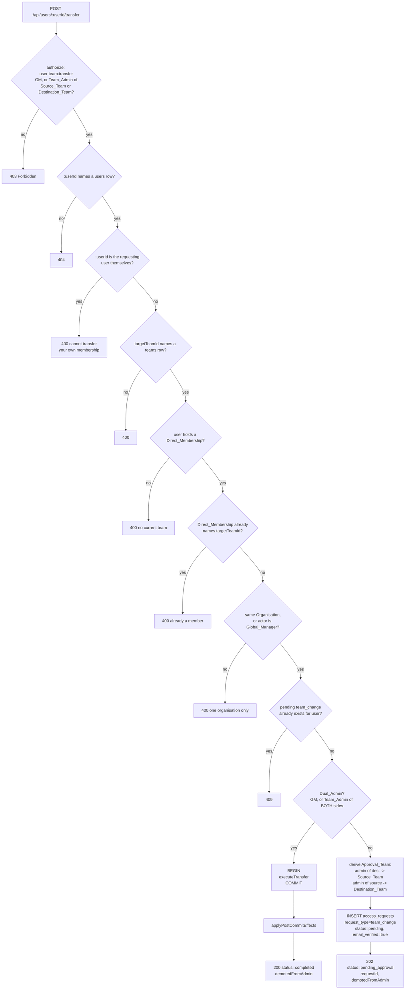
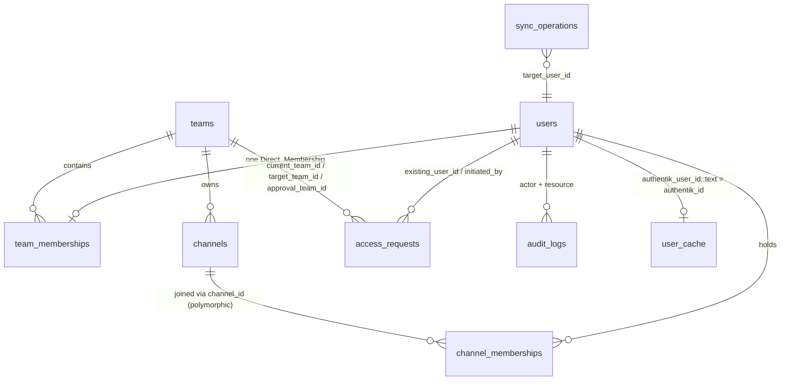

# Design Document

## Overview

Team_Transfer is delivered as one transactional service method with two callers, plus a post-commit effects step that is deliberately outside the transaction.

The move itself is not new. `RequestApprovalService.processApprovedRequest`'s `case 'team_change'` already calls `TeamMembershipService.addUserToTeam(existing_user_id, target_team_id, 'member', adminId, client)` on the approval transaction's own client. That call site is correct in shape and wrong in completeness: it performs the additive half of a move (direct membership row, inherited ancestor rows, destination channel memberships, `add_user_to_group` Sync_Operations) and none of the subtractive or identity half (Source_Team channel revocation, callsign regeneration, admin demotion, notification, audit).

This design therefore introduces a new `TeamTransferService.executeTransfer` that **wraps** `addUserToTeam` rather than replacing or modifying it, adds the missing halves around it, and becomes the single entry point invoked by both the immediate-execution path (`POST /api/users/:userId/transfer` when the Initiating_Admin is a Dual_Admin) and the Transfer_Request approval path (`POST /api/requests/:requestId/approve`).

Three decisions shape everything below and are justified in place:

1. **`executeTransfer` takes a transaction client as a required, non-optional first parameter.** Both callers already own an open transaction. Requiring the client makes Requirement 6.6's atomicity structural rather than conditional.
2. **`addUserToTeam` is not modified.** Its other callers (`UserProvisioningService.createAndAddUser`, `syncWorker.bulkAddUserToTeam`, `POST /api/users/add-to-team`) all operate on users with no prior team, for whom revocation is a no-op with non-zero risk. The Requirement 7 gap is closed on the transfer path only.
3. **Everything that touches Authentik, email, or reads a value this transaction just wrote through the shared `pool` runs strictly after `COMMIT`**, in a single `applyPostCommitEffects` function whose every step is independently failure-tolerant.

### Research findings that constrain the design

These were verified directly against the codebase and each one changes a design choice.

**`channel_memberships.channel_id` is polymorphic.** Migration `1786750000000_make-channel-memberships-channel-id-polymorphic.cjs` dropped the FK to `channels(id)` so the column can also reference `deployment_channels.id`. `TeamMembershipService.removeUserFromTeam` predates that change and does a blanket `DELETE FROM channel_memberships WHERE user_id = $1`, which would silently destroy a user's Deployment_Channel subscriptions. **The revocation step in this design must not copy that pattern.** It is expressed as a `DELETE ... USING channels` join, which scopes the delete to team-owned channels by construction and leaves every non-`channels` row untouched. (A residual hazard remains: a `channel_memberships` row pointing at a `deployment_channels.id` that numerically collides with a `channels.id` will join spuriously. That hazard is pre-existing in every query in the codebase that joins these two tables and is not resolved here.)

**`UserAttributesService.computeCallsignAttributes(userId, teamId)` reads through the shared `pool`, not a client, and takes `teamId` explicitly.** It reads `users.callsign_suffix` and `Team.getAncestorChain(teamId)`; it never reads `team_memberships`. Consequences: it does not need the membership change to be committed to produce the right answer for a given `teamId`, **but** if the transfer wrote a new `callsign_suffix`, a pre-commit call would read the old value through `pool`. Callsign computation therefore must run after commit — which Requirement 8.4 independently requires anyway for the Authentik PATCH.

**`checkCallsignSuffixUniqueness` reads the roster through `pool` via `Team.getFullMemberList` → `Team.getMembers`.** Inside a transaction, its candidate-value read is transactional (the caller passes it a value read on the client) but its roster read is not. There is no unique index backing `callsign_suffix`, so the check is advisory: two concurrent transfers into the same team with the same suffix can both pass. This design does not add a DB-level constraint for it (the requirements do not ask for one, and retrofitting a partial unique index across `users` × Member_List membership is not expressible as a single index). The limitation is stated in Error Handling rather than papered over.

**`user_cache` is keyed by `authentik_id varchar` while `users.authentik_user_id` is `integer`.** Every join needs an explicit `::text` cast. `Team.getMembers` already does this correctly; the post-commit cache write follows suit.

**`PUT /api/teams/:teamId` can change a Team's `parent_team_id`.** A Team's Organisation is therefore not stable for the lifetime of a pending Transfer_Request: either side can be reparented between creation and approval, which invalidates the initiation-time Organisation check. This is the mechanism Requirement 11.6 closes, and it is why the Organisation comparison lives inside the shared `executeTransfer` rather than only in the immediate path's pre-flight — the approval path needs the same check against the state current at approval time, evaluated against the approving user's Global_Manager status rather than the Initiating_Admin's.

**`approveRequest`'s transactional re-fetch has no row lock.** It re-reads with `AND status = 'pending'` but without `FOR UPDATE`, so under READ COMMITTED two concurrent approvals can both observe `pending` and both proceed. This is the mechanism Requirement 11.5 closes.

**`GET /api/requests/pending`'s non-Global_Manager branch scopes by `target_team_id` using direct `role === 'admin'` membership rows and does not call `Team.isAdmin`.** All three properties conflict with Requirement 4.

**`resolveAccess` plus `isSatisfiedWithRowScopedChecks` means a permission identifier absent from `roleDefaults` is still grantable by a resolver.** A required identifier is satisfied if it is held statically *or* a resolver returns true for it. So `user:team:transfer` must **not** be added to `roleDefaults.authenticated_user` — adding it would grant it unconditionally to everyone and bypass the resolver entirely.

## Architecture

### Layering

```
POST /api/users/:userId/transfer          POST /api/requests/:requestId/approve
  (server/routes/users.js)                  (server/routes/requests.js)
         |                                            |
         | authorize: user:team:transfer              | authorize: request:approve
         |   row-scoped resolver                      |   row-scoped resolver
         v                                            v
  pre-flight validation                      RequestApprovalService.approveRequest
  (404 / 400 / 409 / 202)                      SELECT ... FOR UPDATE
         |                                     UPDATE status = 'approved'
         | BEGIN                                      |
         v                                            v
  ============ TeamTransferService.executeTransfer(client, params) ============
    1. lock + read the Direct_Membership row      (FOR UPDATE)
       staleness / precondition assertions
    2. resolve both Ancestor_Chains; re-validate the Organisation boundary
    3. resolve the Callsign_Suffix precedence chain;
       optional users.callsign_suffix write
    4. TeamMembershipService.addUserToTeam(..., client)   <- additive half, reused
    5. revoke non-destination channel_memberships + enqueue remove_user_from_group
    6. return TransferOutcome
  ===========================================================================
         |                                            |
         | COMMIT                                     | COMMIT
         v                                            v
  ========== TeamTransferService.applyPostCommitEffects(outcome) =============
    callsign compute -> user_cache upsert -> Authentik PATCH
    -> team_transfer_completed email -> audit_logs insert
    every step independently try/caught; none can fail the response
  ===========================================================================
```

### Transfer decision flow



### Approval sequence

```mermaid
sequenceDiagram
    participant C as Client (Requests.jsx)
    participant R as routes/requests.js
    participant A as authorize.js
    participant S as RequestApprovalService
    participant T as TeamTransferService
    participant M as TeamMembershipService
    participant DB as Postgres
    participant K as Authentik / Email

    C->>R: POST /requests/:requestId/approve {callsignSuffix?}
    R->>A: request:approve resolver
    A->>DB: SELECT request_type, approval_team_id,<br/>target_team_id, current_team_id
    A->>DB: Team.isAdmin(gating team, req.user.userId)
    A-->>R: permitted (or 403 fail-closed)
    R->>S: approveRequest(requestId, adminId, details, callsignSuffix)
    S->>DB: BEGIN
    S->>DB: SELECT ... WHERE id=$1 AND status='pending' FOR UPDATE
    Note over S,DB: second concurrent approval blocks here,<br/>then sees status='approved' and 0 rows (Req 11.5)
    S->>DB: existing_user_id / target_team_id existence checks
    S->>DB: UPDATE access_requests SET status='approved'
    S->>T: executeTransfer(client, {expectedSourceTeamId: current_team_id, ...})
    T->>DB: SELECT direct membership FOR UPDATE
    alt Direct_Membership no longer names current_team_id
        T-->>S: throw StaleTransferRequestError
        S->>DB: ROLLBACK
        S-->>R: error
        R-->>C: 409 user's team changed since the request was created
    else Organisations diverged since creation and approver is not a Global_Manager
        T->>DB: getAncestorChain(source), getAncestorChain(destination)
        T-->>S: throw CrossOrganisationTransferError
        S->>DB: ROLLBACK
        S-->>R: error
        R-->>C: 409 teams no longer share one organisation (Req 11.6)
    else preconditions hold
        T->>DB: UPDATE users.callsign_suffix (when supplied)
        T->>M: addUserToTeam(userId, destTeamId, 'member', adminId, client)
        M->>DB: delete memberships, insert direct + inherited,<br/>insert dest channel_memberships,<br/>enqueue add_user_to_group
        T->>DB: DELETE channel_memberships USING channels<br/>WHERE team_id NOT IN dest chain RETURNING
        T->>DB: enqueue remove_user_from_group per revoked group
        T-->>S: TransferOutcome
        S->>DB: COMMIT
        S->>K: existing approval email to Initiating_Admin
        S->>T: applyPostCommitEffects(outcome)
        T->>DB: compute callsign; upsert user_cache
        T->>K: Authentik PATCH takCallsign/takColor/takRole
        T->>K: team_transfer_completed email to Transferred_User
        T->>DB: INSERT audit_logs user.team_transfer
        S-->>R: {success: true}
        R-->>C: 200
    end
```

## Components and Interfaces

### 1. `server/services/TeamTransferService.js` (new)

The Transfer_Service of Requirement 6.1. Two exported static methods plus the typed errors tabulated at the end of this subsection.

```js
/**
 * @typedef {object} TransferOutcome
 * @property {number} userId
 * @property {number} sourceTeamId
 * @property {number} destinationTeamId
 * @property {string} priorRole                  // role on the Direct_Membership before the move
 * @property {boolean} demotedFromAdmin          // priorRole === 'admin'
 * @property {number} actorId
 * @property {string|null} callsignSuffixApplied // non-null only when this transfer wrote one
 * @property {string|null} callsignSuffixEffective // Requirement 9.7's resolved value:
 *                                              // what the callsign is built from and what
 *                                              // the uniqueness check ran against
 * @property {number[]} revokedChannelIds
 * @property {string[]} revokedAuthentikGroupIds
 * @property {number|null} transferRequestId
 * @property {number|null} initiatedBy
 * @property {boolean} viaRequest
 */

class TeamTransferService {
  /**
   * Requirement 6.1. The single method that performs a Team_Transfer.
   *
   * `client` is REQUIRED and must already be inside a BEGIN. This service
   * never issues BEGIN/COMMIT/ROLLBACK and never calls pool.connect():
   * the caller owns the transaction lifecycle unconditionally. This is a
   * deliberate departure from TeamMembershipService.addUserToTeam's
   * optional-externalClient / ownsTransaction pattern -- that flexibility
   * exists there for backward compatibility with callers that predate it,
   * and both callers here already hold an open transaction, so making the
   * client mandatory turns Requirement 6.6's atomicity from a caller
   * obligation into a signature guarantee.
   *
   * Performs NO Authentik call, NO email send, and NO audit write --
   * those are applyPostCommitEffects's job (Requirements 8.4, 13.4, 14.4).
   *
   * @param {import('pg').PoolClient} client
   * @param {object} params
   * @param {number} params.userId              local users.id of the Transferred_User
   * @param {number} params.destinationTeamId
   * @param {number} params.actorId             local users.id performing/approving
   * @param {boolean} params.actorIsGlobalManager  Requirement 11.6's exemption,
   *   evaluated against the user performing or approving THIS call. Passed in
   *   rather than re-derived: this service takes a local users.id, not a
   *   req.user, and re-querying Global_Manager status inside the transactional
   *   core would move an authorization decision into the execution path. The
   *   caller already holds the authoritative value (req.user.is_global_manager).
   * @param {number|null} [params.expectedSourceTeamId]  when set, a mismatch
   *   against the locked Direct_Membership throws StaleTransferRequestError
   *   (Requirement 11.1)
   * @param {string|null} [params.callsignSuffix]        Requirement 9.3 / 9.4,
   *   the highest-precedence link of Requirement 9.7's resolution chain
   * @param {string|null} [params.requestCallsignSuffix] Requirement 9.7's second
   *   link: the associated Transfer_Request's access_requests.callsign_suffix
   * @param {number|null} [params.transferRequestId]     Requirement 14.3
   * @param {number|null} [params.initiatedBy]           Requirement 14.3
   * @returns {Promise<TransferOutcome>}
   * @throws {NoCurrentTeamError|AlreadyInDestinationTeamError|StaleTransferRequestError|CrossOrganisationTransferError|CallsignSuffixConflictError}
   */
  static async executeTransfer(client, params) { /* ... */ }

  /**
   * Requirements 8, 13, 14. Runs strictly AFTER the caller's COMMIT.
   * Never throws: every step is individually try/caught and logged, so a
   * failed Authentik PATCH, email, or audit insert leaves the committed
   * membership change in place and the response at 200 (Requirements 8.5,
   * 13.4, 14.4).
   *
   * @param {TransferOutcome} outcome
   * @returns {Promise<{callsign: string|null, emailSent: boolean, audited: boolean}>}
   */
  static async applyPostCommitEffects(outcome) { /* ... */ }
}
```

#### `executeTransfer` step sequence

**Step 1 — lock and read the Direct_Membership.**

```sql
SELECT team_id, role
  FROM team_memberships
 WHERE user_id = $1 AND inherited_from_team_id IS NULL
   FOR UPDATE
```

`FOR UPDATE` on the Direct_Membership row is the second of two concurrency guards (the first is the `access_requests` row lock in the approval path) and is the only guard on the immediate path. It serialises two concurrent transfers of the same user regardless of which entry point each came through. `idx_team_memberships_one_direct_per_user` guarantees at most one row, so this is a single-row lock.

Zero rows → `NoCurrentTeamError` (Requirement 1.4).
`team_id === destinationTeamId` → `AlreadyInDestinationTeamError` (Requirement 1.5).
`expectedSourceTeamId` set and `team_id !== expectedSourceTeamId` → `StaleTransferRequestError` (Requirement 11.1).

`role` captured here is `priorRole`, feeding `demotedFromAdmin` (Requirements 10.2, 10.3) and the audit `details` (Requirement 10.5, 14.2). It must be read before step 4, because `addUserToTeam` deletes the row.

The immediate path also performs these three checks in its own pre-flight (outside the transaction) so it can return the specified status codes without opening a transaction for a doomed request. The in-transaction repetition here is the authoritative, race-free one. That duplication is intentional: pre-flight is for status-code shaping, the locked read is for correctness.

**Step 2 — resolve both Ancestor_Chains and re-validate the Organisation boundary** (Requirements 1.7, 11.6).

```js
const destinationChain = await Team.getAncestorChain(destinationTeamId);
const destinationTeamIds = destinationChain.map(t => t.id);   // includes destinationTeamId itself

const sourceChain = await Team.getAncestorChain(sourceTeamId); // sourceTeamId from step 1's locked row
if (sourceChain[0].id !== destinationChain[0].id && !params.actorIsGlobalManager) {
  throw new CrossOrganisationTransferError(sourceChain[0].id, destinationChain[0].id);
}
```

The destination chain is needed by step 5 regardless, so Requirement 11.6 costs exactly one additional `getAncestorChain` call — on the source team id read under the row lock in step 1, not on the Transfer_Request's recorded `current_team_id`. Both calls read through `pool`, which is correct here: they read `teams`, a table this transaction does not modify, and `PUT /api/teams/:teamId` reparenting is precisely the concurrent writer Requirement 11.6 exists to catch, so reading the committed present state is the intended semantics rather than a hazard.

Requirement 11.6 is why this check lives inside `executeTransfer` rather than only in the immediate path's pre-flight. `PUT /api/teams/:teamId` can change a Team's `parent_team_id` while a Transfer_Request sits pending, so the initiation-time verdict of Requirement 1.7 can be stale by approval time. Placing the check in the shared service means the approval path gets it without a second implementation, and the exemption is evaluated against whoever is executing *this* call — the approving user on the approval path, the Initiating_Admin on the immediate path — which is what Requirement 11.6 specifies. `actorIsGlobalManager` is a required parameter rather than an optional one so that a caller cannot omit it and silently obtain the exempt-by-default behaviour.

The immediate path therefore performs the Organisation check twice: once in the route's pre-flight step 6 for status-code shaping, once here under the row lock for correctness. That is the same deliberate duplication already documented for the membership preconditions in step 1, and for the same reason.

**Step 3 — resolve the Callsign_Suffix and optionally write it** (Requirements 9.3, 9.4, 9.7, 9.8).

Requirement 9.7's precedence chain is resolved here, in one place, rather than split between the call sites and the service:

```js
const effectiveSuffix =
  nonEmpty(params.callsignSuffix)          // (a) supplied on the executing call
  ?? nonEmpty(params.requestCallsignSuffix) // (b) access_requests.callsign_suffix
  ?? existingUserCallsignSuffix;            // (c) users.callsign_suffix, read on `client`
```

Links (a) and (b) arrive as parameters; link (c) is read here with `SELECT callsign_suffix FROM users WHERE id = $1` on `client`, so the read is transactional. `nonEmpty` treats `null`, `''`, and a whitespace-only string alike as absent, which is what makes Requirement 9.7's "non-empty" qualifier total over the values the route can produce (`express-validator`'s `.trim()` already collapses a whitespace-only submission to `''`). When the resolved value came from (a) or (b), the service writes it:

```sql
UPDATE users SET callsign_suffix = $1 WHERE id = $2
```

on `client`, so it commits with the membership writes, and `callsignSuffixApplied` on the outcome is set to that value (feeding the `user_cache` mirror of Requirement 9.5).

When the chain resolves to (c), no `UPDATE` is issued: the existing stored value *is* the effective value, and leaving `users.callsign_suffix` unchanged is the correct expression of that. `callsignSuffixApplied` stays `null` while `callsignSuffixEffective` holds (c).

Either way, `callsignSuffixEffective` is the value step 4's uniqueness check runs against, which is Requirement 9.8. That falls out of the write ordering rather than needing enforcement: `addUserToTeam`'s existing `checkCallsignSuffixUniqueness` call reads the candidate from `client`, so it sees the (a)/(b) write when there was one and the untouched (c) value when there was not. No second, redundant check is added, and there is no path on which the checked value and the used value can differ.

**Step 4 — the additive half, delegated.**

```js
await TeamMembershipService.addUserToTeam(userId, destinationTeamId, 'member', actorId, client);
```

Hardcoding `'member'` is Requirement 10.1: a transferred admin always arrives demoted. This one call supplies Requirements 6.2 (one direct row), 6.3 (inherited rows per ancestor), 6.4 (a `channel_memberships` row per Primary_Channel of the destination chain), **6.8** (exactly one `add_user_to_group` Sync_Operation per destination-chain Primary_Channel holding a non-null `authentik_group_id`, enqueued on `client`), and the `assign_user_to_global_channels` enqueue — all on `client`, all already implemented and already tested. Reusing it rather than reimplementing the ancestor walk is the single biggest reason this design does not duplicate `UserProvisioningService.createAndAddUser`'s logic a third time.

Requirement 6.8 adds no code. It was written because no criterion in any spec covered the destination half of a Team_Transfer's Authentik effect, leaving behaviour that `addUserToTeam` has always had implicit and therefore untested; citing it here keeps the delegation traceable, and Property 27 — the deliberate counterpart of Property 4 — plus the Requirement 17.9 test make it covered. `addUserToTeam` selects those channels with `is_primary = true` across the resolved hierarchy, which is exactly the Primary_Channel definition, so the delegation matches the criterion literally rather than approximately.

**Step 5 — the subtractive half** (Requirement 7).

```sql
DELETE FROM channel_memberships cm
      USING channels c
      WHERE cm.user_id = $1
        AND cm.channel_id = c.id
        AND NOT (c.team_id = ANY($2::int[]))
  RETURNING c.id AS channel_id, c.authentik_group_id
```

Design notes, each load-bearing:

- The `USING channels c` join, not a blanket `DELETE ... WHERE user_id = $1`, is what keeps Deployment_Channel (and any future polymorphic) `channel_memberships` rows out of scope. This is the explicit divergence from `removeUserFromTeam` flagged in the research findings.
- `NOT (c.team_id = ANY($2))` with `$2` = `destinationTeamIds` expresses Requirements 7.1 and 7.4 as one predicate. A Team appearing in both the Source_Team's and the Destination_Team's Ancestor_Chain — the shared-Organisation case, which is the common case — is in `destinationTeamIds`, so its channel is retained and no Sync_Operation is enqueued for it. Although step 2 resolves the source chain for Requirement 11.6, this predicate deliberately does not consult it: the destination chain alone is sufficient, and expressing revocation purely as "not owned by a destination-chain Team" means the result cannot depend on the source chain being complete or resolvable.
- Running this *after* step 4 is safe and intentional. Step 4 inserted destination-chain channel rows with `ON CONFLICT DO NOTHING`; those rows have `c.team_id` inside the array and are never candidates for deletion. Expressing the delete as an end-state predicate over owning teams — rather than "rows that existed before step 4" — makes it directly checkable against Requirement 7.1's own end-state wording.
- Channels of a non-destination Team that are not that Team's Primary_Channel are revoked too. Requirement 7.1 says "a Channel whose owning Team is absent from the Destination_Team's Ancestor_Chain" without restricting to a Primary_Channel (`channels.is_primary = true`); the predicate matches the requirement literally. Requirements 6.4 and 6.8, by contrast, are Primary_Channel-scoped on the additive side, so the two halves are deliberately asymmetric.

Then, per returned row with a non-null `authentik_group_id`:

```js
await EventPublisher.publishOperation('remove_user_from_group', {
  target_user_id: userId,
  target_group_id: row.authentik_group_id
}, actorId, client);
```

Threading `client` is Requirement 7.3 — a rolled-back transfer leaves no `sync_operations` row behind. This matches the pattern already established in `createAndAddUser` and `addUserToTeam`.

**Step 6** — build and return the `TransferOutcome`. No commit.

#### `applyPostCommitEffects` step sequence

Each step is separately try/caught and logged via the structured logger; a failure never rethrows.

1. **Callsign** (Requirements 8.1, 8.6): `UserAttributesService.generateCallsign(userId, destinationTeamId)`. Requirement 8.6 needs no special case — `computeCallsignAttributes` filters ancestors to `depth >= 1`, so a root-Organisation destination yields an empty `teamSegmentPrefixes` and `assembleCallsign` produces `PREFIX-Suffix` with no Sub_Team segment. Verified against `CallsignService.assembleCallsign`'s non-empty-segment join.
2. **`user_cache`** (Requirements 8.2, 9.5): resolve `users.authentik_user_id`, then upsert `tak_callsign`, `tak_color`, `tak_role`, and — when `callsignSuffixApplied` is non-null — `callsign_suffix`. Join/lookup uses `authentik_user_id::text = authentik_id`. Follows `approveRequest`'s Phase 3 `INSERT ... ON CONFLICT (authentik_id) DO UPDATE` shape rather than a bare `UPDATE`, so a user with no cache row yet is handled.
3. **Authentik PATCH** (Requirements 8.3, 8.4, 8.5): `UserAttributesService.updateUserAttributes(authentikUserId, {callsign, color, role})`. That method already returns `false` rather than throwing on failure and already merges rather than replaces attributes, so Requirement 8.5 needs no new handling beyond logging the `false`.
4. **Notification** (Requirement 13): skip entirely when `users.is_team_device` is true (Requirement 13.5). Otherwise `emailService.sendEmail(user.email, 'team_transfer_completed', { first_name, team_path, callsign })`. `team_path` is built from `destinationChain` with the same `callsign_prefix || name` segment mapping and `' - '`/`' > '` join already used in `requests.js` and `RequestApprovalService`; the exact separator follows whichever the surrounding file already uses so the two do not diverge.
5. **Audit** (Requirement 14):

```js
INSERT INTO audit_logs (user_id, action, resource_type, resource_id, details)
VALUES ($1, 'user.team_transfer', 'user', $2, $3)
```

`user_id` = `actorId`, `resource_id` = `userId`. `details` JSON:

```json
{
  "sourceTeamId": 12,
  "destinationTeamId": 34,
  "priorRole": "admin",
  "viaRequest": true,
  "requestId": 91,
  "initiatedBy": 7,
  "revokedChannelIds": [5, 6],
  "callsignSuffixApplied": null
}
```

`requestId` and `initiatedBy` are present only when `viaRequest` is true (Requirement 14.3).

#### Typed errors

| Error | Thrown when | Route status |
|---|---|---|
| `NoCurrentTeamError` | no Direct_Membership | 400 (Req 1.4) |
| `AlreadyInDestinationTeamError` | Direct_Membership already names the destination | 400 (Req 1.5) |
| `SelfTransferError` | `:userId` equals the requesting user's own `users.id` | 400 (Req 1.8) |
| `CrossOrganisationTransferError` | different Organisations, executing actor not a Global_Manager | 400 on the immediate path (Req 1.7), 409 on the approval path (Req 11.6) |
| `StaleTransferRequestError` | locked Direct_Membership ≠ `expectedSourceTeamId` | 409 (Req 11.1) |
| `CallsignSuffixConflictError` (existing, reused) | destination Member_List collision on the value resolved per Req 9.7 | 400 (Req 9.1) |

Attaching a `conflictingValue` field is already `CallsignSuffixConflictError`'s established contract; the new errors follow the same "typed error carries the data the response needs, route shapes the response" convention.

`SelfTransferError` is thrown by the route handler, not by `executeTransfer`, and not by the resolver. Not the resolver, because a self-transfer attempted by a legitimate Team_Admin of their own Team passes the `user:team:transfer` disjunction of Requirement 2.2 on the source-team leg — denying it there would return 403 where Requirement 1.8 specifies 400, and would conflate "you may not act on this route" with "this particular target is not permitted". Not `executeTransfer`, because the service takes a local `users.id` for the actor and the comparison is against the *authenticated* identity, which is a route-layer concern; the check is also a pure integer comparison that needs no query, so pushing it into the transactional core would buy nothing. The consequence is that `executeTransfer` will move a user's own membership if called with `actorId === userId`; no caller does, and no route exists that could.

`CrossOrganisationTransferError` is the one error whose route status depends on the path. On the immediate path it reports a caller mistake at request time (400, Req 1.7); on the approval path the same error means the hierarchy changed under a pending Transfer_Request, which is a staleness condition and takes 409 with a distinct message, consistent with `StaleTransferRequestError`. Mapping it to the generic 500 branch alongside Requirements 11.2 and 11.3 was rejected: those two indicate a dangling foreign key — a genuine internal inconsistency — whereas a reparented Team is ordinary, expected concurrent activity that the approving admin can act on.

### 2. `POST /api/users/:userId/transfer` (in `server/routes/users.js`)

Validators, matching the file's existing `textField` / express-validator conventions:

```js
body('targetTeamId').isInt({ min: 1 }).toInt(),
body('justification').optional().trim().isLength({ max: 500 }),
body('callsignSuffix').optional().trim().isLength({ max: 255 })
```

Handler order — chosen so each requirement's specified status code is reachable:

1. `SELECT id, first_name, last_name, email, is_team_device FROM users WHERE id = $1` → 404 (Req 1.3).
2. Self-transfer gate (Req 1.8): `Number(req.params.userId) === req.user.userId` → 400. Placed here, immediately after the existence lookup, because it is a pure integer comparison needing no query, and because Requirement 1.8 admits no exemption — a Global_Manager is rejected too, so there is nothing later in the order that could change the verdict. Compares against `req.user.userId`, the **local** `users.id`, never `req.user.id`.
3. `validationResult` → 400.
4. `SELECT id FROM teams WHERE id = $1` → 400, not 404 (Req 1.2 specifies 400).
5. `SELECT team_id, role FROM team_memberships WHERE user_id = $1 AND inherited_from_team_id IS NULL` → 400 when absent (Req 1.4); 400 when `team_id === targetTeamId` (Req 1.5).
6. Cross-Organisation gate (Req 1.7): compare `Team.getAncestorChain(sourceTeamId)[0].id` with `Team.getAncestorChain(targetTeamId)[0].id`; unequal and `!req.user.is_global_manager` → 400.
7. Duplicate pending Transfer_Request (Req 3.7) → 409.
8. Dual_Admin determination: `req.user.is_global_manager || (await Team.isAdmin(sourceTeamId, req.user.userId) && await Team.isAdmin(targetTeamId, req.user.userId))` (Req 2.6, 6).
9. Dual_Admin → transaction + `executeTransfer` + commit + `applyPostCommitEffects` → 200. Otherwise → insert the Transfer_Request → 202. On this path `executeTransfer` receives `actorIsGlobalManager: !!req.user.is_global_manager`, `callsignSuffix: req.body.callsignSuffix || null` (Requirement 9.7 link (a)), and `requestCallsignSuffix: null` — there is no Transfer_Request, so link (b) is absent and the chain falls through to the stored value.

Steps 1–7 run outside any transaction and are pre-flight status shaping only; `executeTransfer` re-asserts 5's and 6's preconditions under a row lock.

**Step 7 precedes step 8, and that ordering is load-bearing.** Requirement 3.7 applies "regardless of whether the Initiating_Admin is a Dual_Admin", so the duplicate-pending check must sit *above* the branch that decides between immediate execution and Transfer_Request creation — otherwise a Dual_Admin would silently execute a transfer while a Transfer_Request for the same user sat pending, and Requirement 3.7's 409 would only ever be reachable on one of the two paths. Requirement 3.7 also admits no `superseded` disposition: the pending row is left exactly as it is and the caller is told to resolve it through approval or denial. Moving step 7 below step 8 is the specific refactor that would break this, hence the note.

The same both-paths guarantee is backed at the database level. `idx_access_requests_one_pending_team_change_per_user` is a partial unique index on `existing_user_id`, so it constrains the *existence of a pending row*, not the path that observes it — a `23505` on that index is mapped to the same 409 whichever branch triggered it. On the immediate path the index is not what fires (that path inserts nothing); step 7's `SELECT` is the whole mechanism there, and it is racy against a concurrent Transfer_Request creation. That residual window is narrowed rather than closed: `executeTransfer`'s `FOR UPDATE` on the Direct_Membership row serialises the two transfers themselves, so the worst outcome is a transfer executing while a now-stale pending row remains, which Requirement 11.1's staleness check then rejects at approval time.

Authorization runs before all of this, so 403 precedes every 4xx above. One consequence worth stating: a transfer requested for a user with no Direct_Membership by an admin of the target team returns 400 (the resolver grants on the target-team leg), while the same request from an unrelated admin returns 403. That precedence is standard and intended.

Responses:

```
200 { status: 'completed', demotedFromAdmin, callsign, destinationTeamPath, revokedChannelCount }
202 { status: 'pending_approval', requestId, demotedFromAdmin, approvalTeamId, approvalTeamName }
```

`demotedFromAdmin` is on both, since Requirements 10.2 and 10.3 speak of a transfer being *initiated*, not completed.

Transfer_Request insert (Requirement 3):

| Column | Value | Requirement |
|---|---|---|
| `request_type` | `'team_change'` | 3.1 |
| `existing_user_id` | Transferred_User's `users.id` | 3.1 |
| `current_team_id` | Source_Team id | 3.1 |
| `target_team_id` | Destination_Team id | 3.1 |
| `status` | `'pending'` | 3.1 |
| `justification` | submitted value or `NULL` | 3.1 |
| `initiated_by` | `req.user.userId` | 3.3 |
| `approval_team_id` | Source_Team when the actor is a Team_Admin of the destination; Destination_Team when the actor is a Team_Admin of the source | 3.3 |
| `requester_email` / `requester_first_name` / `requester_last_name` | the **Initiating_Admin's** own values | 3.4 |
| `email_verified` | `true`, no verification email | 3.5 |
| `assigned_to_admin` | one `users.id` holding a direct `role = 'admin'` row for the Approval_Team, else `NULL` | 3.6 |
| `callsign_suffix` | submitted value or `NULL` | 3.8 |

Requirement 3.4 is what makes Requirements 12.3 and the existing approval email work unchanged: `RequestApprovalService` already emails `requester_email`, and for a Transfer_Request that address is the Initiating_Admin's. No change to either email path is needed for the initiator; the Transferred_User's notification is a separate, new email (step 4 of `applyPostCommitEffects`). The two recipients never coincide by construction — Requirement 1.8 forbids a self-transfer, so the Initiating_Admin is never the Transferred_User — which is why no de-duplication between the two emails is needed and why no second notification to the Initiating_Admin is specified anywhere in this design.

The `assigned_to_admin` lookup selects on `role = 'admin'` only (Requirement 3.6). The `role IN ('admin', 'owner')` predicate found in `RequestApprovalService` and `EscalationService` is dead defensive code — no code path writes `'owner'`, no `team_memberships` row holds it, and no CHECK constraint admits it — and is deliberately not propagated into new code.

### 3. Authorization

#### `permissions.registry.js`

One new route entry:

```js
'POST /api/users/:userId/transfer': ['user:team:transfer'],
```

`user:team:transfer` is deliberately absent from `roleDefaults.authenticated_user`; the resolver is the only way to obtain it. `permissions.registry.completeness.test.js` mounts route files into its own Express app and asserts every mounted route has a registry entry — adding the route without the entry fails CI, and the entry above satisfies it with no test change. `publicRoutes.completeness.test.js` is unaffected: the new route is authenticated.

`request:approve` and `request:deny` already have registry entries. Neither is in `roleDefaults.authenticated_user`, while `request:read` is — that asymmetry is exactly the inconsistency the Introduction describes, and it is resolved by giving them resolvers, not by adding them to `roleDefaults`. Adding them statically would grant every authenticated user a blanket approve permission; resolvers keep Global_Manager access flowing through the `'*'` wildcard and Team_Admin access flowing through a row-scoped, per-request check.

#### `authorize.js` — three new resolvers

`user:team:transfer` (Requirements 2.2, 2.3):

```js
'user:team:transfer': async (req) => {
  if (req.user && req.user.is_global_manager) return true;
  const userId = req.user && req.user.userId;          // LOCAL users.id, never req.user.id
  const targetTeamId = req.body && req.body.targetTeamId;
  if (targetTeamId && await Team.isAdmin(targetTeamId, userId)) return true;
  const direct = await pool.query(
    'SELECT team_id FROM team_memberships WHERE user_id = $1 AND inherited_from_team_id IS NULL',
    [req.params.userId]
  );
  if (direct.rows.length === 0) return false;
  return Team.isAdmin(direct.rows[0].team_id, userId);
}
```

Reading `req.body` in a resolver has precedent in `channel_request:create` and `team:create:root_or_sub`; `express.json()` runs before route middleware, so the body is populated. The destination leg is checked first because it needs no extra query when it succeeds. A `:userId` naming no user, or naming a user with no Direct_Membership, yields no source-team leg — so such a request is authorized only via the destination leg or Global_Manager status, and otherwise denied.

`request:approve` and `request:deny` (Requirement 5) share one implementation, modelled directly on `channel_request:process` — load the row by `:requestId`, pick a team column, call `Team.isAdmin`:

```js
async function resolveRequestActionPermission(req) {
  if (req.user && req.user.is_global_manager) return true;         // Req 5.1
  const result = await pool.query(
    'SELECT request_type, approval_team_id, target_team_id, current_team_id FROM access_requests WHERE id = $1',
    [req.params.requestId]
  );
  if (result.rows.length === 0) return false;                      // Req 5.5 -> 403
  const row = result.rows[0];
  const gatingTeamId =
    row.request_type === 'team_change' ? row.approval_team_id      // Req 5.2
    : row.request_type === 'new_account' ? row.target_team_id      // Req 5.3
    : ['role_change', 'name_change'].includes(row.request_type) ? row.current_team_id  // Req 5.4
    : null;
  if (gatingTeamId == null) return false;                          // unknown type, or NULL column
  return Team.isAdmin(gatingTeamId, req.user && req.user.userId);
}
```

A `NULL` gating column (a legacy `team_change` row predating the migration, or an unrecognised `request_type`) denies. Requirement 5.6 needs no code: `PERMISSION_DENIALS_MAPPED_TO_404` is not touched, so these denials keep `authorize()`'s default 403. And per the module's existing contract, a throw from either resolver is caught centrally and fails closed — so these resolvers do not carry their own try/catch.

`pool` is already imported at `authorize.js` module scope. Both resolvers use that import directly. **No function-scoped `const pool = require(...)` anywhere** — the temporal-dead-zone incident in `auth.js` is the reason this is called out rather than left implicit.

### 4. `RequestApprovalService` changes

**Row lock in the transactional re-fetch** (Requirement 11.5). The existing query gains `FOR UPDATE`:

```sql
SELECT ar.*, t.name AS team_name, ...
  FROM access_requests ar
  ...
 WHERE ar.id = $1 AND ar.status = 'pending'
   FOR UPDATE OF ar
```

`FOR UPDATE OF ar` restricts the lock to `access_requests`, leaving the `LEFT JOIN`ed `teams`/`users` rows unlocked — a plain `FOR UPDATE` would also try to lock those, and `FOR UPDATE` is not permitted on the nullable side of an outer join in Postgres. The second concurrent approval blocks until the first commits, then its `AND status = 'pending'` predicate is re-evaluated against the committed `'approved'` value, matches zero rows, and takes the existing "Request not found or already processed" throw path.

This changes behaviour for **all** request types, not just `team_change`. That is intentional and a strict improvement — the same double-approval window exists for `new_account` today. It is called out because it is a change outside this spec's nominal surface.

**`case 'team_change'`** is replaced:

```js
case 'team_change': {
  const outcome = await TeamTransferService.executeTransfer(client, {
    userId: request.existing_user_id,
    destinationTeamId: request.target_team_id,
    actorId: adminId ?? null,
    actorIsGlobalManager: approverIsGlobalManager,        // Requirement 11.6
    expectedSourceTeamId: request.current_team_id,        // Requirement 11.1
    callsignSuffix: callsignSuffixOverride || null,       // Requirement 9.7 link (a)
    requestCallsignSuffix: request.callsign_suffix || null, // Requirement 9.7 link (b)
    transferRequestId: request.id,
    initiatedBy: request.initiated_by
  });
  return { transferOutcome: outcome };
}
```

Returning the outcome (instead of `break`) lets `approveRequest` run `applyPostCommitEffects` after `COMMIT`, mirroring how the `new_account` branch already returns `{localUserId}` for its own Phase 3. Requirements 11.2, 11.3, and 11.4 are already satisfied by the existing pre-`UPDATE` existence checks and the `AND status = 'pending'` predicate — no new code, and the design says so rather than reimplementing them.

The two suffix links are passed separately rather than pre-collapsed with `||` at the call site. Requirement 9.7 specifies one precedence chain of three links, and its third link — the Transferred_User's stored `users.callsign_suffix` — is only readable inside the transaction; collapsing (a) and (b) here and leaving (c) implicit in `addUserToTeam`'s behaviour would split one rule across two files, which is exactly the shape that lets the rule drift. `executeTransfer` step 3 owns the whole chain and reports the resolved value as `callsignSuffixEffective`.

`approverIsGlobalManager` is threaded from the route as a new `approveRequest` parameter, sourced from `req.user.is_global_manager`. Requirement 11.6's exemption is evaluated against the **approving** user, not against the Initiating_Admin recorded in `initiated_by` — a Transfer_Request created within one Organisation by an ordinary Team_Admin and approved after a reparenting is rejected unless the approver themselves is a Global_Manager.

`callsignSuffixOverride` currently applies only to `new_account` (documented in that method's comment as ignored for other types). Requirement 9.4 extends it to `team_change`. That comment needs updating alongside the code so it does not become false.

**Post-commit hook.** After `COMMIT` and after the existing non-`new_account` approval email:

```js
if (request.request_type === 'team_change' && processResult?.transferOutcome) {
  await TeamTransferService.applyPostCommitEffects(processResult.transferOutcome);
}
```

**Route error mapping** in `POST /api/requests/:requestId/approve`: add a `StaleTransferRequestError` → 409 branch and a `CrossOrganisationTransferError` → 409 branch (Requirement 11.6, with a message naming the diverged Organisations) beside the existing `CallsignSuffixConflictError` → 400 branch, before the generic 500. All three are thrown from inside the transaction, so the existing `ROLLBACK` in `approveRequest`'s `catch` leaves the row's `status` as `pending` with no extra handling.

Denial (Requirement 12) needs **no** service change. `denyRequest` already writes `status`, `processed_by`, `processed_at`, `denial_reason`; already emails `requester_email` (the Initiating_Admin, per Requirement 3.4); and already logs-and-continues on email failure (Requirement 12.4). Requirement 12.2 holds because a denial performs no membership write at all.

The deny **route** does change, in one line. Requirement 12.6 caps the reason at 1000 characters, which the existing validator does not:

```js
body('denialReason').trim().isLength({ min: 1, max: 1000 })   // was: { min: 1 }
```

That tightens an existing route: a reason longer than 1000 characters is now a 400 where it previously succeeded. The `min: 1` half already satisfied Requirement 12.5. `denial_reason` is a `text` column, so this is an interface bound rather than a storage one — the motive is bounding an unauthenticated-in-content, admin-supplied string that is interpolated into an outbound email, not avoiding a truncation error.

Beyond the validator, the only thing Requirement 12 needed was the `request:deny` resolver.

### 5. `GET /api/requests/pending` rework (Requirement 4)

Three changes to the non-Global_Manager branch and one shared enrichment change.

**Gating team per request type.** Candidate rows are fetched once, then filtered in JS by a memoised `Team.isAdmin` per distinct gating team id:

```js
const gatingTeamId = (row) =>
  row.request_type === 'team_change' ? row.approval_team_id : row.target_team_id;
```

`Team.isAdmin` (Requirement 4.4) replaces the current `userTeams.filter(t => t.role === 'admin')` intersection, so an admin of a Team *above* the Approval_Team in its Ancestor_Chain sees the row. Memoising by team id bounds the recursive-CTE calls to the number of distinct gating teams among pending rows, not the number of rows — the same batching instinct as the handler's existing `Promise.all` over distinct target teams.

The candidate set for a non-Global_Manager becomes all `status='pending' AND email_verified=true` rows rather than a `target_team_id IN (...)`-narrowed set, because the gating column now varies by row. Pending-request volume is small and `idx_access_requests_status_new` covers the predicate, so the cost is acceptable; nothing leaks, since the `Team.isAdmin` filter runs before the response is built.

**Enrichment for `team_change` rows** (Requirement 4.3). The query gains:

```sql
LEFT JOIN users tu ON ar.existing_user_id = tu.id     -- Transferred_User
LEFT JOIN users iu ON ar.initiated_by     = iu.id     -- Initiating_Admin
LEFT JOIN teams st ON ar.current_team_id  = st.id     -- Source_Team
```

selecting `tu.first_name`, `tu.last_name`, `tu.email`, `iu.first_name`, `iu.last_name`. Hierarchy paths are resolved for the union of distinct `target_team_id` **and** `current_team_id` values (the handler currently resolves only `target_team_id`), producing `team_path` (destination, existing field name preserved) and a new `source_team_path`.

**Incidental refactor.** The Global_Manager and non-Global_Manager branches currently carry a near-identical ~35-line enrichment block. Both need the same new fields, so the block is extracted into one local `enrichPendingRequests(rows)` helper in the route file. This is not gold-plating: duplicating the new join-derived fields into two places is how the two branches drift.

`effective_callsign_suffix` computation stays as-is. It is meaningful only for `new_account`; for a `team_change` row `requested_first_name`/`requester_first_name` are the Initiating_Admin's, so the computed value is not used by the Client's `team_change` card.

### 6. Client

`client/src/services/api.js`:

```js
// usersAPI
transfer: (userId, data) => api.post(`/users/${userId}/transfer`, data),
```

**`client/src/components/TransferMemberDialog.jsx` (new).** `TeamDetail.jsx` is already past 1300 lines with several in-component modals; the transfer dialog carries its own multi-field form plus a retry loop, so it goes in its own component. Props: `{ member, team, onClose, onCompleted }`. Internal state: `targetTeamId`, `justification`, `callsignSuffix`, `serverError`, `callsignSuffixPrompt`, `submitting`.

Behaviour:
- Destination options (Requirements 15.2, 15.3, 15.8, 15.9): `teamsAPI.getMyTeams({ scope: 'organisation' })`, which returns Visible_Branch-filtered teams via `TeamVisibilityService.filterVisibleBranches`, with the displayed team's own id excluded client-side. The `scope: 'organisation'` parameter is what satisfies Requirement 15.8 — the narrowing to the caller's own Organisation happens server-side in `resolveOwnOrganisationTeams`, so the Client is not trusted to enforce it and a selection Requirement 1 Criterion 7 would reject cannot be constructed from the offered list.
- **Caveat that is also the mechanism for Requirement 15.9:** `resolveOwnOrganisationTeams` returns `[]` for a caller with no team membership of their own, which a Global_Manager may well be. The dialog therefore falls back to `teamsAPI.getMyTeams()` (the admin all-teams branch) when the scoped call returns an empty list and `user?.isAdmin` is true. That fallback is what makes Requirement 15.9's permissive "MAY offer Teams outside the Source_Team's Organisation" true in practice, while Requirement 15.8 stays satisfied for every non-Global_Manager because the fallback is unreachable for them — the all-teams branch is admin-gated, so a non-admin caller with an empty scoped list simply gets an empty list. A Global_Manager who does hold a membership gets the Organisation-scoped list, which Requirement 15.9 also permits since it constrains nothing.
- Requirement 15.4: a fixed statement that the transfer changes the member's TAK callsign.
- Requirement 10.4: when `member.role === 'admin'`, an additional statement that the transfer removes admin rights and that they must be granted again in the Destination_Team.
- Requirement 9.6 retry loop: on a 400 whose message names a conflicting Callsign_Suffix, the dialog sets `callsignSuffixPrompt` to the server message and reveals a callsign-suffix input; confirming resubmits the same transfer with `callsignSuffix` populated. The dialog stays open (Requirement 15.7).
- Requirement 15.5: 200 with `status === 'completed'` → `onCompleted()` (which refetches the Member_List) plus a `react-hot-toast` success toast, then close.
- Requirement 15.6: 202 with `status === 'pending_approval'` → toast stating the transfer awaits the other team's approval; Member_List untouched.
- Requirement 15.7: 400/403/404/409 → render `error.response.data.error` inline, keep the dialog open. No native `confirm`/`alert` anywhere — that was deliberately removed from this codebase.

**`TeamDetail.jsx`.** Add `transferringMember` state and an `ArrowRightCircleIcon` action button in the existing `canManageTeam &&` action cell of both the members table and the admins table (Requirement 15.1 covers rows with `role` of `member` or `admin`). `canManageTeam` is already `isGlobalAdmin || isTeamAdmin`, which is exactly Requirement 15.1's gate. Render `<TransferMemberDialog>` when `transferringMember` is set.

**`Requests.jsx`.** Branch the card body on `request.request_type === 'team_change'`:
- Requirement 16.1: Transferred_User name and email, `source_team_path` → `team_path`, Initiating_Admin name, justification, `created_at`.
- Requirement 16.3: a statement that approval removes the member's admin rights in the Source_Team.
- The First Name / Last Name / Callsign Suffix inputs are `new_account`-only and are suppressed for `team_change` (those columns hold the Initiating_Admin's values on a Transfer_Request, so showing them as editable fields would be actively misleading).
- Requirements 16.2, 16.4, 16.5, 16.6 are satisfied by the existing approve/deny controls, the existing denial-reason modal with its non-empty check, the existing optimistic list removal, and the existing error toast. The pending-count badge in `Layout.jsx` derives from `requestsAPI.getPending()` on a 60s interval and needs no change.

## Data Models

### Migration 1 — `access_requests.approval_team_id` and `initiated_by`

`database/migrations/<timestamp>_add-access-requests-transfer-columns.cjs`, node-pg-migrate schema-builder API, additive only (Requirement 3.2):

```js
const up = (pgm) => {
  pgm.addColumn('access_requests', {
    approval_team_id: {
      type: 'integer',
      notNull: false,
      references: 'teams(id)',
      comment: 'Requirement 3.2/3.3: the Team whose Team_Admins may approve or deny this Transfer_Request.'
    }
  }, { ifNotExists: true });

  pgm.addColumn('access_requests', {
    initiated_by: {
      type: 'integer',
      notNull: false,
      references: 'users(id)',
      comment: 'Requirement 3.2/3.3: the Initiating_Admin who created this Transfer_Request.'
    }
  }, { ifNotExists: true });

  pgm.createIndex('access_requests', ['approval_team_id'], {
    name: 'idx_access_requests_approval_team_pending',
    where: "status = 'pending' AND request_type = 'team_change'",
    ifNotExists: true
  });

  pgm.createIndex('access_requests', ['existing_user_id'], {
    name: 'idx_access_requests_one_pending_team_change_per_user',
    unique: true,
    where: "status = 'pending' AND request_type = 'team_change'",
    ifNotExists: true
  });
};
```

Both columns are nullable with no default, so every existing row keeps every other column value unchanged (Requirement 3.2). `ifNotExists` matches the idempotency style of the surrounding migrations (`1786880000000_add-access-requests-signup-code-used.cjs` and the `ADD COLUMN IF NOT EXISTS` block in `1786680000000_non-destructive-access-requests.cjs`).

`idx_access_requests_one_pending_team_change_per_user` is the DB-level backstop for Requirement 3.7 — the route's pre-flight `SELECT` is racy on its own, and this partial unique index closes it for the path that inserts. The route maps a `23505` unique-violation on this index to the same 409 the pre-flight check returns. Because the index constrains the existence of a pending row rather than the path that observes one, Requirement 3.7's "regardless of whether the Initiating_Admin is a Dual_Admin" is satisfied by the pre-flight check's *position* in the handler order (step 7, above the Dual_Admin branch) rather than by the index; the index adds race-freedom only where a row is actually inserted. Creating a unique index over existing data can fail on duplicates; it is safe here because no `team_change` row can exist yet (no route creates one today — the whole premise of this spec), and the partial predicate excludes every non-`team_change` and non-`pending` row.

The `down` migration drops both indexes and both columns.

### Migration 2 — `team_transfer_completed` email template

`database/migrations/<timestamp>_seed-team-transfer-completed-email-template.cjs` (Requirements 13.2, 13.3), following `1786900000000_seed-signup-email-templates.cjs`:

```js
const up = (pgm) => {
  pgm.sql(`
    INSERT INTO email_templates (template_key, subject_template, body_template, description)
    VALUES (
      'team_transfer_completed',
      'Your team assignment has changed',
      $tpl$Hi {{first_name}},

Your team assignment has been changed to:

  {{team_path}}

Your TAK callsign is now: {{callsign}}

Your previous team's channels are no longer available to you. If this
change is unexpected, contact your team administrator.$tpl$,
      'Sent to a user whose Direct_Membership was moved by a Team_Transfer'
    )
    ON CONFLICT (template_key) DO NOTHING;
  `);
};
```

`ON CONFLICT (template_key) DO NOTHING` gives Requirement 13.2's "leaves an existing row with that `template_key` unchanged". Substitution variables are exactly `first_name`, `team_path`, `callsign` (Requirement 13.3), matching `EmailService.sendEmail`'s `{{variable}}` substitution.

Dollar-quoting (`$tpl$...$tpl$`) is used for the body even though this template happens to contain no HTML attributes. It is the convention that survived the earlier template corruption caused by `""`-escaping, and using it unconditionally means a later edit that adds an `<a href="...">` cannot reintroduce that failure.

### Entity relationships



### Column semantics on a Transfer_Request

| Column | Meaning on a `team_change` row |
|---|---|
| `existing_user_id` | Transferred_User |
| `current_team_id` | Source_Team, and the staleness baseline for Requirement 11.1 |
| `target_team_id` | Destination_Team |
| `approval_team_id` | Approval_Team — the side that did *not* initiate |
| `initiated_by` | Initiating_Admin (local `users.id`) |
| `requester_email` / `requester_first_name` / `requester_last_name` | Initiating_Admin's, so existing approval/denial emails reach them (Requirement 3.4) |
| `callsign_suffix` | replacement Callsign_Suffix proposed at creation (Requirement 3.8); link (b) of Requirement 9.7's precedence chain at approval time |
| `email_verified` | always `true`; no verification email (Requirement 3.5) |
| `requested_role` | unused |

### Concurrency model

Three guards, each stated explicitly because Requirement 11.5 asks for a choice:

1. **`SELECT ... FROM access_requests WHERE id = $1 AND status = 'pending' FOR UPDATE OF ar`** inside `approveRequest`'s transaction. This is the primary Requirement 11.5 mechanism. Chosen over an optimistic `UPDATE ... WHERE status = 'pending'` + `rowCount` check because the transaction performs several reads between the status check and the membership writes; a lock held for the whole transaction is simpler to reason about than re-validating at each step. Chosen over `SERIALIZABLE` isolation because that would change behaviour for every other transaction in the process and force retry handling into unrelated call sites.
2. **`SELECT ... FROM team_memberships WHERE user_id = $1 AND inherited_from_team_id IS NULL FOR UPDATE`** inside `executeTransfer`. Serialises two transfers of the same user across *both* entry points — the only guard on the immediate path, and a backstop on the approval path. Single-row by virtue of `idx_team_memberships_one_direct_per_user`.
3. **`idx_access_requests_one_pending_team_change_per_user`** (partial unique). Makes Requirement 3.7 race-free at the DB for the Transfer_Request creation path rather than relying on a check-then-insert. The immediate path inserts nothing, so it relies on guard 2 plus the handler-order placement of the pre-flight check; the residual window there is analysed in the route section and bounded by Requirement 11.1's approval-time staleness rejection.

Requirement 11.6 is not a fourth guard. A Team reparented by `PUT /api/teams/:teamId` between a Transfer_Request's creation and its approval is not a race this design serialises against — it is a legitimate concurrent change that the approval must observe and reject on, which is why the re-validation is a read of committed present state in `executeTransfer` step 2 rather than a lock.

Not guarded: two concurrent transfers of *different* users into the same team with the same Callsign_Suffix. `checkCallsignSuffixUniqueness` reads the roster through `pool`, and no unique index backs `callsign_suffix`. This is pre-existing behaviour, unchanged by this design, and is recorded in Error Handling rather than silently assumed away.

## Correctness Properties

*A property is a characteristic or behavior that should hold true across all valid executions of a system — essentially, a formal statement about what the system should do. Properties serve as the bridge between human-readable specifications and machine-verifiable correctness guarantees.*

This feature is a good fit for property-based testing. The load-bearing logic is set arithmetic (which channel memberships survive a move), a pure string assembly (the callsign), and several total boolean/mapping functions (the admin disjunction, the branch selection, the request-type-to-gating-column table). All are exercisable against generated hierarchies with mocked Authentik and email clients, so the cost per iteration is a few in-memory or transactional database operations.

Requirement 11.5's at-most-once guarantee is deliberately **not** a property: it lives in Postgres row locking rather than in application logic, and generated inputs would explore nothing that two concurrent live transactions do not. It is covered by integration tests instead. The Client criteria in Requirements 15 and 16 are likewise example-based: they are fixed-shape rendering assertions over data whose derivation is already property-tested on the server.

The properties below were consolidated from the per-criterion prework rather than written one per criterion. Ten separate "this failed, therefore nothing changed" criteria collapsed into a single rollback property; four separate membership-shape criteria collapsed into one end-state property; three views of one channel set equality collapsed into one set-equality property.

Three criteria added no property, and the prework says why: Requirement 3.6's narrowing from `role IN ('admin', 'owner')` to `role = 'admin'` is unobservable, since no reachable input distinguishes the two predicates; Requirement 15.9 is permissive ("MAY") and has no falsifiable universal form; Requirement 17.9 is a meta-criterion satisfied by Property 27's test existing.

Properties 27 through 29 cover criteria added after the first draft and are appended rather than interleaved, so that every earlier property number and every Testing Strategy reference to one stays stable. Property 27 is worded as the direct counterpart of Property 4 despite being twenty-three places away from it; the pairing is in the wording, not the ordering.

### Property 1: Both transfer paths produce identical state

For any Team_Transfer scenario — hierarchy shape, source and destination teams, prior role, channel layout, and optional Callsign_Suffix — executing it through the immediate-execution path and executing it through the Transfer_Request approval path against an identical starting state produce identical resulting states, comparing `team_memberships`, `channel_memberships`, the `users` row, the `user_cache` row, and the set of enqueued Sync_Operations.

**Validates: Requirements 6.1, 6.7**

### Property 2: Membership end-state is exactly the destination shape

For any completed Team_Transfer, the Transferred_User holds exactly one `team_memberships` row with `inherited_from_team_id IS NULL`, that row names the Destination_Team and has `role` of `member` regardless of the role held before the transfer, and the set of teams named by that user's rows with `role` of `inherited` and `inherited_from_team_id` equal to the Destination_Team's id equals exactly the Destination_Team's Ancestor_Chain minus the Destination_Team itself.

**Validates: Requirements 6.2, 6.3, 6.7, 10.1**

### Property 3: Channel end-state equals the destination chain's channels

For any completed Team_Transfer, the set of team-owned Channels for which the Transferred_User holds a `channel_memberships` row equals exactly the set of Primary_Channels of the Teams in the Destination_Team's Ancestor_Chain — no Channel of a Team absent from that chain remains, every Channel of a Team present in that chain (including a Team shared with the Source_Team's Ancestor_Chain) is present — and every `channel_memberships` row of that user whose `channel_id` does not correspond to a `channels` row is left untouched.

**Validates: Requirements 6.4, 7.1, 7.4**

### Property 4: Revoked channels with an Authentik group produce exactly one removal operation each

For any completed Team_Transfer, the multiset of `target_group_id` values across the `remove_user_from_group` Sync_Operations enqueued for the Transferred_User equals exactly the multiset of non-null `authentik_group_id` values among the Channels whose `channel_memberships` rows that transfer deleted — no extras, and none omitted.

**Validates: Requirements 7.2**

### Property 5: A transfer that does not succeed changes nothing

For any starting state and any Team_Transfer attempt that does not complete — whether rejected by validation, by a missing user or team, by an absent Direct_Membership, by an already-current destination, by the cross-Organisation gate, by a Callsign_Suffix collision, by a staleness check, by a denial, or by a failure injected at any step of the transactional sequence — the complete resulting state equals the starting state across `team_memberships`, `channel_memberships`, `users`, `user_cache`, `access_requests`, and `sync_operations`, and any associated Transfer_Request retains `status` of `pending`.

**Validates: Requirements 1.2, 6.5, 6.6, 7.3, 9.2, 11.1, 11.2, 11.3, 11.4, 12.2**

### Property 6: A transfer never destroys an identity

For any Team_Transfer attempt, whether it succeeds or fails and on either path, no Authentik user-deletion request is issued and no row is deleted from `users` or from `user_cache`.

**Validates: Requirements 1.6**

### Property 7: Cross-Organisation transfers are rejected at both initiation and execution unless the executing actor is a Global_Manager

For any pair of Teams, any Initiating_Admin, any approving user, and any reparenting applied to either Team between the creation of a Transfer_Request and its approval, the Organisation constraint is evaluated against the Organisations current at the moment of the attempt and against the Global_Manager status of the user making that attempt: an immediate transfer is rejected with status 400 if and only if the two Teams' Organisations differ at initiation and the Initiating_Admin is not a Global_Manager, and an approval is rejected with status 409, the row's `status` left as `pending`, and no membership change if and only if the two Teams' Organisations differ at approval time and the approving user is not a Global_Manager — so a Transfer_Request created while the Organisations agreed is rejected on approval once they have diverged, and the approving user's Global_Manager status alone, not the Initiating_Admin's, determines the exemption.

**Validates: Requirements 1.7, 11.6**

### Property 8: The transfer resolver grants exactly on the admin disjunction

For any Team hierarchy, any placement of direct admin `team_memberships` rows at any depth within it, any Transferred_User, and any requesting user, the `user:team:transfer` resolver returns true if and only if the requesting user is a Global_Manager, or holds a direct admin row for the Source_Team or any Team in its Ancestor_Chain, or holds a direct admin row for the Destination_Team or any Team in its Ancestor_Chain.

**Validates: Requirements 2.2, 2.3, 2.6**

### Property 9: Admin status on both sides selects the branch

For any combination of Global_Manager status, Source_Team admin status, and Destination_Team admin status held by an authorized Initiating_Admin, an otherwise-valid transfer executes immediately and inserts no `access_requests` row when the Initiating_Admin is a Global_Manager or is a Team_Admin of both sides, and otherwise creates exactly one Transfer_Request while leaving every `team_memberships` and `channel_memberships` row unchanged; the response status is 200 with `status` of `completed` in the first case and 202 with `status` of `pending_approval` and a populated `requestId` in the second.

**Validates: Requirements 2.4, 2.5**

### Property 10: Transfer_Request columns round-trip the submitted values

For any valid transfer that becomes pending, the inserted `access_requests` row has `request_type` of `team_change`, `status` of `pending`, `email_verified` of `true`, `existing_user_id` equal to the Transferred_User's id, `current_team_id` equal to the Source_Team's id, `target_team_id` equal to the Destination_Team's id, `initiated_by` equal to the Initiating_Admin's local `users.id`, `requester_email`, `requester_first_name`, and `requester_last_name` equal to the Initiating_Admin's own values, and `justification` and `callsign_suffix` equal to the submitted values or `NULL` exactly when those values were absent.

**Validates: Requirements 3.1, 3.4, 3.5, 3.8**

### Property 11: The Approval_Team is always the side the initiator does not administer

For any Transfer_Request created by an Initiating_Admin who is a Team_Admin of exactly one of the Source_Team and the Destination_Team, the row's `approval_team_id` names the other one of those two Teams.

**Validates: Requirements 3.3**

### Property 12: assigned_to_admin names an eligible Approval_Team admin, or nothing

For any Transfer_Request, the row's `assigned_to_admin` value is the `users.id` of a user holding a direct `team_memberships` row with `role` of `admin` for the Approval_Team, or is `NULL` exactly when no such row exists.

**Validates: Requirements 3.6**

### Property 13: At most one pending Transfer_Request exists per user

For any user and any sequence of transfer attempts against that user, at most one `access_requests` row with `request_type` of `team_change` and `status` of `pending` exists at any time, and every attempt after the one that created it responds with status 409, inserts no row, makes no membership change, and leaves the surviving row's `status` at `pending` — regardless of whether that later attempt comes from a Global_Manager, from a Team_Admin of both sides, or from a Team_Admin of one side, so the rejection is not bypassed by the branch that would otherwise execute immediately.

**Validates: Requirements 3.7**

### Property 14: Pending-request visibility equals the reference admin computation

For any Team hierarchy, any placement of direct admin rows at any depth, any set of `access_requests` rows spanning every `request_type`, `status`, and `email_verified` combination, and any requesting user, the set of rows returned by `GET /api/requests/pending` equals the reference set: every row with `status` of `pending` and `email_verified` of `true` when the requesting user is a Global_Manager, and otherwise every such row whose gating Team — `approval_team_id` for a `team_change` row and `target_team_id` otherwise — is a Team for which the requesting user holds a direct admin row on that Team or any Team in its Ancestor_Chain. Every returned `team_change` row carries the Source_Team's hierarchy path, the Destination_Team's hierarchy path, the Transferred_User's first name, last name, and email, and the Initiating_Admin's first name and last name.

**Validates: Requirements 4.1, 4.2, 4.3, 4.4**

### Property 15: The gating column is determined solely by request type

For any `access_requests` row with distinct values in `approval_team_id`, `target_team_id`, and `current_team_id`, and for any requesting user who is not a Global_Manager, the `request:approve` and `request:deny` resolvers consult admin status against `approval_team_id` when `request_type` is `team_change`, against `target_team_id` when it is `new_account`, against `current_team_id` when it is `role_change` or `name_change`, and against no Team at all — returning false — for any other or absent `request_type` or a `NULL` gating value, and the resolvers' results equal the admin-status result for that one Team.

**Validates: Requirements 5.2, 5.3, 5.4**

### Property 16: The callsign derives from the destination chain and nothing else

For any Team hierarchy with arbitrary `callsign_prefix` values and `callsign_level_selection` settings, and any Callsign_Suffix, the callsign computed for a completed Team_Transfer equals the segment assembly of the Destination_Team's Organisation prefix, the selected Destination_Team Ancestor_Chain prefixes at depth one or greater, and the Callsign_Suffix — containing no prefix that occurs only in the Source_Team's Ancestor_Chain, and containing no Sub_Team segment at all when the Destination_Team is an Organisation.

**Validates: Requirements 8.1, 8.6**

### Property 17: Computed identity attributes round-trip into user_cache

For any completed Team_Transfer, the Transferred_User's `user_cache` row — located by `users.authentik_user_id::text = user_cache.authentik_id` — holds the computed callsign, colour, and TAK role, and holds the newly applied Callsign_Suffix whenever that transfer applied one.

**Validates: Requirements 8.2, 9.5**

### Property 18: Callsign_Suffix collisions are detected case-insensitively

For any Callsign_Suffix value, if any other member of the Destination_Team's Member_List holds a Callsign_Suffix equal to it under case-insensitive comparison, the transfer is rejected with status 400 and a message containing the conflicting value.

**Validates: Requirements 9.1**

### Property 19: A supplied Callsign_Suffix is applied on both paths

For any non-empty `callsignSuffix` supplied to `POST /api/users/:userId/transfer` or to `POST /api/requests/:requestId/approve` for a `team_change` row, the Transferred_User's `users.callsign_suffix` after the transfer equals that value and the callsign computed for that transfer uses that value as its name segment.

**Validates: Requirements 9.3, 9.4**

### Property 20: demotedFromAdmin reports the prior role

For any Team_Transfer initiated for a Transferred_User whose Direct_Membership holds any role, the response's `demotedFromAdmin` field is true if and only if that role was `admin`, on both the 200 and the 202 response shapes.

**Validates: Requirements 10.2, 10.3**

### Property 21: Approval is rejected exactly when the recorded source no longer matches

For any Transfer_Request and any actual Direct_Membership held by its Transferred_User at approval time, the approval is rejected with status 409, the row's `status` stays `pending`, and no membership change occurs if and only if the Direct_Membership names a Team other than the row's `current_team_id`.

**Validates: Requirements 11.1**

### Property 22: Denial records the decision

For any denial reason, denying a Transfer_Request sets the row's `status` to `denied`, `denial_reason` to that reason, `processed_by` to the denying user's local `users.id`, and `processed_at` to a non-null timestamp.

**Validates: Requirements 12.1**

### Property 23: A denial reason outside its bounds is rejected

For any string and for an absent value, `POST /api/requests/:requestId/deny` responds with status 400 and leaves the row's `status` as `pending` if and only if the value is absent, or consists solely of whitespace, or exceeds 1000 characters after trimming.

**Validates: Requirements 12.5, 12.6**

### Property 24: The transfer notification is complete and correctly suppressed

For any completed Team_Transfer, an email is sent to the Transferred_User's address if and only if that user's `is_team_device` value is not true; when sent, its rendered body contains the Destination_Team's hierarchy path and the computed callsign, and retains no unsubstituted `{{...}}` placeholder.

**Validates: Requirements 13.1, 13.3, 13.5**

### Property 25: Every completed transfer is audited with its full context

For any completed Team_Transfer, an `audit_logs` row exists with `action` of `user.team_transfer`, `resource_type` of `user`, `resource_id` equal to the Transferred_User's `users.id`, and `user_id` equal to the local `users.id` of the user who performed or approved it; that row's `details` value parses to an object holding the Source_Team's id, the Destination_Team's id, the Transferred_User's role in the Source_Team, and a boolean indicating whether the transfer was approved through a Transfer_Request, and additionally holds that Transfer_Request's id and its `initiated_by` value if and only if that boolean is true.

**Validates: Requirements 10.5, 14.1, 14.2, 14.3**

### Property 26: Field length limits are enforced at the stated bounds

For any `justification` string and any `callsignSuffix` string submitted to `POST /api/users/:userId/transfer`, the request is rejected with status 400 if and only if the `justification` exceeds 500 characters or the `callsignSuffix` exceeds 255 characters.

**Validates: Requirements 1.1**

### Property 27: Destination-chain Primary_Channels with an Authentik group produce exactly one addition operation each

For any completed Team_Transfer, the multiset of `target_group_id` values across the `add_user_to_group` Sync_Operations enqueued for the Transferred_User equals exactly the multiset of non-null `authentik_group_id` values among the Primary_Channels of the Teams in the Destination_Team's Ancestor_Chain — no extras, and none omitted.

**Validates: Requirements 6.8**

### Property 28: A user's own membership can never be transferred

For any requesting user and any `:userId`, `POST /api/users/:userId/transfer` responds with status 400 with a message stating that an admin cannot transfer their own membership, inserts no `access_requests` row, and leaves every `team_memberships` and `channel_memberships` row unchanged, if and only if `:userId` names the requesting user's own `users.id` — holding regardless of the requesting user's Global_Manager status and regardless of whether they would otherwise be a Dual_Admin of the two Teams.

**Validates: Requirements 1.8**

### Property 29: The Callsign_Suffix used and the Callsign_Suffix checked are both the first available link

For any combination of a `callsignSuffix` supplied on the executing call, a `callsign_suffix` stored on an associated Transfer_Request, and an existing `users.callsign_suffix`, each independently absent, empty, whitespace-only, or a value, the Callsign_Suffix that the Team_Transfer uses as the name segment of the computed callsign equals the first of those three that is present and non-empty, the value the destination Member_List uniqueness check is applied to equals that same value, and `users.callsign_suffix` is left unchanged if and only if that value came from the third link.

**Validates: Requirements 9.7, 9.8**

## Error Handling

### Status code mapping

| Condition | Status | Body | Requirement |
|---|---|---|---|
| Resolver denies `user:team:transfer` | 403 | `{error: 'Forbidden'}` (middleware default) | 2.3 |
| Resolver denies `request:approve` / `request:deny`, including unknown `:requestId` | 403 | `{error: 'Forbidden'}` | 5.5, 5.6 |
| `:userId` names no `users` row | 404 | `{error: 'User not found'}` | 1.3 |
| Validation failure (`targetTeamId`, lengths) | 400 | `{errors: [...]}` | 1.1 |
| `targetTeamId` names no `teams` row | 400 | `{error: ...}` | 1.2 |
| No Direct_Membership | 400 | message stating the user has no current team | 1.4 |
| Direct_Membership already names the destination | 400 | message stating already a member | 1.5 |
| `:userId` equals the requesting user's own `users.id` | 400 | message stating an admin cannot transfer their own membership | 1.8 |
| Cross-Organisation at initiation, Initiating_Admin not a Global_Manager | 400 | message stating one-organisation limit | 1.7 |
| `CallsignSuffixConflictError` | 400 | message naming the conflicting value | 9.1 |
| Pending `team_change` already exists (pre-flight or `23505`) | 409 | message stating a transfer is already pending | 3.7 |
| `StaleTransferRequestError` | 409 | message stating the user's team changed since the request was created | 11.1 |
| Cross-Organisation at approval, approving user not a Global_Manager | 409 | message stating the teams no longer share one organisation; row stays `pending` | 11.6 |
| Approval of a non-`pending` row, or a dangling `existing_user_id` / `target_team_id` | 500 (existing generic branch) | generic error; row stays `pending` | 11.2, 11.3, 11.4 |
| Absent, blank, or over-1000-character `denialReason` | 400 | `{errors: [...]}`; row stays `pending` | 12.5, 12.6 |

Every 4xx and 5xx above leaves the database in its pre-request state (Property 5). The 403s are produced by `authorize()` before any handler runs, so they cannot write anything by construction.

### Post-commit failures are logged, never surfaced

Requirements 8.5, 13.4, and 14.4 all specify the same shape: log the failure, respond 200, leave the committed change in place. `applyPostCommitEffects` therefore wraps each of its five steps in its own try/catch with a structured log line, and never rethrows. The consequences of each failure are bounded and recoverable:

| Failed step | Consequence | Recovery |
|---|---|---|
| Callsign compute returns `null` | later steps skip; no cache write, no Authentik PATCH, email omits the callsign | next run of `authentikSync` / `updateTeamUserAttributes` |
| `user_cache` upsert | stale displayed callsign | next periodic Authentik sync |
| Authentik PATCH | TAK client shows the old callsign | self-correcting within one `SYNC_INTERVAL_MINUTES` (default 10) — see below |
| Notification email | user is not told | none automatic; the membership change is correct |
| `audit_logs` insert | no audit trail row for this transfer | none automatic; logged as an error |

This ordering means a callsign-compute failure cascades into skipping steps 2–4. That is deliberate: writing a `NULL` callsign to `user_cache` or PATCHing `NULL` to Authentik would be worse than leaving the previous value in place.

**The Authentik PATCH row is bounded, not merely "eventually".** Requirement 8.5's note records why no retry mechanism is designed: the periodic Authentik synchronisation treats `tak_callsign`, `tak_color`, and `tak_role` as locally authoritative and pushes the local values to Authentik whenever they differ. Because step 2 has already committed the correct values to `user_cache` by the time step 3 runs, a failed PATCH leaves exactly the divergence that synchronisation exists to detect, and it is corrected within one interval — `SYNC_INTERVAL_MINUTES`, default 10. That is what justifies not enqueueing a compensating `sync_operations` row here: a retry row would duplicate a reconciliation loop that already runs, and would add a second writer to attributes that already have one authoritative source. The dependency is worth naming explicitly, because it means step 2 failing *before* step 3 is the strictly worse ordering — a lost cache write is not self-correcting in the same way, which is why the cache write precedes the PATCH rather than following it.

### Fail-closed authorization

Both new resolver families let exceptions propagate. `isSatisfiedWithRowScopedChecks` catches them centrally, logs `{actorId, resourceId, errorCategory: 'authorization_check_exception', permission, err}`, and treats the permission as unsatisfied — so a database failure during an authorization check denies rather than admits. No new try/catch is added inside the resolvers; doing so would duplicate that handling and risk swallowing an error the central handler wants to log.

### Known limitations, stated rather than assumed away

**Callsign_Suffix uniqueness is advisory.** `checkCallsignSuffixUniqueness` reads the Member_List roster through the shared `pool`, not the transaction client, and no unique index backs `users.callsign_suffix`. Two concurrent transfers of different users into the same Team carrying the same suffix can both pass the check. This is pre-existing behaviour inherited from `addUserToTeam` and `resolveCallsignSuffixForNewUser`; this design does not change it, and a Member_List-scoped unique constraint is not expressible as a single index over `users`. The observable result is a duplicate callsign, which is visible on the Team Detail page and correctable by editing either member's suffix.

**Polymorphic `channel_id` collisions.** The `DELETE ... USING channels` join scopes revocation to team-owned channels, but a `channel_memberships` row whose `channel_id` points at a `deployment_channels.id` that numerically equals some `channels.id` will join spuriously and could be revoked. This hazard exists in every current query joining these two tables and is out of scope here.

**Sync_Operation ordering is not guaranteed.** `add_user_to_group` operations for the destination and `remove_user_from_group` operations for the source are enqueued in the same transaction but processed by the Sync_Worker without a cross-operation ordering guarantee. For a Channel owned by a Team in both chains no operation is enqueued at all (Requirement 7.4), so the case where ordering would matter — add and remove for the same group — does not arise.

## Testing Strategy

### Unit and property tests (Jest, `server/`)

Property tests use `@fast-check/jest`, already a dependency and already used by `TeamVisibilityService.test.js`, whose `Property 9` test is the model to follow: generate a hierarchy, compute the expected answer by walking the generated parent-pointer data directly, and assert the implementation agrees. Computing the expectation from generated data rather than from another call into the code under test is what keeps these tests from becoming tautologies.

Configuration and tagging, per the project convention:

- `test.prop([...], { numRuns: 100 })` — 100 iterations minimum on every property test.
- Each property test carries a comment tag: `// Feature: team-member-transfer, Property 3: For any completed Team_Transfer, the set of team-owned Channels ...`
- Exactly one property-based test implements each of Properties 1–29. No property is split across multiple tests, and no test covers two properties.

New and modified test files:

| File | Covers |
|---|---|
| `server/services/TeamTransferService.test.js` (new) | Properties 2, 3, 4, 5, 6, 16, 17, 19, 20, 27, 29; the Requirement 17.3 channel-revocation, Requirement 17.4 callsign, and Requirement 17.9 destination-`add_user_to_group` assertions |
| `server/services/TeamTransferService.pathEquivalence.test.js` (new) | Property 1 |
| `server/middleware/authorize.test.js` (extend) | Properties 8, 15; the four Requirement 17.1 resolver cases as named examples alongside the property |
| `server/routes/users.transfer.integration.test.js` (new) | Properties 7, 9, 10, 11, 12, 13, 26, 28; Requirement 17.2 and Requirement 17.5 |
| `server/routes/requests.pending.test.js` (new) | Property 14 |
| `server/routes/requests.approval.integration.test.js` (extend) | Properties 21, 22, 23, 24, 25; Requirement 17.6 |
| `server/config/permissions.registry.test.js` (extend) | Requirement 2.1 and Requirement 5.6 registry/404-set assertions |

Properties 27 and 28 sit with their nearest neighbours rather than in new files: Property 27 asserts `sync_operations` rows produced inside `executeTransfer`, alongside its Property 4 counterpart, and Property 28's subject is route-layer rejection, alongside the other route-shaping properties. Property 29 is in the service file because the third link of its precedence chain is only observable inside the transaction.

Property 7 stays in `users.transfer.integration.test.js` even though its Requirement 11.6 half drives the approval route, because a single property test must exercise both moments — create, reparent, approve — and splitting it across two files would split one biconditional into two half-assertions that could both pass while the property failed.

Generators shared across these files live in one `server/services/__fixtures__/transferArbitraries.js` module: a hierarchy arbitrary (Organisation root plus sub-teams to `MAX_TEAM_DEPTH`, with `callsign_prefix`, `visibility`, and `callsign_level_selection`), a channel-layout arbitrary (each Team optionally holding a Primary_Channel with a sometimes-null `authentik_group_id`, plus non-primary Channels so the asymmetry between Requirement 6.8 and Requirement 7.1 is exercised), an admin-placement arbitrary, a reparenting arbitrary for Property 7's approval-time divergence, and a Callsign_Suffix arbitrary including mixed case, non-ASCII, empty, and whitespace-only values so Property 29's presence/absence distinction is reachable. Sharing one generator module is what makes Property 1's cross-path comparison and Property 3's shared-ancestor case reachable without duplicating hierarchy-building code six times.

### Example, edge-case, and smoke tests (Jest, `server/`)

Kept deliberately few — the properties above cover the input space, so these cover only the specific conditions the prework classified as EXAMPLE, EDGE_CASE, or SMOKE:

- Requirement 1.3 (404), 1.4, 1.5: one request each.
- Requirement 3.5: `email_verified` true and the verification-email mock uncalled.
- Requirement 3.6: no new test. The existing `assigned_to_admin` property (Property 12) already covers the eligibility rule, and the narrowing from `role IN ('admin', 'owner')` to `role = 'admin'` is unobservable — no reachable input distinguishes the two predicates, so asserting on it would be asserting on the source text.
- Requirement 5.1: both resolvers short-circuit for a Global_Manager without a row lookup.
- Requirement 5.5: a 403 integration example for an unknown `:requestId`.
- Requirement 8.3, 8.4: `updateUserAttributes` receives the computed values, and `COMMIT` is recorded before the Authentik mock is invoked.
- Requirements 8.5, 11.2, 11.3, 12.4, 13.4, 14.4: one injected-failure test each, asserting the response status and that the committed state (or the untouched `pending` state) is as specified.
- Requirement 11.4: approving an already-`approved` row.
- Requirement 12.3: the denial email reaches the Initiating_Admin's address with the reason in the body.
- Requirements 2.1, 3.2, 5.6, 13.2: static registry, migration, and seed assertions.

### Integration tests

Requirement 11.5 is verified by 2–3 executions that fire concurrent approvals of the same `pending` Transfer_Request against a real transactional database, asserting exactly one success, the rest erroring, and exactly one set of membership writes. This is not a property test: 100 iterations of live concurrent transactions would be slow and flaky, and would explore no input dimension the two or three executions do not.

Migration tests (Requirements 3.2, 13.2) run the two new migrations against a database seeded with pre-existing `access_requests` rows and a pre-existing `team_transfer_completed` template row, asserting additive-only behaviour and `ON CONFLICT DO NOTHING` idempotence across two runs.

### Client tests (Vitest, `client/`)

All Client criteria were classified EXAMPLE in the prework — they are fixed-shape rendering and interaction assertions over data whose derivation is property-tested server-side, so no property-based testing library is introduced on the client.

| File | Covers |
|---|---|
| `client/src/components/TransferMemberDialog.test.jsx` (new) | Requirements 9.6, 10.4, 15.2, 15.3, 15.4, 15.5, 15.6, 15.7, 15.8, 15.9 — including Requirement 17.7's two named assertions: the admin-demotion statement for an `admin` member, and a 400 keeping the dialog open with the server message displayed |
| `client/src/pages/TeamDetail.test.jsx` (extend) | Requirement 15.1 gate combinations |
| `client/src/pages/Requests.test.jsx` (extend) | Requirements 16.1, 16.2, 16.3, 16.4, 16.5, 16.6 |

Requirement 15.7 is a parameterised example set over 400, 403, 404, and 409 rather than four separate tests.

Requirements 15.8 and 15.9 are two examples: the destination control is populated from `getMyTeams({ scope: 'organisation' })`, and the all-teams fallback is issued only when that call returns an empty list *and* the user is an admin. Requirement 15.9's permissive "MAY" has no falsifiable universal form, so it is asserted as the presence of that fallback rather than as a property. The server-side Organisation narrowing itself is already covered by `resolveOwnOrganisationTeams`'s existing tests and is not re-asserted here.

### Coverage

Requirement 17.8 requires the 60 percent statement threshold to hold. The suite currently sits at roughly 75 percent statements across 75 server suites and 127 client tests. The new production code is `TeamTransferService`, one route handler, three resolvers, two migrations, one Client component, and edits to five existing files (`users.js`, `requests.js`, `authorize.js`, `permissions.registry.js`, `RequestApprovalService.js`) — all covered by the tests above, so the ratio should rise rather than fall. Coverage is confirmed with `npm test -- --coverage`, matching the CI invocation; `npm audit --audit-level=high` and `npm run lint:pinned-deps` must also pass, and neither migration nor the new service adds a dependency.
